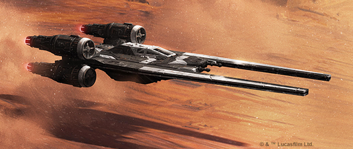
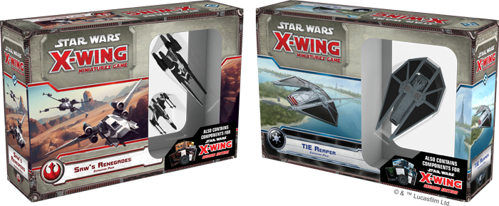
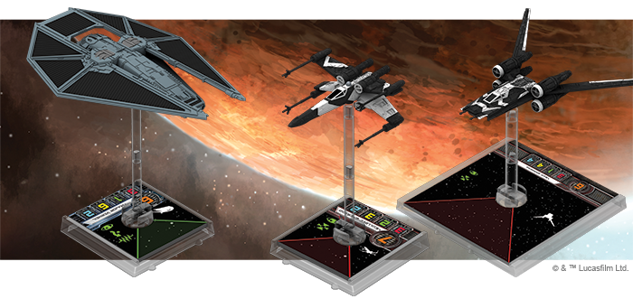
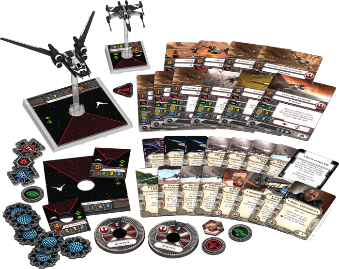
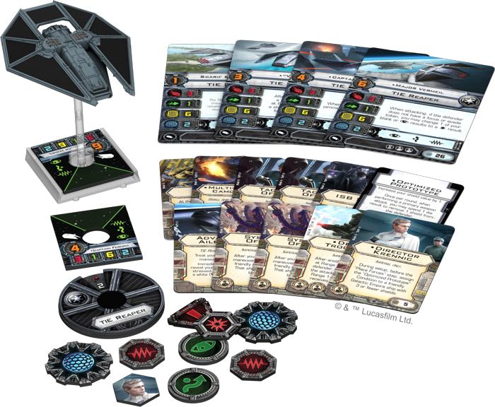

This article was originally published on [https://www.fantasyflightgames.com/en/news/2018/2/13/save-the-dream/](https://www.fantasyflightgames.com/en/news/2018/2/13/save-the-dream/)

&laquo; [Back to index](../index.md)

---

13 February 2018

Save the Dream
==============

Announcing X-Wing Wave XIV

_“Save the Rebellion! Save the dream!”_ –Saw Gerrera, _Rogue One_

The Death Star is nearly complete—and it’s time for battle to be joined in the skies above Jedha, Scarif, and Eadu. Fantasy Flight Games is proud to announce the two expansion packs that make up Wave XIV for [_X-Wing_™](https://www.fantasyflightgames.com/en/products/x-wing/)!

*   _Saw’s Renegades Expansion Pack_
*   _TIE Reaper Expansion Pack_

With these two new expansion packs, you’re drawn directly into the breakneck starfighter conflicts of _Rogue One_ and the beginning of the Galactic Civil War. You may fly with Saw and his partisans, willing to fight for freedom from the Empire at any cost. Or, you may join up with the Galactic Empire and ferry your elite troops into combat in a TIE reaper. No matter which side you support, the starships and upgrades of _X-Wing_ Wave XIV take you into frantic battles for the survival of the Rebellion and the destruction of the Empire’s ultimate weapon.

You can pre-order your own copies of the _Saw’s Renegades Expansion Pack_ and the _TIE Reaper Expansion Pack_ at your local retailer or online through our [website](https://shop.fantasyflightgames.com/preorders/create/SWX74/) today! Then, read on for more information.

Saw’s Renegades Expansion Pack
------------------------------

Take the skies with Saw Gerrera and his renegades with the _Saw’s Renegades Expansion Pack_! Rather than introducing completely new ships to the game, this expansion follows in the vein of the _[Rebel Aces Expansion Pack](https://www.fantasyflightgames.com/en/products/x-wing/products/rebel-aces-expansion-pack/)_ and the _[Heroes of the Resistance Expansion Pack](https://www.fantasyflightgames.com/en/products/x-wing/products/heroes-resistance-expansion-pack/)_ by introducing new versions of existing ships already in the service of the Rebel Alliance. In this case, you’ll find two new ship miniatures—a U-wing and a T-65 X-wing, both pre-painted in the stunning black-and-white paint scheme of Saw Gerrera’s freedom fighters.

Though the ships may be functionally the same as the ones included in previous expansions, the _Saw’s Renegades Expansion Pack_ offers an assortment of ship cards featuring pilots from Saw’s motley band of warriors—or even Saw Gerrera himself, flying his powerful U-wing into your battles. Along with new ship cards for both the T-65 X-wing and the U-wing, you’ll find an arsenal of fifteen new upgrade cards, equipping your squadrons with any number of unusual tactics or system upgrades.

For example, you may load one of your U-wings with the new [Targeting Scrambler](swx74_targeting-scrambler.png) condition. Then, when the ship that’s been Scrambled would attack your ship at Range 1, it loses any ability to modify its attack dice! If you’re using your U-wing or another ship to coordinate the battle, you may want to keep it alive for as long as possible. Scrambling the targeting systems of incoming attackers is just one way to keep your starships around for a few more turns.

With these ten ship cards and fifteen upgrade cards, plus the maneuver dials, tokens, and rules included in this expansion pack, the _Saw’s Renegades Expansion Pack_ gives you everything that you need to take the fight to the Empire!

TIE Reaper Expansion Pack
-------------------------

Engineered as a high-performance troop transport for in-atmosphere missions, the TIE reaper also made its debut in _Rogue One_. Equipped with advanced ailerons for precise atmospheric maneuvering, thick armor plating, powerful laser cannons, and the capacity to carry elite infantry, this menacing vessel struck fear into Rebel forces across the galaxy.

Any TIE reaper that you choose to fly in your squadron packs a potent strike, rolling three attack dice as its primary weapon attack. A TIE reaper is not especially agile, leaving it with only a single defense die, but with six hull and two shields, these starships are durable enough to stick around on the battlefield. In fact, TIE reapers bring something quite special to your Imperial _X-Wing_ squadrons. This ship bears the unusual jam action that lets you jam nearby ships and prevent them from using a focus, evade, or target lock—opening a wealth of tactical opportunities when you’re building your squad or flying into battle.

Due to its primary nature as a troop carrier, it makes perfect sense that the TIE reaper has two crew upgrades as its upgrade slots. You may choose to fly  [Emperor Palpatine](emperor_palpatine_new_web.png) into combat. Death Troopers take up both of the TIE reaper’s crew upgrades, but they give you an undeniable reward for coming into close combat. The Death Troopers card reads, “_After another friendly ship at Range 1 becomes the defender, if you are inside the attacker’s firing arc at Range 1-3, the attacker receives 1 stress token._” By dumping more stress onto your opponent’s ships, you’re limiting their options and giving yourself a better chance of coming out victorious.

In the _TIE Reaper Expansion Pack_, you’ll find the pre-painted TIE reaper miniature, four different ship cards, eleven upgrade cards, a maneuver dial, and all the other tokens that you need to bring the Empire’s deadliest troopers into the heat of battle.

I Will Not Fail
---------------

From the low-flying infiltration of the Imperial base on Eadu, to the frantic starfighter battles in the skies above Scarif, _X-Wing_ Wave XIV takes you into some of the most desperate and dangerous action of _Rogue One_. Choose your side, get your pilots to their ships, and take to the skies!

