This article was originally published on [https://www.fantasyflightgames.com/en/news/2018/5/1/all-wings-report-in-1/](https://www.fantasyflightgames.com/en/news/2018/5/1/all-wings-report-in-1/)

&laquo; [Back to index](../index.md)

---

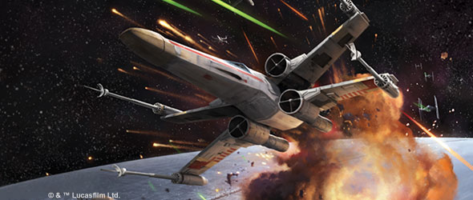

1 May 2018

All Wings Report In
===================

Announcing Four Rebel Alliance Expansions for X-Wing Second Edition

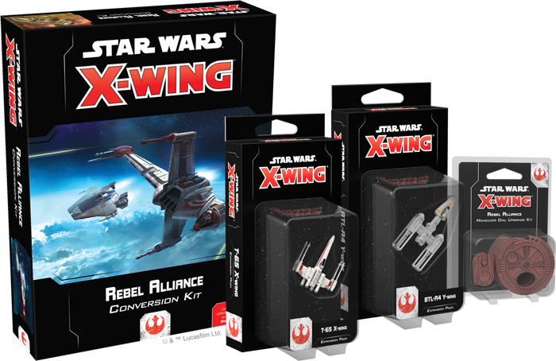

_“You know what’s about to happen, what they’re up against. They could use a good pilot like you.”_ –Luke Skywalker, _Star Wars: A New Hope_

_Order your own copies of the Rebel Alliance expansions for_ X-Wing Second Edition _at your local retailer or online through our website today!  
 _ 

In _[X-Wing™ Second Edition](https://www.fantasyflightgames.com/en/products/x-wing-second-edition/)_, you'll assemble your own squadron of ships from across the _Star Wars_ galaxy and fly them into the next evolution of space combat. Now, the elite pilots of the Rebel Alliance are ready to launch into the fight. Fantasy Flight Games is happy to announce four Rebel Alliance expansion packs for _X-Wing Second Edition_!

*   _[Rebel Alliance Conversion Kit](https://shop.fantasyflightgames.com/preorders/create/SWZ06/)_
*   __[T-65 X-Wing Expansion Pack](https://shop.fantasyflightgames.com/preorders/create/SWZ12/)__
*   ___[BTL-A4 Y-Wing Expansion Pack](https://shop.fantasyflightgames.com/preorders/create/SWZ13/)___
*   ____[Rebel Alliance Maneuver Dial Upgrade Kit](https://shop.fantasyflightgames.com/preorders/create/SWZ09/)____

Whether they're flying against a massive battlestation like the Death Star or facing wave after wave of TIE fighters, the pilots of the Rebel Alliance are no strangers to long odds. Despite this, the brave band of smugglers, pilots, soldiers, and spies continues flying in the name of freedom, striking out against the tyranny of the Galactic Empire whenever and wherever they can.

When _X-Wing Second Edition_ launches in the third quarter of this year, if you're a veteran player with an existing collection, the _Rebel Alliance Conversion Kit_ will bring your existing Rebel ships into the second edition, giving you a wealth of options from the very first day. Additionally, you’ll be able to increase your squadron size with two Rebel starfighters, taken from some of the most iconic ships and pilots from the _Star Wars_ saga. For more information about _X-Wing Second Edition_, [click here](https://www.fantasyflightgames.com/en/news/3000/1/1/x-wing-second-edition/) to read our announcement!

Read on for more information about each of these four expansions and what they bring to your games of _X-Wing Second Edition_.

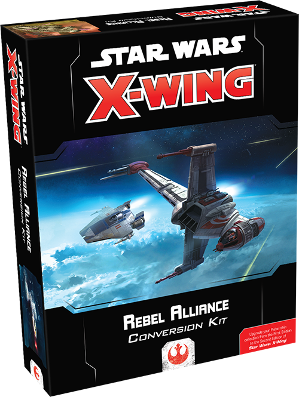

Uphold the Legacy
-----------------

From the blazingly fast A-wing to the iconic _Millennium Falcon_, the Rebel Alliance fielded a great number of starships during the interstellar battles of the Galactic Civil War. Between the _Rebel Alliance Conversion Kit_ and the extensive catalog of first edition expansions, these ships are available to join your squadron from day one.

Within this conversion kit, veteran players will find all of the components necessary to upgrade their existing Rebel ship collection from the first edition of _X-Wing_ to the second edition. The conversion kit contains a vast array of new ship cards and tokens, including iconic pilots such as Han Solo, alongside more than one-hundred upgrade cards that give you the power to customize your squad to fit your playstyle. Finally, the conversion kit also includes the second edition maneuver dials for each ship, which makes planning your actions easier than ever before. 

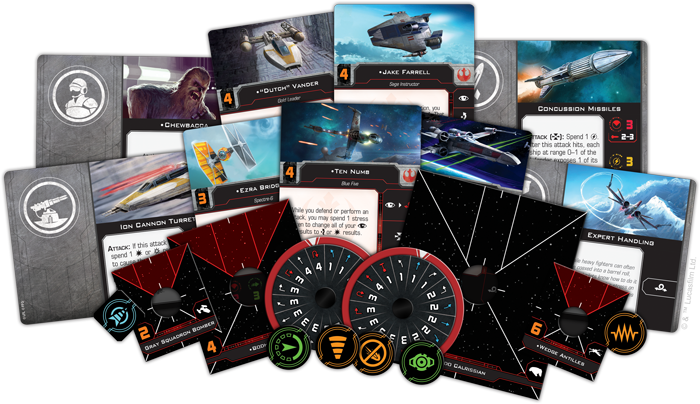

In addition to being present in the _Rebel Alliance Conversion Kit_, all of the Rebel Alliance ships and upgrades found in the conversion kit will be fully implemented in the _X-Wing Second Edition_ squad-builder app at launch, giving you the opportunity to experiment with a full complement of new content. Likewise, first-time players can use the conversion kit and first edition expansions to get a feel for the game with as many different ships as possible! 

Although many Rebel ships from first edition are making their way into _X-Wing Second Edition_ via the _Rebel Alliance Conversion Kit_, pilots and ships representing the Resistance, such as Poe Dameron and his T-70 X-wing, will not be present. These brave heroes carry on the spark of the Rebellion as a new generation of freedom fighters and, as such, the Resistance is being developed into a completely separate faction in _X-Wing Second Edition_. You can look for the Resistance to join _X-Wing Second Edition_ with its own conversion kit during the first round of expansions.

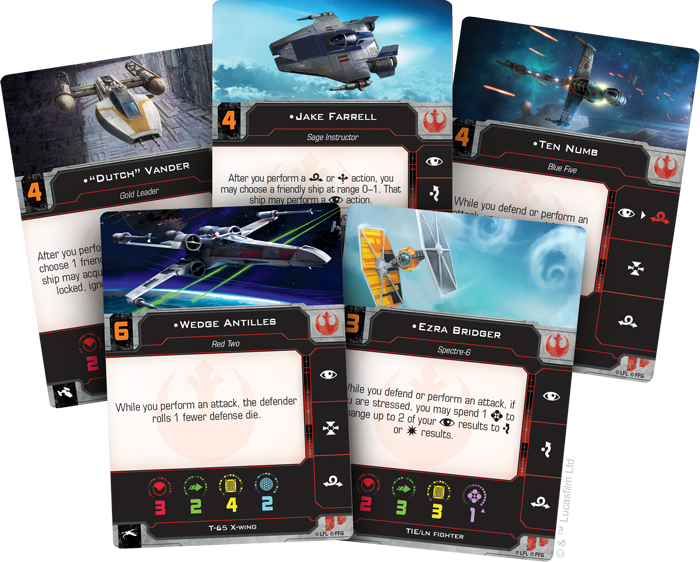

As you can read in [our announcement](https://www.fantasyflightgames.com/en/news/3000/1/1/x-wing-second-edition/) of _X-Wing Second Edition_, the new edition introduces several new elements to the game, including Force powers, multiple-use ordnance, changes to turrets, and several “quality of life” improvements for often-used mechanics. The contents of the _Rebel Alliance Conversion Kit_ reflect these changes, which include the reclassification of several Rebel Alliance ships. In the game's second edition, the BTL-S8 K-wing and ARC-170 have been converted to medium-base ships—a new size of ship base between small and large bases. The _Rebel Alliance Conversion Kit_ also contains all the bases and pegs that you'll need to bring the first edition versions of these ships into the second edition.

We'll take a closer look at everything included in this conversion kit in a future preview! _**For a full list of the ships converted by the**_ **Rebel Alliance Conversion Kit** _**visit our**_ **X-Wing Second Edition** _**FAQ section [on this page](https://www.fantasyflightgames.com/en/products/x-wing-second-edition/)!**_

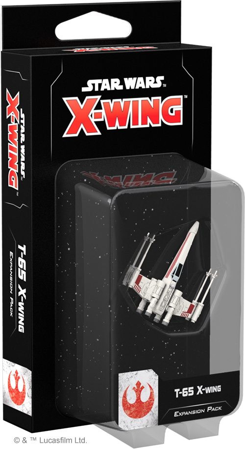
-------------------------------------------------------------------------------------------------------------------------

Accelerate to Attack Speed
--------------------------

No ship has become more emblematic of the Rebel Alliance than the T-65 X-wing. A mainstay of the Rebel fleet throughout the Galactic Civil War, this versatile craft was present at almost every major space battle, proving itself to be one of the most effective military vehicles in the galaxy.

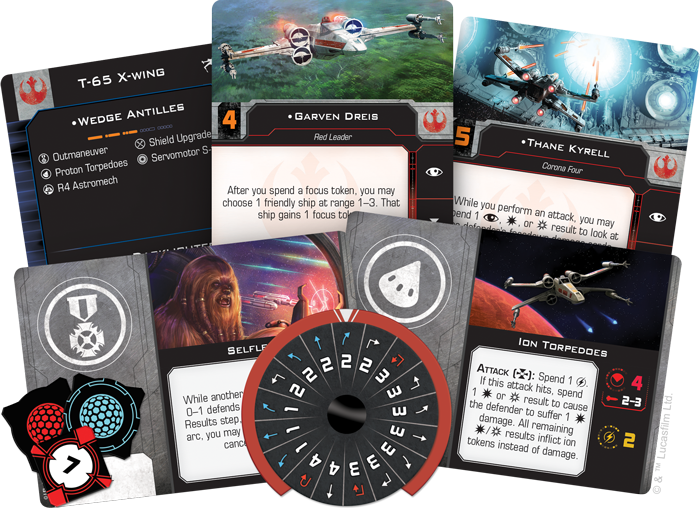

When it comes to _X-Wing Second Edition_, this classic ship features a few new tricks. Every X-wing miniature now comes equipped with the [Servomotor S-foils](2107885ec917bf51e11db239f34d9265.png) upgrade, allowing you to open or close the ship’s wings before it activates. Far from being a mere aesthetic addition, the position of the S-foils adds new strategic options to the T-65. 

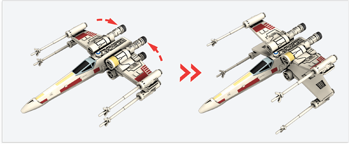  
_In_ X-Wing Second Edition_, the T-65 X-wing can open or close its S-foils before activating, providing new tactical options._

While its [S-foils are closed,](bd57fc1b704ef706f08534baae669468.png)  the X-wing becomes a bit speedier, gaining the ability to boost itself around the battlefield. Closing your S-foils, then, could give you the edge you need to slip out of your enemy's line of fire or reposition yourself to get the drop on a rival ship.

Closing your S-foils to boost maneuverability can help you seize the upper hand, but what the T-65 gains in speed, it loses in sheer firepower. While performing a primary attack with S-foils in the closed position, your ship rolls one fewer attack die. Piloting an X-wing, then, requires you to survey the field every turn, determining when you need a bit of extra speed and when you might launch an attack.

The _T-65 X-Wing Expansion Pack_ includes a beautifully-painted T-65 X-wing miniature for you to add to your squadron, a maneuver dial, and all the ship and upgrade cards you need to fly this iconic starfighter into battle. We'll explore the T-65 X-wing's capabilities and contents of this expansion pack in much more detail in a future preview!

In addition, the _T-65 X-Wing Expansion Pack_ contains a few entirely new cards that have never before appeared in the game's first edition. These new cards and associated punchboard are also included in the _Rebel Alliance Conversion Kit_ for the benefit of veteran players!

Stay on Target
--------------

Once a common sight in the Imperial Navy, the slow and lumbering Y-wing has long since been phased out of the Imperial ranks in favor of the faster and far more maneuverable TIE fighter. To the fledgling Rebel Alliance, however, the ship’s durability, dependability, and heavy armament make it an appealing choice for missions that need a little more firepower.

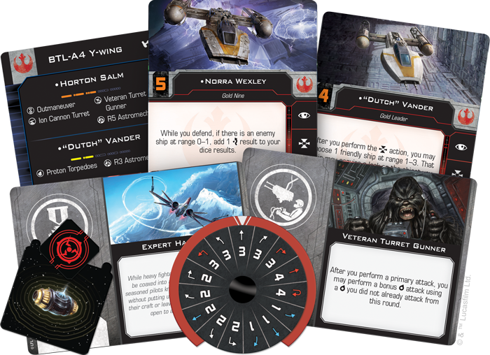

As the Rebellion’s primary bomber, the Y-wing is able to equip some heavy munitions that can wreak havoc on the battlefield. Whether it is launching a flurry of [torpedoes](1708b9cdef7e9138dd7cd33b31753b0a.png)  the Y-wing can cause numerous headaches for ships unprepared to face it.

Similarly, the Y-wing can also be upgraded with a turret weapon, giving it even more options in the middle of a fight. Equipping one with an Ion Cannon Turret, for example, doesn't just let you deal a bit of damage to an enemy ship. It also lets you load that ship with ion tokens, limiting its movement and making it an easier target in the future.  

The _BTL-A4 Y-Wing Expansion Pack_ includes a beautifully pre-painted miniature and all the ship and upgrade cards you need to incorporate this powerful ship into your Rebel squadron. We'll explore the Y-Wing and this expansion pack in much more detail in a future preview!

In addition, the _BTL-A4 Y-Wing Expansion Pack_ contains a few entirely new cards that have never before appeared in the game's first edition. These new cards and associated punchboard are also included in the _Rebel Alliance Conversion Kit_ for the benefit of veteran players!

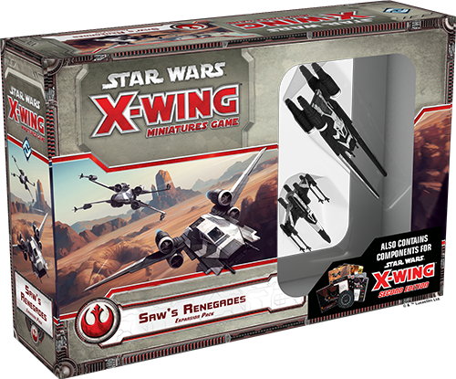

Extreme Action
--------------

His ruthless tactics too extreme for some, Saw Gerrera was a polarizing figure in the Rebellion. Despite this, he would go on to play a pivotal role in helping Jyn Erso discover the fatal flaw with the Death Star’s thermal exhaust port. Although he perished during the Imperial attack on Jedha, Saw and his partisans live on in _X-Wing Second Edition_ with the _Saw’s Renegades Expansion Pack_.

We've already shown you many of the first edition cards included in this expansion pack, and we can now reveal that the _Saw's Renegades Expansion Pack_ is a hybrid product, containing new content for both the first and second editions. On top of the second edition versions of the ship cards, _Saw’s Renegades_ also includes a full complement of upgrade cards that you can use to customize your squadrons.

The U-wing included in this expansion, for instance, gains some added functionality to its Pivot Wing. Similar to the T-65 X-wing’s Servomotor S-foils, this upgrade features two different settings that have different functions in battle. [When closed,](fa3a4c1291982647b0c836b3ec0355f0.png)  the Pivot Wing makes the U-wing capable of pulling off tight turns to quickly reposition in the thick of an engagement. But being stationary for so long also makes it more vulerable to attack, forcing the U-wing to roll one fewer defense die while its Pivot Wing is closed. 

The _Saw’s Renegades Expansion Pack_ includes both a U-wing and a T-65 X-wing painted in the black-and-white paint scheme of Saw Gerrera and his followers, making a formidable new addition to any _X-Wing Second Edition_ squad. We'll have previews of the second edition content in the _Saw's Renegades Expansion Pack_ in coming weeks!

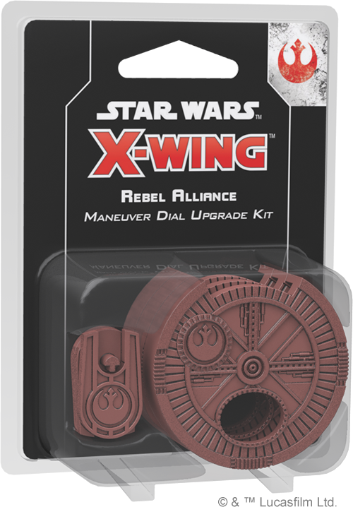

Enhanced Interface
------------------

With a galaxy’s worth of ships available to customize your squadron, it’s only appropriate that you can further customize your squadron with the _Rebel Alliance Maneuver Dial Upgrade Kit_.

During every game of _X-Wing Second Edition_, you and your opponent will secretly plot your ships’ movements on cardboard maneuver dials. The dial upgrade kit contains three plastic protectors that situate a ship’s dial within a secure housing, enhancing the aesthetics of your squadron and proudly displaying the colors of the Rebel Alliance. Not only does each dial clearly indicate that you fight for the freedom of the galaxy, they also include a space on the back to insert a dial ID token displaying a silhouette of the corresponding ship, making it easy to differentiate between your ships.

Join the Rebellion
------------------

The brave pilots of the Rebellion stand ready to launch themselves straight into the fight against the Empire. Build your squad and fight for freedom across the galaxy!