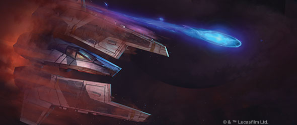
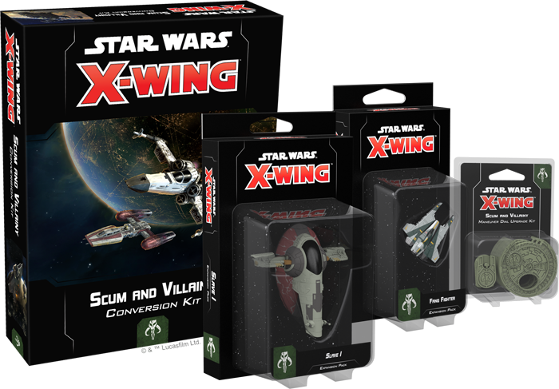
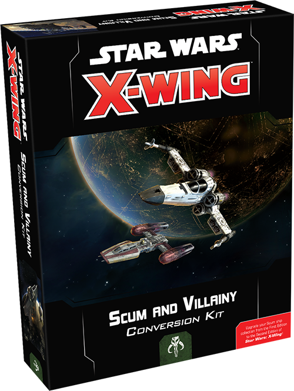
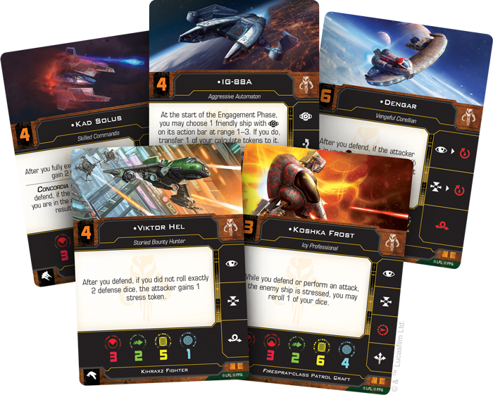
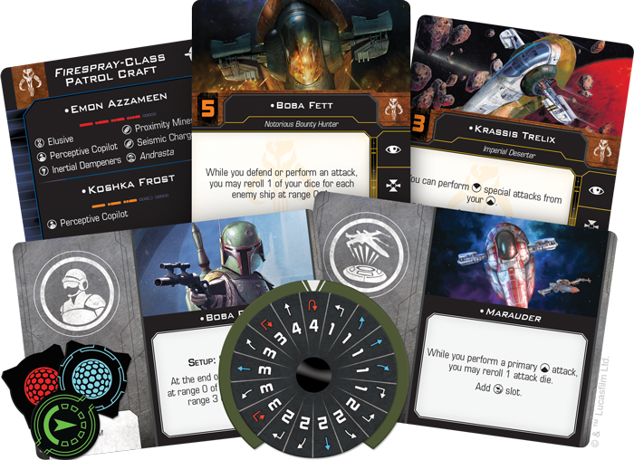
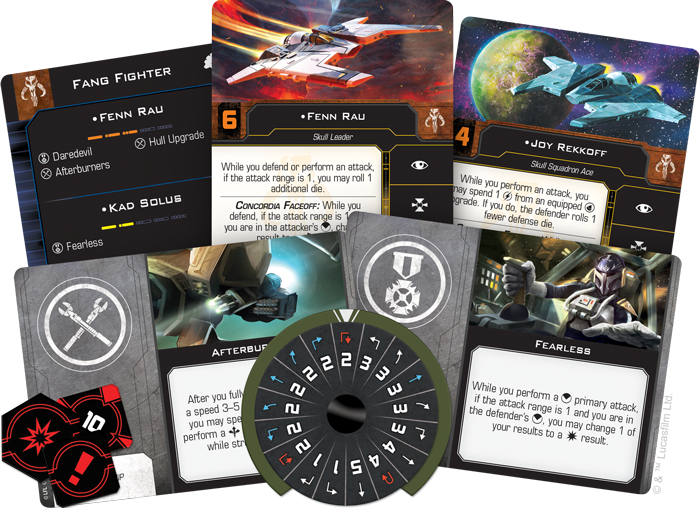
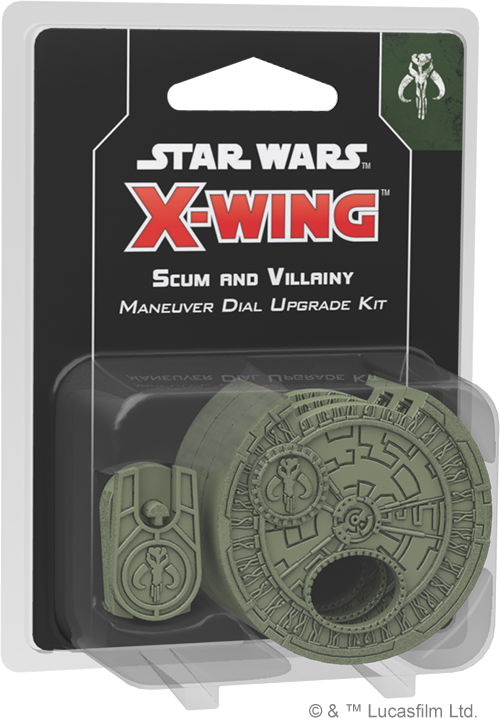

This article was originally published on [https://www.fantasyflightgames.com/en/news/2018/5/1/become-infamous/](https://www.fantasyflightgames.com/en/news/2018/5/1/become-infamous/)

&laquo; [Back to index](../index.md)

---

1 May 2018

Become Infamous
===============

Announcing Four Scum and Villainy Expansions for X-Wing Second Edition

_“This bounty hunter is my kind of scum: fearless and inventive.”_  
   –Jabba the Hutt, _Star Wars: Return of the Jedi_

_Order your own copies of the Scum and Villainy expansions for_ X-Wing Second Edition _at your local retailer or online through our website today!  
 _ 

_[X-Wing™ Second Edition](https://www.fantasyflightgames.com/en/products/x-wing-second-edition/)_ gives you the opportunity to take part in a new age of tense space battles in the _Star Wars_ galaxy. Now, the galaxy’s most vile mercenaries and bounty hunters are ready to do battle for the highest bidder. Fantasy Flight Games is happy to announce four new Scum and Villainy expansions for _X-Wing Second Edition_:

*   _[Scum and Villainy Conversion Kit](https://shop.fantasyflightgames.com/preorders/create/SWZ08/)_
*   [_Slave I_ Expansion Pack](https://shop.fantasyflightgames.com/preorders/create/SWZ16/)
*   _[Fang Fighter Expansion Pack](https://shop.fantasyflightgames.com/preorders/create/SWZ17/)_
*   _[Scum and Villainy Maneuver Dial Upgrade Kit](https://shop.fantasyflightgames.com/preorders/create/SWZ11/)_

With the _Scum and Villainy Conversion Kit_, you can bring the entirety of your Scum and Villainy cards from the game's first edition! Between the conversion kit and these expansion packs, you have the chance to assemble a squadron from some of the worst criminals and most notorious bounty hunters the galaxy has ever known, bringing a whole host of conniving characters and dirty tricks to the fight.

For more information about _X-Wing Second Edition_, click [here](https://www.fantasyflightgames.com/en/news/3000/1/1/x-wing-second-edition/) to read our announcement. Then, read on for more information about each of these four expansions and what they bring to your games of _X-Wing Second Edition_!

A Wretched Hive
---------------

Driven by their desire for profit, bounty hunters will relentlessly pursue their quarry to the farthest reaches of the galaxy. Far from the uniform ranks of the Rebellion or the Empire, these mercenaries often inject their own style and flair into their work. With the _Scum and Villainy Conversion Kit_, you can take your own ragtag band of bounty hunters into _X-Wing Second Edition_ right away.

The _Scum and Villainy Conversion Kit_ contains everything that you need to take your existing collection of first edition Scum and Villainy ships into the game's second edition. Here, you'll find an assortment of second edition punchboard, ship cards, and upgrade cards, letting you bring the galaxy's most dangerous beings to life on your tabletop. In addition to being present in the _Scum and Villainy Conversion Kit_, all of the Scum and Villainy ships and upgrades found in the conversion kit will be fully implemented in the _X-Wing Second Edition_ squad-builder app at launch, giving you the opportunity to experiment with a full complement of new content. Likewise, first-time players can use the conversion kit and first edition expansions to get a feel for the game with as many different ships as possible! 

Veteran _X-Wing_ players will notice many new elements in the game's second edition, including the introduction of Force powers, multiple-use ordnance, changes to turrets, and several “quality of life” improvements for often-used mechanics. From launch, you’ll be able to incorporate notorious bounty hunters like Dengar and IG-88 and their signature ships into your squadrons, letting you build the squad that fits your play style.

In addition to the other changes, _X-Wing Second Edition_ converts several ships from small bases to medium bases. Medium-base ships are a new addition to _X-Wing Second Edition_, filling the space between small-base and large-base ships. For Scum and Villainy, the G1-A Starfighter, M12-L Kimogila Fighter, and Scurrg H-6 Bomber have all been converted to medium-based ships for second edition. In addition to its cards and punchboard, the _Scum and Villainy Conversion Kit_ supplies the bases and conversion pegs you need to bring these ships into the second edition.

_**For a full list of the ships converted by the**_ **Scum and Villainy Conversion Kit_,_** _**visit our**_ **X-Wing Second Edition** _**FAQ section [on this page](https://www.fantasyflightgames.com/en/products/x-wing-second-edition/)!**_

In Pursuit of Profit
--------------------

While the pilots of the Empire and Rebellion fly in the name of their beliefs, Scum pilots have little concern for political conflicts. Rather than declare allegiance to one side or another, they are only concerned with one thing: profit, no matter how it’s obtained. And no one in the galaxy is better at tracking down their quarry and collecting the reward than the infamous Boba Fett.

The _Slave I_ Expansion Pack gives you the chance to add Boba Fett and his signature ship to your _X-Wing Second Edition_ squadron. Along with one of the galaxy's most feared bounty hunters, you'll also find a host of pilots and upgrade cards to outfit your own _Firespray_\-class patrol craft. 

As a highly modifiable ship offering plenty of space for additional weaponry and other upgrades, the _Firespray_\-class patrol craft can suit the needs of any intrepid mercenary. The ship’s rear firing arc makes it an ideal fit for a [Veteran Tail Gunner,](f8655fabd51c03272d47df64d0ac973e.png) designed to wreak havoc on an enemy squadron.

The _Slave I_ Expansion Pack includes a beautifully pre-painted ship miniature along with a maneuver dial and all the ship cards and upgrade cards you need to supplement your squadron with this versatile ship. We'll explore the contents of the _Slave I_ Expansion Pack in much greater depth in a future preview!

In addition, the _Slave I_ Expansion Pack contains a few entirely new cards that have never before appeared in the game's first edition. These new cards and associated punchboard are included in the _Scum and Villainy Conversion Kit_ for the benefit of veteran players!

For Mandalore
-------------

Mandalorians are known throughout the galaxy as ferocious warriors, and the sight of their iconic armor enough to strike fear in even the most hardened Imperial or Rebel. When it comes to space combat, the pilots of Mandalore prefer one starfighter above all others: the Fang Fighter.

Rather than relying on shields and heavy armament, the Fang Fighter takes advantage of advanced pivot wing technology and a low attack profile to execute deadly head-on charges against enemy ships. Since it's a ship that operates best up close, the Fang Fighter features several daring ways to quickly close the distance on your opponent. Every Fang Fighter can link a barrel roll or boost with a red focus action, allowing you to get into position to launch a particularly deadly attack or increase your chances of surviving an enemy salvo. 

Furthermore, several upgrades can help the Fang Fighter become even more effective at close range. If you have a [Fearless](4b522059e3c768a6c64c5cbcdb55596c.png) pilot, for example, you are guaranteed at least one hit while performing a primary weapon attack… so long as you're charging straight at your opponent!

The _Fang Fighter Expansion Pack_ includes a fully pre-painted Fang Fighter miniature, a maneuver dial, and all the ship cards, upgrade cards, and tokens you need to add one of these deadly starfighters to your squadron. We'll explore the full capabilities of the Fang Fighter and the contents of this expansion pack in a future preview!

In addition, the _Fang Fighter Expansion Pack_ contains a few entirely new cards that have never before appeared in the game's first edition. These new cards and associated punchboard are included in the _Scum and Villainy Conversion Kit_ for the benefit of veteran players!

Loyal to No One
---------------

As the commander of a Scum and Villainy squadron, you have no loyalty to anyone other than yourself. In _X-Wing Second Edition_, you can proudly declare your independence with the _Scum and Villainy Maneuver Dial Upgrade Kit_.

During a game of _X-Wing Second Edition_, you’ll secretly select your ships’ movements using cardboard maneuver dials included in each ship expansion and the _Scum and Villainy Conversion Kit_. Now, you can further customize the aesthetics of your squadron by situating each ship’s maneuver dial within a stylish and secure plastic housing.

The _Scum and Villainy Maneuver Dial Upgrade Kit_ provides three sculpted plastic dial casings that announce your affiliation with the galaxy’s most feared bounty hunters and criminals. Additionally, these plastic maneuver dials provide an easy way for you to differentiate your dials—each dial includes a space on the back for you to insert a dial ID token that displays a silhouette of the corresponding ship. Choose your speed and style!

Begin the Hunt
--------------

With several Scum and Villainy expansions launching with _X-Wing Second Edition_, this is your first opportunity to begin the hunt and take your squad into the future of _X-Wing_!

