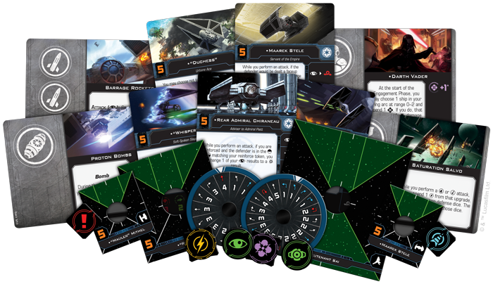
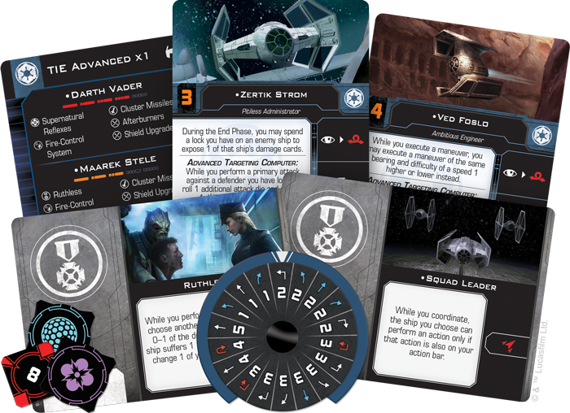

This article was originally published on [https://www.fantasyflightgames.com/en/news/2018/5/1/crush-the-rebellion-1/](https://www.fantasyflightgames.com/en/news/2018/5/1/crush-the-rebellion-1/)

&laquo; [Back to index](../index.md)

---

1 May 2018

Crush the Rebellion
===================

Announcing Four Galactic Empire Expansions for X-Wing Second Edition

_“We will deal with your Rebel friends soon enough.”_   
   –Grand Moff Tarkin, _Star Wars: A New Hope_

_Order your own copies of the Galactic Empire expansions for_ X-Wing Second Edition _at your local retailer or online through our website today!  
 _ 

_[X-Wing™ Second Edition](https://www.fantasyflightgames.com/en/products/x-wing-second-edition/)_ promises to usher in a new era of interstellar combat in the _Star Wars_ galaxy. When it does, the Galactic Empire will be ready to extend its dominance with squadrons of advanced starfighters. Fantasy Flight Games is proud to announce four new Galactic Empire expansion packs for _X-Wing Second Edition_:

*   _[Galactic Empire Conversion Kit](https://shop.fantasyflightgames.com/preorders/create/SWZ07/)_
*   _[TIE/ln Fighter Expansion Pack](https://shop.fantasyflightgames.com/preorders/create/SWZ14/)_
*   _[TIE Advanced x1 Expansion Pack](https://shop.fantasyflightgames.com/preorders/create/SWZ15/)_
*   _[Galactic Empire Maneuver Dial Upgrade Kit](https://shop.fantasyflightgames.com/preorders/create/SWZ10/)_

With these expansion packs, you can bring your entire collection of first edition Galactic Empire ships into the game's second edition. Then, you can round out your Imperial squadrons and enhance the look of your maneuver dials with the other Galactic Empire expansion packs. You may add even more TIE fighters, identical to those found in the _X-Wing Second Edition_ _Core Set_ to your squadron, overwhelming your opponent with a deadly swarm. Or, you could show your enemies the true power of the dark side and bring Darth Vader himself into the battle. No matter what you choose, all will know the might of the Empire.  

For more information about _X-Wing Second Edition_, click [here](https://www.fantasyflightgames.com/en/news/3000/1/1/x-wing-second-edition/) to read our announcement! Then, read on for more information about what you can expect from these Galactic Empire expansions.

The Empire’s Finest
-------------------

At the height of its power, the Imperial Navy deployed a wide range of ships and exceptional pilots in its effort to bring order to the galaxy and crush the Rebellion. From the legendary Soontir Fel in his TIE interceptor to the feared TIE defender pilots of Onyx Squadron, each pilot and ship had unique skills and capabilities to offer in service of the Emperor. The _Galactic Empire Conversion Kit_ allows you to tap into the vast reserves of the Empire at the very beginning of _X-Wing Second Edition_.

This kit contains all the components you need to upgrade your Imperial ship collection from the first edition to the second edition, including ship cards, upgrade cards, ship tokens, and maneuver dials. With the conversion kit, veteran and new players alike will be able to choose from a variety of Imperial pilots for each ship, then outfit those ships by selecting from more than one-hundred upgrade cards. All ships and upgrade cards contained in the _Galactic Empire Conversion Kit_ will be supported by the _X-Wing Second Edition_ squad-builder app at launch, giving you a deep pool of options for customizing each ship and squadron. 

Although most of the Galactic Empire's ships from the first edition are represented in the conversion kit, those emblazoned with the emblem of the First Order are not. Pilots like Kylo Ren and his TIE silencer carry on the legacy of the Empire in a new era, struggling to retake control of the galaxy from the New Republic and the Resistance. Therefore, the First Order is being developed into a separate faction for _X-Wing Second Edition_ and will receive its own conversion kit as a future expansion. 

_**For a full list of the ships converted by the**_ **Galactic Empire Conversion Kit**_**, visit our**_ **X-Wing Second Edition** _**FAQ section [on this page](https://www.fantasyflightgames.com/en/products/x-wing-second-edition/)!**_

As you can read in [our announcement](https://www.fantasyflightgames.com/en/news/3000/1/1/x-wing-second-edition/) of _X-Wing Second Edition_, the _Galactic Empire Conversion Kit_ adapts your first edition ships and pilots to the changes introduced in _X-Wing Second Edition_, including Force powers, multiple-use ordnance, changes to turrets, and other “quality of life” improvements. Additionally, in the game's second edition, the Empire’s TIE/ca Punisher has been reclassified as a medium-base ship—a new size of ship base filling the space between small-base and large-base ships. In addition to a wealth of punchboard and cards, the _Galactic Empire_ _Conversion Kit_ provides all the bases, pegs, and tokens you need to add this ship to your squadron.

Launch your fighters into the future of _X-Wing_ with the _Galactic Empire Conversion Kit_! We'll take a much closer look at the contents of this conversion kit in a future preview.

Strength in Numbers
-------------------

Few sounds can strike fear into the heart of a starfighter pilot like the howl of an incoming group of Imperial TIE/ln fighters. The iconic fighter of the Galactic Empire, the TIE’s namesake twin ion engines deliver impressive speed and pinpoint maneuverability. Although its lightweight frame lacks deflector shields or a hyperdrive, its affordability allows the Empire to deploy TIE fighters in great numbers to crush any Rebel resistance.

As a unit ideally suited for flying in large groups and raining fire down upon enemy ships, the TIE fighter forms the backbone of many Imperial squadrons. Flying in a tight formation can help you quickly pile damage on a target, and many TIE pilots included in this expansion help enhance this strategy. Adding ["Howlrunner"](swz07_howlrunner.png) to your squadron, for example, enables squadmates at close range to reroll an attack die, giving them a chance to deal even more damage. 

These swarm tactics are enhanced by taking precise shots. For example, a TIE pilot who can get an enemy ship in the new bullseye firing arc printed on every ship token can take a [Crack Shot](swz07_crackshot.png) to deal more damage than usual.

The _TIE/ln Fighter Expansion Pack_ includes one beautifully pre-painted miniature and all the ship and upgrade cards you need to incorporate this flying terror into your Imperial squadron. We'll look at the contents of this expansion pack in much more detail in a future preview!

In addition, the _TIE/ln Fighter Expansion Pack_ contains a few entirely new cards that have never before appeared in the game's first edition. These new cards and associated punchboard are also included in the _Galactic Empire Conversion Kit_ for the benefit of veteran players!

A Technological Terror
----------------------

While the TIE fighter is a common sight in Imperial squadrons, picking up a TIE Advanced x1 on your scopes is all the proof you need that a sector has drawn the Empire’s attention. This prototype design is flown only by high-ranking Imperial agents, including the dreaded Darth Vader himself, making it a deadly addition to your squadron.

As a technologically superior version of the TIE fighter, the TIE Advanced x1 has plenty to offer compared to its counterparts. The most noticeable difference may be the fact that the TIE Advanced x1 comes equipped with its own set of deflector shields, without sacrificing any of the ship’s evasiveness. This added durability helps it operate on its own much more effectively than a standard TIE fighter, and it allows you hunt down your enemies with deadly precision.

The _TIE Advanced x1 Expansion Pack_ includes a single new TIE Advanced x1 miniature for you to add to your squadron, along with a full complement of pilot cards to choose from. Additionally, you’ll find an assortment of upgrade cards for you to enhance your TIE Advanced x1 and other ships. We'll look at the contents of this expansion pack in much more detail in a future preview!

The _TIE Advanced x1 Expansion Pack_ also contains a few entirely new cards that have never before appeared in the game's first edition. These new cards and associated punchboard are included in the _Galactic Empire Conversion Kit_ for the benefit of veteran players!

Fear the Reaper
---------------

As evidenced by the ubiquitous TIE fighter, the Empire’s strategy for starfighters is based on speed, maneuverability, and crushing their enemies with superior numbers. When catching sight of a TIE reaper, however, all who oppose the Empire have a new reason to fear. Designed to deliver specialized soldiers into the heart of battle, this menacing vessel is an imposing presence to any Rebel forces. We've previously revealed many of the first edition cards and components in this expansion, and with the announcement of _X-Wing Second Edition_, we can reveal this expanion's nature as a hybrid product—spanning first and second editions with cards and components from both.

The TIE reaper can quickly shuttle troops into the thick of battle and the _TIE Reaper Expansion Pack_ continues this deadly efficiency in _X-Wing Second Edition_. Largely eschewing the design philosophy of other TIE models, the TIE reaper instead relies on thick armor plating and powerful laser cannons to survive in the thick of combat. But it is this starfighter's role as a troop transport that makes it truly special. Whether carrying a [Tactical Officer](swz_tactical-officer_upgrade.png) himself, adding crew cards to the TIE reaper makes it even more unique and gives it a specialized role within your squadron.

This expansion contains a pre-painted TIE reaper miniature as well as all the upgrade cards, ship cards, and tokens that you need to incorporate the ship into both first and second edition squadrons. We'll take a closer look at the second edition parts of this expansion in a future preview!

Fly the Imperial Flag
---------------------

Commanding a fighter squadron is an honor only bestowed on the best Imperial commanders and a distinction that shouldn’t go unnoticed. With the _Galactic Empire Maneuver Dial Upgrade Kit_, you can display your Imperial pride and further customize your squadron.

These upgraded plastic maneuver dials proudly declare your allegiance to the Empire while enhancing the aesthetic look of your squadron. As you secretly plot your maneuvers each round, these kits house a ship’s dial within a secure plastic housing. Additionally, the kits include a space on the back to insert a dial ID token, making it easy to differentiate between your ships in the middle of a game. 

Dominate the Galaxy
-------------------

With several Galactic Empire expansions arriving at launch, this is your chance to round out your squadron and rule the galaxy with an iron fist.

