This article was originally published on [https://www.fantasyflightgames.com/en/news/2018/5/1/x-wing-second-edition/](https://www.fantasyflightgames.com/en/news/2018/5/1/x-wing-second-edition/)

&laquo; [Back to index](../index.md)

---

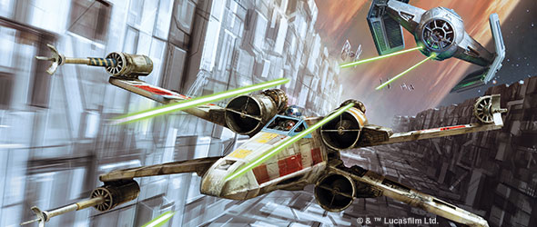

1 May 2018

X-Wing Second Edition
=====================

Announcing a New Era of Interstellar Battle in the Star Wars Galaxy

_“All wings report in!”_ –Red Leader, _Star Wars: A New Hope_

From the skies of Scarif in _Rogue One_ to the climactic clash above Endor in _Return of the Jedi_, starfighters have played a pivotal role in almost every defining battle of the Galactic Civil War. During these confrontations, the brave members of the Rebel Alliance faced seemingly insurmountable odds, squaring off against the merciless forces of the Galactic Empire in intense, ship-to-ship space combat.

Since its release, _X-Wing_™ _Miniatures Game_ has invited you to enter the _Star Wars_ galaxy and play out your own battles with some of the series’ most iconic starfighters. Leading custom-built squadrons into fast-paced, high-stakes battles, you’ve flown with the Galactic Empire, the Rebel Alliance, and the Scum and Villainy of the galaxy in countless battles. You’ve modified your ships for every scrap of speed, maneuverability, and firepower. Now, it’s time for a new chapter in your _X-Wing_ journey.

Today, Fantasy Flight Games is excited to announce the next evolution of your interstellar dogfights: [_X-Wing™ Second Edition_](https://www.fantasyflightgames.com/en/products/x-wing-second-edition/), a game of daring space combat for two players! With three fully assembled and beautifully pre-painted ships, and all the cards, movement tools, tokens, and dice that you need to get flying with the second edition, the _X-Wing Second Edition Core Set_ is the perfect way to introduce yourself to the new mechanics or experience _X-Wing_ for the first time.

**Are you a veteran _X-Wing_ player? Find the answers to your questions about _X-Wing Second Edition_ [here](https://www.fantasyflightgames.com/en/products/x-wing-second-edition/).**

While the _X-Wing Second Edition Core Set_ provides everything you need to get started with your first space battles in the new edition, it isn’t all that will be on offer. You can bring your full collection of first edition ships into the new edition with _Conversion Kits_ for the Galactic Empire, Rebel Alliance, and Scum and Villainy. What’s more, a full hangar bay of expansions will launch alongside the _Core Set_, giving you plenty of options for creating your squadrons and customizing your _X-Wing Second Edition_ experience.

Click these links to read more about the [Rebel Alliance](https://www.fantasyflightgames.com/en/news/3000/1/1/all-wings-report-in-1/), [Galactic Empire](https://www.fantasyflightgames.com/en/news/3000/1/1/crush-the-rebellion-1/), and [Scum and Villainy](https://www.fantasyflightgames.com/en/news/3000/1/1/become-infamous/) content that will be available at launch! Then, click [here](https://www.fantasyflightgames.com/en/news/2018/5/1/xwing-second-edition-organized-play/) to learn more about the Organized Play program for _X-Wing Second Edition_.

Watch the trailer below for a taste of what awaits in _X-Wing Second Edition_ and read on for more information!

Why Second Edition?
-------------------

Since 2012 and the release of the game, _X-Wing Miniatures Game_ has grown and expanded to become a massive bestseller. Fourteen waves and fifty-eight distinct starships provided a massive library of ships and tactical possibilities, giving you the chance to field hundreds of unique squadrons in their space battles across the _Star Wars_ saga.

Despite the massive success of the game’s first edition, we believe that by advancing the game to a second edition, _X-Wing_ can offer an even better experience! There are four primary places where we believe _X-Wing Second Edition_ will offer a renewed and improved experience:

*   With _X-Wing Second Edition_, gameplay has been refined across the board, implementing minor tweaks and changes to improve the game’s flow, clean up interactions, and refocus the game on the physical act of flying starships. For more information about the gameplay tweaks implemented in _X-Wing Second Edition_, click here to [read our FAQ](https://www.fantasyflightgames.com/en/products/x-wing-second-edition/)!
*   The Force is a crucial part of the _Star Wars_ galaxy that has historically played a smaller role in the game of _X-Wing_. With the release of _X-Wing Second Edition_, we have the chance to implement the Force as an important part of the game, affecting how you fly your ships and the choices that you make in the heat of battle. For more information about the Force and how it plays out in your games of _X-Wing_, just keep reading!
*   Faction identities have been strengthened in _X-Wing Second Edition_, giving each faction more unique tactics and strategies. Flying a squadron of Scum and Villainy starships should feel very different from flying an Imperial squadron, and with the game’s second edition, those differences are more present than ever before. What’s more, the First Order and Resistance have been reformed into their own distinct factions, separate from the Rebel Alliance and Galactic Empire, with their own themes, strengths, and weaknesses.
*   An official _X-Wing_ squad builder app / website will be implemented, bringing a new level of dynamic play to Organized Play and casual games alike. This _X-Wing_ squad builder gives players an easy way to assemble their squadrons and manage their collection, and it also allows the Organized Play team to explore dozens of new possibilities with alternate formats for the game. The point cost of ships and upgrades and the upgrade slots available to ships can be adjusted for the course of a single event, a tournament series, or an entire season of the game. Ultimately, the _X-Wing_ squad builder app creates dynamic and constantly evolving Organized Play unlike anything that was possible before. For more information about the _X-Wing_ squad builder app, read on.

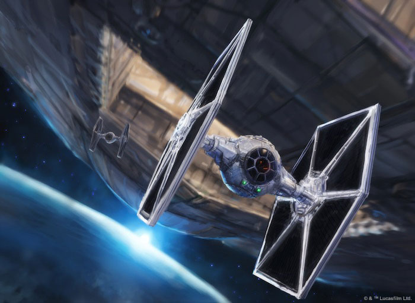

Fly into the Fray
-----------------

_“I know a few maneuvers. We’ll lose ‘em!”_  
   –Han Solo, _Star Wars: A New Hope_

_X-Wing Second Edition_ puts you in command of your own squadron of advanced starfighters locked in thrilling, tactical space combat. Following in the footsteps of the first edition, the second edition refines the intuitive and exciting core formula of maneuvering your ships into position by placing a central focus on the visceral thrill of flying starships in the _Star Wars_ galaxy.

During a battle, you’ll use your squadron’s unique capabilities to give yourself an advantage in the thick of combat. Each _X-Wing_ ship flies differently, with its own set of maneuvers ranging from gentle banks to aggressive Koiogran turns. As in the game’s first edition, you’ll need to use every ship’s maneuvering capabilities to the fullest in order to strategically position your ships. A round begins with players secretly selecting a maneuver on each of their ships’ unique maneuver dials. Once you’ve decided how each of your ships is going to fly, you’ll begin revealing the dials and moving your ships, starting with the lowest skilled pilots.

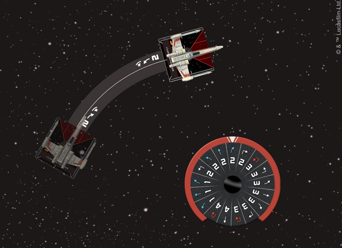  
_You choose a two-speed right bank on the X-wing’s dial. When it’s this ship’s turn to activate, you’ll use the corresponding maneuver template to complete the move._

As you move, you’ll enter a tense duel with your opponent as you both try to line up the perfect shot. Before you can open fire on an opponent’s ship, however, they must be in your firing arc and within range. By carefully selecting your maneuvers, you can get enemy ships in your sights, and once you’ve locked onto your target, you’re free to choose your plan of attack. You might pepper the enemy with blaster fire to whittle away their shields. Or, you could go for massive damage and launch a devastating volley of proton torpedoes. No matter how you approach the battle, you have complete control of your squadron. One player wins when all of their opponent’s ships are destroyed!

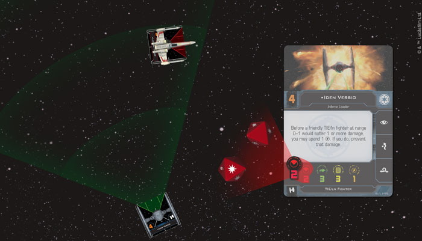  
_This TIE fighter has caught an X-wing within its firing arc and takes a shot. It has an attack value of two, so it rolls two attack dice._

Slick flying is certainly important, but it isn’t the only consideration you’ll have to make in the midst of a dogfight. As in the first edition of _X-Wing_, once your ships have completed a maneuver, you can also perform an action to gain the upper hand. Whether you choose to acquire a target lock on a rival ship or barrel roll out of an enemy’s firing arc, the actions you take affect the course of the battle and determine the fate of your squadron.

Now, in the second edition of the game, your actions offer greater strategic depth than ever before. Some actions are red and induce stress when they are used. Other actions may be linked, allowing you to chain two actions together and push the limits of how your ship can handle in a dogfight! We’ll be covering every part of _X-Wing Second Edition_ gameplay in much more detail in a series of in-depth previews. Stay tuned to our website for more information! 

Use the Force
-------------

_“For my ally is the Force. And a powerful ally it is.”_  
   –Yoda, _Star Wars: The Empire Strikes Back_

The Force is an iconic part of the _Star Wars_ galaxy, and some of the best pilots, including Luke Skywalker and Darth Vader, have been able to use this energy source to push themselves—and their starfighters—to the limits of their capabilities.

Fittingly then, _X-Wing Second Edition_ introduces Force powers into the game, giving Force-sensitive pilots an extra edge in the heat of battle. Pilots with the ability to exert their influence over the Force have Force charges that they can spend to perform awe-inspiring feats, far beyond the abilities of normal pilots. 

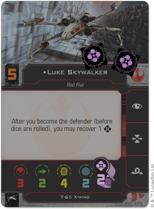  
_Luke Skywalker has a Force capacity of two, granting him two Force charges at the beginning of the game._

At their most basic, these charges can be spent to improve a pilot’s aim or give them an extra push to avoid incoming fire. Using a Force charge lets you change a single focus result on attack or defense to a hit or evade result! When paired with upgrade cards, however, Force-sensitive pilots become even more versatile. Upgrades that require Force charges can make Force-sensitive pilots more perceptive of their surroundings, give them supernatural reflexes, or even grant them the ability to reach out and sense where their opponent will move next.

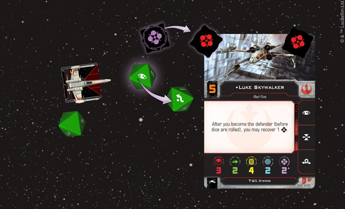  
_While Luke is being attacked, he uses one of his Force charges to change a focus result to an evade._

While the Force can be a powerful ally in the midst of battle, it is also a finite resource. You must choose the right moment to spend your charges to ensure they have the greatest impact on the battle. Trust your feelings and let the Force flow through you!

Iconic Ships
------------

_“We’ll have to destroy them ship to ship. Get the crews to their fighters.”_  
   –Darth Vader, _Star Wars: A New Hope_

_X-Wing_ is known for bringing starships from across the _Star Wars_ galaxy to life in beautifully-detailed miniatures. On top of the T-65 X-wing and two TIE fighters included in the _X-Wing Second Edition Core Set_, the many _X-Wing Second Edition_ expansions give players plenty of options for building a squadron that fits your playstyle.

Whether you prefer the versatile starfighters of the ragtag Rebel Alliance, the speed and overwhelming numbers of the Galactic Empire, or the unpredictability of the galaxy’s most wretched Scum and Villainy, all three factions will be represented at launch. New players can expand their collections with _X-Wing Second Edition_ ship expansions while veterans can use each faction’s conversion kit to bring their entire collection of first edition ships into the game’s second edition. 

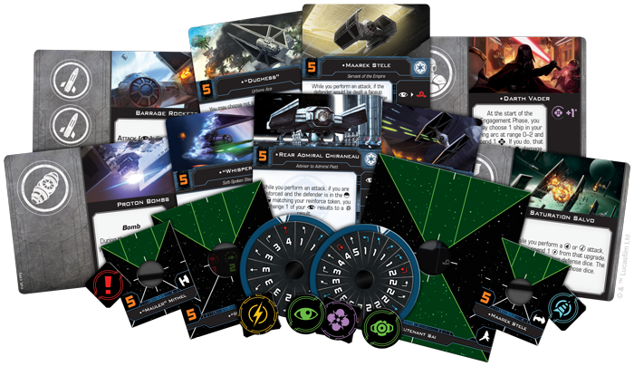  
_Each_ Conversion Kit _contains a massive amount of cards, punchboard, and new medium-sized bases to convert your existing ships to the game's second edition. For a full list of the ships converted by each_ Conversion Kit_, read more in our FAQ section [on this page](https://www.fantasyflightgames.com/en/products/x-wing-second-edition/)!_

Each conversion kit contains a massive array of second edition cards, tokens, and maneuver dials for the ships previously released in the game’s first edition. Between the conversion kits and the support offered by the _X-Wing_ squad builder app, you’ll have everything that you need to completely customize your squadron and play with all of your existing ships in the game’s second edition. You can follow these links for more information on all of the products coming out for the [Galactic Empire](https://www.fantasyflightgames.com/en/news/3000/1/1/crush-the-rebellion-1/), [Rebel Alliance](https://www.fantasyflightgames.com/en/news/3000/1/1/all-wings-report-in-1/), and [Scum and Villainy](https://www.fantasyflightgames.com/en/news/3000/1/1/become-infamous/) factions. For more information about the _X-Wing_ squad builder app, read on!

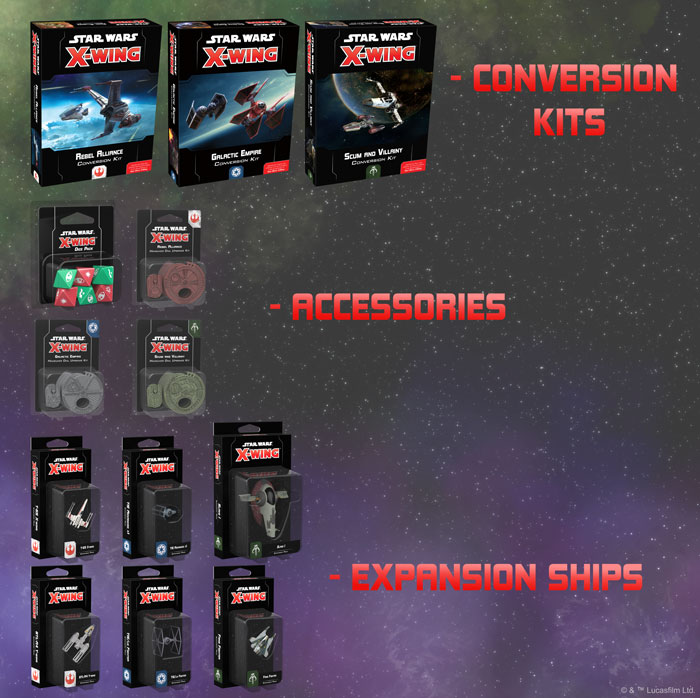  
_The expansions shown above comprise_ X-Wing _Wave I, releasing alongside the_ Core Set_!_

Furthermore, the _X-Wing Second Edition Dice Pack_ will be available alongside the release of the _Core Set_. This accessory includes three red attack dice and three green defense dice, identical to those found in the _Core Set_. With this tool of convenience at your side, your battles can keep up with even the fastest starfighter.

Of course, the _Star Wars_ saga encompasses more than just the Galactic Civil War. _The Force Awakens_ and _The Last Jedi_ continue the story, dramatizing the struggle between the Resistance and First Order. Rather than continue as sub-factions of the Rebel Alliance and Galactic Empire, the Resistance and the First Order are being expanded into their own complete factions in _X-Wing Second Edition_! These factions will be introduced during the second wave of expansions, with their own conversion kits for veteran players to bring their existing First Order and Resistance ships into the game.

Build Your Squad
----------------

_“Man your ships!”_  
   –General Dodonna, _Star Wars: A New Hope_

Once you’ve chosen a faction, it’s time to build your squadron. _X-Wing Second Edition_ gives you a massive amount of freedom to select the ships, pilots, and upgrades that you want to fly. Ace pilots such as Luke Skywalker and Iden Versio bring special abilities to the fray, giving them an advantage over other pilots. On top of the tricks that your pilots can bring to the battle, aces and rank-and-file pilots alike can customize their ships with modifications, secondary weapons, astromech droids, and special skills that add new variety and tactical depth to every game. In the second edition, however, the exact upgrades which each ship can equip are determined by the _X-Wing_ squad builder app, which we’ll explore more below!

The upgrade cards that you choose give your pilots special abilities or alternative ways to attack, giving you more flexibility in the middle of a battle. You’ll choose your upgrades using the Quick Build cards or the official _X-Wing_ squad builder app before the game starts, as part of assembling your squadron. Once equipped, the new, horizontally-aligned upgrade cards are tucked partially beneath the ship card or another equipped upgrade—allowing you to clearly view the text and any new icons that the upgrade adds to your ship.

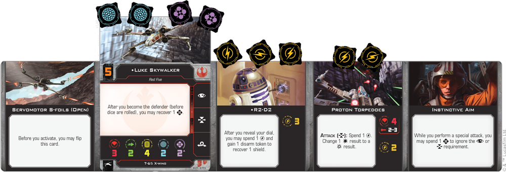  
_Luke Skywalker is ready to enter the fight with an assortment of upgrades!_

When you’re pulling together a squadron to battle against a friend, _X-Wing Second Edition_ offers two excellent ways to assemble your squadrons. If you want to jump into action right away, you can use the Quick Build cards for each ship to easily put together balanced squadrons. These cards include predefined selections of pilots and upgrades, with a threat level that represents the strength of that particular combination. All you have to do to get playing is choose a threat level, select a combination of Quick Build cards that add up to that threat level, and start playing!

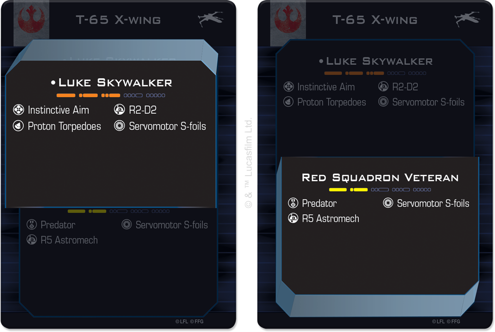  
_Using the predefined selections on these Quick Build cards, pairing Luke Skywalker and a Red Squadron Veteran would create a five-threat squadron._ 

If you want full control over the pilots and upgrades in your squadron, however, _X-Wing Second Edition_ introduces the _X-Wing_ squad-builder app. In the first edition of _X-Wing_, a ship’s upgrade slots and the point costs of ship cards and upgrade cards were printed directly on the card. With the advent of _X-Wing Second Edition_, these point values and upgrade slots will be governed by the app! Rather than using point values printed on the ship cards and upgrade cards, the squad-builder tracks all point values and the upgrade slots available to a ship at any time. What’s more, this app explains the rules of squad-point building and enforces these rules so that players do not accidentally build illegal squads.

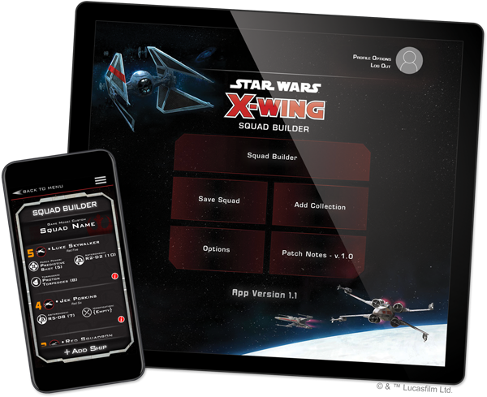

Not only does the _X-Wing_ squad builder app enable fast, accurate list-building, the versatility of the _X-Wing_ squad builder app means that it will be easy to support multiple formats of play, creating a more dynamic play environment. Whether you’re playing at a tournament or around your table at home, the squad builder can be used to create specific formats that test all of your squad-building abilities. The point costs or upgrade slots available to certain ships could be easily adjusted for the course of a single event, a series of tournaments, or a season of the game.

The dynamic approach to _X-Wing_ formats given by the _X-Wing_ squad builder app gives the Organized Play team an opportunity to create unforgettable and unique tournament formats. You can even use the _X-Wing_ squad builder app to create your own custom formats if you’re playing at home or running your own tournament in a local store! By restricting certain cards, you can create a tournament format that’s as unique as the game experience you want to explore.

Future previews will explore the Quick Build cards and the squad builder app in much more detail, showing you just how you’ll be able to pick your pilots, outfit their ships, and jump into the thick of battle! 

A New Beginning
---------------

_“The Force will be with you. Always.”_ –Obi-Wan Kenobi, _Star Wars: A New Hope_

Enemy ships are on your scanners and you only have a few seconds to issue your commands. Experience the next era of interstellar _Star Wars_ battles with _X-Wing Second Edition_!