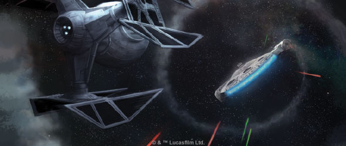
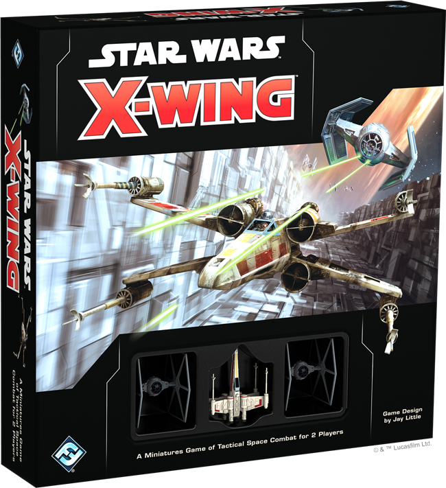
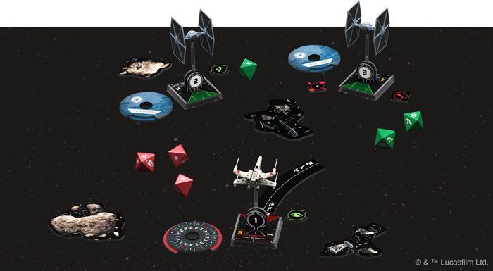
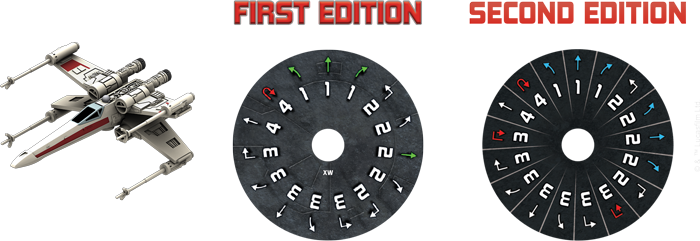
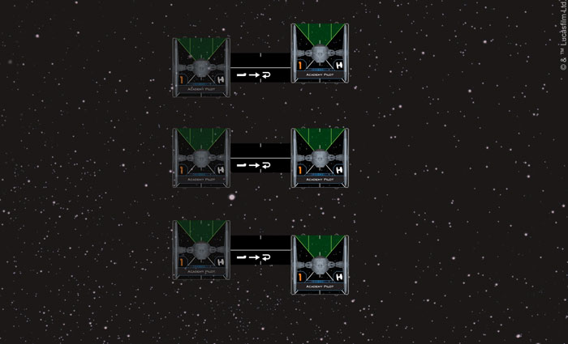
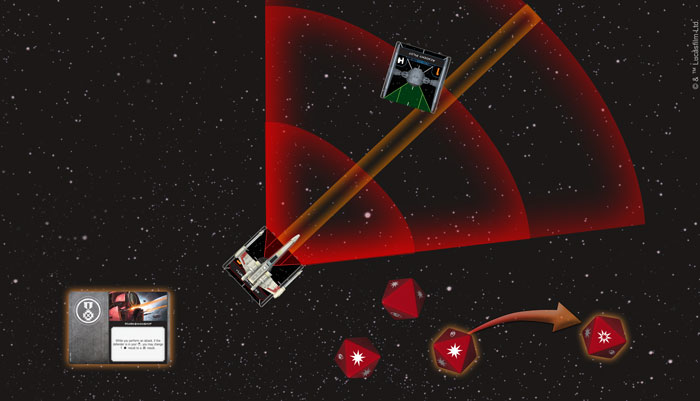

This article was originally published on [https://www.fantasyflightgames.com/en/news/2018/5/9/a-few-maneuvers/](https://www.fantasyflightgames.com/en/news/2018/5/9/a-few-maneuvers/)

&laquo; [Back to index](../index.md)

---

9 May 2018

A Few Maneuvers
===============

Preview Movement in X-Wing Second Edition

_“I know a few maneuvers; We’ll lose ‘em!”_ –Han Solo, _Star Wars: A New Hope_

To the unseasoned starfighter pilot, the heart of a space battle is chaos. With enemy ships zipping in and out of view and the flash of laser fire lighting up the darkness of space, every decision must be made in a split second and could be the difference between victory and defeat.

_[X-Wing™ Second Edition](https://www.fantasyflightgames.com/en/products/x-wing-second-edition/)_ puts you in the middle of these intense space battles, giving you control of your own squadron of iconic ships and pilots from across the _Star Wars_ galaxy. Retaining the exciting, fast-paced foundation of the first edition, each battle tests your ability to outmaneuver enemy ships and gain the upper hand over your opponent.

This all starts with precise movement. Unlike lumbering capital ships, the starfighters you find in _X-Wing Second Edition_ are nimble craft that scream across the battlefield. The best pilots in the _Star Wars_ galaxy are able to anticipate their opponents’ movements and get themselves into the perfect position to open fire. What’s more, these pilots can also take advantage of the asteroids and debris from past battles that they encounter in the depths of space, using them as shields from incoming attacks.

While _X-Wing Second Edition_ continues many of the traditions established by the first edition in terms of movement, a number of changes place even more emphasis on skillfully maneuvering to get enemy ships in your sights. Today, we’re pleased to offer you a closer look into movement in _X-Wing Second Edition_!

New Moves
---------

The _Star Wars_ galaxy is home to a diverse array of starfighters, each with its own capabilities and specifications that make it unique. Fundamental to every _X-Wing_ ship’s identity is its unique maneuver dial that determines what maneuvers a ship can perform when it's activated. Whether you fly your ship in a gentle bank, a tight turn, or a daring Tallon Roll, every ship has its own ways of setting up attacks—or staying out of harm’s way—that shape how it approaches every battle.

Fittingly, a number of ships releasing at the launch of _X-Wing Second Edition_ have revised maneuver dials that give them new life in _X-Wing Second Edition_, beginning with the T-65 X-wing. This iconic fighter becomes a bit more maneuverable in second edition—the speed-two bank maneuvers on the T-65’s dial are now blue, which means this maneuver can be used to remove stress from the ship. More importantly, the T-65’s dial gains speed-three Tallon Rolls and its action bar gains the barrel roll icon, giving it plenty of options for getting enemy ships into its line of fire.

On the Imperial side, the TIE Advanced x1’s maneuver dial gets a similar update. Like the T-65, the TIE Advanced x1 now sports blue speed-two banks and speed-three Tallon Rolls, but it also picks up the speed-one forward maneuver. This gives your TIE Advanced x1 the ability to slow down just a little bit and wait for enemy ships to cross its path before launching a devastating salvo of laser fire.

We’ll take a closer look at all of the ships releasing during the launch of _X-Wing Second Edition_ and their maneuver dials in future previews!

Plan of Attack
--------------

Selecting a maneuver isn’t the only consideration you’ll have to make when activating your ships. Every round of _X-Wing Second Edition_ begins with players using their dials to secretly select maneuvers. After a ship moves, though, it can use one of the actions shown in its action bar, such as acquiring a target lock or focusing.

As in the game's first edition, pilots with higher initiative have more information about how the battle is developing before they move, giving them a better sense of what action to take. Some actions, such as boosting or performing a barrel roll, provide additional movement options. A well-timed boost can propel a ship forward, bringing it in for a close-range shot. Barrel rolling, on the other hand, allows a pilot to move their ship laterally and adjust their position.   

Notably, the barrel roll has been modified for _X-Wing Second Edition_. Each ship token now features hash marks printed along the sides and, when performing a barrel roll, the short end of the movement template must be placed with the middle line of the template aligned with the hashmark on the side of the base. Then, the ship can be placed so the hashmark on the other side of the base is aligned to the front, middle, or back of the other short end of the template. This creates six possible final positions for a barrel roll, so you'll need to carefully decide where you want your ships to wind up. 

  
_When the Academy Pilot barrel rolls to the right, it can move slightly forward, slightly backward, or straight across._

Bullseye Bravado
----------------

The space battles of _X-Wing Second Edition_ are fast, with a single round representing mere seconds of actual combat. It’s common for enemy ships to appear in your firing arc for a brief moment, giving you a small window to squeeze off some shots before they’re gone. For expert pilots, however, it’s second nature to line up the perfect shot and launch a powerful attack. In _X-Wing Second Edition_, displaying such skill does not go unnoticed. 

Every _X-Wing Second Edition_ ship token now has a bullseye arc printed inside of its forward firing arc and players are rewarded for catching enemy ships in this narrow band. Although the bullseye arc itself has no inherent effect, pilots with confidence in their abilities can equip a number of upgrades that take advantage of it. For example, you might be a deadly [Predator,](9c413e19edfb6b0e059cba70b24bf0b1.png) and change a hit result to a critical result.

_The T-65 X-wing has the TIE fighter in its bullseye arc, so it can use Marksmanship to turn one of its hits to a critical hit._ 

Of course, the number of hits you roll doesn’t matter if they’re neutralized by evade rolls. If you’re a [Crack Shot,](0be7ab68d69bc3575d766efb7db2aa59.png)  though, and get the enemy ship in your bullseye arc, you can spend a charge to cancel one of those evade results and ensure that some of your shots make it through. 

Move to Attack Position
-----------------------

Starfighter battles are fast, frenzied affairs where every decision you make could mean the difference between victory and defeat. Only those who can quiet their nerves and move their ships into the right position will win the day. Join the ranks of the best starfighter pilots in the _Star Wars_ galaxy with _X-Wing Second Edition_!

