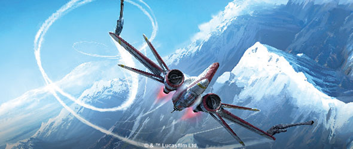
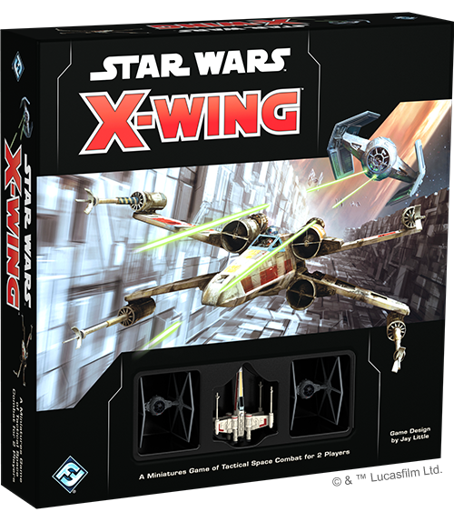
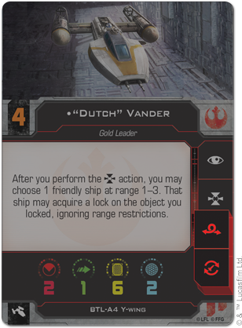
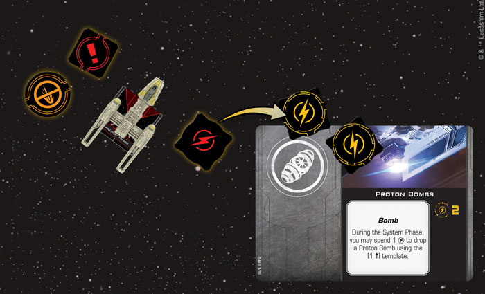
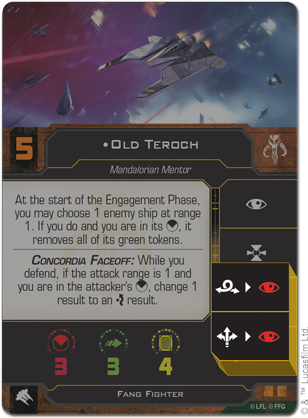
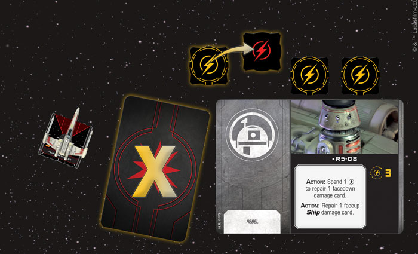

This article was originally published on [https://www.fantasyflightgames.com/en/news/2018/5/21/take-action-1/](https://www.fantasyflightgames.com/en/news/2018/5/21/take-action-1/)

&laquo; [Back to index](../index.md)

---

21 May 2018

Take Action
===========

Preview Actions in X-Wing Second Edition

_“Here goes nothing.”  
   –_Lando Calrissian, _Star Wars: Return of the Jedi_

Being an ace starfighter pilot takes more than just fancy flying. You need to be in tune with your ship, making use of all of its unique capabilities if you want to come out on top. Whether you lock on to an enemy ship, fly erratically to become harder to hit, or clear your head of distractions, a pilot and ship working in tandem can be a powerful destructive force in the space battles of the _Star Wars_ galaxy.

As you lead your squadrons into the heart of intense [X-Wing™ Second Edition](https://www.fantasyflightgames.com/en/products/x-wing-second-edition/) battles, your success or failure will depend upon the actions that you pair with the maneuvers your ships perform. While many of the fundamentals of actions carry over from the first edition, _X-Wing Second Edition_ makes a number of refinements that add new dimensions to the game, creating new opportunities for bold gambits and surprising attacks.

Before you build your squadron and launch your fighters, we're happy to offer you a closer look at actions in _X-Wing Second Edition_!

Red Alert
---------

The battles of _X-Wing Second Edition_ are fast-paced affairs, with ships darting in and out of each other’s firing arcs in an instant. Each round, you’ll send your fighters blazing into battle, pushing them to the limit in order to eliminate enemy ships. Taking actions is a fundamental part of your strategy every game and _X-Wing Second Edition_ gives you plenty of options for outsmarting and outmaneuvering your opponent.

  
_A T-65 X-wing can perform the focus, target lock, and barrel roll actions._

Just as each type of ship has its own unique maneuver dial, each ship also has its own action bar printed on its ship card indicating the actions it can perform, as shown above. After a ship activates and executes a maneuver, it may also perform one of these actions. Some actions, like focusing, can help you hone in on your target or deftly avoid incoming fire. Others, such as boosting, reposition your ship slightly, putting it in a better position.  

These action aren’t always easy to pull off, and each one puts its own pressure on both the pilot and ship. For this reason, _X-Wing Second Edition_ introduces red actions. After a ship performs one of these red actions, it gains a stress token. Just like when you take stress from performing a red maneuver, you cannot perform actions or execute red maneuvers with this pilot until they no longer have any stress tokens.

  
_The Y-wing will gain a stress token after performing either the barrel roll or reload action._

Performing a red action might be beneficial, but that must be weighed against the limitations it places on the ship in the next round. For example, a Y-wing equipped with bombs or torpedoes can take the reload action to recover one charge on that secondary weapon. But, seeing as the reload action on the Y-wing’s action bar is red, it would receive a stress token in addition to the disarm token it gains from performing the action.

  
_The Y-wing takes the reload action to recover one charge of its Proton Bombs, then gains a stress token and a disarm token._

Becoming stressed can have potent consequences, but a certain class of pilots doesn’t have to worry quite so much about being stressed. As long as they have active Force charges, Force-sensitive pilots can spend these charges to modify their attack or defense dice, even if they have stress tokens. These pilots allow you to think about actions differently, allowing you to unexpectedly pull off a red maneuver or fly through a debris field and rely on the power of the Force to carry you through safely. (We'll take a much closer look at the power of the Force in a future preview!)

Beyond simply performing red actions, the ships of _X-Wing Second Edition_ can pull off some impressive feats, and occasionally a daring pilot might be able to push their fighter beyond its normal abilities. Some second edition ships now have actions linked to other actions on their ship cards, forming some potent combinations. For example, the Fang Fighter can follow either a boost or barrel roll action with a focus, putting it in good position to make a powerful attack and survive any retaliatory fire.

  
_The Fang Fighter may immediately perform a focus action after performing a barrel roll or boost._

The linked actions shown above do incur stress, however, which makes using one a calculated risk. The impact could be felt for multiple rounds in the future.

Upgrade Complete
----------------

The actions available to a ship aren’t limited to a ship’s action bar. Every ship can be customized with upgrade cards that can enhance the actions already available to a ship or even unlock new actions for you to perform. The [Expert Handling](4925aac2f3b4af82a346badeca59b644.png) upgrade, for example, allows a ship with a red barrel roll icon to gain a white barrel roll action, giving it even more freedom to reposition itself without taking stress.

Still other upgrades improve the potency of your actions. Astromech droids in particular help to make your actions more versatile. Not only does equipping a ship with an [R3 Astromech](edd0c11055939716e566009c543505eb.png) allow that ship to maintain up to two locks, it also gives that ship the ability to acquire both of those locks at once.

  
_As an action, the T-65 X-wing spends one of R5-D8's charges to repair a facedown damage card, completely removing it from the ship!_

Alternatively, other astromechs are known for their ability to make repairs to ships mid-flight, and having one equipped can keep your ship in the fight a little bit longer. With R5-D8 on your ship, you can use an action to repair a faceup **_Ship_** damage card, flipping it facedown. Alternatively, if you spend one of his charges and take an action, you can get rid of a facedown damage card completely.

Join the Fight
--------------

Deep in the heart of a space battle, it can be hard to determine the best course of action. Only the best pilots have the nerve to stay calm and take the actions that will keep themselves—and their squadmates—in the fight. Join their ranks and jump into the thick of the action!