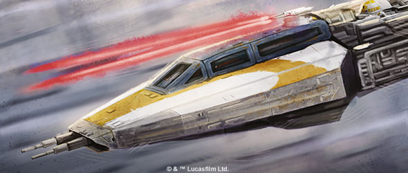
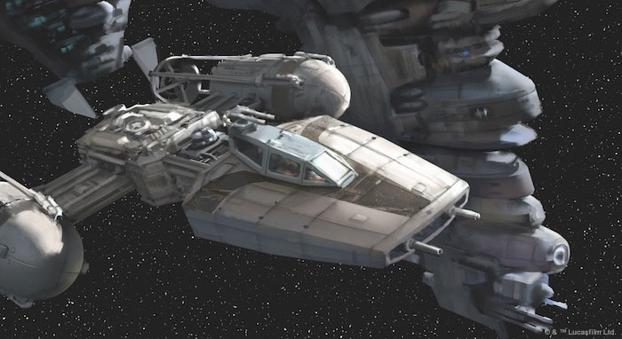
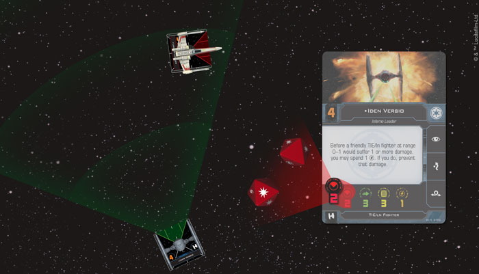
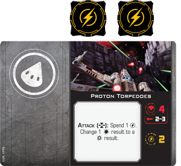
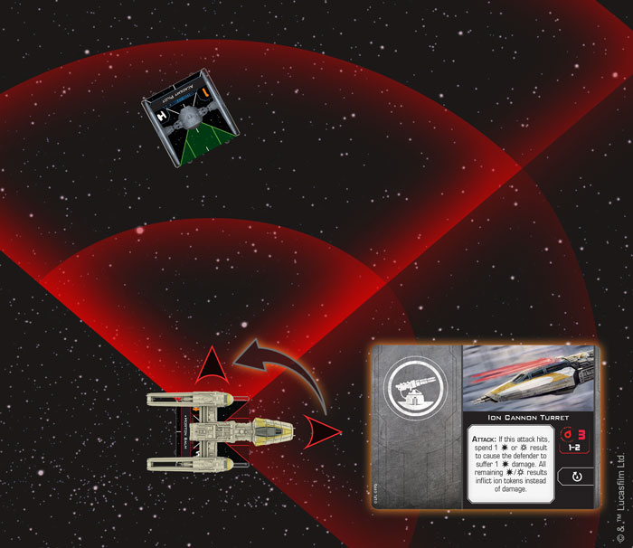

This article was originally published on [https://www.fantasyflightgames.com/en/news/2018/5/29/begin-engagement/](https://www.fantasyflightgames.com/en/news/2018/5/29/begin-engagement/)

&laquo; [Back to index](../index.md)

---

29 May 2018

Begin Engagement
================

Preview Combat in X-Wing Second Edition

_“Get set up for your attack run!”_  
   –Red Leader, _Star Wars: A New Hope_

Although they may be infinitesimal in comparison to capital ships, individual starfighters can make a huge difference in a space battle. After all, it was a lone T-65 X-wing fighter that destroyed the massive Death Star, scoring a major victory for the Rebel Alliance. In _[X-Wing Second Edition](https://www.fantasyflightgames.com/en/products/x-wing-second-edition/)_, you have the chance to enter a new era of space battles as you lead squadrons of these fighters into tense engagements.

Thus far, we’ve taken a look at the refinements that have been made to the game’s movement system, placing the emphasis on precisely maneuvering your ships into the perfect position. From there, we examined the actions you can pair with these movements to develop your overall strategy. But both the way you fly your ship and the actions you take with it are ultimately geared toward one goal: opening fire and eliminating enemy ships. Today, we’re pleased to offer a glimpse into combat in _X-Wing Second Edition_!

Strike Swiftly
--------------

Everything in a round of _X-Wing Second Edition_ builds up to engaging and attacking enemy ships. As things progress, you’ll deftly maneuver your ships into position, selecting actions along the way that will make them all the more deadly. Every decision you make carries strategic weight, and combat in _X-Wing Second Edition_ builds the tension while maintaining the quick tempo of a space battle.

The first goal of any engagement is to get the enemy in your ships’ firing arcs. Once you do, you’ll then choose the weapon you’ll use for your attack. Each weapon rolls a different number of attack dice and has its own set of effects once it’s fired. At the very least, you can always fire a ship’s primary blaster cannons, rolling red attack dice equal to the attack value printed on your pilot card. The defending ship will roll green defense dice equal to the agility value printed on their ship card. Any evade results rolled by the defender will cancel your hits, so it’s best to find a way to maximize the amount of damage that gets through!

  
_When firing with its primary weapon, the TIE fighter rolls two red attack dice._

One solution is to use a secondary weapon with a little more power. Each of these weapons give you more tactical options in the middle of a fight. Launching a volley of [Proton Torpedoes,](0ace99bef06892f2dbe95c4e58b83bbc.png)  for example, lets you roll four attack dice and change a hit result to a critical result. This added power is not without its limits, however. In _X-Wing Second Edition_, secondary weapons like torpedoes have a finite number of charges. Every time one of these weapons is used, one of its charges is flipped to its inactive side and, when all of its charges are inactive, that secondary weapon cannot be used again.

  
_Proton Torpedoes come with two charges that can be spent throughout a game._

In addition to providing extra firepower, some weapons provide more versatility, inviting you to subvert the normal attack requirements. Bombs such as [Seismic Charges,](637648e6e5e396f7f5b16ce05eacc87f.png)  for example, can be dropped in the path of enemy ships, forcing them to alter their flight path or suffer damage. Still other weapons, like turrets, give you a greater degree of freedom when you’re determining where to fire. Rather than being fixed to a ship’s forward firing arc, these weapons can be rotated to fire in other directions.

  
_The Y-wing uses an action to rotate its turret arc and open fire on the TIE fighter with its Ion Cannon Turret!_ 

Unlike in the game's first edition, however, your turrets can't fire in every direction at once. Depending on your ship, you'll only be able to fire your turrets in one or two of these arcs at a time. What's more, rotating your turrets requires an action, so you must choose your arc wisely if you want to properly use these guns. Savvy pilots can use this to their advantage, maintaining their course while still being able to fire at enemy ships with weapons such as an [Ion Cannon Turret](e20d68dc9d4ad65825e72dca43f99c11.png) on your ship, giving you attacks from two different arcs during a single round. 

My Ally is the Force
--------------------

As we saw when Luke Skywalker guided his proton torpedoes into the Death Star’s exhaust port in _Star Wars: A New Hope_, the Force can be a powerful ally during the fiercest space battle. Within _X-Wing Second Edition_, the addition of Force powers adds new dimensions to the game, giving you even more strategic options. Our preview of actions showed how simply having Force charges to modify your dice affects how you think about the maneuvers you perform and the actions you take. But your Force charges become even more useful when you outfit your Force-sensitive pilots with Force upgrade cards.

These upgrade cards deepen these pilots’ connection to the Force, unlocking new abilities and giving them the ability to perform feats that will leave even ace pilots in awe. For example, being in tune with the Force could help a pilot have [Heightened Perception,](9f2b49bfe9856ac01e37c2629d493613.png)  ignoring the normal requirements.

The Force connects all things in the _Star Wars_ galaxy, and those trained in its ways can reach beyond themselves and feel the presence of those around them. Sometimes, they can even [Sense](8a156e5f8534df5dea54c72317f0494c.png) their intentions, gaining insight into what they’ll do next. This Force power lets you look at nearby ship's dial and takes effect during the new System Phase, which allows you to activate certain abilities between secretly setting maneuever dials and activating ships. 

  
_Luke Skywalker spends a Force charge to use Sense and reveal the TIE fighter's maneuver dial!_

While the Force is a powerful tool that gives users connected to it supernatural abilities, using it takes its toll. Most pilots who can use the Force only have a handful of Force charges at their disposal and while they typically recover one Force charge at the end of each round, you must carefully select which of your powers to use to get the most out of them. 

Enter the Battle
----------------

With pinpoint maneuvering and lightning-quick reflexes you’ve gotten the enemy ship in your sights. It’s time to seize this opportunity and launch a devastating attack. A new era of intense, fast-paced space battles is coming to your tabletop soon with _X-Wing Second Edition_!