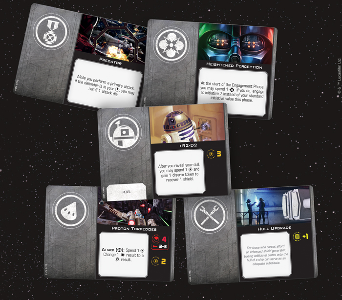
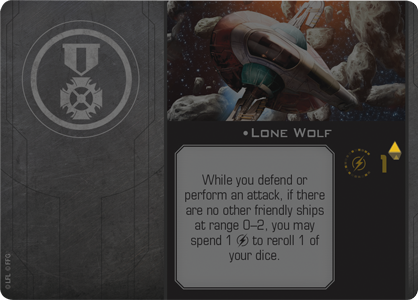
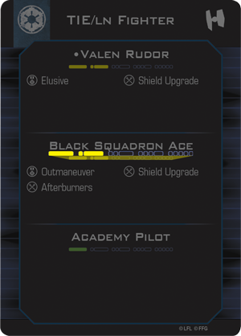
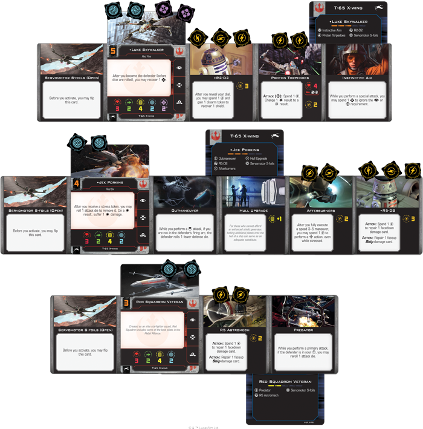

This article was originally published on [https://www.fantasyflightgames.com/en/news/2018/6/4/squad-selection/](https://www.fantasyflightgames.com/en/news/2018/6/4/squad-selection/)

&laquo; [Back to index](../index.md)

---

4 June 2018

Squad Selection
===============

Preview the Upgrades and Quick Build Cards of X-Wing Second Edition

_“She may not look like much, but she’s got it where it counts, kid. I’ve made a lot of special modifications myself.”_  
   –Han Solo, _Star Wars: A New Hope_

With _[X-Wing™ Second Edition](https://www.fantasyflightgames.com/en/products/x-wing-second-edition/)_, you can play out a new era of space battles in the _Star Wars_ galaxy right on your tabletop. You might join up with the Rebel Alliance, locking the s-foils of your T-65 X-wing into attack position as you begin your assault. Or you could send a swarm of Imperial TIE fighters screaming into battle. Finally, if the squabbles of the Galactic Civil War mean little to you, you can always throw in your lot with the galaxy’s most notorious Scum and Villainy.

These factions bring their own ships and strategies to each battle, giving you the chance to take control of some of the most iconic starfighters in the galaxy. But _X-Wing Second Edition_ is about more than just individual ships and pilots. The game also invites you to forge an entire squadron, outfitting your ships with anything from torpedoes to astromech droids.

Thus far, we’ve taken a look at the refined movement of the second edition, explored the changes to actions, and gotten a glimpse at combat. These are all integral aspects of gameplay, but they also vary greatly depending on the ships you choose to fly and the upgrade cards you choose to equip.

For veteran players, you can expand your squad building possibilities at launch with the wealth of upgrade cards included in each of the three _Conversion Kits_ for the game! On the other hand, if you're new to the game, the six _X-Wing Second Edition_ ship expansions releasing with the _Core Set_ also contain upgrade cards that can be used to enhance your ships. Today, we begin discussing bringing your squadron together with a closer look at upgrade cards and Quick Build cards! 

Outfitting Your Ships
---------------------

Every _X-Wing Second Edition_ ship is unique, with its own combination of attack power, maneuverability, hull strength, and shields. On top of these core characteristics, ships also distinguish themselves by the unique combination of upgrade cards they can equip. These cards represent the different ways you can customize your ships, granting them special abilities or alternative ways to attack.

  
_From Force abilities to ship modifications,_ X-Wing Second Edition _features many different types of upgrades that you can use to customize your ships and build your own unique squadron!_

There are many different types of upgrades, distinguished by the icon found on the left side of the card. In addition to their special abilities, ace pilots can be given Elite talents such as [Outmaneuver](7b8df048c5737f29f4b6ee7964eda5a2.png) to perform actions at just the right moment.

The vast majority of upgrade cards, however, come in the form of changes that can be made to your ships. For example, you could add a modification like [Afterburners](34878dec224145e9090d06799a6d818d.png) and give yourself the chance to launch two attacks in a row.

  
_The Lone Wolf upgrade includes an arrow next to its charges, meaning that it recovers its charge at the end of every round!_

In _X-Wing Second Edition_, many upgrades have a number of charges that limit the number of times they can be used throughout a game. But some, like [Lone Wolf,](1ddfef9704eb3b11295595d6dc7a4340.png)  have a small arrow printed on their upgrade card. These cards recover a single charge at the end of each round, letting you continue to use them throughout a the game. Still, you must use your charges strategically during a round, picking the moments you’ll need them most.

Putting a Team Together
-----------------------

From the very beginning, _X-Wing Second Edition_ gives you vast array of options for assembling your squadron of starfighters and soaring into battle. On top of the pilots and upgrades you'll get to choose from, the game also gives you two options for putting these pieces together. If you’re using the _X-Wing_ squad builder on the web or on your mobile device, the squad builder tracks the upgrade slots available to your ships, as well as the point cost of both ship and upgrade cards. All you have to do is select the faction you wish to play and begin building your squadron!

But if you’d like to jump right into the action without worrying about squad points, _X-Wing Second Edition_ offers you another option. The Quick Build cards included in the _Core Set_ and every ship expansion give you a way to quickly assemble a squadron and get flying right away. Each of these cards provide pre-defined selections of pilots and upgrades, combined with a threat level that represents the approximate strength of that ship. For a normal game, players choose cards with a total of eight threat—though these Quick Build cards also make it easy for you to play a simple escalation variant, choosing ships with greater threat as your ships on the battlefield are destroyed!

  
_When building a squadron using the Quick Build cards, this configuration of the Black Squadron Ace is worth two threat._

Constructing our first _X-Wing Second Edition_ squadron with Quick Build cards, we’ll use Luke Skywalker as the cornerstone of our squadron, supporting this powerful, Force-sensitive pilot  with some wingmen from Red Squadron. Of course, this squadron could be made even more diverse by including a Y-wing—Quick Build cards for each ship come in that ship's corresponding expansion in _X-Wing Second Edition_!

With a total of six threat between them, [Luke Skywalker](6cdce8bfbfb01d70bdaa88cd6cf21c93.png) is ready to help him recover lost shields.

Despite lacking Force abilities, Jek Porkins can still hold his own in the midst of an intense battle. He tends to be a bit riskier, with his ability allowing him to remove stress tokens by simply rolling an attack die. This could lead to taking some damage, of course, but adding a [Hull Upgrade](3be6543871d8acc672596aa14dfa5b4d.png) enemy ships, giving him an even better chance of landing attacks.

Finally, a [Red Squadron Veteran](61548214dd74da1ca688704cceef764f.png) repairing damage for them.

Enter the Fight
---------------

The Quick Build cards let you jump into the action of _X-Wing Second Edition_ right away, giving you the opportunity to explore new pilots and upgrade cards, or easily play an escalation variant. Still, they only represent the beginning of the squad building possibilities that lie before you. You can take full control and create the squad that matches your strategy using the _X-Wing_ squad builder app. Look for more details on the squad builder in a later preview, and join us next time for a preview of the _T-65 X-Wing Expansion Pack_!

