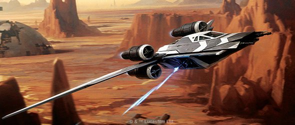
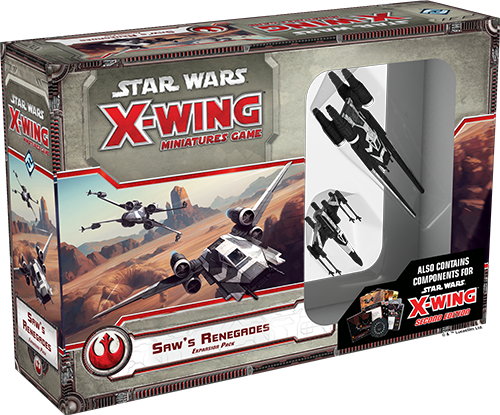
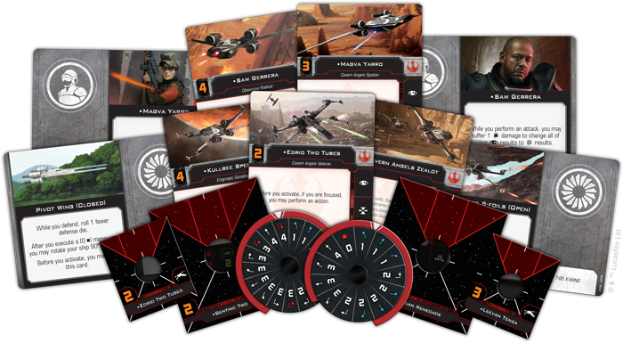
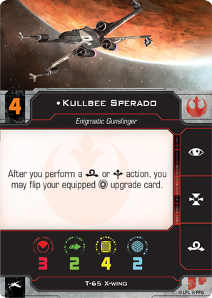
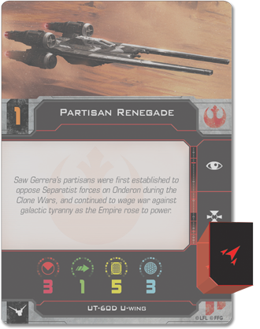
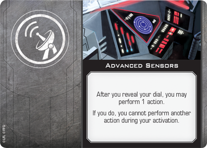
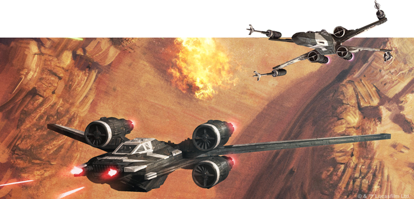

This article was originally published on [https://www.fantasyflightgames.com/en/news/2018/6/5/extreme-action/](https://www.fantasyflightgames.com/en/news/2018/6/5/extreme-action/)

&laquo; [Back to index](../index.md)

---

5 June 2018

Extreme Action
==============

Previewing the X-Wing Second Edition Content of the Saw's Renegades Expansion Pack

_“You give way to an enemy this evil with this much power and you condemn the galaxy to an eternity of submission. The time to fight is now!”_ –Jyn Erso, _Rogue One: A Star Wars Story_

When _Rogue One: A Star Wars Story_ was released, we got a glimpse at a side of the Rebel Alliance that we had never seen before. Chiefly, we were introduced to Saw Gerrera and his unique brand of resistance against the Empire. Even though his extreme tactics were condemned by some, Saw and his Partisans played a critical role in the foundation of the Alliance.

Similarly, Saw will also be key in establishing a new era of interstellar combat in the _Star Wars_ galaxy when _[X-Wing™ Second Edition](https://www.fantasyflightgames.com/en/products/x-wing-second-edition/)_ launches on September 13th, 2018. The _[Saw’s Renegades Expansion Pack](https://www.fantasyflightgames.com/en/products/x-wing/products/saws-renegades-expansion-pack/)_ will bridge the gap between the first and second editions by including components compatible with both. On top of the T-65 X-wing and UT-60D U-wing miniatures painted in the striking black-and-white paint scheme of Saw's Partisans, this expansion also contains second edition versions of all ship cards and tokens as well as a plastic medium base to fully bring your U-wing into the second edition.

Rounding out the second edition content are a complement of twelve upgrade cards that will give you a taste of the new edition when the _Saw’s Renegades Expansion Pack_ is released in the second quarter of 2018. These cards expand the already vast pool of upgrades that will be available through the _X-Wing Second Edition Core Set_ and the seven ship expansions releasing alongside it, giving you a wide array of options for customizing your squadrons from the very beginning of _X-Wing Second Edition_. We’ve already shown you many of the [first edition cards](https://www.fantasyflightgames.com/en/news/2018/4/24/save-the-rebellion/) included in this expansion. Today, we’re happy to present a preview of the second edition content included in the _Saw’s Renegades Expansion Pack_!

A New Generation
----------------

 The T-65 X-wing is a versatile starfighter that forms the cornerstone of many Rebel starfighter squadrons. Saw Gerrera and his followers share the Rebellion’s taste for the T-65 and the _Saw’s Renegades Expansion Pack_ gives you access to even more T-65 X-wing pilots from the start of _X-Wing Second Edition_.

[Our announcement](https://www.fantasyflightgames.com/en/news/2018/5/1/x-wing-second-edition/) revealed that this classic ship has been given some new capabilities in the second edition and Saw’s Partisans are ready to take full advantage of them. A pilot like [Leevan Tenza,](2cdf1b9ef5665256a321940662ca12da.png) its S-foils. He can perform a red evade action after executing a barrel roll or a boost, so he’ll always have this option no matter what position his S-foils are in.

[Kullbee Sperado,](ada3683fc83cbee06ec3aa485dc36588.png)  meanwhile, can switch the position of his S-foils with lightning-quick reflexes, flipping his Servomotor S-foils upgrade card after performing a barrel roll or boost. This frees him to focus while his S-foils are closed, perform a red boost action, then open his S-foils and prepare to attack, all in a single activation.

Other pilots, such as [Edrio Two Tubes,](ee83ee1e65a04d361e4c2907fe8acad0.png)  who can transfer a focus token from his U-wing to a nearby friendly ship after performing a focus action. 

Striking Back
-------------

In addition to introducing us to Saw and his Partisans, _Rogue One: A Star Wars Story_ also gave us our first on-screen look at the UT-60D U-wing starfighter. The preferred ship of Saw Gerrera himself, the U-wing gets its own updates for _X-Wing Second Edition_ that open up new tactical possibilities for this Rebel troop transport. It now sports a red coordinate action in addition to its focus and target lock, allowing it to act as a mobile command center and dole out actions to friendly ships in the thick of battle.

Beyond this, the second edition pilots you’ll find in the _Saw’s Renegades Expansion Pack_ bring their own flavor to the U-wing. Saw’s followers are known for their fanatical devotion to the cause of freedom and [Saw Gerrera](72fc817027759ff87f57dd70645fcb4a.png) on a ship, he can force the ship to suffer one damage to change all of its focus results to critical results while attacking.

[Magva Yarro,](315641c1dcb541bdaeb35f59fefcdf15.png) is aboard a ship that gets hit by an attack, her ship can prepare to return fire by acquiring a lock on the attacker.

 While the pilots in Saw's cadre of freedom fighters fight alongside their Rebel brethren in _X-Wing Second Edition_, as a splinter group, they remain notably distinct from other Rebels in _X-Wing Second Edition_. Their existence on the fringes of the Rebellion gives them an edge not seen by other, more mainstream Rebel pilots. As a result, every pilot included in the _Saw’s Renegades Expansion Pack_ can also equip an Illicit upgrade such as the [Deadman's Switch.](8029f1be40aacd0e25404e8e9422a4f8.png) 

The ability to equip Illicit upgrades certainly makes Saw and the rest of his followers unique among T-65 and U-wing pilots, but this expansion also contains a number of other upgrades that can be equipped by other members of the Rebel Alliance and beyond. You might give an already daring pilot the ability to pull off a [Trick Shot,](12bd8963f08ceb04b28c7baef11158f8.png)  for example, rolling an extra attack die while your attack is obstructed by an obstacle.

The _Saw’s Renegades Expansion Pack_ is also the first place to find the second edition version of a powerful System upgrade like [Advanced Sensors.](3efe418339a30bca022304ceaee8d3d9.png)  Allowing you to perform an action after you reveal your maneuver dial, Advanced Sensors gives you the chance to react to the evolving battle around you before you execute your maneuver.

Rebel Spirit
------------

Although some may label him an extremist, Saw Gerrera is steadfast in his resistance to the Empire. Soon, you will be able to join his fight for freedom as it shifts to the new era of starfighter combat of _X-Wing Second Edition_. Man your ships and fly for freedom!

