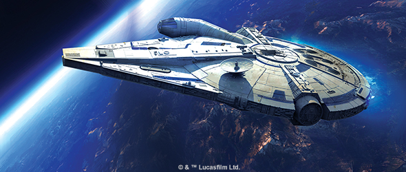
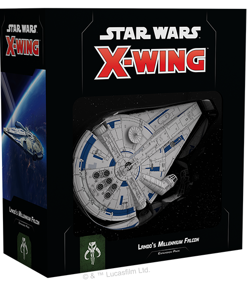
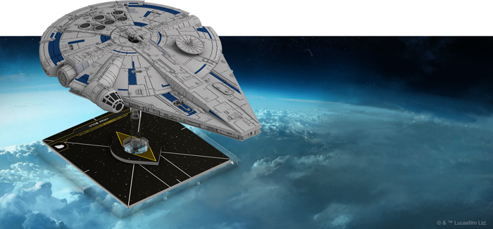
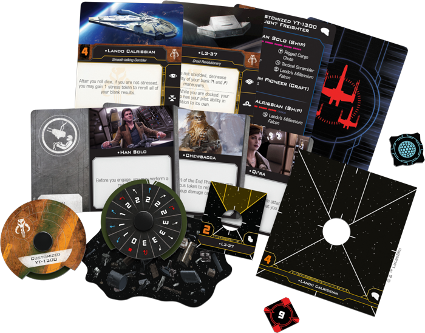
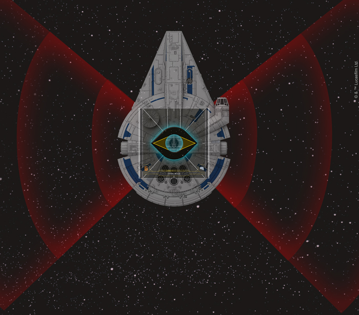

This article was originally published on [https://www.fantasyflightgames.com/en/news/2018/6/7/fast-enough/](https://www.fantasyflightgames.com/en/news/2018/6/7/fast-enough/)

&laquo; [Back to index](../index.md)

---

7 June 2018

Fast Enough
===========

Announcing the Lando's Millennium Falcon Expansion Pack for X-Wing Second Edition

_"Might want to buckle up, baby."_  
   –Lando Calrissian, _Solo: A Star Wars Story_

From its first appearance, blasting its way out of Mos Eisley spaceport in _A New Hope_ to its triumphant arrival at the Battle of Crait in _The Last Jedi_, the _Millennium Falcon_ has been an iconic part of the _Star Wars_ saga, transporting us and our heroes to many of the fantastic worlds of a galaxy far, far away.

But long before Han Solo owned the _Millennium Falcon_ and made his own brand of special modifications to the ship, it belonged to infamous gambler and smuggler Lando Calrissian. With the recent release of _Solo: A Star Wars Story_, we finally got to witness some of the _Millennium Falcon_’s early exploits and see how it inevitably came into Han Solo’s possession. Soon, you’ll have the opportunity to experience this classic ship in an all-new way during your games of [_X-Wing™ Second Edition_](https://www.fantasyflightgames.com/en/products/x-wing-second-edition/).

Fantasy Flight Games is proud to announce the [Lando’s _Millennium Falcon_ Expansion Pack](https://www.fantasyflightgames.com/en/products/x-wing-second-edition/products/landos-millennium-falcon-expansion-pack/) for _X-Wing Second Edition_! This expansion pack will join the rest of Wave I for _X-Wing Second Edition_, releasing on September 13th, 2018!

Roll the Dice
-------------

Long before either of them became affiliated with the Rebel Alliance, both Lando Calrissian and Han Solo made a living by smuggling illicit cargo throughout the Outer Rim. For this reason, Lando’s _Millennium Falcon_ becomes a powerful new option for the Scum and Villainy faction of _X-Wing Second Edition_.

Within the Lando’s _Millennium Falcon_ Expansion Pack, you’ll find everything you need to add a customized YT-1300 Light Freighter to your squadron, including a beautifully painted ship miniature and an assortment of eight ship cards that reflect the Scum faction’s penchant for risk-taking. But these risks aren’t totally reckless. Any gambler knows the best time to place a bet is when the odds are in your favor, and few are better gamblers than [Lando Calrissian.](swz04_a1_pilot-card_lando.png)  If he’s is at the controls of the _Falcon_ and not stressed, he can gain a stress token to reroll all of his blank results, giving him a much better chance of enhancing an attack or dodging some incoming fire. 

  

Beyond its pilots, Lando’s _Millennium Falcon_ has a few interesting built-in features. Although it was originally built as a freighter, it still makes an intimidating opponent in the middle of a space battle thanks to its double turret arc that functions as a primary weapon. This arc covers much of the space surrounding the ship, making it difficult for an enemy ship to approach without the threat of return fire.

These turrets need operators, of course, and you can enhance their effectiveness by adding a gunner from among the thirteen upgrade cards found in this expansion. In addition to being an ace pilot, [Han Solo](swz04_a1_upgrade-card-han.png) is just as good in the gunner seat, granting you the ability to perform a red focus action before engaging with enemy ships. In effect, this gives you the chance to both rotate your turret into position and focus in a single round, providing ample opportunity to line up your shot and give it a good chance of hitting.

  
_Lando's_ Millennium Falcon _features a double turret arc as its primary weapon, covering half the space surrounding the ship!_

A large ship like the _Millennium Falcon_ can be greatly enhanced by good crew and you’ll find plenty of opportunities to add one among this expansion’s upgrade cards. Scum are known for their unpredictability and [Tobias Beckett](swz04_a1_upgrade-card-tobias.png) is sure to enhance this reputation with his ability to dramatically alter the playing field during setup.

Even more unpredictable is the _Falcon_ itself. Han Solo may have put his own mark on the ship, but Lando Calrissian also gave it a few tricks of his own that you also include. With a [Rigged Cargo Chute,](swz04_a1_rigged-cargo-chute.png)  for example, you can dump a fresh obstacle into the middle of the battlefield and—if you're lucky—into the path of enemy ships. What's more, Lando always had an exit strategy, and this version of the _Millennium_ _Falcon_ also includes the escape craft featured in the film. This craft docks snugly in the larger miniature, even as it makes Lando's _Millennium Falcon_ more versatile with the ability to launch this escape craft, which can operate independently from the larger ship. 

We’ll take a closer look at the pilots, upgrades, and escape craft included in the Lando’s _Millennium Falcon_ Expansion Pack in a future preview!

Not a Scratch
-------------

The _Millennium Falcon_ has woven itself into the history of the galaxy on a number of occasions. Now, the Lando's _Millennium Falcon_ Expansion Pack lets you experience the untold history of one of the galaxy's most storied ships. Take the controls and build your own legacy!

