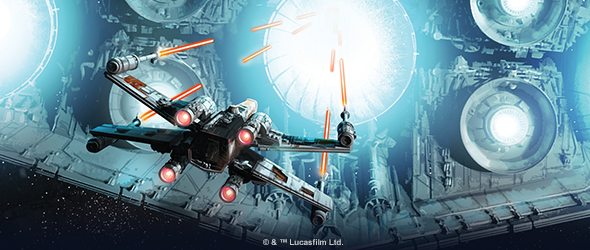
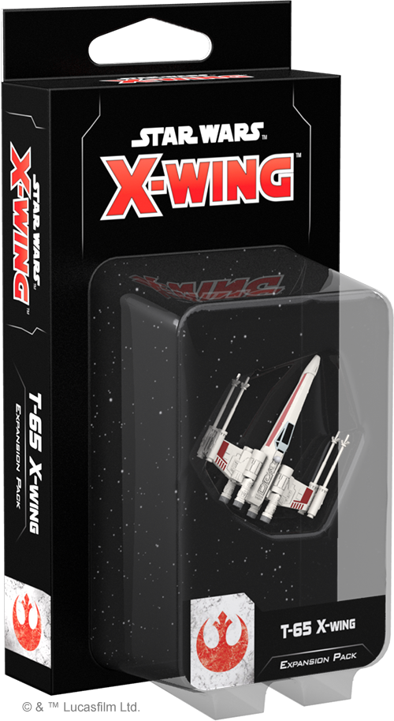
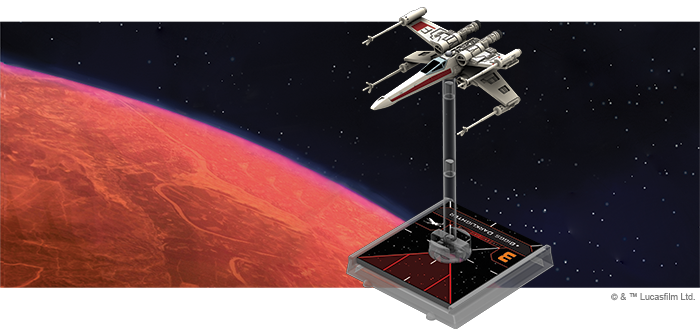
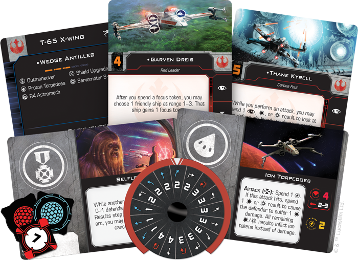
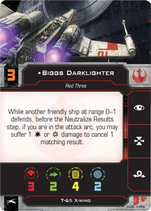
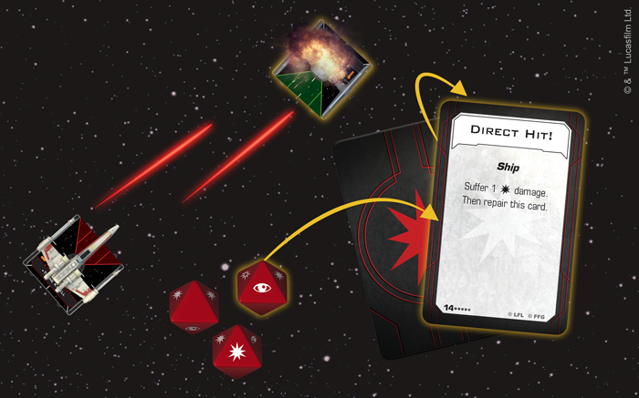

This article was originally published on [https://www.fantasyflightgames.com/en/news/2018/6/11/symbol-of-the-rebellion/](https://www.fantasyflightgames.com/en/news/2018/6/11/symbol-of-the-rebellion/)

&laquo; [Back to index](../index.md)

---

11 June 2018

Symbol of the Rebellion
=======================

Preview the T-65 X-Wing Expansion Pack for X-Wing Second Edition

_“I’ll take the leader_._”_  
   –Wedge Antilles, _Star Wars: Return of the Jedi_

No starfighter is as ubiquitous in Rebel squadrons as the T-65 X-wing. With its astromech droid finely balancing its firepower, shielding, and maneuverability, the T-65 is capable of taking part in almost any Rebel operation. As a result, the ship is a fixture in the space battles of the Galactic Civil War, becoming an indelible symbol of the Rebellion itself. When [_X-Wing_™ _Second Edition_](#)  launches later this year, you’ll have the chance to launch your own group of T-65 X-wings into the next evolution of space combat with both the _Core Set_ and the _[T-65 X-Wing Expansion Pack](https://www.fantasyflightgames.com/en/products/x-wing-second-edition/products/t-65-x-wing-expansion-pack/)_.

The _T-65 X-Wing Expansion Pack_ contains a fully-assembled, beautifully painted miniature featuring moveable S-foils that can easily transition between closed and attack positions. Additionally, the expansion also includes the tokens, cards, and maneuver dial you need to incorporate another T-65 X-wing into your squadron.

Veteran players can bring their existing T-65 X-wings and other ships from the first edition into _X-Wing Second Edition_ with the ship tokens, cards, and maneuver dials included in the _Conversion Kits_ available at launch. New players, on the other hand, can grow their collection with the six ship expansions launching alongside the _T-65 X-wing Expansion Pack_ and the _Core Set_. All of the ship and upgrade cards contained in the _T-65 X-wing Expansion Pack_ will also be present in the _[Rebel Alliance Conversion Kit](https://www.fantasyflightgames.com/en/products/x-wing-second-edition/products/rebel-alliance-conversion-kit/)_.

Fight for Freedom
-----------------

The T-65 X-wing was a mainstay in Rebel squadrons during the Galactic Civil War, and for good reason. These starfighters played an integral role in the destruction of both Death Stars, their pilots bravely taking part in both missions despite the long odds. With a strong list of available actions and a wide range of options for upgrades, the T-65 is a great all-around fighter capable of playing many roles within your squadron.

In our [announcement](https://www.fantasyflightgames.com/en/news/2018/5/1/all-wings-report-in-1/), we already revealed that the Servomotor S-foils upgrade unlocked new possibilities for the T-65 depending on whether its S-foils are [open](swz01_a3_servomotor-open.png)  giving you access to more actions and deepening the ships’ tactical flexibility. Additionally, when we previewed the [refinements to movement](https://www.fantasyflightgames.com/en/news/2018/5/9/a-few-maneuvers/) made in _X-Wing Second Edition_, we discussed how the T-65 was more maneuverable than ever with the addition of speed-three Tallon Rolls.

But these aren’t the only tweaks made to the T-65 for _X-Wing Second Edition_. The ship is now a bit heartier, with four total hull. It’s also a bit more maneuverable, with the barrel roll added to its action bar. The result is a powerful fighter that will take a concerted effort to bring down.

Beyond these upgrades, though, the T-65 X-wing can fill a much different role on your squad depending on who's flying it. Fortunately, it's the ship of choice of some of the Rebellion’s best pilots, including the legendary [Wedge Antilles.](swz12_card_wedge-antilles.png)  When he does shoot, he can zero in on his target with uncanny accuracy, forcing the defender to roll one fewer defense die.     

 But even a pilot as good as Wedge Antilles needs wingmen to support him, and the other members of Red Squadron can give him the help he needs. [Garven Dreis,](swz12_card_garven-dreis.png)    giving him the ability to suffer both one normal and one critical damage result in place of a friendly ship during a single attack.

Looking outside of Red Squadron, _X-Wing Second Edition_ sees the introduction of a brand new T-65 pilot. Known for being an ARC-170 pilot in the first edition, [Thane Kyrell](swz12_card_thane-kyrell.png)  he could just finish off an enemy ship right there.

  
_Thane Kyrell spends a focus result to expose the TIE fighter's Direct Hit! damage card, adding another damage and causing it to be destroyed!_

In addition to a diverse array of pilots to choose from, the T-65 also features a number of upgrade slots that can be used to further customize the ship. Astromech droids, of course, are some of the most versatile upgrades in the game, providing benefits ranging from shield recovery to enhancing a ship’s target locks. A droid like an [R4 Astromech](swz12_card_r4-astromech.png) adds navigational assistance to this list. When installed on a T-65, even speed-two turns become blue, allowing you to both perform pinpoint maneuvers and remove stress.

Beyond astromechs, T-65 X-wings are also famous for using torpedoes during the battle of Yavin. There are more options for you to explore beyond the standard proton torpedoes, however. You could easily add some [Ion Torpedoes](swz12_card_ion-torpedoes.png) and pepper an enemy ship with ion tokens. If you add enough of these ion tokens, you’ll make that ship a ripe target for the next round by forcing it into a speed-one straight maneuver.

Lead Your Rebellion
-------------------

If the Rebel Alliance is planning a combat operation, the T-65 X-wing is sure to be there, bringing with it the hope of the Rebellion. Get to your ships, take to the skies, and start your own rebellion!

