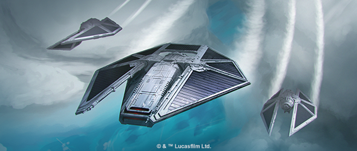
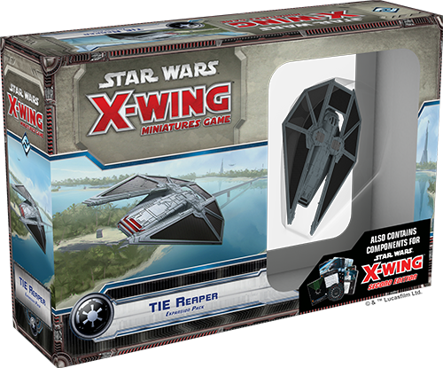
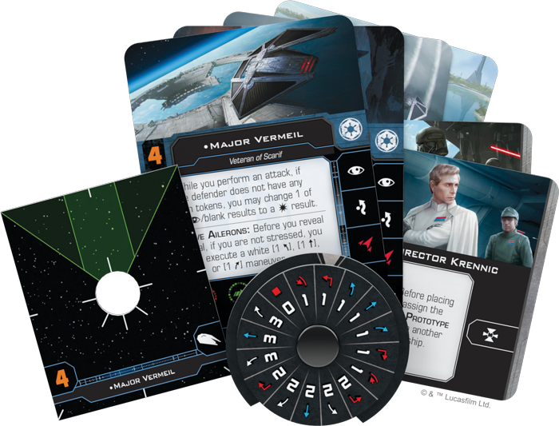
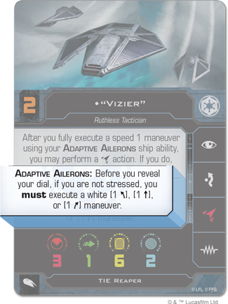
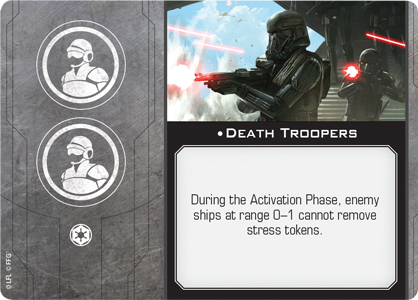

This article was originally published on [https://www.fantasyflightgames.com/en/news/2018/6/15/transporting-terror/](https://www.fantasyflightgames.com/en/news/2018/6/15/transporting-terror/)

&laquo; [Back to index](../index.md)

---

15 June 2018

Transporting Terror
===================

Preview the X-Wing Second Edition Content of the TIE Reaper Expansion Pack 

_"We need a statement, not a manifesto."_  
   –Grand Moff Tarkin, _Rogue One: A Star Wars Story_

As we saw in _Rogue One: A Star Wars Story_, stealing the Death Star plans was no easy task. One of the biggest challenges the Rogue One team faced on Scarif were the waves of Death Troopers ferried into the heat of battle by the imposing TIE reaper. These menacing fighters pose a multipurpose threat to Rebel forces… and the _[TIE Reaper Expansion Pack](https://www.fantasyflightgames.com/en/products/x-wing/products/tie-reaper-expansion-pack/)_ gives you everything you need to add one to your games of [_X-Wing_™](https://www.fantasyflightgames.com/en/products/x-wing/).

In addition to adding a new starfighter to the Imperial ranks, the _TIE Reaper Expansion Pack_ will help usher in _[X-Wing Second Edition](https://www.fantasyflightgames.com/en/products/x-wing-second-edition/)_ by including components that are compatible with both the first and second editions. The beautifully painted TIE reaper miniature included in this expansion will be accompanied by second edition versions of all the ship cards and tokens you need to incorporate one of these terrifying ships into your Imperial squadrons, as well as its own complement of ten upgrade cards.

These cards will give you an early glimpse of the refinements made in the new edition and, when _X-Wing Second Edition_ is released on September 13th, 2018, they will join the upgrades already found in _X-Wing Second Edition_ to give you an array of options for building your first squadron. We’ve already taken a look at the first edition content you’ll find in this expansion. Join us today for a preview of the second edition content in the _TIE Reaper Expansion Pack_!

Advanced Tech
-------------

On the cutting edge of Imperial weapons technology, the TIE reaper is a surprisingly nimble ship for its size. It can pull off some impressively tight turns and quickly reposition itself, daring opposing pilots to underestimate its abilities. Part of this added maneuverability can be attributed to the Adaptive Ailerons that give the reaper a little extra speed before its dial is revealed.  

 A standard feature of all TIE reapers, Adaptive Ailerons are the first instance of ship abilities in _X-Wing Second Edition_. These abilities represent systems built directly into ships, rather than the abilities of the pilots who fly them. Sometimes, such as with  ["Vizier,"](swx75_card2_vizier.png)    a ship ability and pilot ability synchronize to provide extra benefits. In this case, “Vizier” can perform a coordinate action after fully executing the speed one maneuver required by his Adaptive Ailerons, giving another pilot the chance to take an action.

If this pilot you coordinate with happens to be [Major Vermeil,](swx75_card2_major-vermeil.png)  he could always take the jam action to remove a green token from an enemy ship at Range 1 or force that ship to break one of its locks. At the very least, Major Vermeil can assign a jam token to the ship, preventing it from gaining a green token or lock later in the round. If he can successfully keep his target from gaining any green tokens, Major Vermeil can then change a blank or focus result to a damage result while attacking later in the round.

[Captain Feroph](swx75_card2_captain-feroph.png) has a similar ability, guaranteeing her an evade result so long as the attacker does not have any green tokens. In either case, the coordinate action from “Vizier” ensures that Major Vermeil and Captain Feroph can both jam and focus in the same round, putting them at an advantage while limiting the enemy’s options.

Lethal Cargo
------------

When the TIE reaper darkens the skies, enemy pilots know they’re in for a difficult fight. This ship packs quite the punch, rolling three attack dice with its primary weapon. While this fact alone should be enough to give enemy ships pause, the reaper becomes even more frightening when carrying specialized crew members into battle. Originally designed as a troop transport, the reaper's two crew upgrade slots give you plenty of options for enhancing its abilities.

For example, you could fill both of those slots with a group of Director Krennic’s [Death Troopers](swx75_card2_death-troopers.png) on your ship prevents nearby enemy ships from removing jam tokens at the end of the round, ensuring they’ll have difficulty gaining locks or green tokens for at least another round.

Rather than place limits on what enemy ships can do, other crew members, like the [Tactical Officer,](swx75_card2_tactical-officer.png) from the very beginning of the game. Krennic’s ship can then work closely with the Optimized Prototype, with his ship obtaining locks on enemy ships and the Optimized Prototype quickly draining these ships’ shields or exposing their facedown damage cards.

Death from Above
----------------

Whenever an enemy is foolish enough to launch an attack on an Imperial facility, the TIE reaper will be there to carry elite troops into battle. And when _X-Wing Second Edition_ launches on September 13th, 2018, the TIE reaper will be ready to enter a new era of interstellar combat.

