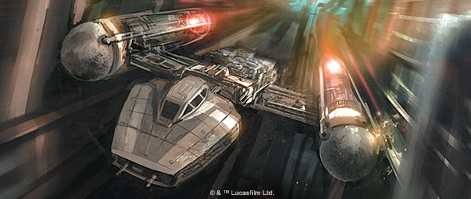
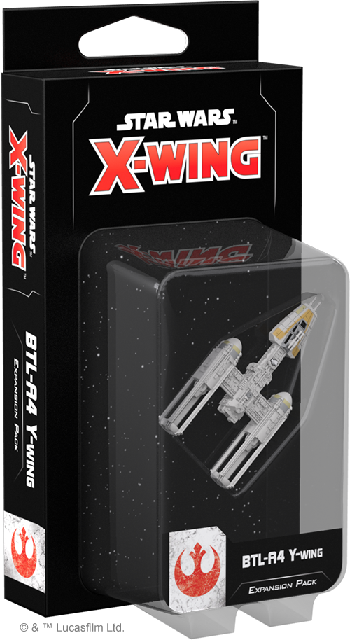
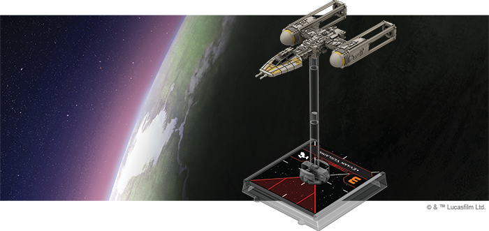
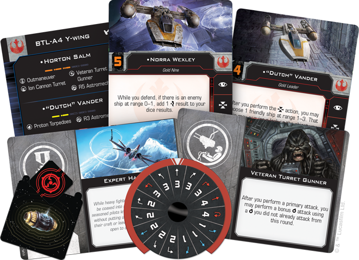
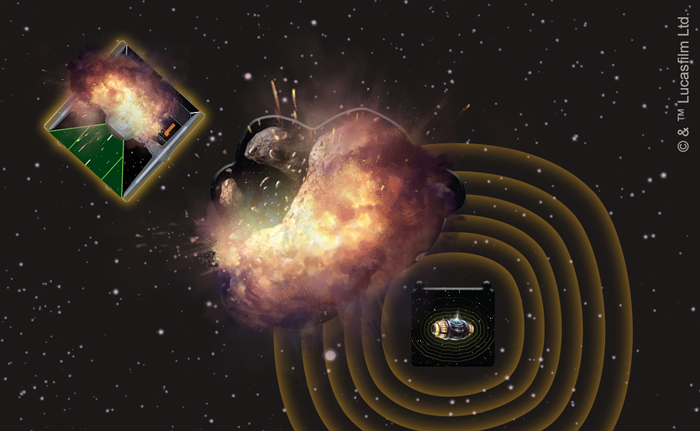
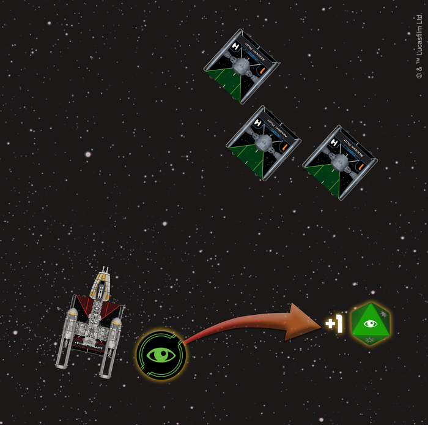

This article was originally published on [https://www.fantasyflightgames.com/en/news/2018/6/18/begin-attack-run/](https://www.fantasyflightgames.com/en/news/2018/6/18/begin-attack-run/)

&laquo; [Back to index](../index.md)

---

18 June 2018

Begin Attack Run
================

Preview the BTL-A4 Y-Wing Expansion for X-Wing Second Edition

“_Red Leader, this is Gold Leader. We’re starting our attack run.”_ –Gold Leader, _Star Wars: A New Hope_

With the vast resources at its disposal, the Galactic Empire can afford to field starfighters that fill very specific roles. The TIE/ln fighter overwhelms enemy squadrons with superior numbers and maneuverability while the TIE bomber wreaks havoc across the battlefield with its heavy payload of bombs, torpedoes, and missiles. The Rebel Alliance, on the other hand, has no such luxury. They must rely on older, more versatile starfighters that can play many roles within a squadron while facing the seemingly infinite variations of the Imperial TIE fighter.

This is certainly the case with the BTL-A4 Y-wing. Long after falling out of favor with the Empire, the Y-wing would be pressed back into the service of the Rebellion, its resilient frame and flexible payload helping it become a reliable workhorse within Rebel squadrons. This formidable starfighter can be a part of your Rebel squadrons from the moment _[X-Wing™ Second Edition](https://www.fantasyflightgames.com/en/products/x-wing-second-edition/)_ launches on September 13, 2018, with the _[BTL-A4 Y-Wing Expansion Pack](https://www.fantasyflightgames.com/en/products/x-wing-second-edition/products/btl-a4-y-wing-expansion-pack/)_. This expansion contains a fully-assembled, beautifully painted, and newly resculpted Y-wing miniature, along with a maneuver dial and all the cards and tokens that you need to add a Y-wing to your squadron.

If you already own a Y-wing from the first edition, you can bring it into _X-Wing Second Edition_ with the ship tokens, cards, and maneuver dials found in the _Rebel Alliance Conversion Kit_ that will be available at launch. This kit includes all of the ship and upgrade cards available in the _BTL-A4 Y-Wing Expansion Pack_. Those looking to expand their ship collections, however, can grab the _BTL-A4 Y-Wing Expansion Pack_ and the six other ship expansions launching alongside the _X-Wing Second Edition Core Set_!

Heavy Munitions
---------------

On the surface, the Y-wing may not seem all that impressive. While it does have a thicker hull than the T-65 X-wing, it’s not nearly as maneuverable and it can’t match the X-wing in terms of firepower from its primary weapon. What the Y-wing lacks in basic stats, however, it makes up for in customizability. Y-wings can be outfitted with a number of upgrades, including turrets, torpedoes, astromechs, and bombs, greatly increasing its firepower and making it a more than worthwhile addition to your squadron.

With both device and torpedo upgrade slots and a red Reload action in its action bar, a Y-wing can be easily outfitted as a heavy bomber, littering the battlefield with devices that can deal damage and disrupt your opponent’s flight paths. A well-placed [Proton Bomb,](swz13_proton-bombs.png)  for example, causes ships at range 0–1 to suffer one critical damage if they’re too close when it goes off.

Other devices, like [Seismic Charges,](swz13_seismic-charges.png) let you make use of obstacles on the board to damage enemy ships. Not only does one of these Seismic Charges cause an obstacle at range 0–1 to be removed when it detonates, it also showers ships within range 0–1 of that obstacle in debris, causing damage. When the Seismic Charges come into play, using obstacles for cover becomes a much riskier strategy—one that could, quite literally, blow up in your opponent’s face.

  
_The Seismic Charge detonates, destroying the asteroid and damaging the TIE fighter!_

Clearly, the Y-wing is a ship that excels at using many different weapons to keep enemy ships off-balance, and deployable devices and torpedoes aren’t the only way for the Y-wing to add more options to its arsenal. You can always add a turret and a gunner to the ship, giving you the freedom to target ships outside your forward arc.

Turrets, of course, can be used for more than simply dealing damage. We’ve already shown you how an [Ion Cannon Turret](swz13_ion-cannon-turret.png)  can help you gain other advantages. In this case, having one allows you to perform a bonus attack, spreading your fire to a turret arc you have not yet used that round.

A Few Good Pilots
-----------------

Thanks to the various upgrades it can equip, the Y-wing has some potent offensive capabilities, and with so many weapons and devices to choose from, a good Y-wing pilot needs to know how to get the most out of their ship. Thankfully, the Rebels who choose to fly them are up to the challenge. True to his position as Gold Leader, ["Dutch" Vander](swz13_dutch-vander.png)  meanwhile, has a better chance of launching a potent attack when his wingmates are close to the defending ship.

If there's an area that the Y-wing is truly lacking, it's agility. With only a single defense die, the Y-wing mostly relies on its thick hull and shields to stay in the fight for as long as possible. Two Y-wing pilots, however, are adept at taking evasive maneuvers with this lumbering ship. First appearing as an ARC-170 pilot in the first edition, [Norra Wexley](swz13_norra-wexley.png) takes her place at the controls of a Y-wing in _X-Wing Second Edition_. She likes to keep her enemies close, making it difficult for other ships to take a clean shot at her. If an enemy ship is at range 0–1 while Norra is defending, she has the rare ability to add an evade to her die results, ensuring that at least one hit will be canceled.

  
_Sensing a strong incoming attack, Evaan Verlaine spends a focus token to give herself an additional defense die until the end of the round._

[Evaan Verlaine](swz13_evaan-verlaine.png) is similarly defensively minded, but unlike Norra Wexley, her results are far from guaranteed. If she finds herself or another friendly ship at range 0–1 in a vulnerable position, she can always spend a focus token to grant herself or her chosen ally an additional defense die while defending until the end of the round.

Take on the Empire
------------------

The Y-wing may be an older starfighter, but it is still a powerful force within Rebel fighter squadrons. With a full complement of bombs and torpedoes, even one Y-wing has the firepower to take the fight to the Empire. Outfit yours and dominate the battles of _X-Wing Second Edition_!

