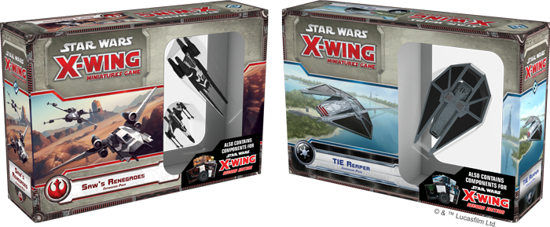
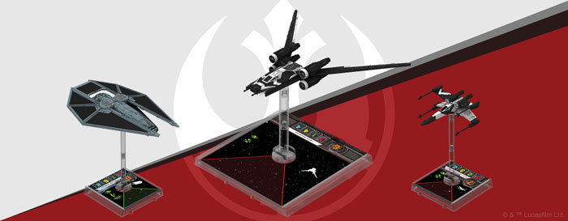
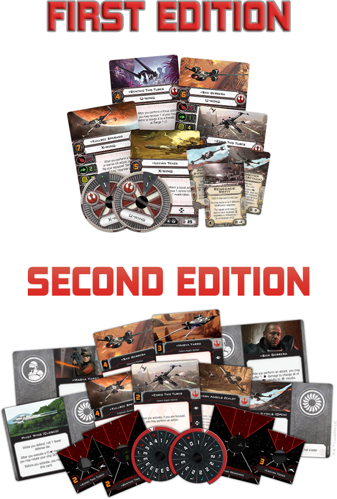
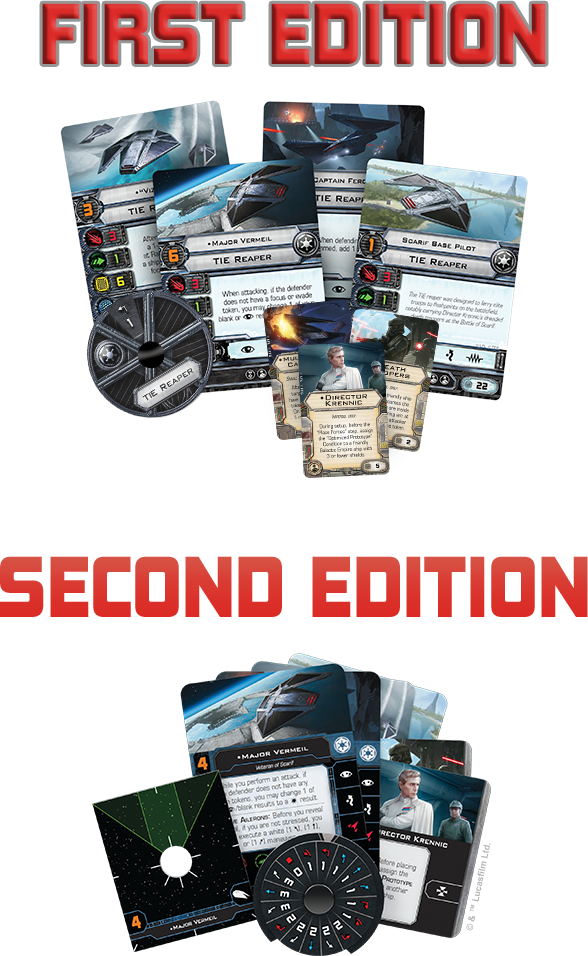

This article was originally published on [https://www.fantasyflightgames.com/en/news/2018/6/21/built-on-hope/](https://www.fantasyflightgames.com/en/news/2018/6/21/built-on-hope/)

&laquo; [Back to index](../index.md)

---

21 June 2018

Built on Hope
=============

X-Wing Wave XIV Is Available Now

_“We call it the Death Star. There is no better name… and the day is coming soon when it will be unleashed.”_  
   –Galen Erso, _Rogue One: A Star Wars Story_

The Death Star is one step closer to being fully operational and the Rebel Alliance must act quickly to counter this menace before the Empire tightens its grip on more star systems. _[X-Wing](https://www.fantasyflightgames.com/en/products/x-wing/)_™ Wave XIV—the _[Saw’s Renegades Expansion Pack](https://www.fantasyflightgames.com/en/products/x-wing/products/saws-renegades-expansion-pack/)_ and the _[TIE Reaper Expansion Pack](https://www.fantasyflightgames.com/en/products/x-wing/products/tie-reaper-expansion-pack/)—_are available now from your local retailer or online through our website!

These expansion packs take you back to the very beginning of the Galactic Civil War, putting you directly in the desperate struggle over the plans to the Death Star. On one side, you can join up with Saw Gerrera and his partisans to take whatever actions you deem necessary to stop the spread of Empire. On the other, you could patrol the skies over Scarif in a TIE reaper, giving even the most experienced Rebel pilots pause before entering the fray.

No matter which side you choose, these expansion packs will help you usher in the next chapter of fast-paced space battles in the _Star Wars_ galaxy with content from _[X-Wing Second Edition](https://www.fantasyflightgames.com/en/products/x-wing-second-edition/)_. Both the _Saw’s Renegades Expansion Pack_ and the _TIE Reaper Expansion Pack_ contain everything you need to convert their ships to second edition, giving you the opportunity to experience their raw power from launch.

Fight for Freedom
-----------------

While other members of the Rebel Alliance debate their next move, Saw Gerrera takes action. He has been fighting tyranny across the galaxy since the Clone Wars and won’t stop until every trace of the Empire has been eliminated. Reflecting the rebel spirit of Saw and his band of freedom fighters, the _Saw’s Renegades Expansion Pack_ puts a new spin on some classic Rebel ships. Both the T-65 X-wing and U-wing miniatures found here feature the striking black-and-white paint scheme particular to Saw and his freedom fighters and are accompanied by ten ship and fifteen upgrade cards that give them a distinct edge when compared to other Rebel starfighters.

For example, you can now outfit your T-65 X-wing with the [Renegade Refit](99ddc8b2e095948597522a59b733beb5.png)  What’s more, this upgrade has a negative squad point cost, giving you the freedom to further customize your other ships—or even squeeze in another T-65 X-wing.

On top of this first edition content, you’ll also find ten ship cards and twelve upgrade cards along with all the maneuver dials, tokens, and bases you need to bring Saw and his partisans into _X-Wing Second Edition_. Among these, you’ll find an updated version of the U-wing’s [Pivot](fa3a4c1291982647b0c836b3ec0355f0.png) that gives you a greater degree of control over your ship's facing, potentially rotating in mid-air.

You can find a full preview of the _Saw’s Renegades Expansion Pack_ [here](https://www.fantasyflightgames.com/en/news/2018/4/24/save-the-rebellion/) and a preview of the _X-Wing Second Edition_ content found in this expansion [here](https://www.fantasyflightgames.com/en/news/3000/1/1/extreme-action/)!

The Ultimate Weapon
-------------------

The Death Star is a weapon of immeasurable power and the Empire will go to great lengths to keep the plans for this battle station out of Rebel hands. Among the security forces on Scarif, the TIE reaper is uniquely designed to strike fear in any Rebel forces who would dare mount an attack.

Largely doing away with the speed and maneuverability that are the trademarks of so many Imperial starfighters, the TIE reaper makes use of a unique action bar and the ability to carry two crew members to keep enemy ships off guard. The four different ship cards and eleven upgrade cards you’ll find alongside the TIE reaper miniature in the _TIE Reaper Expansion Pack_ enhance the ship’s ability to take the jam action, making the reaper wholly unique among Imperial starfighters.

[Captain Feroph,](03d163c27dff62d320d43e74b686b7d7.png)  This upgrade gives the reaper the rare ability to avoid target locks so long as it can roll an evade result, giving it an even greater chance of coming out the other side of a confrontation unscathed.

The _TIE Reaper Expansion Pack_ also contains _X-Wing Second Edition_ versions of all four of its ship cards as well as ten upgrade cards that can be used to customize your TIE reaper or other ships. The reaper itself gets an upgrade in second edition, coming already equipped with Adaptive Ailerons that give the ship an extra burst of speed before you reveal its maneuver dial.

You can find a full preview of the _TIE Reaper Expansion Pack_ [here](https://www.fantasyflightgames.com/en/news/2018/4/30/sowing-fear/) and a look at the _X-Wing Second Edition_ content found in the expansion [here](https://www.fantasyflightgames.com/en/news/3000/1/1/transporting-terror/)!

On the Verge of Greatness
-------------------------

The events of _Rogue One_ determined the fate of the galaxy and set the events of the entire _Star Wars_ saga in motion. Now you can add three more ships from these pivotal battles to your _X-Wing_ squadrons and get a glimpse into the future of space combat.

