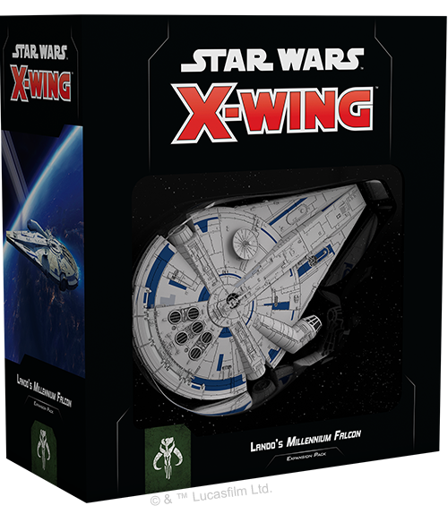
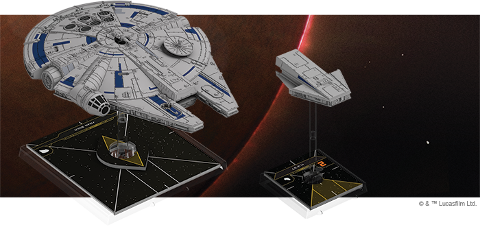
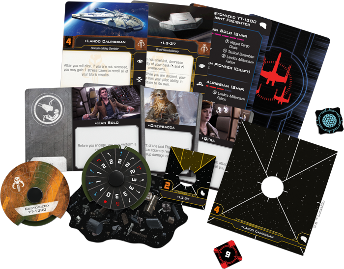
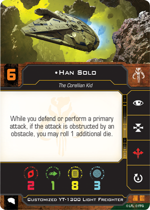
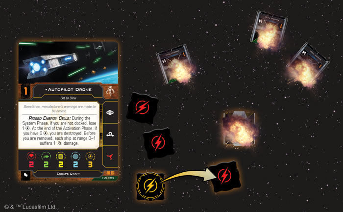

This article was originally published on [https://www.fantasyflightgames.com/en/news/2018/6/25/got-it-where-it-counts/](https://www.fantasyflightgames.com/en/news/2018/6/25/got-it-where-it-counts/)

&laquo; [Back to index](../index.md)

---

25 June 2018

Got It Where It Counts
======================

Preview the Lando's Millennium Falcon Expansion Pack for X-Wing Second Edition

_"Everything you've heard about me is true."_  
   –Lando Calrissian, _Solo: A Star Wars Story_

The _Millennium Falcon_ may be best known as the ship that completed the Kessel Run in twelve parsecs (if you round down), but that’s not its only claim to fame. Before Han Solo ever touched the ship's controls, Lando Calrissian had already used the _Falcon_ to build a reputation as one of the best smugglers in the _Star Wars_ galaxy and, with the upcoming release of the [Lando's _Millennium Falcon_ Expansion Pack](https://www.fantasyflightgames.com/en/products/x-wing-second-edition/products/landos-millennium-falcon-expansion-pack/), Scum and Villainy players will have the opportunity to experience the less than savory exploits of this iconic ship in their [_X-Wing™ Second Edition_](https://www.fantasyflightgames.com/en/products/x-wing-second-edition/) squadrons.

The Lando’s _Millennium Falcon_ Expansion Pack contains a fully-assembled, pre-painted customized YT-1300 light freighter miniature, including a detachable Escape Craft miniature that can be piloted as a separate ship. In addition to these miniatures, you’ll find eight ship cards featuring classic characters like Han Solo alongside new faces like the droid revolutionary L3-37, as well as thirteen upgrade cards to further customize your version of the _Falcon_ or your other second edition ships. Rounding out the pack are all the tokens, bases, and maneuver dials you need to add the _Falcon_ and its Escape Craft to your squadron.

Join us today as we take a closer look inside the Lando’s _Millennium Falcon_ Expansion Pack!

The Best Pilot in the Galaxy
----------------------------

Although it was originally built as a light freighter, the _Millennium Falcon_ has seen its share of combat. From participating in the attacks on both Death Stars to drawing the First Order’s squadrons of TIE fighters away from the Resistance forces on Crait, the _Falcon_ is more than capable of holding its own in a fight. The ship is the first in _X-Wing Second Edition_ to feature a double turret arc, allowing you to fire at anything that approaches—as long as you’ve rotated your arcs into the correct position. 

Of course, having one of the best pilots in the galaxy also helps. As we saw during the legendary Kessel Run in _Solo: A Star Wars Story_, [Han Solo](135ee44175f8573ad93ebd1065b5601f.png) excels at flying through debris fields. In _X-Wing Second Edition_, obstacles only serve to enhance his abilities. While performing a primary attack or defending, Solo can roll an additional die if the attack is obstructed by an obstacle, encouraging him to put asteroids and debris fields between himself and enemy ships as much as possible.

But Han Solo can’t take all the credit for the _Falcon_'s recording-breaking run. He was only able to complete his run thanks to the navigational prowess of the droid L3-37. The Lando’s _Millennium Falcon_ Expansion Pack gives you several ways to include Calrissian’s trusted co-pilot in your squadron. You could put her in the _Falcon_’s [pilot seat,](ced3ca936e377f2f3be2bd8bbedee684.png) and giving it the same navigational boost she gives the _Falcon_ while she's piloting it.

 As L3-37 demonstrates, having a competent co-pilot on board a ship like the _Millennium Falcon_ can give you a major advantage, and you’ll find plenty of options for filling the _Falcon_’s two crew slots in this expansion. For example, [Chewbacca](0acb825a5b662e2e0df3c1b58f377592.png)    taste for gambling carries over to his crew card, giving you the ability to spend any green token to reroll up to two of your results.

Still other crew members can open up new options for maneuvering your ships into the perfect position. [Qi'ra](75a3ccd34fec4c0599d63cfaf356826a.png) in particular syncs well with Han Solo’s pilot ability. In _X-Wing Second Edition_, ships can acquire locks on objects in addition to ships, and with Han flying and Qi’ra as a crew member, this can provide multiple benefits. Together, they let you fly right through any obstacles you're locking and gain the extra die from Han's ability when firing through those same obstacles—without also granting an extra defense die to your target.

Exit Plan
---------

Although both Han Solo and Lando Calrissian are skilled smugglers confident in their own abilities, they have wildly different styles when it comes to being the captain of the _Millennium Falcon_. One of the most visible of these differences is the Escape Craft that Calrissian kept docked in the nose of the _Falcon_ while he owned the ship. In the Lando’s _Millennium Falcon_ Expansion Pack, this craft forms its own miniature that can be flown on its own or docked with the ship for even more tactical options.  

If you have the [Lando's _Millennium Falcon_](c61aef8951a6a0eceb4f152085e49bb6.png) works equally well docked with the _Falcon_ or on their own, letting friendly ships at Range 0–1 perform attacks even while they are on top of obstacles. 

  
_The Autopilot Drone loses its last charge and explodes, doing one critical damage to every ship within Range 0–1!_

In addition to sharing pilot abilities, a docked Escape Craft gives you two extra shields to spend as if they were on the _Millennium Falcon_’s ship card. This extra layer of defense is nice, but you might want to save the Escape Craft’s shields for when it’s flying on its own, especially if it’s being operated by an [Autopilot Drone](897f7ae478b6e6d72fff7147bf212595.png) and carrying a load of rigged energy cells. This ship is set to blow and do massive damage to any nearby ship after three rounds, but it’ll need all of its shields if it’s going to survive that long.

Buckle Up
---------

The _Millennium Falcon_ has a storied history, taking part in events that have shaped the galaxy. But long before she was a part of the Rebel Alliance, the _Falcon_ became infamous for making daring smuggling runs across the Outer Rim. Experience this history with the Lando's _Millennium Falcon_ Expansion Pack!

