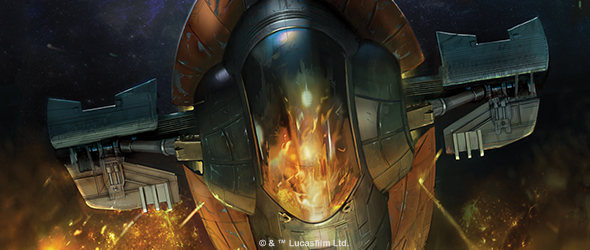
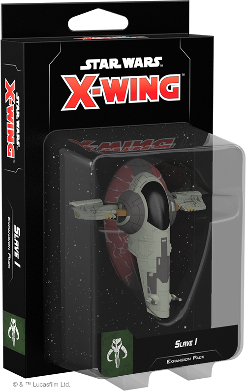
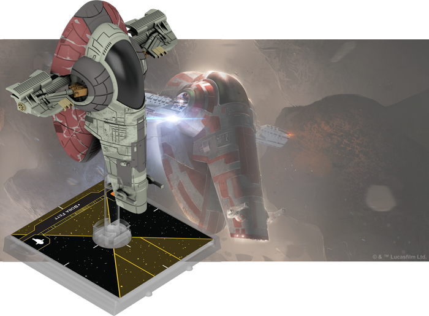
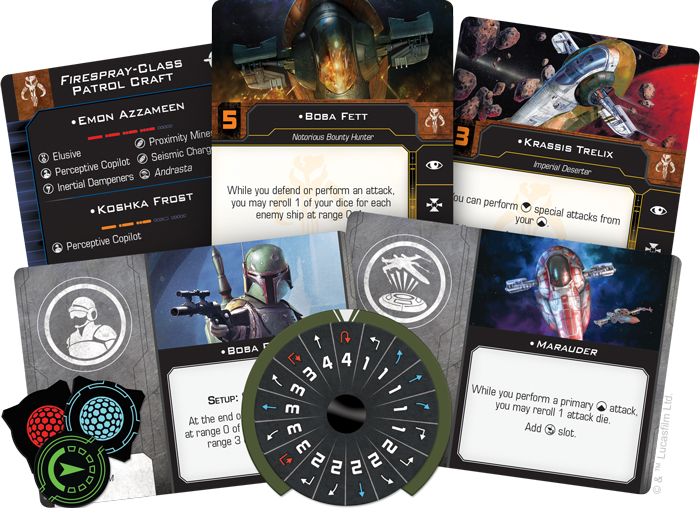
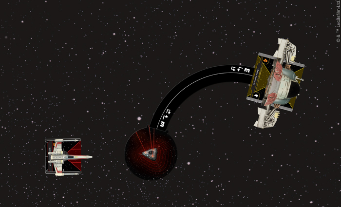
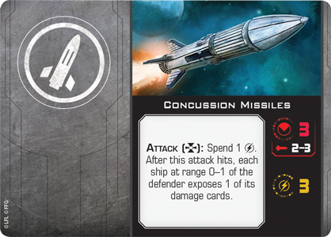

This article was originally published on [https://www.fantasyflightgames.com/en/news/2018/7/2/any-methods-necessary-1/](https://www.fantasyflightgames.com/en/news/2018/7/2/any-methods-necessary-1/)

&laquo; [Back to index](../index.md)

---

2 July 2018

Any Methods Necessary
=====================

Preview the Slave I Expansion Pack for X-Wing Second Edition

_“There will be a substantial reward for the one who finds the_ Millennium Falcon_.”_  
   –Darth Vader, _Star Wars: The Empire Strikes Back_

Whenever there is a sizeable bounty to be collected anywhere across the galaxy, Boba Fett will assuredly be on the hunt in his signature ship, _Slave I_. A heavily modified _Firespray_\-class patrol craft, the ship belonging to the most infamous bounty hunter in the _Star Wars_ galaxy is sure to strike fear in anyone with a price on their head. Later this year, you’ll have the chance to add this notorious craft to your Scum and Villainy squadrons from the beginning of [_X-Wing™ Second Edition_](https://www.fantasyflightgames.com/en/products/x-wing-second-edition/) with the [_Slave I_ Expansion Pack](https://www.fantasyflightgames.com/en/products/x-wing-second-edition/products/x-wing-second-edition-slave-i-expansion-pack/).

In the _Slave I_ Expansion Pack, you’ll find a fully assembled and pre-painted _Firespray_\-class patrol craft miniature, as well as all the components you need to seamlessly incorporate one of these highly customizable ships into your Scum squadron, including six unique pilots and twelve upgrade cards to outfit your ships as you see fit.

Veteran players can bring their existing _Firespray_\-class patrol craft and other Scum ships from the first edition into _X-Wing Second Edition_ with the tokens, cards, and maneuver dials found in the _Scum and Villainy Conversion Kit_! This kit will be available when the game launches on September 13th, 2018, and all of the ship and upgrade cards found in the _Slave I_ Expansion Pack will also be contained in this kit. New players, on the other hand, can expand their ship collection with the six other ship expansions launching alongside the _Slave I_ Expansion Pack and the _Core Set_!

__

On the Hunt
-----------

Boba Fett might be the most recognizable name associated with the _Firespray_\-class patrol craft, but he is far from the only member of the galaxy’s seedy underbelly to choose the craft. Originally designed for law enforcement purposes, the _Firespray_ quickly became a favorite of bounty hunters, pirates, and other criminals, thanks to its robust chassis that offered plenty of space for additional weaponry and other modifications. This customizability meant that the _Slave I_ wasn’t the only prominent ship prowling the stars using the _Firespray-_class patrol craft as a starting point. As a result, the _Slave I_ Expansion Pack includes three Title upgrade cards that foster different approaches to piloting the ship.

[Boba Fett](684f6bd6f18cc4a8c204325df4bb1f7b.png) himself isn’t afraid to face down groups of enemies up close. In fact, he can reroll one die for each enemy ship at Range 0–1 while defending or performing an attack, giving him better odds of succeeding when there are more enemies nearby. This should be of little difficulty if Boba Fett is flying his personal ship, the _[_Slave I_.](a4a6c030dcc66a71b20248d125ae3564.png)_  In addition to adding a torpedo slot to the ship, this title gives you the ability to quickly alter your course after revealing a turn or bank maneuver. No matter who’s piloting it, the _Slave I_ has the extraordinary ability to make use of its red Reinforce action and reduce the damage it takes by positioning enemy ships in front of or behind it.

While Boba Fett prefers to take advantage of the three attack dice provided by the _Firespray_’s front and back arcs, the ship also allows pilots like [Emon Azzameen](5cdb6acd37d0bd48660384a2f5834404.png)  has an extra device slot and the ability to reload any missiles or devices he may be carrying.

  
_Emon Azzameen uses the three-turn template to drop a Proximity Mine directly in the path of a pursuing T-65 X-wing!_

This extra slot dedicated to devices means that Azzameen has the ability to litter the battlefield with a mixture of bombs and mines, including the particularly deadly [Proximity Mines.](0dc451d168e2f657e0071d22615bed9e.png)  Unlike bombs that detonate at the end of the Activation phase, a Proximity Mine remains in play until a ship overlaps or moves through it. When this happens, the ship that triggered it rolls two attack dice and suffers regular or critical damage for each matching result!

Still other pilots, such as [Kath Scarlet,](da1c8d89017d361435fb6e7326b33230.png)  potentially giving the ship two attacks if you’re able to line up shots from both your front and back arcs. 

Fully Armed
-----------

While piloting an infamous ship like the _Slave I_ or the _Marauder_ is certainly enticing, you can also use the _Slave I_ Expansion Pack to fully customize your own _Firespray_\-class patrol craft. Able to carry cannons, missiles, devices, crew members, illicit upgrades, and modifications, the ship you create will almost assuredly be powerful enough to be able to operate as a [Lone Wolf,](ee92e9448cd1131aae3daa56dd2cff51.png) away from friendly ships.

 Beyond this, some pilots encourage you to outfit your ship with certain upgrades. If you add [Krassis Trelix](c719d5a7a013f912818965263a3ac477.png)   from your back arc, potentially damaging one ship and forcing others nearby to expose a damage card. No matter which arc he uses for a special attack, Trelix has a better chance than most of making the best use of his special weapons.

[Koshka Frost,](fa2a1a3395b8e61d8b6897fcb8e4e354.png) as a crew member. Much like he did while tracking the _Millennium Falcon_ in _The Empire Strikes Back_, Boba Fett lets you to conceal yourself on an obstacle at the beginning of the game, potentially forcing enemy ships to resort to red maneuvers earlier than expected.

And if an enemy ship appearing from an asteroid or debris isn’t enough to stress out an enemy pilot, being chased by a ship armed with a [Heavy Laser Cannon](eb451914cdbb6802c16e87b0ffe23779.png)  certainly will. Although you must have the target in your bullseye arc to use this weapon, it gives you four attack dice, one of which could potentially be rerolled with Koshka Frost’s ability.

Claim Your Bounty
-----------------

Whether you’re tracking a target to the farthest reaches of the galaxy or engaged in an intense dogfight, the _Firespray_\-class patrol craft provides the firepower to get the job done. Outfit yours and track your mark with the _Slave I_ Expansion Pack!