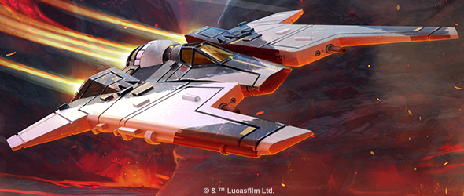
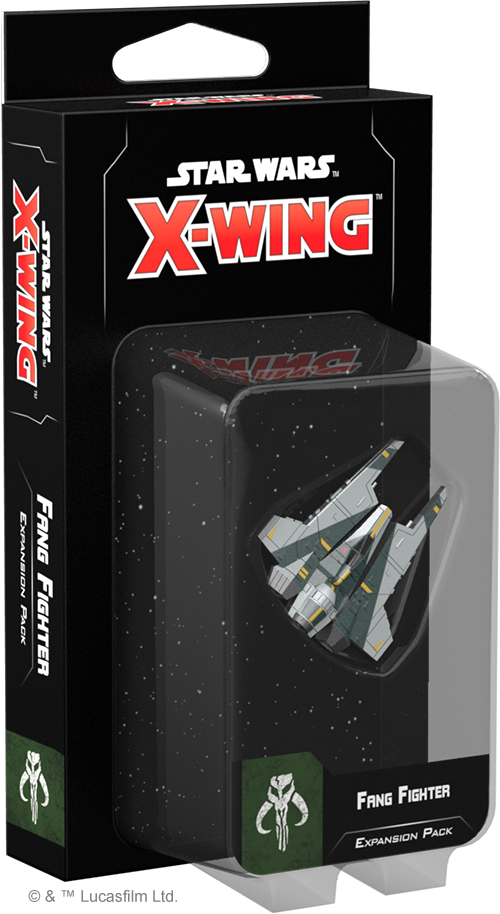
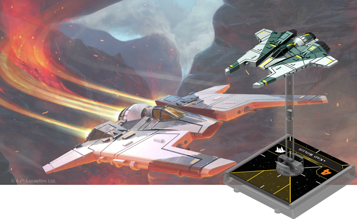
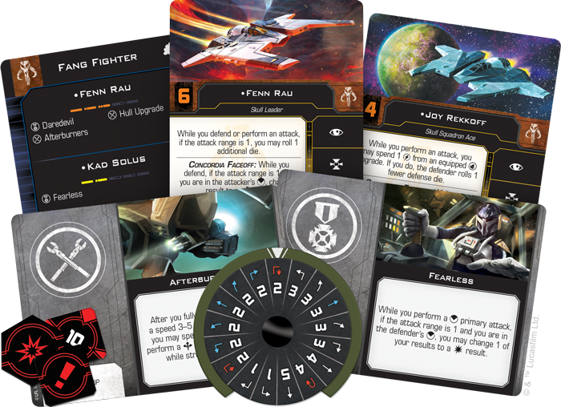
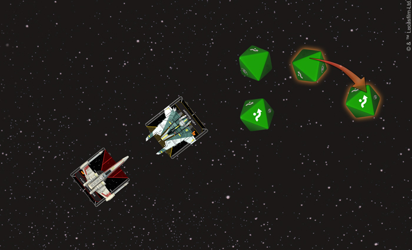
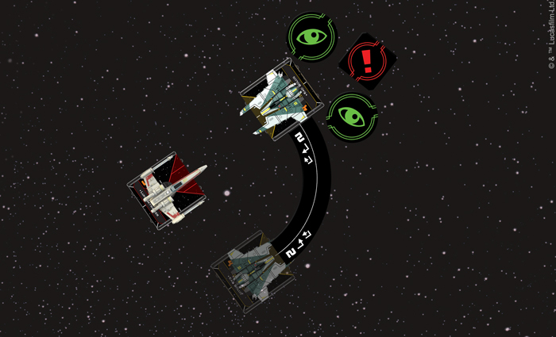

This article was originally published on [https://www.fantasyflightgames.com/en/news/2018/7/9/direct-confrontation/](https://www.fantasyflightgames.com/en/news/2018/7/9/direct-confrontation/)

&laquo; [Back to index](../index.md)

---

9 July 2018

Direct Confrontation
====================

Preview the Fang Fighter Expansion Pack for X-Wing Second Edition

“_The Mandalorians have endured wars since before the formation of the Republic.”_  
   –Fenn Rau, _Star Wars: Rebels_

Mandalorians are some of the most feared warriors in the _Star Wars_ galaxy. Forged by centuries of warfare, the Mandalorian culture has a distinct martial edge that reveres the glory of combat. Although virtually all Mandalorians are considered fearsome warriors, only the most elite among them are chosen to join the Journeyman Protectors and pilot the Fang Fighter. The ship’s advanced pivot wing technology grants it exceptional agility, allowing its pilots to pull off some daring maneuvers. And when _[X-Wing™ Second Edition](https://www.fantasyflightgames.com/en/products/x-wing-second-edition/)_ launches on September 13, you can bring these intimidating fighters to the table as part of your Scum and Villainy squadrons with the _[Fang Fighter Expansion Pack](https://www.fantasyflightgames.com/en/products/x-wing-second-edition/products/fang-fighter-expansion-pack/)_!

Within the _Fang Fighter Expansion Pack_, you’ll find a fully assembled, pre-painted Fang Fighter miniature featuring posable wings alongside everything you need to add one of these nimble fighters to your games of _X-Wing Second Edition_. Alongside the tokens, base, and maneuver dial, you’ll be able to choose from six unique pilots to take control of your Fang Fighter and four upgrades to improve it or your other ships.

If you’re a veteran _X-Wing_ player, you can bring your existing Fang Fighters and other ships from the first edition into _X-Wing Second Edition_ with the tokens, ship cards, maneuver dials, and upgrade cards found in the _Conversion Kits_ available at launch. If you’re a new player, however, you can grow your collection of second edition ships with the six ship expansions launching with the _Fang Fighter Expansion Pack_ and the _Core Set_. All of the ship and upgrade cards included in the _Fang Fighter Expansion Pack_ can also be found in the _Scum and Villainy Conversion Kit._

Designed for Combat  
---------------------

Unlike much of the Scum and Villainy faction, the Mandalorian Protectors aren’t motivated by profit or personal gain. Rather, their loyalties lie with Mandalore and her people. Powers like the Galactic Empire and the Alliance to Restore the Republic may interfere in their affairs, but the Mandalorians will continue to cling to their cultural traditions. Chief among these traditions was a reverence for defeating a worthy opponent in single combat. As a result, Mandalorian warriors have a reputation as fierce combatants, using a number of advanced techniques in battle.

This ferocity is reflected in the design of the Fang Fighter. The ship features a robust maneuver dial and action bar that most pilots would use to slip out of an enemy’s firing arc, especially if their ship only had four hull like the Fang Fighter. But the Journeyman Protector pilots of the Fang Fighter prefer just the opposite. As we saw in _Star Wars Rebels_, they charge headfirst into combat, facing down enemy ships at high speeds with their Concordia Faceoff ship ability. Putting yourself directly in the line of fire may seem counterintuitive, but the Concordia Faceoff guarantees at least one evade result if your Fang Fighter is at Range 1 and in the attacker’s front arc. This gives you a good chance of shrugging off any enemy fire you may face while pulling off your own attack with extra power.

What’s more, the Fang Fighter's ability to link a barrel roll or a boost action into a focus further helps aggressive pilots get in prime position to launch a devastating strike against an enemy ship. Rather than using these close-quarters movement actions to escape an enemy firing arc, a daring pilot can quickly move directly into an enemy ship’s path and focus, readying them to modify their dice during the ensuing attacks.

  
_The Concordia Faceoff ship ability allows Joy Rekkoff to change one of her defense dice to an evade result when she's attacked from Luke Skywalker's front arc._

Far from solely being a trait of the Fang Fighter itself, those who pilot it are also prepared for head-on confrontations. Representing the best pilots Mandalore has to offer, it should be no surprise that Fang Fighter pilots are exceptionally skilled. Of all the pilots included in the _Fang Fighter Expansion Pack_, only the  [Zealous Recruit](9d841889789db681c036dea027af736c.png)  has an initiative less than four. This means that most Fang Fighter pilots can gauge their movements in relation to enemy ships that are already in place, while also giving them a good chance of firing first. Charging in head-on, then, could deal massive damage to an enemy ship—or even destroy it in one fell swoop. 

The chance to eliminate an opposing ship before it even takes a shot is certainly enticing and the Fang Fighter pilots all have abilities that synchronize nicely with the Concordia Faceoff strategy. For example, at Range 1,  [Fenn Rau](2d1f77af52c7ad05a367ce4207b255bb.png) can help him become even more dangerous, granting him the ability to pull off a tight turn when boosting to snap into the perfect position to open fire.   

The Concordia Faceoff is an undeniably aggressive and risky maneuver, one that could easily lead to a Fang Fighter’s untimely destruction. This risk can be reduced a bit, however, if [Old Teroch](02043e6a5d674347cb95775e97d5bf6f.png) is in the pilot’s seat. When the Engagement Phase begins, he can force an enemy ship at Range 1 to remove all of its green tokens if he is in its front arc, robbing it of the opportunity to enhance any attack.

Similarly, when getting up close to enemy ships you want to press your advantage as much as possible. Beyond its primary attack, the Fang Fighter also features a concealed torpedo tube that the Mandalorians like to use at the last possible moment to catch their opponents off-guard. In addition to the torpedoes this allows the ship to carry, [Joy Rekkoff](1e962b95d41f8d123e71f5250c410935.png) contained in this expansion to force a defender to roll one fewer defense die. At the close range of the Concordia Faceoff, this ability puts the defender at an even greater disadvantage, giving Joy Rekkoff a better chance of landing some hits.

  
_Kad Solus performs a speed-two Tallon Roll, gaining two focus tokens and a stress token for executing a red maneuver._ 

The Concordia Faceoff is such an effective tactic that perhaps the Fang Fighter’s biggest weakness is that opposing squadrons will be prepared to do whatever it takes to keep them from moving in close. While most Fang Fighter pilots choose to zoom straight at enemy ships, [Kad Solus](b3889cf7a75213c6b9d304d71562741c.png) could give him the extra boost he needs to close the distance after performing a Koiogran Turn. 

The Joy of Combat
-----------------

Mandalorians are not ones to back down from a fight. Rather, they seek out the honor and glory of facing a worthy adversary. Accept the challenge and show of all of your skills with the _Fang Fighter Expansion Pack_ for _X-Wing Second Edition_!

