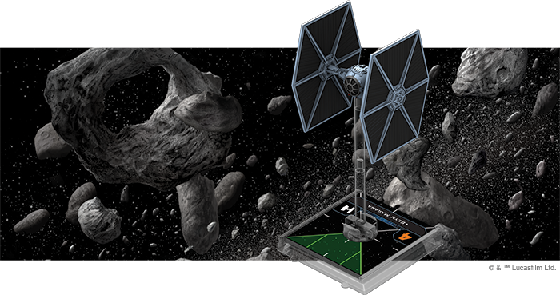

This article was originally published on [https://www.fantasyflightgames.com/en/news/2018/7/16/space-superiority-1/](https://www.fantasyflightgames.com/en/news/2018/7/16/space-superiority-1/)

&laquo; [Back to index](../index.md)

---

16 July 2018

Space Superiority
=================

Preview the TIE/ln Fighter Expansion Pack for X-Wing Second Edition

_“Stay in attack formation.”_  
   –Darth Vader, _Star Wars: A New Hope_

Perhaps the greatest advantage the Galactic Empire holds over the Rebellion is superior numbers. Alliance starfighters may outclass their Imperial counterparts in terms of sheer firepower, but the Empire has the means to overwhelm their foes with swarms of swift starfighters. This is most evident with the TIE/ln fighter. Lacking the shields and heavy armament of their Rebel counterparts, TIE fighters often fly in large groups and rely on their superior maneuverability to crush enemy squadrons.

You can form your own attack group of TIE fighters the moment [_X-Wing™ Second Edition_](https://www.fantasyflightgames.com/en/products/x-wing-second-edition/) launches with the _[_TIE/ln Fighter Expansion Pack_](https://www.fantasyflightgames.com/en/products/x-wing-second-edition/products/tieln-fighter-expansion-pack/)_. Within this expansion, you’ll find a fully-assembled, beautifully painted TIE/ln fighter miniature, identical to the miniatures included in the _X-Wing Second Edition Core Set_. This miniature is accompanied by ten ship cards featuring unique pilots, four upgrade cards, a maneuver dial, and all the tokens you need to add one of these swift starfighters to your squadron.

Veteran _X-Wing_ players can bring their first edition TIE/ln fighters into _X-Wing Second Edition_ with the ship tokens, cards, and maneuver dials included in the _Galactic Empire Conversion Kit_, available at launch on September 13, 2018. All of the ship and upgrade cards found in the _TIE/ln Fighter Expansion Pack_ will also be present in this kit. On the other hand, if you're a new player, you can build your collection of _X-Wing Second Edition_ ships with the six ship expansions launching alongside the _TIE/ln Fighter Expansion Pack_ and the _Core Set_!

Swarm Tactics
-------------

If the Rebellion hopes to launch an attack against an Imperial target, they will inevitably have to contend with TIE/ln fighters. These lightweight fighters are a ubiquitous part of Imperial squadrons, representing Imperial might as much as a massive Star Destroyer or Darth Vader’s iconic helmet. Unlike these other examples, however, the TIE/ln fighter does not draw its strength from heavy armaments or raw power.    

In fact, a single TIE/ln fighter—even one with the most formidable pilot in the galaxy—isn’t all that intimidating. Its action bar only features three actions and it only has a modest amount of attack power. What’s more, with no shields and only three hull, a single concentrated attack could mean a quick end for a TIE/ln fighter. But this lack of fancy features also means that TIE/ln fighters can be deployed in greater numbers than almost every other _X-Wing Second Edition_ ship.

Commanding a group of six to eight TIE/ln fighters, you are free to focus your fire on a single enemy ship, quickly whittling its defenses down to nothing. Each TIE in your squadron attacks with two dice and, even if they don’t cause damage or remove shields, every attack from one of your TIE fighters can contribute something to your battle plan. For example, your attacks could force a ship to spend its focus or evade tokens early in the Engagement Phase, giving you a better chance of landing some hits later on. With so many shots headed their way, it’s difficult for an enemy to escape unscathed from an encounter with a group of TIE/ln fighters.

      

As a light and highly maneuverable ship, the TIE/ln fighter naturally attracts some of the most daring pilots in the Imperial Navy and the _TIE/ln Fighter Expansion Pack_ includes pilots with a wide range of skills to contribute to your squadron. Some, like ["Howlrunner"](swz07_howlrunner.png)  play to the TIE’s natural tendency to fly in tight groups. A born leader, she makes all the pilots around her better, letting them reroll one of their attack dice while they perform a primary attack.

This ability is useful in any situation, but it can really make a difference with pilots who roll additional attack dice for meeting certain conditions. For example, ["Mauler" Mithel](swz14_mauler.png)  meanwhile, rolls an additional attack die regardless of range, so long as the target is in his bullseye arc.

Rolling extra dice obviously gives every pilot a better chance of dealing more damage and these odds become even better if they perform a [Juke](swz14_juke.png) before firing. This upgrade turns a defensive action into an offensive advantage, letting you change one of the defender’s evade results to a focus while you are evading. While equipped on a TIE/ln fighter pilot, Juke enhances the nimble fighter’s ability to avoid damage, while also giving its shots a better chance of finding their mark or, at the very least, forcing your enemy to spend a focus token.

  
_"Scourge" Skutu is evading, so he uses his Juke ability to change one of Luke Skywalker's evade results to a focus result._

Juke certainly provides many benefits, but TIE/ln pilots can always benefit from more ways to avoid incoming fire. One of the most direct comes from finding a place for [Del Meeko](swz14_del-meeko.png) to roll an additional defense die. This modification is only good for so long, however, deactivating as soon as you suffer damage.

Other TIE pilots employ some unusual tactics in battle. On the surface, ["Wampa"](swz14_wampa.png) appears to be one of the many TIE/ln pilots that can roll an additional attack die. But he’s also not that skilled of a pilot, which means he’ll probably lose the charge that grants him this extra attack die before he can spend it. This is unfortunate, but it also presents opposing players with a tough choice. On the one hand, they could reduce the threat posed by “Wampa” by shooting at him. On the other, they could try to eliminate more powerful pilots like “Howlrunner,” but allow “Wampa” the benefit of an extra attack die. Either way, “Wampa” more than makes up for his low skill by commanding the enemy’s attention.

  
_Seyn Marana uses her ability to spend a critical damage result and deal Evaan Verlaine a facedown damage card!_

Finally, [Seyn Marana](swz14_seyn-marana.png) might be the most crafty TIE/ln pilot in the Imperial fleet. She can completely bypass an enemy ship’s shields and deal them a facedown damage card during an attack by spending a critical damage result and canceling the rest. She may give up the chance to deal more damage, but guaranteed damage is certainly worth it.

Dominate the Galaxy
-------------------

Few Rebel pilots will ever forget the distinctive whine of a TIE/ln fighter’s namesake twin ion engines. Deadly on their own, these nimble starfighters are even more efficient when flying in large numbers. Swarm your opponent and extend the reach of the Empire in the battles of _X-Wing Second Edition_!

