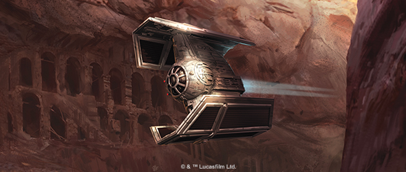
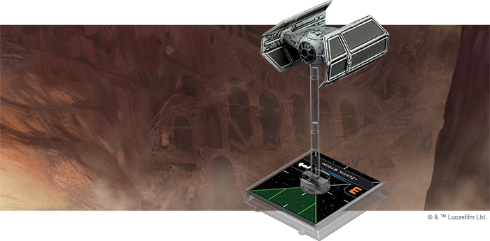
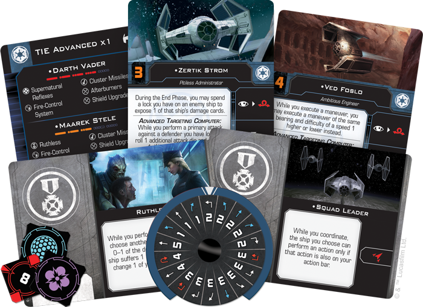
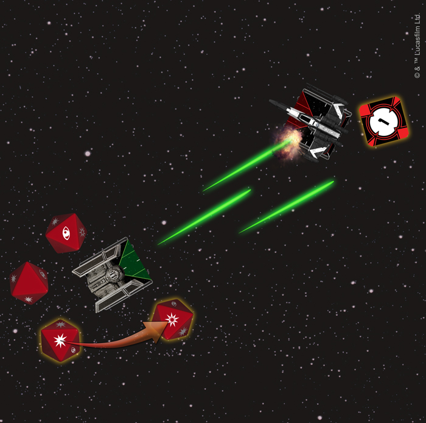
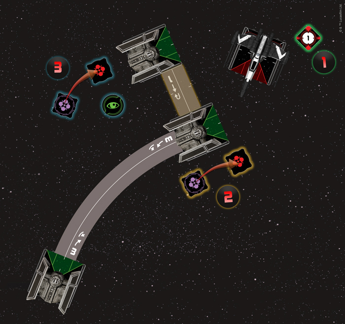

This article was originally published on [https://www.fantasyflightgames.com/en/news/2018/7/23/on-the-cutting-edge/](https://www.fantasyflightgames.com/en/news/2018/7/23/on-the-cutting-edge/)

&laquo; [Back to index](../index.md)

---

23 July 2018

On the Cutting Edge
===================

Preview the TIE Advanced x1 Expansion Pack for X-Wing Second Edition

_“I have you now!”_  
   –Darth Vader, _Star Wars: A New Hope_

The Galactic Empire’s strategy in space combat often hinges on crushing enemy squadrons with wave after wave of cheap, expendable TIE/ln fighters. This does not mean, however, that the Empire lacks advanced starfighters that can match the T-65 X-wings and BTL-A4 Y-wings that Imperial pilots regularly face. For that, they turn to the TIE Advanced x1. Reserved for only the very best Imperial pilots, this prototype design is the ship of choice of Darth Vader himself.

You can bring Vader and his signature ship to your [_X-Wing™ Second Edition_](https://www.fantasyflightgames.com/en/products/x-wing-second-edition/) squadrons when the game launches on September 13, 2018, with the [_TIE Advanced x1 Expansion Pack_](https://www.fantasyflightgames.com/en/products/x-wing-second-edition/products/tie-advanced-x1-expansion-pack/). Alongside the fully-assembled, beautifully painted TIE Advanced x1 miniature, this pack contains six unique pilots ready to push this fearsome fighter to the limit. Aiding them are six upgrade cards that you can use to outfit the TIE Advanced x1 to your personal specifications.

If you already own a TIE Advanced x1 from the first edition, you can bring it into _X-Wing Second Edition_ with the ship tokens, cards, and maneuver dials found in the [_Galactic Empire Conversion Kit_](https://www.fantasyflightgames.com/en/products/x-wing-second-edition/products/galactic-empire-conversion-kit/)  at launch. This kit includes all of the ship and upgrade cards available in the _TIE Advanced x1 Expansion Pack_. New players looking to expand their ship collections, however, can simply grab the _TIE Advanced x1 Expansion Pack_ and the six other ship expansions launching alongside the _X-Wing Second Edition Core Set_!

Merciless Pursuit
-----------------

Sienar Fleet Systems’ TIE line includes a dazzling array of starfighters, and while all of those models include the line’s trademark twin ion engines and solar collector panels, each one plays a distinct role in a starfighter squadron. For its part, the TIE Advanced x1 provides a more flexible and durable alternative to the standard TIE/ln fighter. Unlike its counterpart, the TIE Advanced comes equipped with deflector shields and, although it can’t quite pull off the tight turns of the TIE/ln fighter, in many ways it is the more maneuverable of the two ships.

The TIE Advanced's maneuver dial pairs speed-three Tallon Rolls with a speed-four Koiogran Turn to give intrepid pilots plenty of ways to aggressively approach enemy fighters. If that pilot is [Ved Foslo,](7213ea668839f9dfcb39e00e788a588e.png)  This upgrade gives you access to a red Coordinate action, with the limitation that the ship you coordinate with can only perform an action that is also on your action bar. Still, a well-timed barrel roll can make all the difference for a TIE/ln fighter in need of a better position.     

No matter who’s flying, the TIE Advanced x1 already has an advantage thanks to its onboard Advanced Targeting Computer. Not only does this ship ability grant you an extra attack die during a primary attack against a ship you have locked, it makes your attack all the more damaging by letting you change a regular hit to a critical hit. If they’re particularly [Ruthless,](afd136e6e245d857494b168f8170ba80.png)  TIE Advanced pilots will also open fire indiscriminately, even hitting fellow Imperial ships in order to do just a little more damage.

  
_The TIE Advanced x1's onboard Advanced Targeting Computer grants it an extra attack die against ships it is locking and the ability to change a normal hit to a critical hit._ 

The Advanced Targeting Computer is clearly designed to make each attack as painful as possible, and the other pilots included in the _TIE Advanced x1 Expansion Pack_ continue this trend. Pilots like [Maarek Stele](63e8af036931a25cdc365528a596ddb7.png)  on the other hand, might not have the luxury of choosing the exact nature of the damage, but he can still make sure an enemy ship winds up with a faceup damage card by spending his lock on an enemy ship to randomly select one of that ship’s damage cards to expose.  

These pilots are certainly skilled, but they pale in comparison to the expert flying of [Darth Vader.](b0e54e6d3136a7714caee77615acc843.png)  Already recognized as one of the best starfighter pilots in the galaxy when he was still known as Anakin Skywalker, Darth Vader continues to live up to this reputation. The Force is strong with him—he has the largest Force capacity yet seen in _X-Wing Second Edition_. Vader can also can put his three Force charges to good use: every time he takes an action, he can spend a Force charge to perform another action. This gives him the unparalleled ability to set up the ultimate attack by acquiring a lock on an enemy ship, barrel rolling into position, and focusing, all in the same activation.

  
_After completing his maneuver, Darth Vader acquires a lock on the T-65 X-wing. He then spends a Force charge to barrel roll out of the T-65's firing arc and another Force charge to focus._

Vader could use this advantage to set up a perfect primary attack using his Advanced Targeting Computer, or he could target multiple enemy fighters with a volley of [Cluster Missiles.](70551b4435b86793208ea1832d44d623.png) installed on his TIE Advanced x1. This system upgrade makes his Cluster Missiles even more likely to hit by giving him the chance to reroll one of his attack dice.

Show Your Might
---------------

TIE/ln fighters might be a common sight to Rebel pilots, but the appearance of a TIE Advanced x1 is all the evidence they need to know the Empire has taken notice of their activities. Deploy yours and show them the true power of the Empire!