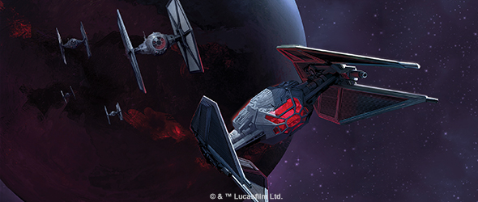
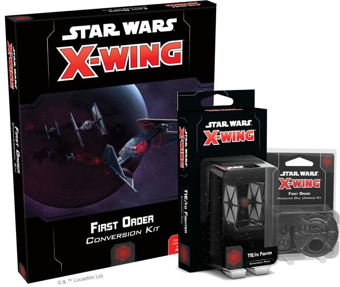
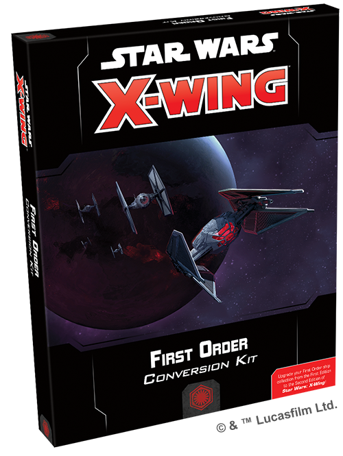
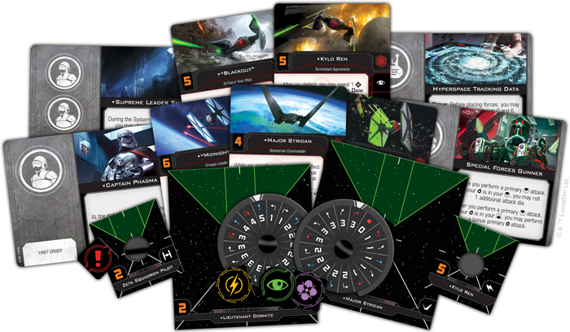
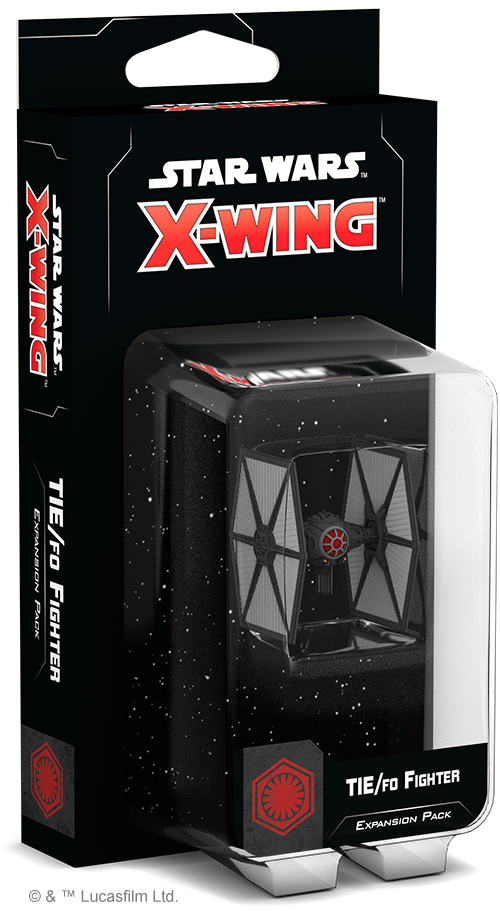
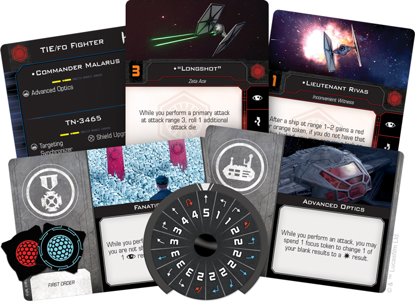
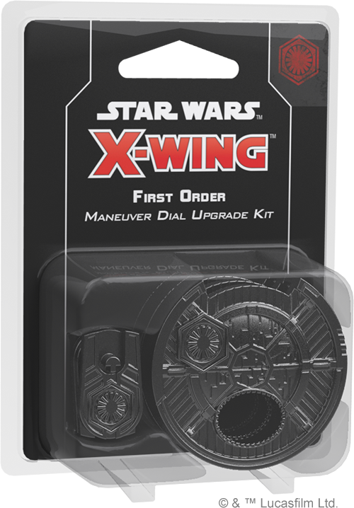

This article was originally published on [https://www.fantasyflightgames.com/en/news/2018/8/3/evil-resurgent/](https://www.fantasyflightgames.com/en/news/2018/8/3/evil-resurgent/)

&laquo; [Back to index](../index.md)

---

3 August 2018

Evil Resurgent
==============

Announcing the Three First Order Expansions of Wave II for X-Wing Second Edition

_“All remaining systems will bow to the First Order and remember this as the last day of the Republic!”_  
   –General Hux, _Star Wars: The Force Awakens_

Rising from the ashes of the Galactic Empire, the First Order stands poised to usher in a new era of galactic dominance. Soon, its starfighters will enter the intense space battles of the _Star Wars_ galaxy. Fantasy Flight Games is excited to announce three First Order expansions of Wave II for [_X-Wing™ Second Edition_](https://www.fantasyflightgames.com/en/products/x-wing-second-edition/): 

*   _[First Order Conversion Kit](https://www.fantasyflightgames.com/en/products/x-wing-second-edition/products/first-order-conversion-kit/)_
*   _[TIE/fo Fighter Expansion Pack](https://www.fantasyflightgames.com/en/products/x-wing-second-edition/products/x-wing-second-edition-tiefo-fighter-expansion-pack/)_
*   _[First Order Maneuver Dial Upgrade Kit](https://www.fantasyflightgames.com/en/products/x-wing-second-edition/products/first-order-maneuver-dial-upgrade-kit/)_

For too long, the First Order has been relegated to the far corners of the galaxy. But, with these expansion packs, you can join their fight and destroy those who embrace disorder. Following in the footsteps of the Empire, the First Order spreads terror in the form of mass-produced starfighters designed to overwhelm their opponents with sheer numbers.

In _X-Wing Second Edition_, the First Order is being introduced as its own unique faction separate from the Galactic Empire. Veteran _X-Wing_ players will be able to use the cards, tokens, and maneuver dials found in the _First Order Conversion Kit_ to bring their existing TIE/fo fighters, TIE/sf fighters, TIE/vn silencers, and _Upsilon_\-class shuttles into _X-Wing Second Edition_. Meanwhile, veteran players looking to further expand their squadrons or new players prepared to start their own fleet can sow the seeds of terror by adding more of the First Order’s take on the infamous TIE fighter. 

Read on for more information about each of these expansions and what they bring to your games of _X-Wing Second Edition_! For more information about the Resistance or Scum and Villainy ships in Wave II, follow those links.

Crush the Resistance
--------------------

As you might expect from the successor to the Galactic Empire, the First Order fields a variety of starfighters based on classic Imperial designs. Far from simply rehashing these older ships, though, First Order fighters feature a number of refinements that give them the edge in their fight against the loathsome Resistance. The _First Order Conversion Kit_ makes your first edition versions of these ships immediately available for use in your _X-Wing Second Edition_ squadrons.

Within the _First Order Conversion Kit_, you’ll find everything you need to strike fear into the heart of the Resistance and take your squad into the future of _X-Wing_, including a wide variety of new ship cards and tokens, more than one-hundred upgrade cards, and new maneuver dials for all of your First Order ships. The ship cards contained in this kit include some of the most celebrated pilots in the First Order, such as Major Stridan, “Backdraft,” and Kylo Ren himself.

Skilled as they may be, these vaunted pilots and their ships can always benefit from upgrades. Alongside the other upgrades included in the _First Order Conversion Kit_, you’ll also find ten Tech upgrade cards that can only be used on starfighters from this era. Finally, the conversion kit provides plenty of options for completing your squadrons, containing enough maneuver dials to convert seven TIE/fo fighters, five TIE/so fighters, three TIE/vn silencers, and three _Upsilon_\-class shuttles to _X-Wing Second Edition_.

In addition to the being present in the _First Order Conversion Kit_, all of the First Order pilots, ships, and upgrades will be fully implemented in the _X-Wing Second Edition_ squad-builder app when they are released. A pdf with the point values of all First Order pilots and upgrades will also be available for reference on our website. New players can also use the conversion kit and first edition versions of First Order ships for even more options when building their squads!

Terror Evolved
--------------

Although it may be a separate entity, the First Order has taken several cues directly from the former Empire. One of the most evident is the use of a new generation of the iconic TIE fighter. Developed using technologies pioneered for the Empire’s TIE Advanced program, the TIE/fo fighter is a shielded, mass-produced TIE fighter that the First Order can use to spread terror across the galaxy.

The addition of shields isn’t the only improvement made to the TIE design. TIE/fo fighters also boast the ability to acquire locks, giving their pilots the opportunity to reroll their attack dice for even more potent attacks. Some TIE/fo pilots go beyond this, using their target locks in new and creative ways. An ace like ["Midnight,"](b8c39c354ef75b04a2b01416009a38d3.png)  for example, prevents enemy ships that he has locked from modifying their dice while he defends or performs a primary attack against them.

Even with these refinements, TIE/fo fighters remain similar to their predecessors in that they are ideally suited for flying in large groups. A TIE/fo pilot such as ["Muse"](35e27cfdb37e8d4a7f2e3f4d7cd4052b.png) devotion to the cause, pressing the attack even when they are at their most vulnerable.     

The _TIE/fo Fighter Expansion Pack_ includes one fully assembled and beautifully painted miniature and all the ship cards, upgrade cards, and tokens you need to add one of these frightening fighters to your First Order squadrons. All the cards and punchboard included in the _TIE/fo Fighter Expasion Pack_ will also be present in the _First Order Conversion Kit_ for the benefit of veteran players. We’ll take a closer look at the contents of this expansion pack in a future preview! 

Display Your Dominance
----------------------

The First Order may be the successor state to the Galactic Empire, but it has an identity wholly its own. You can signal your allegiance to this faction during your games of _X-Wing Second Edition_ with the _First Order Maneuver Dial Upgrade Kit_.

During every game of _X-Wing Second Edition_, you will secretly select the maneuvers for your ships on cardboard maneuver dials. In each dial upgrade kit, you’ll find three plastic protectors that situate these maneuver dials in a secure housing while enhancing the aesthetics of your squadron and declaring your devotion to the First Order. Not only does every dial clearly indicate your intention to dominate the galaxy, they also include a space on the back to insert the dial ID tokens included in the _First Order Conversion Kit_. Each dial ID token displays the silhouette of the corresponding ship, making it even easier to differentiate between your ships' dials.

Resurrect the Empire
--------------------

Once banished to the unknown regions of the galaxy, the First Order is now poised to sweep across the galaxy and build an empire of its own. Join their campaign with these new expansions for _X-Wing Second Edition_!