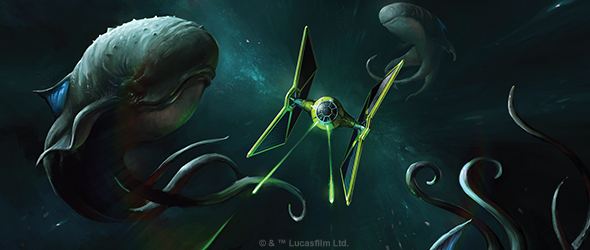
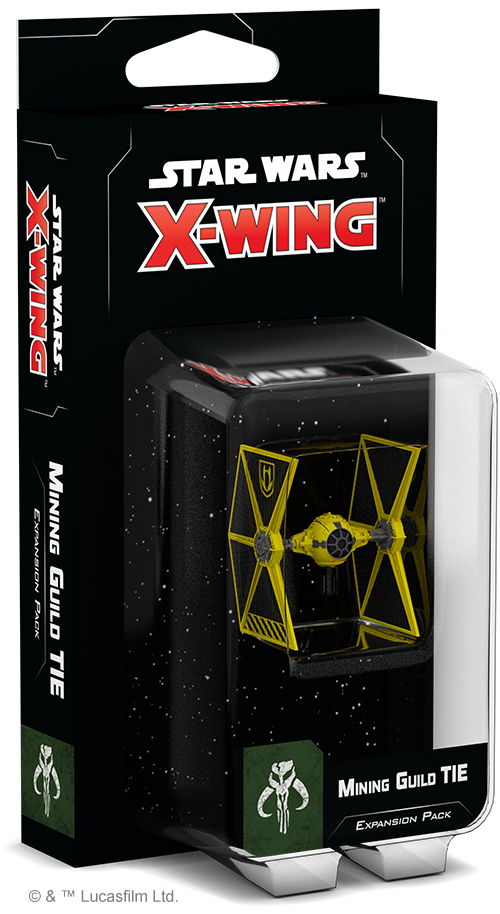
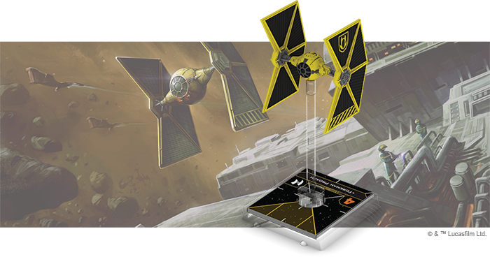
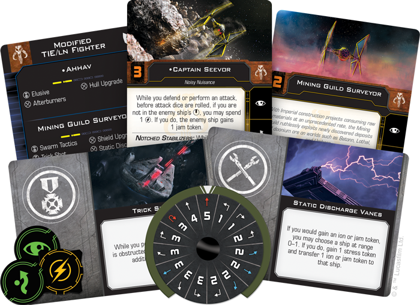
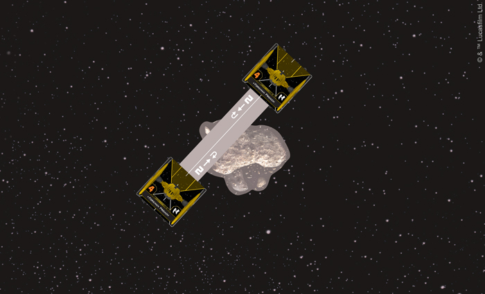

This article was originally published on [https://www.fantasyflightgames.com/en/news/2018/8/3/mining-modifications/](https://www.fantasyflightgames.com/en/news/2018/8/3/mining-modifications/)

&laquo; [Back to index](../index.md)

---

3 August 2018

Mining Modifications
====================

Announcing the Mining Guild TIE Expansion Pack in Wave II for X-Wing Second Edition

_“Those TIEs have been modified. They’re not Imperial.”_ –Sabine Wren, _Star Wars: Rebels_

Fantasy Flight Games is happy to announce the _[Mining Guild TIE Expansion Pack](https://www.fantasyflightgames.com/en/products/x-wing-second-edition/products/mining-guild-tie-expansion-pack/)_ as part of Wave II for [_X-Wing_™ _Second Edition_](https://www.fantasyflightgames.com/en/products/x-wing-second-edition/)!

The original TIE/ln design has served as the basis for countless variations serving many purposes, even those outside of Imperial demands. Thanks to their close collaboration with the Empire, the Mining Guild has access to state-of-the-art Sienar Fleet Systems technology, including their own version of this iconic starfighter. The result is a unique take on the TIE design, ideally suited for the Mining Guild’s operations and unlocking new tactical opportunities for your Scum and Villainy squadrons.

Within the _Mining Guild TIE Expansion Pack_, you’ll find everything you need to supplement your own mining operations and keep the profits flowing. Six ship cards—including four unique pilots—are ready to take the controls of the beautifully detailed, fully assembled Modified TIE/ln Fighter miniature. Meanwhile, five upgrade cards invite you to further customize your Mining Guild TIE to suit the unique needs of your Scum squadron. Rounding out this expansion are a maneuver dial and all the tokens you need to experience this classic starfighter in a whole new way.

The _Mining Guild TIE Expansion Pack_ is set to debut alongside the first Resistance and First Order expansions with Wave II for _X-Wing Second Edition_ in the fourth quarter of 2018. Read on for more information about what twists the Mining Guild TIE brings to your Scum squadrons!

Corporate Control
-----------------

In the service of the Empire, the countless TIE variations have a single purpose: combat. From fighters that directly engage other starships to bombers that drop a variety of deadly devices throughout the engagement zone, the mass-produced TIE variants are designed to help the Empire dominate space in every aspect of battle. In the hands of a corporate entity like the Mining Guild, however, the TIE takes on a wholly different role.

Rather than launching offensive operations against Rebel targets and overwhelming them with wave after wave of ships, the Mining Guild cares more about protecting its own interests. These concerns carry over into the design of the guild’s version of the TIE. Most noticeably, Mining Guild TIEs have two panels removed from their stabilizers, granting a much-needed boost to their pilots’ peripheral vision when weaving through the treacherous asteroid fields where they normally operate. These Notched Stabilizers, built into every Mining Guild TIE, give these ships the useful ability to ignore asteroids while moving, letting them freely perform risky maneuvers without the threat of damage from these obstacles!

But this increased visibility comes at the cost of a reduced power output. As a result, the Mining Guild TIE loses some of the trademark speed that the ship is known for. While the ship can execute all the same maneuvers as its Imperial counterpart, the decrease in power means that pushing the ship to its farthest limits is a bit more difficult. To manage stress, then, Mining Guild pilots prefer to use the ship’s maneuverability to sharply cut between asteroids and gain a superior position on enemy ships.

  
_The Mining Guild TIE's Notched Stabilizers let them ignore obstacles while moving!_

Their ship might not boast quite the same performance as the Imperial version, but the corporate pilots who man the Mining Guild TIE are undoubtedly more creative when it comes to the strategies they employ in a dogfight. True to form, these Scum pilots deploy all manner of dirty tricks to put the opposing squadron at a disadvantage. For example, while he defends or performs an attack, [Captain Seevor](47f076395cc282f76798c33e716a8808.png) can force the enemy ship to take a jam token—so long as he has avoided being caught in their bullseye arc.

We’ll take a look at everything included in the _Mining Guild TIE Expansion Pack_ in a future preview!

Defend Your Assets
------------------

The demand for raw materials has never been higher. If you’re going to properly protect your investments, you’re going to need a starfighter that’s up to the task. Take on any threat with a new take on a classic design!