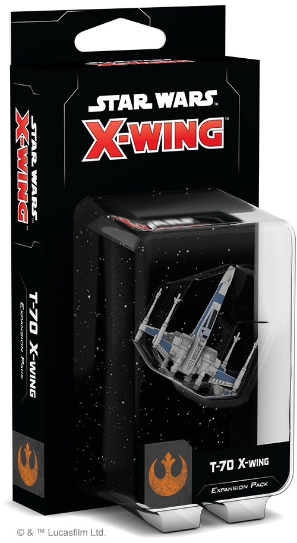
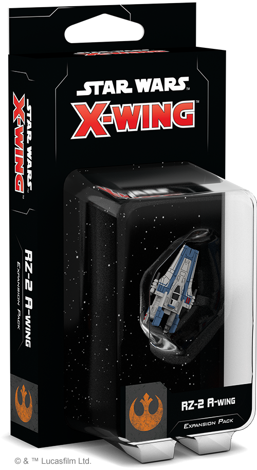

This article was originally published on [https://www.fantasyflightgames.com/en/news/2018/8/3/spark-of-rebellion-1/](https://www.fantasyflightgames.com/en/news/2018/8/3/spark-of-rebellion-1/)

&laquo; [Back to index](../index.md)

---

3 August 2018

Spark of Rebellion
==================

Announcing the Four Resistance Expansions of Wave II for X-Wing Second Edition

_“We are the spark that’ll light the fire that’ll burn the First Order down.”_  
   –Poe Dameron, _Star Wars: The Last Jedi_

The Empire may be gone, but its shadow still looms large across the galaxy. As [_X-Wing™ Second Edition_](https://www.fantasyflightgames.com/en/products/x-wing-second-edition/)  ushers in a new era of starfighter combat in the _Star Wars_ galaxy, the pilots of the Resistance aim to rekindle hope as they carry on the legacy of the Rebel Alliance. Fantasy Flight Games is happy to announce four Resistance expansion packs of Wave II for _X-Wing Second Edition_!

*   _[Resistance Conversion Kit](https://www.fantasyflightgames.com/en/products/x-wing-second-edition/products/resistance-conversion-kit/)_
*   _[T-70 X-Wing Expansion Pack](https://www.fantasyflightgames.com/en/products/x-wing-second-edition/products/x-wing-second-edition-t-70-x-wing-expansion-pack/)_
*   _[RZ-2 A-Wing Expansion Pack](https://www.fantasyflightgames.com/en/products/x-wing-second-edition/products/rz-2-wing-expansion-pack/)_
*   _[Resistance Maneuver Dial Upgrade Kit](https://www.fantasyflightgames.com/en/products/x-wing-second-edition/products/resistance-maneuver-dial-upgrade-kit/)_

Carrying on the torch first lit by the Rebellion against the Empire, the Resistance remains ever vigilant in its fight to maintain peace throughout the galaxy. With these expansions, you’re invited to join a new generation of heroes and experience the intense space combat seen in _The Force Awakens_ and _The Last Jedi_ from behind the controls of these upgraded versions of iconic ships.

Beginning in _X-Wing Second Edition_, the Resistance has been spun off from the Rebel Alliance into its own distinct faction and, if you’re a veteran _X-Wing_ player with an existing collection of ships, the _Resistance Conversion Kit_ will bring your T-70 X-wing, YT-1300, and Resistance Bomber ships into the second edition, giving you everything you need to build your own Resistance squadrons. Then, whether you're a new player or a veteran, you’ll be able to grow your squadrons with two Resistance starfighter expansion packs, representing a new generation of pilots and ships in the ongoing _Star Wars_ saga.

For more information about each of these four expansions and what they bring to your games of _X-Wing Second Edition_, read on! To read about the First Order and Scum and Villainy ships in Wave II, follow those links.

Continue the Fight
------------------

The Resistance is the only line of defense against the rising tide of the nefarious First Order. Like the Alliance to Restore the Republic before them, the pilots of the Resistance often find themselves outnumbered and outgunned. Fortunately, the Resistance has some of the most advanced starfighters from the entire _Star Wars_ saga at their disposal. With the _Resistance Conversion Kit_, your first edition versions of these ships can be added to your _X-Wing Second Edition_ squadrons right away.

This kit contains everything you need to upgrade your Resistance ship collection from the first edition to the second edition, including pilot cards, upgrade cards, and ship tokens. Amongst the new ship cards and tokens, you’ll find new versions of Resistance heroes like Poe Dameron and Rey, each ready to bring their unique abilities to your custom-built squadrons. These pilots are complemented by over one-hundred upgrade cards that you can use to customize your squadron to fit your play style, including ten Tech upgrade cards only available to starfighters from this era. Finally, the conversion kit gives you plenty of options for rounding out your Resistance squadrons, containing enough maneuver dials to convert three Resistance Bombers, three YT-1300s, and four T-70 X-wing fighters.

In addition to being present in the _Resistance Conversion Kit_, all of these Resistance pilots, ships, and upgrades will be fully implemented in the _X-Wing Second Edition_ squad-builder app when they are released. A PDF with the point values of all Resistance pilots and upgrades will also be available for reference on our website. New players can also use the conversion kit and first edition versions of Resistance ships for even more options when building their squads!

A New Generation of Starfighter
-------------------------------

Carrying on the tradition set by ace Rebel pilots like Wedge Antilles, the heroes of the Resistance enter the fight against the First Order in the next evolution of the classic X-wing fighter. Upgraded in almost every conceivable way, the T-70 X-wing can equip a variety of astromechs, weapons, and other customizations preferred by individual pilots, making it an invaluable part of Resistance operations.

Already a flexible starfighter, the T-70 X-wing features even more versatility than its earlier incarnations. The ship’s built-in Weapon Hardpoint give it access to an unprecedented number of weapons, including cannons, torpedoes, and missiles. Meanwhile, just like the T-65 X-wing before it, the T-70 gives you the power to open and close its Integrated S-foils on the fly, offering even more options for maneuvering into the perfect position.

Besides its built-in capabilities, the _T-70 X-Wing Expansion Pack_ features a full complement of twelve ship cards, including nine unique pilots who bring their own skills to your squadron. For example, [Poe Dameron](swz19_a1_poe-dameron.png)  equipped, the benefits extend to his squadmates. In that case, friendly ships at Range 1–2 can ignore the lock requirement while attacking a target that Poe has locked. 

In addition to the beautifully detailed, pre-painted miniature, the _T-70 X-Wing Expansion Pack_ contains twelve ship cards, including nine unique pilots, six upgrade cards, and the tokens, base, pegs, and maneuver dial you need to grow your Resistance forces. Additionally, this expansion contains a few entirely new cards not seen in the first edition. These cards and associate punchboard are also included in the _Resistance Conversion Kit_ for the benefit of veteran players. 

We’ll take a look at all of the T-70 X-wing’s pilots, upgrades, and capabilities in much more detail in a future preview!

The Need for Speed
------------------

The second upcoming Resistance ship expansion marks a brand-new ship's first entrance to the fast-paced dogfights of _X-Wing_. The main interceptor of the Resistance, the RZ-2 A-wing is the natural evolution of its predecessor used by the Rebel Alliance. With several field-tested refinements integrated into its design, the new generation of A-wing fighters boasts incredible maneuverability to go along with blazingly fast speed, which makes mastering this craft a challenge worthy of the greatest aces.  

Resistance pilots are always looking for ways to push the RZ-2 to the limits of its performance, and much of the challenge of flying the ship in combat is keeping it safe. While the RZ-2 A-wing’s three defense dice and ability to evade incoming attacks make it a hard target to hit, its redesigned swivel mounts deter pursuers by allowing pilots to target enemies behind them. One of the ship’s many improvements over earlier models, these built-in Refined Gyrostabilizers provide the RZ-2 with a turret arc that can rotate exclusively between the front and back of the ship. This gives it some much needed flexibility in where it fires, but intrepid pilots must carefully choose where to direct their fire or miss out on opportunities elsewhere.

If its reversible cannons don’t provide enough of a defensive boon, the RZ-2 A-wing can always rely on the five upgrade cards included in the _RZ-2 A-Wing Expansion Pack_ for help. For example, the ship is already highly maneuverable, but adding some [Primed Thrusters](swz19_a1_primed-thrusters.png) makes it even more so. If you have two or fewer stress tokens, this tech upgrade allows you to quickly barrel roll or boost away from incoming fire, even while stressed.

With six ship cards—including four unique pilots—and five upgrade cards, plus the maneuver dial and tokens included in this expansion pack, the _RZ-2 A-Wing Expansion Pack_ gives you everything you need to stand toe-to-toe with the First Order’s best!

We'll take a closer look at everything included in this expansion in a future preview!

Defy Tyranny
------------

Although the Resistance may share similar goals with the former Rebellion, it is still a separate entity and you can signal this difference with the _Resistance Maneuver Dial Upgrade Kit_.

During every game of _X-Wing Second Edition_, you will secretly select the maneuvers for your ships on cardboard maneuver dials. In each maneuver dial upgrade kit, you’ll find three plastic protectors that enclose these maneuver dials in a secure housing while enhancing the aesthetics of your squadron and declaring your resistance to the First Order. Not only does every dial clearly indicate your defiant spirit, they also include a space on the back to insert one of the dial ID tokens included in the _Resistance Conversion Kit_. Each dial ID token displays the silhouette of the corresponding ship, making it even easier to differentiate between your ships.

Fan the Flames of Rebellion
---------------------------

The Resistance will continue the fight against tyranny and oppression no matter the cost. Expand your games of _X-Wing Second Edition_ and stoke the fires of resistance! 

