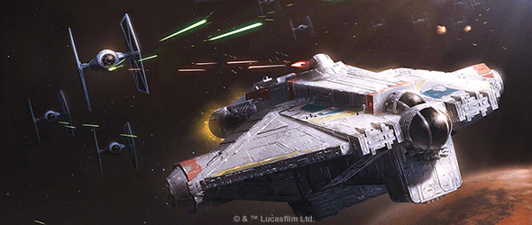
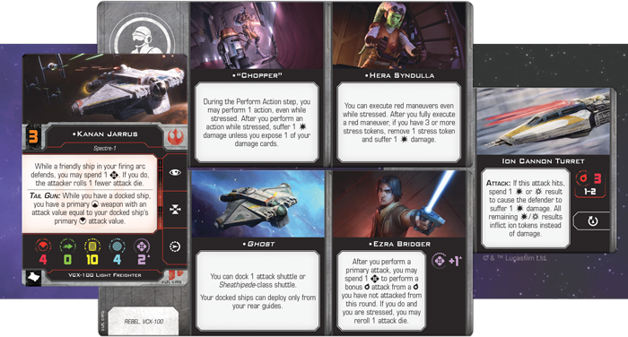
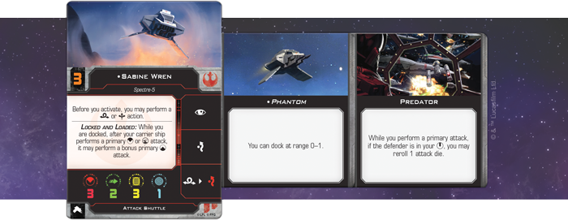
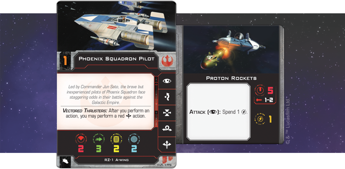

This article was originally published on [https://www.fantasyflightgames.com/en/news/2018/8/13/fly-for-freedom/](https://www.fantasyflightgames.com/en/news/2018/8/13/fly-for-freedom/)

&laquo; [Back to index](../index.md)

---

13 August 2018

Fly for Freedom
===============

Preview a Rebel List for X-Wing Second Edition

_“General, the Spectres are the real deal.”_ –Ahsoka Tano, _Star Wars: Rebels_

When _X-Wing_™ _Second Edition_ is released on September 13, it’ll introduce a whole new era of tense space battles in the _Star Wars_ galaxy. During these battles, you have the chance to lead elite squadrons from the Galactic Empire, the Rebel Alliance, or the galaxy’s most notorious Scum and Villainy, making use of each faction’s pilots and starfighters to win the upper hand.

The first step to entering this new era is, of course, building a squad to fly into battle. In addition to the miniatures, pilot cards, and upgrade cards available in the _X-Wing Second Edition Core Set_, the _Conversion Kit_ for each faction provides the components you need to bring your collection of first edition ships into the second edition. Finally, the seven ship expansions available at launch can help round out your collection, giving you even more options for creating a squadron that fits your style.

To demonstrate the possibilities of squad building in _X-Wing Second Edition_, designer Alex Davy has created a list for each of the three factions available at launch. We’ll explore each of these lists in the lead-up to the game’s launch. Join us today as we take a look at Alex’s Rebel Alliance squadron!

The Ghosts of Lothal
--------------------

This Rebel list focuses on the Spectres and their signature ship, the _Ghost_. Operating during the fledgling days of the Rebellion, the _Ghost_’s crew have forged strong bonds during their operations around Lothal. It should be no surprise, then, that the crew members present in this list exhibit some incredible synergy that should help their VCX-100 light freighter overcome its limitations. Chiefly, the _Ghost_ isn’t maneuverable enough to escape enemy fire and its shields aren’t quite as hearty as they were in the first edition. As a result, this list focuses on having the crew work together to attack as many times as possible.

**"The Spectres" (Rebel Alliance)**

**VCX-100 Light Freighter**  
Kanan Jarrus (90 points)  
**Title:**  
Ghost (0 points)  
**Crew:**  
Hera Syndulla (4 points)  
"Chopper" (2 points)  
**Gunner:**  
Ezra Bridger (18 points)  
**Turret:**  
Ion Cannon Turret (6 points)

**Attack Shuttle**  
Sabine Wren (38 points)  
**Title:**  
Phantom (2 points)  
**Talent:**  
Predator (2 points)

**RZ-1 A-Wing**  
Phoenix Squadron Pilot (30 points)  
**Missiles:**  
Proton Rockets (7 points)

Everything begins with two Force-sensitive characters. With the Jedi [Kanan Jarrus](e872e926e1d0481e49deb8c6507012ea.png)  After spending the Force token to perform this attack, the other two Force tokens can then be used to modify your attack dice for a better chance of ionizing your target. Of course, this might not be necessary if you’re stressed and have the chance to reroll one of your attack dice.

Ezra isn’t the only member of the crew who grants the ship a bonus while stressed, either. In fact, everyone aboard the _Ghost_ performs at their best while under pressure, bucking the normal restrictions placed on ships with stress tokens. [Hera Syndulla](7c7ad8b4b42574022647a9e61fdfb05e.png)  lets you keep taking actions at the cost of a damage or exposing a damage card. The result is a ship with more freedom to perform pinpoint maneuvers or a daring Koiogran turn at just the right moment. What’s more, the ship can still acquire locks, ensuring you can reroll your attack dice even while performing the most dangerous maneuvers.

A Larger Rebellion   
---------------------

The _Ghost_ may be the centerpiece of this Rebel squadron, but it certainly isn’t the only ship that can make a contribution. [Sabine Wren](78133d49321f586b1ab999ff8ff54f09.png)_ Title allows the Attack Shuttle to dock at Range 0–1, making it significantly easier for the shuttle to come on board.

Once it's docked with the _Ghost_, the _Phantom_ can continue the offensive onslaught started by Ezra Bridger thanks to both ships’ complementary abilities. The VCX-100’s Tail Gun gives it a rear arc primary weapon while it has a docked ship and the Attack Shuttle’s Locked and Loaded lets you perform a primary weapon attack from the _Ghost_'s rear arc after attacking from its front arc or a turret. When taken together, the _Ghost_ can fire twice and cover nearly all its arcs in a single activation, making it a particularly difficult ship to attack without the threat of return fire.

This configuration is certainly powerful, but also certain to attract the fire of opposing squadrons. Sometimes it’s more useful to have another ship acting independently, to draw enemy fire or approach from a different angle. With her unique abilities, Sabine is more than up to the task. She can perform a barrel roll or boost action before activating, making her adept at ducking away from enemy fire and, if she does find herself in an enemy’s sights, she can always evade to minimize the damage. In fact, her ability makes it easier for her to line up a shot and use her [Predator](9c413e19edfb6b0e059cba70b24bf0b1.png) talent. A quick barrel roll or boost gives her even more freedom to adjust her position and get an opposing ship in her bullseye arc.

Although they are an effective team, the Spectres did not operate completely independently. They eventually became part of the Phoenix Cell of rebels, and this element is represented by the final ship in the squadron: a single RZ-1 A-wing starfighter. The [Phoenix Squadron Pilot](c8a0860d13f4f03038d50f006b133de4.png)  If they can line up the shot, these rockets unleash a salvo of five attack dice, potentially dealing a critical blow to anything in their path.

May the Force Be with You
-------------------------

The Spectres are just one sliver of what the Rebel Alliance brings to _X-Wing Second Edition_. With a vast assortment of ships, pilots, and upgrades available at launch, the game invites you to explore countless combinations and create the squadron you want to fly. Join us in the lead-up to launch as we explore lists for both the Galactic Empire and the Scum and Villainy factions!

