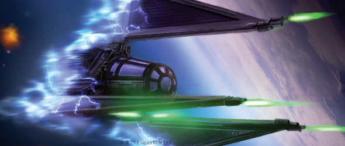
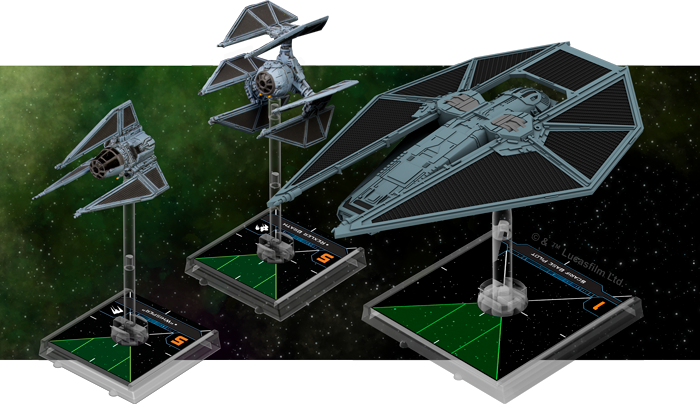
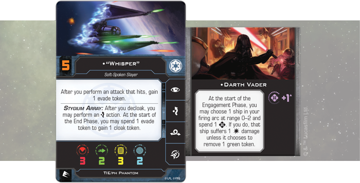
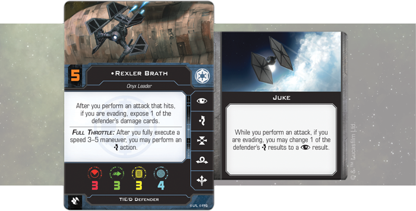
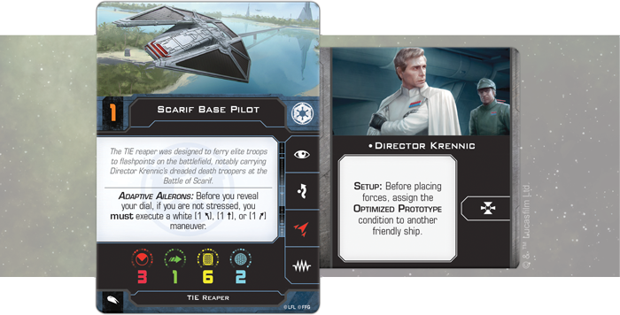

This article was originally published on [https://www.fantasyflightgames.com/en/news/2018/8/27/pushing-the-envelope/](https://www.fantasyflightgames.com/en/news/2018/8/27/pushing-the-envelope/)

&laquo; [Back to index](../index.md)

---

27 August 2018

Pushing the Envelope
====================

Preview an Imperial List for X-Wing Second Edition

_“Fear will keep the local systems in line.”_  
   –Grand Moff Tarkin, _Star Wars: A New Hope_

The Galactic Empire is the ultimate force in the _Star Wars_ galaxy, maintaining its dominance with crushing military might. When [_X-Wing_™ _Second Edition_](https://www.fantasyflightgames.com/en/products/x-wing-second-edition/) launches on September 13, it’ll usher in a new generation of Imperial terror, giving you the chance to command crack squadrons of cutting-edge Imperial starfighters in fast-paced space combat.

With the _X-Wing Second Edition Core Set_ and the two Imperial ship expansions releasing at launch, you already have a wide array of possibilities for customizing your Imperial squadrons. And if you’re a veteran _X-Wing_ player, the _[_Galactic Empire Conversion Kit_](https://www.fantasyflightgames.com/en/products/x-wing-second-edition/products/galactic-empire-conversion-kit/)_ provides the components you need to bring your collection of first edition ships into the second edition, opening up even more squad-building possibilities.  

After taking a look at a Rebel squadron featuring the crew of the _Ghost_ in our last article, we’re turning our attention to the forces of the Galactic Empire and another 200-point list created by designer Alex Davy. Join us as we take a look at an Imperial squadron that relies on some of the most advanced ships in the Imperial arsenal.

An Unseen Menace
----------------

With the vast resources at its disposal, the Empire can afford to experiment with untested weapons technology in its quest to crush the Rebellion. From constructing massive superweapons like the Death Star to outfitting individual starfighters with cloaking devices, Imperial scientists and engineers are always looking for new ways to tighten the Empire’s grip on the galaxy.

The TIE fighter is ample ground for this type of experimentation. Its versatile chassis allows nearly infinite variation and this list makes use of some of the more experimental TIE designs that aren’t commonly seen in the space battles of the Galactic Civil War. While most squadrons are content with dealing the damage necessary to destroy enemy ships, this squad uses its cutting-edge tech to create as many headaches for your opponent as possible.

**"Experimental Technology" (Galactic Empire)**

**TIE/ph Phantom**  
"Whisper" (52 points)  
**Crew:**  
Darth Vader (14 points)

**TIE/D Defender**  
Rexler Brath (84 points)  
**Talent:**  
Juke (4 points)

**TIE Reaper**  
Scarif Base Pilot (41 points)  
**Crew:**  
Director Krennic (5 points)

This begins with one of the most elusive ships in the Imperial Navy: the TIE/ph Phantom. On its own, the Phantom’s ability to cloak itself makes it extremely hard to hit. Not only does a cloaked ship roll two additional defense dice, it can show up in a drastically different position when it decloaks, putting it in prime position to launch an attack. This incredible power does come at a cost, however. Cloaked ships cannot attack, forcing pilots to take this action only as a defensive measure.

Thankfully, the TIE/ph Phantom’s built-in Stygium Array lets you take advantage of the Phantom’s ability to cloak without robbing it of the opportunity to attack enemy ships. The array lets you perform an evade action after you decloak, giving you an evade token that can then be spent at the start of the End Phase to cloak the ship. Ultimately, this maintains the ship’s unpredictable movement while freeing it to take other beneficial actions.

Of course, sometimes it’s necessary to use the evade token gained from the Stygium Array to avoid incoming fire. In those instances, most pilots would lose the ability to recloak at the end of the round, but the Phantom in this list happens to be piloted by one of the best TIE/ph Phantom pilots in the galaxy: ["Whisper."](swz07_a2_whisper.png) She gains an evade token after she performs an attack that hits, leaving her with two such tokens if she also performed an evade action after decloaking.

Helping her ensure this critical shot gets through enemy defenses is none other than [Darth Vader](swz07_a2_darth-vader.png) himself. Lord Vader adds a valuable Force charge to the TIE Phantom, and you’ll most likely want to spend that Force charge at the beginning of the Engagement Phase to force an enemy ship to suffer a damage or remove a green token. Without these defensive tokens, “Whisper’s” shots have an even better chance of finding their mark, increasing her odds of gaining that coveted evade token. 

Technological Terror
--------------------

While “Whisper” and her TIE/ph Phantom are confounding enemy ships by quickly cloaking and decloaking, the second ship in this list is facing enemy pilots head-on. The experimental TIE/D Defender outclasses all other starfighters and the indomitable [Rexler Brath](swz07_a2_rexler_brath.png) flies one as the leader of the elite Onyx squadron. Like “Whisper,” Brath wants his attacks to hit. In his case, Brath can expose one of the defender’s damage cards so long as he has an evade token when the attack hits.

While meeting both these requirements may seem dependent on luck, Brath has two things working in his favor. First, the TIE/D Defender’s Full Throttle ability lets him perform an evade after he fully executes a Speed 3–5 maneuver. Not only does this give him the evade token he needs, it frees him to focus or take a target lock, increasing the odds of a successful attack. Second, if Brath has  [Juke,](swz14_juke.png)  the evade token he gains from Full Throttle becomes doubly useful, letting him change a defender’s evade to a focus while he performs an attack.

The final ship in this squadron can be a boon to either of the other two. Designed to ferry elite troops to flashpoints on the battlefield, the TIE Reaper is also capable of disrupting enemy operations or acting as a sort of command shuttle. It can both jam enemy ships, ridding them of pesky green tokens and locks, and coordinate with friendly ships, giving them the chance to take more actions.

In addition to these abilities, in this squadron a [Scarif Base Pilot](swz07_a2_scarif-pilot.png)  This ship can then spend its hit, critical hit, and focus results to remove shields or expose damage cards while attacking a ship the Reaper has locked!

The Optimized Prototype condition provides benefits for the entire squadron and works equally well on either the Phantom or the Defender. If you add it to the Phantom, you suddenly have the chance to add a damage card to an enemy ship with Darth Vader, then flip that card later in the round. In the hands of Brath and his TIE/D Defender, on the other hand, you have the potential to throw an enemy ship’s systems into chaos by exposing two of its damage cards in the same attack. 

State of the Art
----------------

The Empire has no shortage of advanced starfighters to test on hapless Rebels and this list is just a taste of the Imperial technology you’ll have at your disposal. From a traditional swarm of TIE/ln fighters to an exotic mix of experimental fighters, _X-Wing Second Edition_ gives you the tools you need to create the perfect squadron to snuff out any Rebel resistance.

