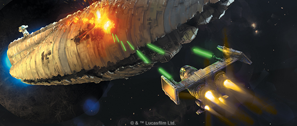
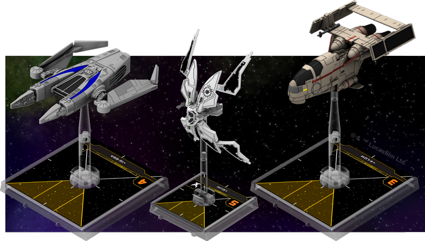
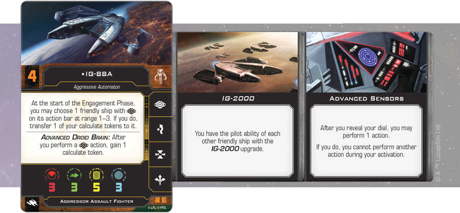
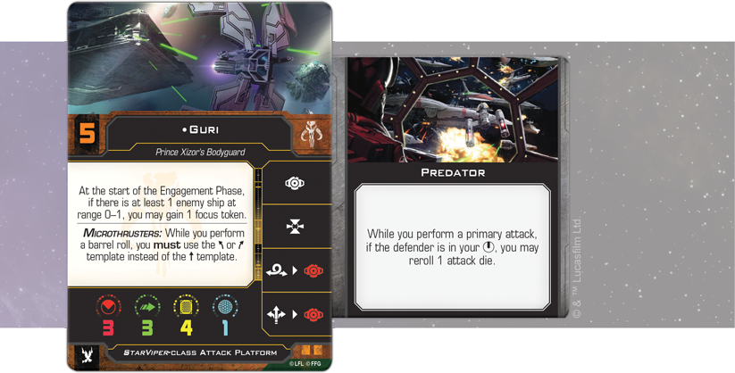
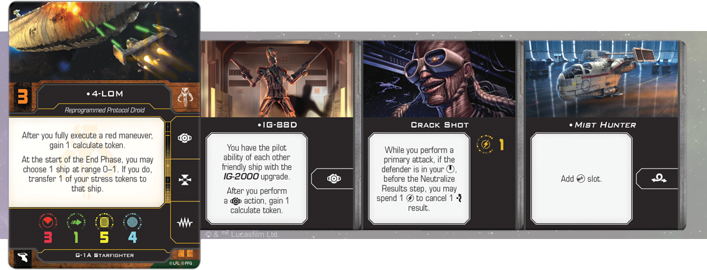

This article was originally published on [https://www.fantasyflightgames.com/en/news/2018/9/10/deadly-calculations/](https://www.fantasyflightgames.com/en/news/2018/9/10/deadly-calculations/)

&laquo; [Back to index](../index.md)

---

10 September 2018

Deadly Calculations
===================

Preview a Scum and Villainy List for X-Wing Second Edition

_"You are free to use any methods necessary."_  
   –Darth Vader, _Star Wars: The Empire Strikes Back_

The Galactic Civil War may be a defining moment for the _Star Wars_ galaxy, but that doesn’t mean everyone has to side with the Empire or the Rebellion. Plenty of individuals look at the conflict and see only opportunity. When _X-Wing™ Second Edition_ launches on September 13, the galaxy’s most notorious Scum and Villainy will be there, ready to stay one step ahead of the competition with an entire toolkit of dirty tricks and illicit upgrades.

With the _Lando’s_ Millennium Falcon _Expansion Pack_, the _Slave I_ Expansion Pack, and the _Fang Fighter Expansion Pack_ all available at launch, you can build a squadron that gives you a taste of the life of the smugglers, bounty hunters, and hardened warriors that make up the Scum and Villainy faction. If you’re already an experienced member of the galactic underworld, you can bring your collection of first edition Scum ships into the second edition with the _Scum and Villainy Conversion Kit_, giving yourself even more ways to build a squad of notorious criminals. Alternatively, this conversion kit is the perfect tool for new players to collect their favorite Scum ships from the game's first edition and play with them before their debut in _X-Wing Second Edition_!

We’ve already taken a look at a squad highlighting the _Ghost_ and her crew of fledgling Rebels, as well as a squadron making use of some advanced Imperial technology. Today, our focus turns away from the central conflict of the Galactic Civil War and look to see what’s happening on the fringes. Join us as we examine at a 200-point list featuring some of the Scum and Villainy’s robotic pilots.

A Mind of Their Own    
-----------------------

Although the galaxy’s Scum and Villainy are largely self-serving individuals with little regard for the ideals of the Rebel Alliance or the Galactic Empire, a certain few belong in a class of their own. Rather than serve those that created them, the droid pilots that make up this list have rebelled against their programming and decided to make their own way in the galaxy as bounty hunters, thieves, and assassins.

As droids, these pilots have some capabilities not seen in their organic counterparts. Chiefly, they are able to make the calculations necessary to minutely adjust their aim or change course at lightning-quick speeds by taking the calculate action. Each calculate token they receive can be spent to change a single focus die result to a hit or evade, depending on the situation. This may seem like a less powerful version of the focus action, but it can provide droid pilots with some unique flexibility to use their tokens exactly when they need them. This list is focused on giving them plenty of opportunities to do so.

"Droid Revolution" (Scum and Villainy)

Agressor Assault Fighter   
IG-88A (70 points)  
System:  
Advanced Sensors (8 points)  
**Title:**  
IG-2000 (2 points)

_StarViper_\-class Attack Platform  
Guri (62 points)  
Talent:  
Predator (2 points)

**G-1A Starfighter**  
4-LOM (49 points)  
Talent:  
Crack Shot (1 point)  
**Crew:**  
IG-88D (4 points)  
**Title:**  
_Mist Hunter_ (2 points)

Capable of processing mountains of complex information in millionths of a second, droid brains are very different from those of other beings. Droids constantly use the information they obtain to predict their opponents’ next move and adjust their strategy accordingly. Even among droids, no other is as ruthlessly efficient as IG-88. Thanks to his Advanced Droid Brain, he gains an additional calculate token after performing a calculate action.

These tokens could be split between separate engagements, but there is another option. This list specifically includes [IG-88A](swz08_a1_ig88a.png) , who has the ability to transfer one of his calculate tokens to a friendly ship at Range 1–3 that also has the calculate action on its action bar at the start of the Engagement Phase. If he’s close enough, then, IG-88A can fuel his fellow droids with additional calculate tokens, giving them the chance to perform other actions.

You can ensure that he’ll be close enough to pass off his spare calculate token by using his [Advanced Sensors](swz08_a1_sensors.png) . This upgrade allows you to perform an action after revealing your dial but before executing the maneuver. This means IG-88A can perform his calculate action and gain an extra token, even while preparing to pull off a difficult red maneuver that could put him in perfect position to pass off that token.  

These extra calculate tokens are certain to come in handy for [Guri](swz08_a1_guri.png) , who likes to engage enemies at close range with her _StarViper_\-class Attack Platform. She gains a focus token when she's close to an enemy ship at the start of the Engagement Phase. Combine that with a calculate token and Guri has great power to modify her dice results. Gaining this token while staying out of harm’s way should be a little easier thanks to the _StarViper_’s built-in Microthrusters. Rather than perform a barrel roll using the standard, straight maneuver template, the Microthrusters force the ship to use the bank maneuver instead, making it capable of sliding into tight spaces inaccessible to other ships.

This extra bit of maneuverability can also help Guri in other ways. For example, it syncs nicely with her talents as a [Predator](swz08_a1_predator.png) to get the perfect angle on an opponent. Furthermore, seeing as she can gain focus and calculate tokens without taking actions, Guri remains free to acquire locks on enemy ships, granting her another opportunity to reroll her attack dice with the hope of getting the hit or focus results she needs.    

While Guri and IG-88A are working closely together, the final member of the squadron is free to operate independently. The rogue protocol droid [4-LOM](swz08_a1_4lom.png) is carrying IG-88D on his G-1A Starfighter, the _Mist Hunter_, giving him the same bonus calculate token after performing a calculate action enjoyed by IG-88A, as well as the ability to pass off one of his Calculate tokens to any other ship on the list. And, just like IG-88A, 4-LOM is still free to fly a bit more aggressively. He gains a calculate token every time he fully executes a red maneuver, which means he will rarely go without the opportunity to gain a calculate token.

In addition to the calculate token, 4-LOM has plenty of other reasons to use some fancy flying. The _Mist Hunter_ is the least maneuverable of the three ships in this squadron, but that doesn’t mean it still can’t pull off some clever repositioning. The  _[Mist Hunter](swz08_a1_mist-hunter.png)_  title gives the ship abilities beyond a normal G-1A Starfighter. Chiefly, it adds the barrel roll action to the ship’s action bar, giving you another method for quickly ducking out of the line of fire.

Normally, the bold flying and red maneuvers that 4-LOM favors would incur stress that would severely limit him in future rounds, but he refuses to suffer these consequences. If he can get within Range 0–1 of a ship—enemy or friendly—he can transfer a stress token to it at the start of the End Phase. Ultimately, 4-LOM has the amazing ability to execute a red maneuver, gain a calculate token, pass that calculate token, and remove the stress from that red maneuver in the course of a single round.

We Think, Therefore We Are
--------------------------

The Rebel Alliance may claim to seek freedom from the tyranny of the Galactic Empire, but the droids of this list display their own rebel spirit, fighting back against their very programming to make their own way in the galaxy. The rest of the Scum and Villainy exhibit a similar independence, pursuing their own interests rather than committing themselves to a cause. With the Scum and Villainy ships, pilots, and upgrades available at launch, pursue your own agenda with _X-Wing Second Edition_!

