This article was originally published on [https://www.fantasyflightgames.com/en/news/2018/9/13/take-command-3/](https://www.fantasyflightgames.com/en/news/2018/9/13/take-command-3/)

&laquo; [Back to index](../index.md)

---

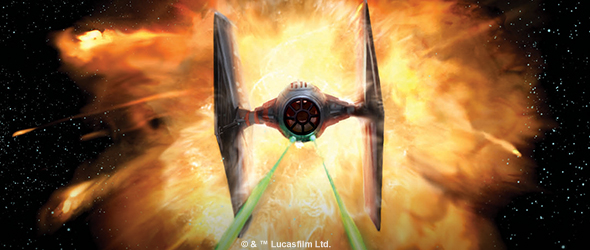

13 September 2018

Take Command
============

Fourteen X-Wing Second Edition Expansions Are Now Available

_"I'm not such a bad pilot myself."_  
   –Luke Skywalker, _Star Wars: A New Hope_

There’s no telling what you’ll come up against in the thrilling space battles of the _Star Wars_™ galaxy. Whether you’re launching a quick strike against sensitive Imperial targets, sending waves of TIE/ln fighters to quell any resistance, or tracking your next bounty through deep space, having the right combination of ships and equipment can make all the difference. Fortunately, a full complement of starfighters is at the ready.

[_X-Wing™ Second Edition_](https://www.fantasyflightgames.com/en/products/x-wing-second-edition/) went on sale today, and a wide variety of expansions are available for you to supplement your squadrons. No matter if you prefer the heroic pilots of the Rebel Alliance, the might of the Galactic Empire, or the galaxy’s most notorious Scum and Villainy, these expansions provide even more options for you to round out your squadrons. Lead your squadron into the fight with fifteen _X-Wing Second Edition_ products, all releasing today:

*   _[X-Wing Second Edition Core Set](https://www.fantasyflightgames.com/en/products/x-wing-second-edition/products/x-wing-second-edition/)_
*   _[X-Wing Second Edition Dice Pack](https://www.fantasyflightgames.com/en/products/x-wing-second-edition/products/x-wing-second-edition-dice-pack/)_
*   [Lando's _Millennium Falcon_ Expansion Pack](https://www.fantasyflightgames.com/en/products/x-wing-second-edition/products/landos-millennium-falcon-expansion-pack/)
*   _[Rebel Alliance Conversion Kit](https://www.fantasyflightgames.com/en/products/x-wing-second-edition/products/rebel-alliance-conversion-kit/)_
*   _[Galactic Empire Conversion Kit](https://www.fantasyflightgames.com/en/products/x-wing-second-edition/products/galactic-empire-conversion-kit/)_
*   _[Scum and Villainy Conversion Kit](https://www.fantasyflightgames.com/en/products/x-wing-second-edition/products/scum-and-villainy-conversion-kit/)_
*   _[Rebel Alliance Maneuver Dial Upgrade Kit](https://www.fantasyflightgames.com/en/products/x-wing-second-edition/products/rebel-alliance-maneuver-dial-upgrade-kit/)_
*   _[Galactic Empire Maneuver Dial Upgrade Kit](https://www.fantasyflightgames.com/en/products/x-wing-second-edition/products/galactic-empire-maneuver-dial-upgrade-kit/)_
*   _[Scum and Villainy Maneuver Dial Upgrade Kit](https://www.fantasyflightgames.com/en/products/x-wing-second-edition/products/scum-and-villainy-maneuver-dial-upgrade-kit/)_
*   _[T-65 X-Wing Expansion Pack](https://www.fantasyflightgames.com/en/products/x-wing-second-edition/products/t-65-x-wing-expansion-pack/)_
*   _[BTL-A4 Y-Wing Expansion Pack](https://www.fantasyflightgames.com/en/products/x-wing-second-edition/products/btl-a4-y-wing-expansion-pack/)_
*   _[TIE/ln Fighter Expansion Pack](https://www.fantasyflightgames.com/en/products/x-wing-second-edition/products/tieln-fighter-expansion-pack/)_
*   _[TIE Advanced x1 Expansion Pack](https://www.fantasyflightgames.com/en/products/x-wing-second-edition/products/tie-advanced-x1-expansion-pack/)_
*   _[Slave I Expansion Pack](https://www.fantasyflightgames.com/en/products/x-wing-second-edition/products/x-wing-second-edition-slave-i-expansion-pack/)_
*   _[Fang Fighter Expansion Pack](https://www.fantasyflightgames.com/en/products/x-wing-second-edition/products/fang-fighter-expansion-pack/)_

_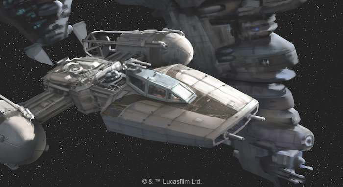_

Spirit of Rebellion
-------------------

Taking on a force like the Galactic Empire is a nearly impossible task, and the Rebel Alliance needs every starfighter it can find if it wants to continue the fight for freedom. Luckily, the _Rebel Alliance Conversion Kit_ gives you access to a full complement of Rebel ships right away.

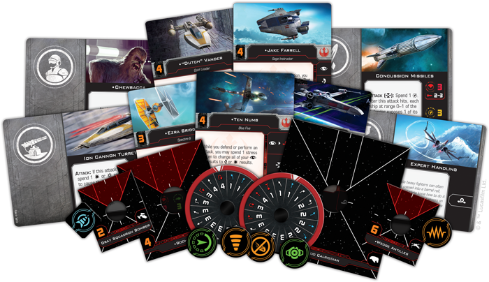

The conversion kit contains all the ship cards, tokens, upgrade cards, and maneuver dials that veteran players need to upgrade their existing Rebel Alliance ship collection to _X-Wing Second Edition_. Alternatively, new players looking to experiment with ships beyond those available at launch can combine the components found in this _Conversion Kit_ with first edition expansions to gain access to even more ships, like the blazingly fast RZ-1 A-wing or the iconic _Millennium Falcon_, from day one!

A Rebel Mainstay
----------------

The Rebel Alliance might not be able to match the sheer number of starfighters fielded by the Empire, but they can counter with one of the most effective starfighters in the galaxy. With a fine balance of speed, maneuverability, and firepower, the T-65 X-wing is more than a match for anything the Empire can throw at it.  

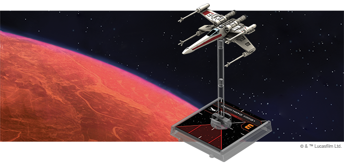

The _T-65 X-Wing Expansion Pack_ features a beautifully painted T-65 X-wing miniature as well as all the cards and tokens you need to play. A mainstay of Rebel fighter squadrons, the T-65 X-wing can play a part in virtually every Rebel operation, and every Rebel pilot will appreciate the extensive range of customization options available to the ship.

These iconic starfighters can be outfitted with a variety of torpedoes, astromechs, and modifications that enhance their abilities and make them all the more effective. But perhaps the most striking feature of the T-65 are its Servomotor S-foils. Pilots can [open](211a46b03cd72304a4bba22cea6f3138.png) these moveable wings before they activate to grant the ship an added burst of speed or a little firepower, giving you the freedom to choose the best configuration for the situation.

For a full preview of the T-65 X-wing, including the pilots who fly it, click [here](https://www.fantasyflightgames.com/en/news/2018/6/11/symbol-of-the-rebellion/)! 

Heavy Hitter
------------

While the Empire has the resources and pilots to field squadrons containing a large number of starfighters, the Rebels are left scrounging for whatever ships they can find. The dependable BTL-A4 Y-wing, then, is a boon for squadrons in need of its heavy armament.

Within the _BTL-A4 Y-Wing Expansion Pack_, you’ll find one fully assembled, beautifully painted and resculpted BTL-A4 Y-wing miniature to add to your Rebel squadron, along with several upgrade cards that you can use to unlock the ship’s full potential.

Although slower and more lumbering than the T-65 X-wing, the Y-wing can carry some munitions capable of causing some massive damage. The ship can be loaded with a range of devices that can be dropped into the path of enemy ships and, thanks to its ability to take the reload action, the Y-wing can refresh its supply of these munitions. To further counter its low maneuverability, the Y-wing can also add a turret weapon and gunner to return fire in any direction, no matter which direction the Y-wing is flying.  

For a full preview of the BTL-A4 Y-wing, including its many upgrade cards, click [here](https://www.fantasyflightgames.com/en/news/2018/6/18/begin-attack-run/).

Imperial Might
--------------

In the space battles of the Galactic Civil War, the Galactic Empire can call upon a whole host of starfighters to quell any resistance. Now, the full might of the Imperial Navy can be at your command from the very beginning of _X-Wing Second Edition_.

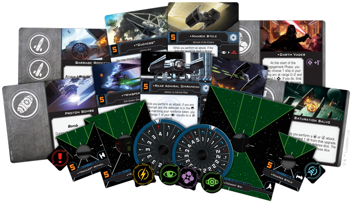

With the _Galactic Empire Conversion Kit_, you can bring your entire fleet of Imperial ships from the first edition into the second edition, allowing you to add powerful ships like the TIE/D Defender or the stealthy TIE/ph Phantom to your Imperial squadrons as soon as you start playing. On the other hand, if you’re a new player, you can use the ship cards, tokens, maneuver dials, and more than 100 upgrade cards found in this conversion kit together with first edition ship expansions to grow the possibilities for your _X-Wing Second Edition_ squadrons.

Deadly Swarms
-------------

With the vast resources at its command, the Empire has created some of the most advanced starfighters in the galaxy. For its standard-issue starfighter, however, it has chosen to press its numerical advantage and crush the Rebellion under the weight of swarms of TIE/ln fighters.

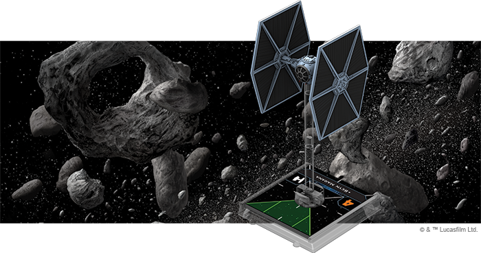

The _TIE/ln Fighter Expansion Pack_ contains one beautifully painted TIE/ln miniature alongside all the components you need to add it to your Imperial squadron. Cheap and highly maneuverable, the TIE/ln is the perfect option for filling out your Imperial squadron.

The TIE/ln may lack the shields and heavy firepower of its Rebel counterparts, but it more than makes up for these shortcomings with superior speed and maneuverability. Sporting three agility, this ship can easy dodge any incoming fire. What’s more, although a single TIE/ln fighter only has two primary attack, a large attack group can rain fire down on an enemy ship in a devastating concentrated attack.

For a full preview of the _TIE/ln Fighter Expansion Pack_, including its array of available pilots, click [here](https://www.fantasyflightgames.com/en/news/2018/7/16/space-superiority-1/)! 

Rule Through Fear
-----------------

Wave after wave of TIE/ln fighters are usually all it takes to eliminate opposition to Imperial order. Sometimes, however, cheap, expendable starfighters aren’t enough to handle the problem. During those times, the TIE Advanced x1 is more than enough to convince any remaining Rebels to abandon the cause.

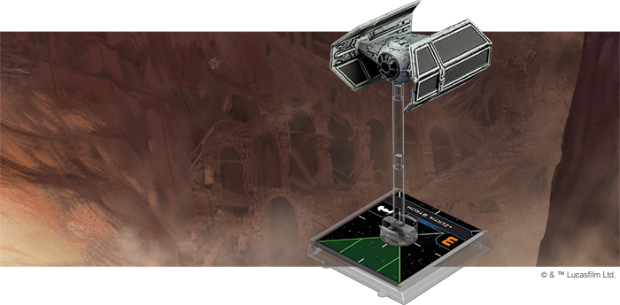

Within the _TIE Advanced x1 Expansion Pack_, you’ll find a beautifully painted TIE Advanced x1 miniature as well as the cards and tokens you need to add this new ship to your squadron.

Much more durable than the TIE/ln, the TIE Advanced x1 also makes your squadron that much more deadly. Already enhanced by an onboard Advanced Targeting Computer, the TIE Advanced can also equip a number of upgrades not available to the TIE/ln, including missiles and various System upgrades. The ship becomes truly frightening when Darth Vader is at the controls, using the power of the Force to take additional actions and set up a powerful attack.

For a full preview of the _TIE Advanced x1 Expansion Pack_, including a look at the dreaded Darth Vader himself, click [here](https://www.fantasyflightgames.com/en/news/2018/7/23/on-the-cutting-edge/)!

A Wretched Hive
---------------

While the Empire and Rebellion are mired in their ideological conflict, the galaxy’s seedy underbelly searches for ways to serve their own interests. Unlike the uniform military vehicles of the other two factions, the infamous bounty hunters and criminals that make up the galaxy’s Scum and Villainy pilot a diverse array of highly customized ships and the _Scum and Villainy Conversion Kit_ gives you the chance to bring all these ships to your games of _X-Wing Second Edition_ from launch.

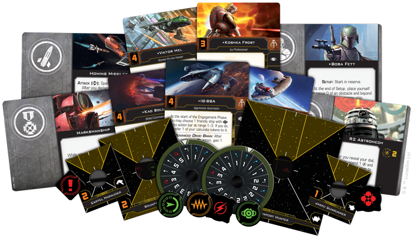

With the full hangar bay of new ship cards, tokens, upgrade cards, and maneuver dials you’ll find in the _Scum and Villainy Conversion Kit_, you can upgrade your Scum ship collection from the first edition to the second edition, bringing iconic pilots like Boba Fett and Fenn Rau into the game right at the start. If you’re a new player looking to fly notorious ships like the _IG-2000_ or the _Punishing One_, you can also use this kit along with first edition ship expansions to round out your _X-Wing Second Edition_ squadrons.

Buckle Up
---------

The _Millennium Falcon_ is one of the most iconic ships from the entire _Star Wars_ saga. But long before Han Solo was piloting it as a member of the Rebel Alliance, it belonged to the notorious gambler and smuggler Lando Calrissian. You can experience this classic ship in a whole new way by adding it to your Scum and Villainy squadrons with the Lando’s _Millennium Falcon_ Expansion Pack.

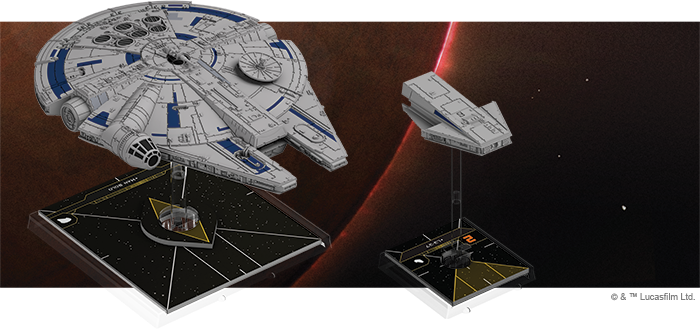

This expansion contains a fully assembled and pre-painted customized YT-1300 light freighter miniature, as well as all the components you need to incorporate the ship into your Scum squadron and outfit it for battle.

The _Millennium Falcon_ may have been built to haul cargo, but that doesn’t mean it’s not effective in a fight. The ship sports a double turret arc, allowing it to cover a wide swath of space with its primary weapon. More importantly, the ship’s detachable Escape Craft lends it even more flexibility. While docked, this ship lends its shields and pilot abilities to the _Falcon_. But, if the situation is dire, it can also be flown on its own, working alongside the rest of your squadron. It can even equipped with Rigged Energy Cells and flown by an [Autopilot Drone](897f7ae478b6e6d72fff7147bf212595.png) directly into an incoming group of enemy fighters for an explosive surprise!

For a full preview of the Lando's _Millennium Falcon_ Expansion Pack, including a look at the pilots for both the _Falcon_ and the Escape Craft, click [here](https://www.fantasyflightgames.com/en/news/2018/6/25/got-it-where-it-counts/)! 

Track Your Target
-----------------

Although it was originally produced for law enforcement purposes, the _Firespray_\-class patrol craft is also a favorite of pirates and some of the best bounty hunters in the galaxy, including the infamous Boba Fett. Attracted by a robust chassis that can be packed full of countless deadly armaments, every pilot puts their own spin on this highly customizable craft.

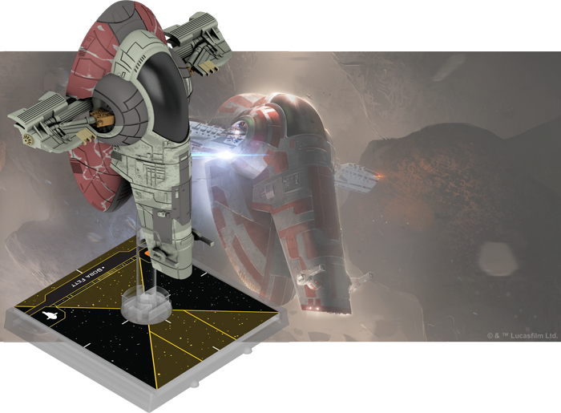

The _Slave I_ Expansion Pack contains a beautifully detailed _Firespray_\-class patrol craft miniature alongside all the ship cards, tokens, upgrade cards, and maneuver dial you need to outfit your ship and begin the hunt.

Without any upgrades, the _Firespray_\-class patrol craft still offers a powerful ship that rolls three attack dice from both its front and back arc. But the ship truly shines when you begin adding upgrades. It can be modified with cannons, missiles, devices, crew members, and illicit upgrades for a stunning array of tactical possibilities. What’s more, this expansion pack also includes three Title upgrades that unlock even more abilities, actions, and customization options.

For a full preview of the _Slave I_ Expansion Pack, including a look at all its upgrade options, click [here](https://www.fantasyflightgames.com/en/news/2018/7/2/any-methods-necessary-1/)!

The Thrill of Combat
--------------------

The warriors of Mandalore crave the glory of battle, and this desire only grows stronger when they take to space. Fortunately, their signature starfighter, the Concord Dawn Protectorate Fang Fighter, helps them maintain their confrontational style in the high-stakes dogfights of _X-Wing Second Ediition_.

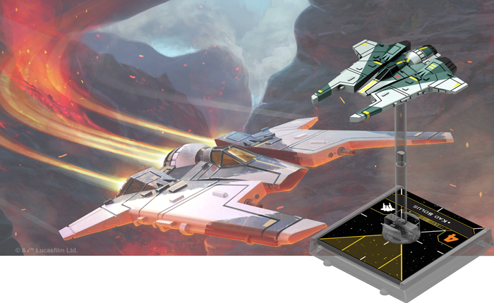

The _Fang Fighter Expansion Pack_ contains a beautifully painted Fang Fighter miniature, featuring posable wings, alongside everything you need to add one of these nimble fighters to your Scum squadron.

The Fang Fighter’s advanced pivot wing technology grants it unmatched agility, making it an exceptionally difficult ship to hit. This added maneuverability is tempered by the ship’s lack of deflector shields, but this doesn’t deter Fang Fighter pilots’ aggression in their relentless pursuit of their quarry. In fact, all Fang Fighter pilots are expected to master the bold Concordia Faceoff maneuver, leveraging their ships’ narrow attack profile to execute deadly head-on charges.

For a full preview of the _Fang Fighter Expansion Pack_, including a look at the Concordia Faceoff, click [here](https://www.fantasyflightgames.com/en/news/2018/7/9/direct-confrontation/)! 

Bold Maneuvers
--------------

Plotting your maneuvers is a central part of your strategy in _X-Wing Second Edition_, and every type of ship features its own unique maneuver dial. With three distinct factions and ships from across the _Star Wars_ saga to choose from, you can make your squadron even more distinct with the _Maneuver Dial Upgrade Kit_s for each faction.

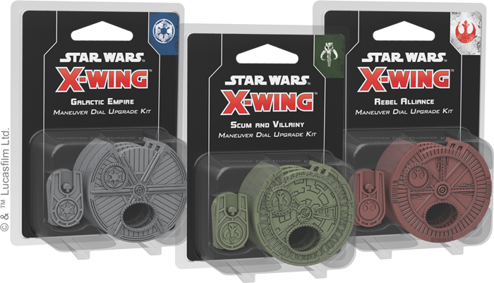

These upgraded plastic maneuver dials proudly declare your allegiance to the faction of your choice while enhancing the aesthetic look of your squadron. As you secretly plot your maneuvers each round, these kits house a ship’s dial within a secure plastic housing. Additionally, the kits include a space on the back to insert a dial ID token, making it easy to differentiate between your ships in the middle of a game.

Put Your Team Together
----------------------

With the release of _X-Wing Second Edition_, a new era of space combat and some of the most iconic starfighters from across the _Star Wars_ saga are at your fingertips. It's time to pick your pilots, outfit your ships, and enter the fight. 

