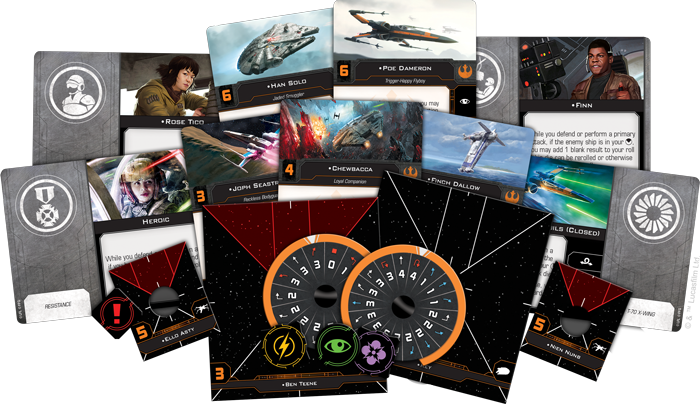

This article was originally published on [https://www.fantasyflightgames.com/en/news/2018/10/3/continuing-the-fight/](https://www.fantasyflightgames.com/en/news/2018/10/3/continuing-the-fight/)

&laquo; [Back to index](../index.md)

---

3 October 2018

Continuing the Fight
====================

Preview the Upgrade Cards in the Resistance Conversion Kit for X-Wing

_“We have everything we need.”_  
   –Leia Organa, _Star Wars: The Last Jedi_

The situation is dire. Lurking in the Unknown Regions, the sinister First Order is poised to sweep across the _Star Wars_ galaxy, conquering everything in its path. Now, the Resistance is all that stands in the way of a new era of galactic domination. Launching into battle in a new generation of advanced starfighters, these brave pilots are ready to continue the fight for freedom begun by the Rebel Alliance in the tense ship-to-ship combat of [_X-Wing_™](https://www.fantasyflightgames.com/en/products/x-wing-second-edition/).   

Rather than continue as part of the Rebel Alliance, the Resistance is becoming its own unique faction in the new edition of _X-Wing_, and the _[Resistance Conversion Kit](https://www.fantasyflightgames.com/en/products/x-wing-second-edition/products/resistance-conversion-kit/)_ is the perfect place to begin building your Resistance squadrons. This conversion kit contains everything that veteran _X-Wing_ players need to rekindle hope and bring their existing T-70 X-wing, Scavenged YT-1300 light freighter, and MG-100 StarFortress miniatures from the first edition into the game's second edition. Alternatively, new players can combine the ship cards, upgrade cards, maneuver dials, and ship tokens in this kit with first edition ship expansions to play with the full strength of the Resistance right away.

While the Resistance carries on the legacy of the Rebellion, it is more than just updated versions of classic starfighters. Most importantly, it is made up of people from across the galaxy, each committed to defending the galaxy from tyranny. In the years since the end of the Galactic Civil War, new heroes have taken their place alongside some of the saga’s most iconic characters, each of them contributing to the fight in their own way. Join us today as we take a look at the these characters and what they bring to your games of _X-Wing_!

Seasoned Veterans
-----------------

The second Death Star may have been destroyed, but the struggles that began with the Galactic Civil War continue long past the Battle of Endor. The resurgent First Order must be thwarted if the galaxy is to remain at peace. Whether they stayed dedicated to the cause or they've been pulled back into the escalating conflict, many veterans of the Rebellion have become members of the Resistance, including some of the _Star Wars_ saga’s most iconic characters.

These characters might be heroes of a former era, but that doesn’t mean they don’t have anything new to contribute to the Resistance. They each feature new skills and abilities they can lend to your Resistance ships, helping your squadrons develop an identity all their own. [C-3PO,](swz19_a2_tfa-3p0.png)  for example, has always excelled at facilitating communication between machines and their users. With the Resistance, he continues this tradition by adding both the calculate action and a red coordinate action to his ship’s action bar. But his abilities go even further than this. Whenever his ship performs either of these actions, it gains another calculate token, giving you even more flexibility in upcoming engagements.  

While C-3PO continued alongside General Leia Organa in the wake of Endor, other characters eventually went their own way, only to be pulled back into the struggle between the Resistance and First Order. Ever the scoundrel, [Han Solo](swz19_a2_old-han.png) can talk himself out of almost any situation. He can extend this knack for getting out of tight situations to whatever ship he finds himself aboard in _X-Wing_. Not only does Han Solo add the valuable evade action to his ship’s action bar, but his ship also gains additional evade tokens equal to the number of nearby enemy ships! With even a single enemy within range, Han's ship receives two evade tokens, well worth the stress this action would incur.

  
_There are two enemy ships at Range 0–1, so the Scavenged YT-1300 gains two additional evade tokens thanks to Han Solo!_

Han Solo is rarely seen without his faithful companion [Chewbacca,](swz19_a2_tfa-chewie.png)  of course, and the Wookiee is ready to fight alongside the Resistance. Always loyal to his friends, Chewbacca will do whatever it takes to defend them, and he becomes even more dangerous when he sees them come under fire. Chewie recovers a charge after a friendly ship at Range 0–3 is dealt damage, and, once he has his two full charges, he can unleash a powerful attack, changing a focus to a critical hit! Chewbacca is sure to show your opponent why it’s not wise to upset a Wookiee.

Rebel Spirit
------------

The Rebel Alliance has had a lasting impact on the galaxy, its influence reverberating long after the formation of the New Republic. Inspired by the ideals of the Rebellion, a new generation of freedom fighters has risen to protect the galaxy. Unlike the ruthless ambition displayed by members of the First Order, these young heroes know the best way to counter the threat of the First Order is to come together. Fittingly, then, the young heroes of the Resistance tend to play off each other’s strengths to create some powerful combinations.

No one exemplifies this more than the former First Order stormtrooper [Finn.](swz19_a2_finn-gunner.png)  who can spend Finn's blank to acquire a lock on the enemy ship.

  
_The TIE/fo fighter is in the Scavenged YT-1300's front arc, so Finn adds a blank result that Rose immediately spends to acquire a lock on the incoming ship!_

Rose isn’t the only character Finn has developed a strong connection with, of course. He began a strong friendship with the scavenger Rey when the pair narrowly escaped Jakku in the _Millennium Falcon_, and it’s only fitting that Finn and Rey also form a powerful duo in _X-Wing_. A blossoming Force-user, [Rey](swz19_a2_reys-pilot.png) is a naturally good pilot. For starters, she can spend a Force charge to change a blank to an evade or a hit while attacking or defending against a ship in her front arc. Powerful on its own, this ability is a great way to add some extra punch or make an amazing escape with the blank that comes from Finn.

Rey’s Force abilities may serve her well on any ship, but she’s most comfortable flying the _Millennium Falcon_. Thanks to the new [Rey's _Millennium Falcon_](swz19_a2_reys-falcon.png)  title included in the _Resistance Conversion Kit_, she can push this iconic ship even further, performing Segnor’s Loops, boosting, and rotating the _Falcon_’s double turret arc while she has two or fewer stress tokens.

Like the Rebellion before it, the Resistance often finds itself on the defensive, and its pilots often look for ways to make their equipment last as long as it can. Luckily, droids like [R2-HA](swz19_a2_r2-ha.png) make this a bit easier. He excels at tracking enemy ships and predicting their attacks, giving you a better chance of defending yourself. With this astromech on your ship, you can spend your target lock on the attacker to reroll any of your defense dice!

Still, even with droids like R2-HA, members of the Resistance must be willing to give their lives for the cause, a characteristic exemplified by [Paige Tico.](swz19_a2_paig-tico.png)  She greatly improves the efficiency of her ship by allowing it to drop a bomb or rotate its turret arc after performing a primary attack, but what's more, Paige is resilient to the end. Her ship can drop a bomb after it is destroyed, hopefully ensuring that its crew’s sacrifice was not made in vain.

Find Your Place
---------------

The threat grows by the day. New heroes must step up before the influence of the nefarious First Order grows to encompass the entire galaxy. Fortunately, the courageous pilots of the Resistance are ready to forge their own identity as protectors of peace. Enter the fight and keep hope alive!

