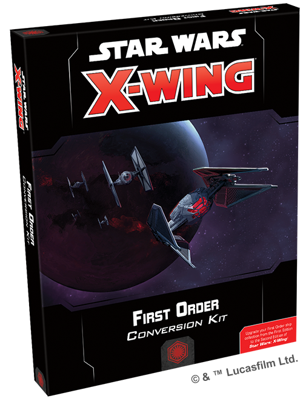

This article was originally published on [https://www.fantasyflightgames.com/en/news/2018/10/8/a-new-order/](https://www.fantasyflightgames.com/en/news/2018/10/8/a-new-order/)

&laquo; [Back to index](../index.md)

---

8 October 2018

A New Order
===========

Preview the Upgrade Cards in the First Order Conversion Kit for X-Wing

_"Let the past die. Kill it, if you have to.”_  
   –Kylo Ren, _Star Wars: The Last Jedi_

The Empire is gone. The _Star Wars_ galaxy has fallen into disorder. It is time for the First Order to rise and bring calm to the chaos fostered by the New Republic. But to do so, the First Order must first wipe out the loathsome Resistance. Flying into the tense space battles of _[X-Wing](https://www.fantasyflightgames.com/en/products/x-wing-second-edition/)_™ in modern starfighters based on Imperial designs, the pilots of the First Order are ready to display their fanatical devotion to the cause.

Although the Galactic Empire’s influence is evident, the First Order has evolved into a separate entity in the years since the Battle of Endor and this break carries over into the new edition of _X-Wing_. As a separate faction, the First Order brings its own complement of starfighters to _X-Wing_, and veteran and new players alike can use the _[First Order Conversion Kit](https://www.fantasyflightgames.com/en/products/x-wing-second-edition/products/first-order-conversion-kit/)_ as a starting point for their First Order squadrons. This kit contains a vast array of new ship cards and tokens—including iconic pilots like Kylo Ren—along with more than 100 upgrade cards that can be combined with the TIE/fo Fighter, TIE Silencer, Special Forces TIE, and _Upsilon_\-class Shuttle miniatures from first edition expansions to create lethal First Order squadrons as soon as this kit is released in the fourth quarter of 2018.

The First Order may fly newer versions of Imperial ships into battle, but this isn’t the only connection it shares with the Empire. Many members of the First Order’s chain of command can trace their roots directly to members of Empire and this new generation is eager to put their ruthless ambition to use in _X-Wing_. Today, we’ll take a look at how this ambition has been translated into the First Order’s exclusive upgrade cards!

No Surrender
------------

Like their Imperial predecessors, inflicting fear in their enemies is just as important to First Order squadrons as the firepower of their starfighters. Swarms of imposing TIE/fo fighters are certainly one method of intimidating opponents, but that’s just one of many options. In fact, much of the First Order’s strategy centers on disrupting the normal flow of the game and keeping opposing pilots off guard. This starts with the First Order’s officers, whose mere presence aboard shuttles and other transports is often enough to push the enemy off their game.

Known for her gleaming chrome armor, [Captain Phasma](swz18_captain-phasma_a2.png) is also in play. As long as you catch the enemy ship in your front arc, he can force this ship to take an additional stress token, severely limiting its options.

Obviously, the First Order prefers being confrontational in its space battles, and their pilots and officers are not afraid to hinder their own ships as long as it means hurting the enemy even more. This is most evident with [General Hux.](swz18_general-hux_a2.png)  With the ability to coordinate with two additional ships while taking the Coordinate action, Hux can prepare a large swath of your squadron for a major assault. Doing so will cause every ship involved to gain a stress token, of course, but this is a small price to pay if you can inflict some heavy damage on the ensuing attack.

  
_While he's aboard the_ Upsilon-_class shuttle piloted by Major Stridan, General Hux can coordinate with the three TIE/fo fighters at range 3!_

While other First Order ships are charging into the fight, General Hux is too valuable to be exposed to much enemy fire. Normally, he would have to stay within Range 1–2 to coordinate with his ships. But if [Major Stridan](swz18_major-stridan_a2.png) is acting as his personal pilot, you can stay at a more comfortable distance. With Major Stridan as your pilot, you can treat friendly ships at Range 2–3 as being at Range 0 or Range 1 while coordinating and resolving effects from his upgrades, giving General Hux a bit more room to use his ability while remaining at a comfortable distance from the action.

Trained officers like General Hux and Captain Phasma certainly keep their subordinates in line, but the First Order's power does not come from military might alone. Some of its most powerful members are disciples of the dark side of the Force and can fuel their abilities by tapping into their own raw aggression. Confronting the enemy is even easier if you know where your opponent is going to move. While this may be impossible for lesser beings, [Supreme Leader Snoke](swz18_supreme-leader-snoke_a2.png)  his ship will have an additional charge to spend, giving you foresight into the movements of two enemy ships.

Beyond their many leaders determined to elimate the Resistance at any cost, even the First Order’s technology is designed to relentlessly pursue their enemies from the very beginning of a game. A ship with [Hyperspace Tracking Data,](swz18_hyperspace-tracking-data_a2.png)  for example, can use it to enter the battle more prepared than their opponent. With this data in hand, a ship can be placed exactly when you want it. This placement is especially crucial, as each friendly ship at Range 0–2 of the ship carrying the Hyperspace Tracking Data is assigned either a focus or an evade token once Setup is complete!

  
_After being placed at iniative 0 with Hyperspace Tracking Data, Lieutenant Dormitz allows the four Episilon Squadron Cadets to be placed at Range 2 of herself, ready to launch an attack on the Resistance forces!_

These tokens might not seem very useful with enemy ships all the way on the other side of the play area, but this changes completely if [Lieutenant Dormitz](swz18_lt-dormitz_a2.png)  is the one equipped with Hyperspace Tracking Data. If you place her first, the rest of your ships can be placed anywhere in the play area within Range 0–2 of her _Upsilon_\-class shuttle, including far enough into the play area to swoop in on your opponent’s ships and launch a vicious attack in the very first round.

The War Is Just Beginning
-------------------------

The galaxy is vulnerable. The time to strike is now. With the help of a new generation dedicated to galactic domination, the First Order will rise and recapture the glory of the Galactic Empire.

