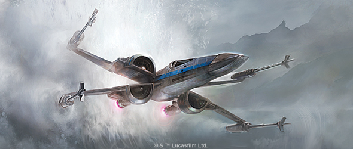
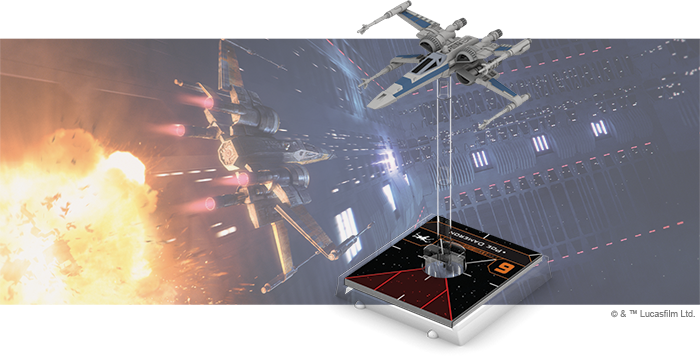
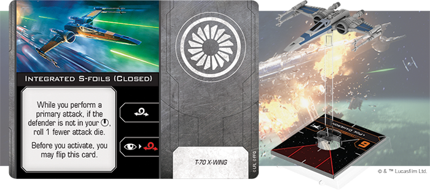
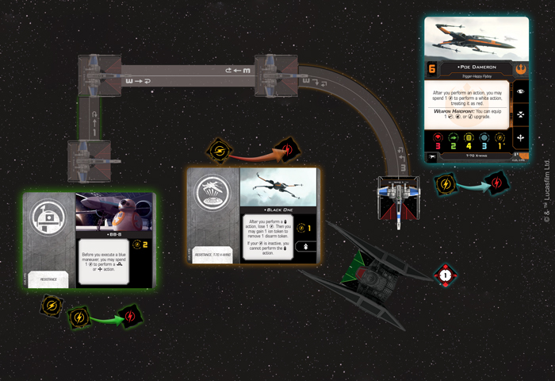
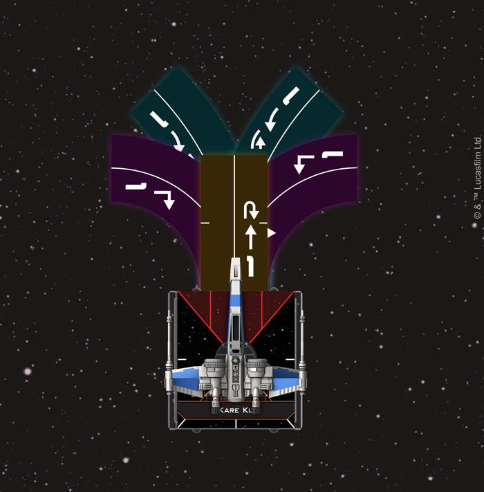
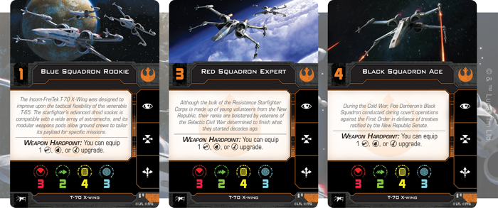

This article was originally published on [https://www.fantasyflightgames.com/en/news/2018/10/24/a-new-classic/](https://www.fantasyflightgames.com/en/news/2018/10/24/a-new-classic/)

&laquo; [Back to index](../index.md)

---

24 October 2018

A New Classic
=============

Preview the T-70 X-Wing Expansion Pack for X-Wing

_“Permission to hop in an X-wing and blow something up?”_  
   –Poe Dameron, _Star Wars: The Last Jedi_

During the Galactic Civil War, the T-65 X-wing became one of the most recognizable starfighters in the _Star Wars_ galaxy, its use by the Rebel Alliance earning it a reputation as a highly versatile and effective military vehicle. So effective, in fact, that it became a symbol of the fledgling Rebellion itself. It is only fitting, then, that the Resistance flies an updated version of this classic fighter into battle as it continues to defend freedom across the galaxy.

Designed by Incom-FreiTek to improve upon the tactical flexibility of the T-65, the T-70 X-wing features an advanced droid socket that makes it compatible with a wide array of astromechs as well as modular weapons pods that allow ground crews to tailor its payload for specific missions. Soon, you’ll have to chance to customize your own T-70 X-wing when the Resistance joins [_X-Wing_™](https://www.fantasyflightgames.com/en/products/x-wing-second-edition/) as its own faction with the _[T-70 X-Wing Expansion Pack](https://www.fantasyflightgames.com/en/products/x-wing-second-edition/products/x-wing-second-edition-t-70-x-wing-expansion-pack/)_.

Within this expansion, Resistance players will find everything they need to add a flashy new T-70 to their _X-Wing_ squadrons. A single finely detailed and fully painted miniature is accompanied by twelve ship cards, including nine unique pilots ready to take up the fight. Meanwhile, six upgrade cards give you plenty of options for outfitting your T-70 to your exact specifications and four Quick Build cards offer suggested combinations of pilots and upgrades to get your T-70 into the fight right away.

In addition to the _T-70 X-Wing Expansion Pack_, both veteran and new players can combine a T-70 miniature from _X-Wing_’s first edition with the components included in the _[Resistance Conversion Kit](https://www.fantasyflightgames.com/en/products/x-wing-second-edition/products/resistance-conversion-kit/)_ to add a T-70 to their Resistance squadrons. All of the new ship cards and punch included in the _T-70 X-Wing Expansion Pack_ will also be present in the _Resistance Conversion Kit_. Read on for a glimpse at how you can grow your Resistance forces with this new classic!

Happy Beeps
-----------

The days of the Galactic Civil War may be fading from memory, but to some Resistance pilots, the expanding conflict with the First Order is just a continuation of a fight that began long ago. While the bulk of the Resistance Starfighter Corps consists of young volunteers from the New Republic, their ranks are bolstered by veterans of the Rebel Alliance determined to finish what they started all those years ago. 

Similarly, the pilots found in the _T-70 X-Wing Expansion Pack_ represent a mixture of fresh-faced pilots and those returning from the first edition. Leading the returning pilots is none other than the best pilot in the Resistance, [Poe Dameron.](60692adb76f5fea00675bf20aebcaf7d.png)  Featuring the rare combination of high initiative and a powerful ability, few aces can match him in terms of sheer skill.

After performing an action, Poe can spend his recurring charge to perform another action, treating it as red. This alone makes him a versatile pilot capable of easily swooping into position and unleashing powerful attacks, but—if you follow his [Quick Build](49ac9c4075ef49665cf57e9b65e22055.png)  the ship becomes even more maneuverable.

This free Configuration upgrade adds the barrel roll action to the T-70’s action bar, as well as the ability to link a focus action into a barrel roll. Since he's able to use both the boost and barrel roll actions in the same activation, Poe should have little trouble perfectly lining up his shot in his bullseye arc and rolling all three of his attack dice, even with his S-foils closed.

While every T-70 can feature its own set of Integrated S-foils without increasing its squad point value, other upgrades are one-of-a-kind, with Poe's faithful astromech  [BB-8](a691d380e50e3257778eadd1c3865d25.png)  being one such example. This spunky droid gives his ship even more navigational options, providing two charges that can be spent to barrel roll or boost before executing a blue maneuver. These actions can be combined with Poe’s ability, of course, letting you dramatically alter his starting position even before you execute his chosen maneuver.

Poe Dameron is a bona fide ace even without BB-8, and he has earned the privilege of piloting his own unique T-70 X-wing, _Black One_. With the addition of a booster pod, Dameron was able to use this ship to singlehandedly disable the cannons of a First Order dreadnought during the evacuation of D’Qar, and the _[Black One](35ad8678b23df2a09a8ebefd8cd970d1.png) **Title**_ gives you the chance to recreate this incredible feat.

  
_With BB-8, Poe Dameron can perform a barrel roll before executing his three-straight maneuver. He can then use his_ Black One _title to perfom a SLAM action and pull within Range 1 of the TIE Silencer. Finally, he can use his ability to acquire a lock on the Silencer!_

This upgrade’s one-time use SLAM sends the T-70 careening across the board, allowing it to easily gain the upper hand on enemy ships. Better yet, a player can trade the normal disarm token gained by this action for an ion token. While every T-70 pilot can get behind the controls of _Black One_, the ship is particularly terrifying in the hands of Poe Dameron, who can combine its SLAM with a boost or barrel roll to set up the perfect shot.

New Aces
--------

In addition to Poe Dameron, the Resistance Starfighter Corps features a number of other pilots who make use of the T-70’s unique design in their own way. These new pilots bring fresh ideas to the updated version of this classic starfighter, taking it in their own exciting directions. 

[Kare Kun,](2aee77e8985af9a7d538b0db3ad1da9a.png) also gives her more options. While this droid doesn’t give you the option to boost like BB-8, it still lets you perform a barrel roll before executing a blue maneuver, giving Kun plenty of power to choose where her T-70 winds up.

  
_Kare Kun has five options when performing a boost!_

Where pilots like Poe Dameron and Kare Kun excel at staying out of danger, [Joph Seastriker](32b1ccc3d38e0ad13439efbc57d005f8.png) is at his best when he’s directly in the enemy’s crosshairs. His skills at evading enemy fire improve with every hit he takes, granting him an evade token each time he loses a shield! He’ll have to take a few hits, of course, but that just means that Seastriker is all the more likely to escape any subsequent attacks unscathed.

Even with an [R2 Astromech](583af264abde740da6f8f079407270f5.png) equipped, Seastriker is free to reroll an attack die for as long as the lock lasts.

Each of these unique pilots helps to shape the strategies you’ll employ and any one of them will use up a good portion of your squad points. Sometimes it’s better to trade the advantages of unique pilot abilities for the strength in numbers gained generic pilots and the _T-70 X-Wing Expansion Pack_ gives you three options to choose from.

With Poe Dameron as their leader, Black Squadron is the best squadron in the Resistance. Poe is the most recognizable, but every pilot in this squadron is a crack T-70 pilot who can hold their own against the First Order’s best. Adding a [Black Squadron Ace](974df65dc355e841b6c6c43800dbd336.png) to your squadron, then, gets you a pilot with above average initiative and a lower point cost than a unique pilot of equivalent skill.

They might not be quite as skilled as the members of Black Squadron, but a [Red Squadron Expert](70c1ff0720c42a0ec5910a42a62d8ed6.png) can lend them the guiding hand they need to flourish in combat. Despite not being the most skilled pilot himself, he excels at mentoring new pilots and can help new pilots manage their stress in the heat of battle.

Heroes of the Resistance 
-------------------------

The Resistance is ready to push back against tyranny wherever it may appear and, with a full strike force of T-70 X-wings, they have the power to burn the First Order to the ground.

