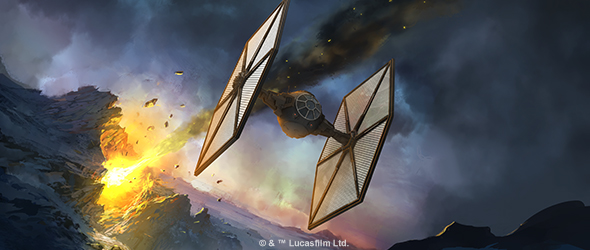
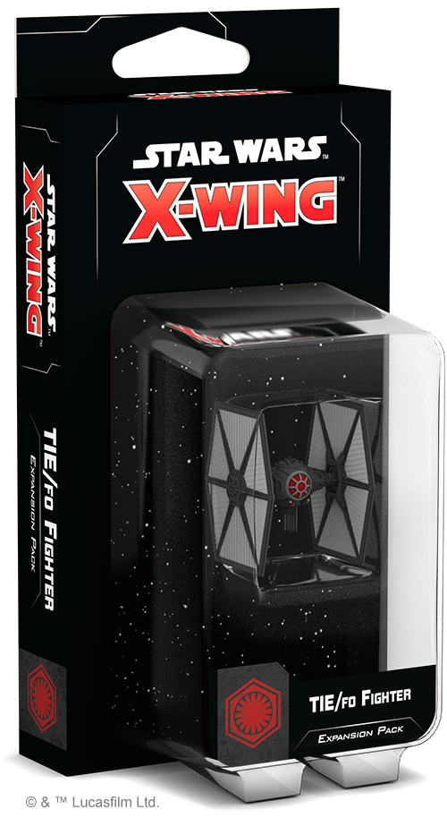
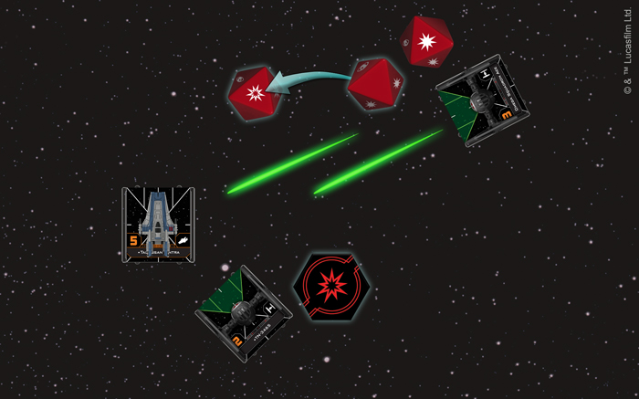
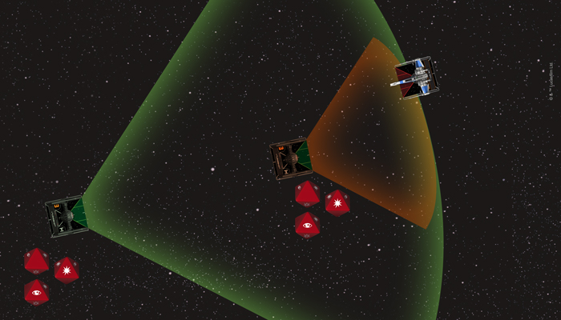
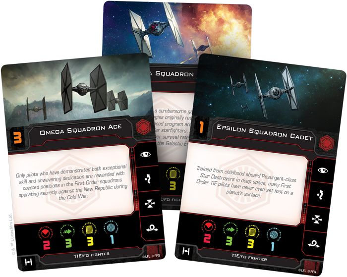

This article was originally published on [https://www.fantasyflightgames.com/en/news/2018/11/7/advanced-terror/](https://www.fantasyflightgames.com/en/news/2018/11/7/advanced-terror/)

&laquo; [Back to index](../index.md)

---

7 November 2018

Advanced Terror
===============

Preview the TIE/fo Fighter Expansion Pack for X-Wing

_"You and your friends are doomed. We will wipe your filth from the galaxy."_  
   –General Hux, _Star Wars: The Last Jedi_

It is a new era in the _Star Wars_ galaxy. Emerging from the far corners of space, the First Order is on a campaign of conquest, threatening to destroy everything that has been built in the wake of the Empire’s collapse. Leading the charge is a familiar starfighter.

Once emblematic of the Empire, the TIE fighter design has been adopted by the First Order in its bid to retake the galaxy from the New Republic. This new breed of TIE fighter may share a resemblance to old Imperial fighters, but it features a number of improvements that give it an identity all its own. The TIE/fo fighter continues to help define the First Order as it becomes a separate faction in the intense dogfights of [_X-Wing_™](https://www.fantasyflightgames.com/en/products/x-wing-second-edition/)!

Pairing the trademark speed and maneuverability of its namesake with enhanced defensive capabilities, the TIE/fo can hit the Resistance where it counts. You can start forming your own squadron of these surprisingly lethal fighters with the _[TIE/fo Fighter Expansion Pack](https://www.fantasyflightgames.com/en/products/x-wing-second-edition/products/x-wing-second-edition-tiefo-fighter-expansion-pack/)_. Each expansion pack includes one fully assembled and beautifully painted miniature, twelve ship cards, five upgrade cards, four Quick Build cards, and all the tokens you need to add a TIE/fo fighter to your First Order squadron.

In addition to the _TIE/fo Fighter Expansion Pack_, you can also bring multiple TIE/fo fighters to the table with the _[First Order Conversion Kit](https://www.fantasyflightgames.com/en/products/x-wing-second-edition/products/first-order-conversion-kit/)_.  This kit contains twenty-six TIE/fo fighter ship cards—including all nine unique pilots found in the _TIE/fo Fighter Expansion Pack_—as well as seven TIE/fo fighter maneuver dials that can be combined with miniatures from first edition expansions to fill out your squadron. Read on for a look at what this new generation of TIE fighter can do!

A New Fighter for a New Era
---------------------------

The First Order may be inspired by the Galactic Empire, but its military leaders face some challenges unique to this new regime. While the Empire controlled many of the core systems during the Galactic Civil War, the First Order has been exiled to the unknown regions of the galaxy for decades. To restore the ideals of the Empire, then, it must seize power through force.

This shift in objectives has also created the need for a new type of TIE fighter. Freed from the bureaucracies that tied down their Imperial predecessors, First Order engineers are able to more easily incorporate new technology into their starfighters, preparing them for modern combat. As a result, the First Order’s version of the TIE fighter includes a number of advancements, including on-board deflector shields and the ability to acquire locks.

In addition to ensuring that their ships are a bit more durable, these new tools also give TIE/fo pilots options that were not available to previous generations of pilots. Some of these pilots, like [TN-3465,](swz26_a1_tn-3465.png)  follow their Imperial predecessors in attempting to support their squadmates. Whenever another friendly attacks a ship at Range 0–1 of TN-3465, she can take a critical damage to change one of the attacker’s results to a critical hit.  

  
_TN-3465 suffers a critical damage to change one of the Omega Squadron Ace's results to a critical hit._

Most First Order pilots, however, aren’t as willing to help out their fellow pilots, with most preferring to look out for themselves and their ships. One thing that the TIE/fo shares with the Imperial version is a relatively weak two-die primary attack. The first goal of some pilots, then, is to find a way to give their attacks more firepower. Most TIE/fo pilots display a fanatical devotion to the cause, none moreso than ["Scorch."](swz26_a1_scorch.png)  is equally effective up close and from a distance, rolling an additional attack die at Range 3.

  
_Longshot rolls an additional attack die at both range 1 and range 3!_

A good offensive barrage is about more than just brute strength, however. The TIE/fo’s ability to acquire locks helps make it much more accurate and another group of pilots takes full advantage of this advancement. Omega Squadron’s ace, ["Static,"](swz26_a1_static.png) is particularly good at using her locks to hit the enemy where it hurts. By spending a lock on the defender and a focus token, she can ensure all her attack results are critical hits!

Similarly, [Lieutenant Rivas](swz26_a1_rivas.png) may not be able to fire with the same accuracy as “Static,” but he can still make a bad situation worse for enemy ships. He can acquire a lock on an enemy ship at Range 1–2 after that ship gains a red or orange token, giving him a good chance to attack at the best possible moment.

A truly skilled pilot knows that striking a balance between offense and defense is the best approach, especially in a fighter as brittle as the TIE/fo. With an initiative of five, [Commander Malarus](swz26_a1_malarus.png) is better than most at knowing when to press the attack and when to take evasive action. Twice every game, she can spend a charge and gain a stress token to change all of her focus results to evade or hit results until the end of the round.

These pilots represent only a fraction of those serving the First Order and, if you’re looking to fit as many ships in your squadron as possible, you can forego their abilities in favor of some pilots from the First Order’s best squadrons. Only pilots who have demonstrated exceptional skill are rewarded with a spot in Omega Squadron and an [Omega Squadron Ace](swz26_a1_omega-ace.png) to round out your squadron. 

Conquer the Galaxy
------------------

The TIE fighter has always been a symbol of power and prestige. With the First Order poised to retake the galaxy, it’s only fitting that they announce themselves with the recognizable roar of twin ion engines.

_The_ TIE/fo Fighter Expansion Pack _(SWZ26) is releasing alongside the other Wave II expansions, including the_ _ in the fourth quarter of 2018. Pre-order your copy at your local retailer or [through our website](https://shop.fantasyflightgames.com/preorders/create/SWZ26/) today!_

