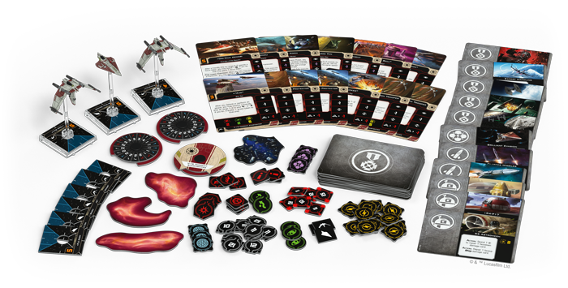

This article was originally published on [https://www.fantasyflightgames.com/en/news/2018/11/9/enter-the-clone-wars/](https://www.fantasyflightgames.com/en/news/2018/11/9/enter-the-clone-wars/)

&laquo; [Back to index](../index.md)

---

9 November 2018

Enter the Clone Wars
====================

Announcing Wave III for X-Wing

_“The shroud of the dark side has fallen. Begun the Clone War has.”_  
   –Yoda, _Star Wars: Attack of the Clones_

Turmoil has engulfed the Galactic Republic. The Separatist Alliance has driven a spike into the heart of the galaxy, splintering the once-unified worlds with chaos, tyranny, and fear. But even in this age of uncertainty and disunion, legendary Jedi Knights band together and fight to preserve the Republic. Soon, you can choose a side and experience a new era of space combat. Fantasy Flight Games is proud to announce a new wave of expansions for _[X-Wing](https://www.fantasyflightgames.com/en/products/x-wing-second-edition/)_!

*   _[Servants of Strike Squadron Pack](https://www.fantasyflightgames.com/en/products/x-wing-second-edition/products/servants-strife-squadron-pack/)_
*   _[Sith Infiltrator Expansion Pack](https://www.fantasyflightgames.com/en/products/x-wing-second-edition/products/sith-infiltrator-expansion-pack/)_
*   [Vulture-class Droid Fighter Expansion Pack](https://www.fantasyflightgames.com/en/products/x-wing-second-edition/products/vulture-class-droid-fighter-expansion/)
*   _[Guardians of the Republic Squadron Pack](https://www.fantasyflightgames.com/en/products/x-wing-second-edition/products/guardians-republic-squadron-pack/)_
*   _[ARC-170 Starfighter Expansion Pack](https://www.fantasyflightgames.com/en/products/x-wing-second-edition/products/arc-170-starfighter-expansion-pack/)_
*   [Delta-7 Aethersprite Expansion Pack](https://www.fantasyflightgames.com/en/products/x-wing-second-edition/products/delta-7-aethersprite-expansion/)
*   _[Separatist Alliance Maneuver Dial Upgrade Kit](https://www.fantasyflightgames.com/en/products/x-wing-second-edition/products/separatist-alliance-maneuver-dial-upgrade-kit/)_
*   _[Galactic Republic Maneuver Dial Upgrade Kit](https://www.fantasyflightgames.com/en/products/x-wing-second-edition/products/galactic-republic-maneuver-dial-upgrade-kit/)_
*   _[Z-95-AF4 Headhunter Expansion Pack](https://www.fantasyflightgames.com/en/products/x-wing-second-edition/products/z-95-af4-headhunter-expansion-pack/)_
*   _[TIE/sk Striker Expansion Pack](https://www.fantasyflightgames.com/en/products/x-wing-second-edition/products/tiesk-striker-expansion-pack/)_

These expansions give you the chance to enter this spreading conflict and command endless legions of droid fighters or valiantly lead powerful Jedi Knights and dedicated clone pilots into battle. As you do, you’ll experience new twists to the _X-Wing_ formula, outfit your ships with new upgrades, and immerse yourself in the Clone Wars like never before. In addition to introducing the Galactic Republic and Separatist Alliance as brand-new factions to _X-Wing_, this wave also brings the opportunity to round out your Scum and Villainy and Galactic Empire squadrons with updated versions of two classic starfighters.

Read on for a look into what each of these expansions brings to your games of _X-Wing_!

Servants of Strife Squadron Pack
--------------------------------

The corporate entities that form the bulk of the Separatist Alliance have untold resources at their disposal. As the Clone Wars escalate, then, it is only natural that they throw this weight into developing advanced starfighter technology that can help them put the Republic on the defensive. The result of this research is a unique blend of cheap but deadly droid starfighters and heavily armed ships controlled by "more traditional" organic pilots.

Both of these design philosophies are represented in the _Servants of Strife Squadron Pack_. Within this expansion, you’ll find both a heavily armed Belbullab-22 starfighter and two _Vulture_\-class droid fighters (painted in General Grievous's colors) to begin building your Separatist Alliance squadrons. Accompanying these ships is a full suite of 48 upgrade cards that reflect the Separatists’ emphasis on groups of networked droid fighters working as one. For example, adding a Tactical Relay upgrade such as [Kraken](swz29_kraken.png) to your squadron gives your droids even more power to make use of their calculate tokens. This massive array of upgrade cards, including reprints of many common neutral upgrade cards, also means that _Servants of Strife_ can be combined with the _X-Wing Core Set_ to make the perfect start, especially if you're just getting into the game and want to start flying with the Separatists.

We’ll take a look at everything included in the _Servants of Strife Squadron Pack_, including all the Seperatist-exclusive upgrade cards, in a future preview!

Sith Infiltrator Expansion
--------------------------

The Sith operate in the shadows. As they unfold their dark machinations across the galaxy, they need a ship that matches their nefarious purposes. Casting a menacing shadow as it cuts across the skies, the Sith Infiltrator is the perfect choice to carry the agents of Darth Sidious on their dark missions across the galaxy.

With the _Sith Infiltrator Expansion Pack_, you can use the experimental cloaking device, devastating firepower, and advanced systems of one of these ships to deliver vicious surgical strikes before vanishing into the void. In addition to the finely detailed and fully painted Sith Infiltrator miniature, you’ll find a collection of five ship cards, including [Darth Maul](swz30_darth-maul.png) himself, twenty upgrade cards that help you fully utilize the ship’s systems, and all the tokens and maneuver dials you need to launch your own secret missions.

We’ll look at everything included in the _Sith Infiltrator Expansion Pack_, including all of its pilots, in a future preview!

_Vulture_\-class Droid Fighter Expansion
----------------------------------------

The Separatist Navy may contain many capable organic pilots, but the vast majority is made up of _Vulture_\-class droid fighters. These starfighters form the backbone of the Separatist forces and are emblematic of its strategy: weak in isolation, but overwhelming in numbers. A sufficiently vast swarm of networked attackers form a cunning, sinister intelligence that can defeat even wise and powerful Jedi pilots.

The Vulture_\-class Droid Fighter Expansion Pack_ contains everything you need to begin building your own squadron of linked droid starfighters—most importantly, a beautifully pre-painted _Vulture_\-class droid fighter miniature. Each of the five droid pilots included in this pack can contribute to your Separatist swarm in their own way, but they become even more deadly when using their careful calculations to launch [Energy-Shell Charges](swz31_energy-shell-charges.png) at enemy ships.

We’ll take a glimpse at everything included in the Vulture_\-class Droid Fighter Expansion Pack_, including all the ways these ships can use calculate tokens, in a future preview!

Guardians of the Republic Squadron Pack
---------------------------------------

Leading the fight against the Separatist war machine are none other than the Jedi Knights. They enter the fight at the controls of the Delta-7 _Aethersprite_, a starfighter that allows them to use their Force-enhanced reflexes to the fullest. Behind them, clone pilots take to the skies in V-19 Torrents, covering their Jedi Generals with coordinated fire, tight formation flying, and salvos of missiles.

With the Jedi taking the lead, the _Guardians of the Republic Squadron Pack_ gives you the chance to further explore the potential of the Force in your _X-Wing_ squadrons. In addition to  one Delta-7 _Aethersprite_ (painted in Obi-Wan Kenobi's colors) and two V-19 Torrent Starfighter miniatures, this expansion contains new Force upgrade cards that unlock even more potential in your Force-sensitive pilots. For example, they could exhibit [Brilliant Evasion](swz34_brilliant-evasion.png) to escape a seemingly impossible situation unscathed. And of course, like _Servants of Strife_, the _Guardians of the Republic Squadron Pack_ makes the perfect introduction to the game with a wealth of upgrade cards, including reprints of many common neutral upgrade cards. If you're interested in starting to fly alongside the Galactic Republic, this squadron pack is the perfect second purchase after your _X-Wing Core Set_!

We’ll take a look at everything included in the _Guardians of the Republic Squadron Pack_, including all the upgrade cards, in a future preview!

ARC-170 Starfighter Expansion 
------------------------------

Starfighters piloted by powerful Jedi are certainly a boon to the Republic, but the lightly armed Delta-7 _Aethersprite_ is still a delicate starfighter that can’t handle the brunt of enemy fire. The ARC-170 starfighter, on the other hand, can smash through foes that might repel the Republic’s more lightly armed ships. Equipped with torpedoes and a rear gunner, even the most intelligent Separatist droids will find it difficult to approach this intimidating craft.

With the _ARC-170 Starfighter Expansion Pack_, you can bring a single ARC-170 starfighter to your _X-Wing_ battles. Primed for battle, clone pilots like ["Sinker"](swz33_sinker.png) are ready to do whatever it takes to support their squadron, whether that means defending the flanks of a formation or giving support to a Jedi General.

We’ll take a look inside the _ARC-170 Starfighter Expansion Pack_, including all the ship cards, in a future preview!

Delta-7 _Aethersprite_ Expansion
--------------------------------

Jedi Knights travel far across the galaxy in their mission to uphold justice. Rather than cross the gulfs between the stars and their destination in any ship, they choose one specifically designed to augment their considerable abilities. Equipped with an astromech for navigation, the Delta-7 _Aethersprite_ is lightly armed but highly maneuverable, its fine-tuned controls allowing a Force-sensitive pilot to fly it with unmatched precision.

With five ship cards—including four unique pilots—the _Delta-7_ Aethersprite _Expansion Pack_ adds even more Jedi for you to include in your Galactic Republic squadrons, including the legendary Anakin Skywalker. Though the Delta-7 is specifically designed to work with its pilot’s enhanced reflexes, any Jedi would still welcome the aid of the [Calibrated Laser Targeting](swz34_calibrated-laser-targeting.png) modification to add even more damage potential to their primary attacks. Furthermore, the miniature included in this expansion features an alternate paint scheme to the ships included in the _Guardians of the Republic Squadron Pack_, here evoking the starfighter flown by none other than Anakin Skywalker.

We’ll take a look at everything included in the _Delta-7_ Aethersprite _Expansion Pack_, including all of its upgrade cards, in a future preview!

Upgraded Controls
-----------------

When these expansion are released in the first quarter of 2019, the Galactic Republic and Separatist Alliance will enter _X-Wing_ as distinct factions with their own options for building your own unique squadrons. You can further indicate the uniqueness of your squadron with the _Galactic Republic Maneuver Dial Upgrade Kit_ and the _Separatist Alliance Maneuver Dial Upgrade Kit_.

During every game of _X-Wing_, you will secretly select the maneuvers for your ships on cardboard maneuver dials. In each of these maneuver dial upgrade kits, you’ll find three plastic protectors that enclose these maneuver dials in a secure housing, enhancing the aesthetics of your squadron and declaring your allegiance to the Republic or your independence from it. Not only does every dial clearly indicate the faction of your choice, they also include a space on the back to insert one of the dial ID tokens included in these expansions. Each dial ID token displays the silhouette of the corresponding ship, making it even easier to differentiate between your ships.

Z-95-AF4 Headhunter Expansion
-----------------------------

Widely produced across the galaxy, the reliable, easy-to-acquire Z-95-AF4 Headhunter has become integral to numerous criminal cartel fleets—from large operations like Black Sun to small-time raiders like the Binayre Pirates. When outfitted with missiles and other illicit technologies, a single Z-95-AF4 can be a danger, but a swarm can be devastating to anyone unprepared to face it.

Now, you have the chance to continue growing your Scum and Villainy squadrons. The _Z-95-AF4 Headhunter Expansion Pack_ includes everything you need to add one Z-95-AF4 Headhunter ship to your squadron, including a miniature with a stunning new paint scheme, four ship cards, five upgrade cards, and a handful of tokens. All the ship and upgrade cards included in this expansion pack are also included in the _Scum and Villainy Conversion Kit_!

TIE/sk Striker Expansion
------------------------

Screaming through the atmosphere on nimble ailerons, the TIE/sk striker is a unique starfighter designed to excel at both air and space assaults. Its atmospheric capabilities give it unique and flexible movement patterns that can surprise even veteran opponents, as its heavy firepower lets it wear down nearly any foe.

With the _TIE/sk Striker Expansion Pack_, you have a new option for rounding out your Imperial squadrons. In addition to the fully assembled, pre-painted TIE/sk striker miniature, five pilots stand ready to swoop into battle and protect the Empire, while five upgrade cards give you the chance to further customize your squadron. In addition to this expansion pack, the ship and upgrade cards in this expansion can also be found in the _Galactic Empire Conversion Kit._

The War Has Begun
-----------------

The battles of _X-Wing_ are entering a new era of the _Star Wars_ saga as the Separatist Alliance threatens the sovereignty of the Galactic Republic. With these expansions, you have everything you need to launch your squadrons into the Clone Wars.

