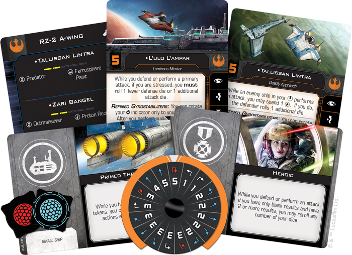

This article was originally published on [https://www.fantasyflightgames.com/en/news/2018/11/12/deadly-speed/](https://www.fantasyflightgames.com/en/news/2018/11/12/deadly-speed/)

&laquo; [Back to index](../index.md)

---

12 November 2018

Deadly Speed
============

Preview the RZ-2 A-Wing Expansion Pack for X-Wing

_“It’s not every day we get a shot at a dreadnought, so let’s make it count.”_  
   –Tallissan Lintra, _Star Wars: The Last Jedi_

The T-70 X-wing is certainly a versatile starfighter, but it can’t do everything. When the Resistance needs a surgical strike against a sensitive First Order target or a lightning-fast raid, they turn to a fighter that can match—and even surpass—the incredible speed of the TIE fighters they regularly face. Soon, you’ll be able to launch your own attacks in the battles of [_X-Wing_™](https://www.fantasyflightgames.com/en/products/x-wing-second-edition/) with the RZ-2 A-wing.

The successor to a starfighter that distinguished itself during the Battle of Endor, the RZ-2 A-wing incorporates many field-tested refinements into its design, maintaining the incredible speed of its predecessor while also featuring several significant improvements over previous designs. You can add these advanced starfighters to your Resistance squadrons for the very first time when the _[RZ-2 A-Wing Expansion Pack](https://www.fantasyflightgames.com/en/products/x-wing-second-edition/products/rz-2-wing-expansion-pack/)_ releases alongside two other Resistance expansions in the fourth quarter of 2018.

This expansion contains everything you need to incorporate a single RZ-2 A-wing into your squadron. The beautifully detailed, fully painted miniature can be flown by one of six pilots—including four unique pilots. Additionally, five upgrade cards help you outfit your RZ-2 A-wing to match these pilots’ unique skills and two Quick Build cards give you predefined combinations of pilots and upgrades to get your RZ-2 into the fight right away. As a final touch, a maneuver dial and a collection of tokens ensure that you have everything you need to take on the First Order.

Join us today as we explore just what the next evolution of the A-wing can do!

Refined Precision
-----------------

Despite being a major boon to the Rebellion in the waning days of the Galactic Civil War, the RZ-1 A-wing was not without its problems. Its sensitive controls and high maneuverability posed a significant challenge to inexperienced pilots and caused frequent breakdowns. Decades later, however, years of field-expedient modifications have been standardized in the RZ-2 A-wing’s design, beginning with the ship’s finicky swiveling cannon mounts.

While these mounts would commonly jam in the rear-facing position on the RZ-1, every RZ-2 A-wing features much more reliable Refined Gyrostabilizers that can be rotated between the ship’s front and rear arcs. Doing so can help shake any pursuing craft, of course, but it is not without its risks.

  
_The RZ-2 A-wing's Refined Gyrostabilizers allow it to fire at any pursuing ships from its rear arc!_

The RZ-2’s turret arc can only be rotated after performing an action and doing so will incur stress, forcing you to choose where you wish to fire carefully. A pilot like [Greer Sonnel,](swz22_greer_sonnel.png)  however, is accustomed to the pressures of piloting a blazing fast starfighter. As such, she can rotate her turret arc after fully executing a maneuver, giving her an extraordinary amount of control over where she fires.   

 The Refined Gyrostabilizers are just one of many improvements that make the RZ-2 more friendly to inexperienced pilots, but daring Resistance pilots also see the ship’s improved reliability as a challenge to push the limits of its performance. A veteran of the Galactic Civil War like [L'ulo L'ampar,](swz22_lulo_lampar.png)    for example, has no problem testing the possibilities of the RZ-2. So much so, in fact, that he rolls an additional attack die while he’s stressed.

At the same time, flying on the edge also makes L’ampar an easier target, and as a result, he rolls one fewer defense die while he’s stressed. To reduce the risk of this happening, L’ampar could benefit from the extra maneuverability provided by a set of [Primed Thrusters.](swz19_a1_primed-thrusters.png)  This tech upgrade allows a pilot with two or fewer stress tokens to continue performing barrel rolls and boosts, granting them the flexibility they need to get in the perfect position.

Harnessing the great speed of the RZ-2 can make it difficult to maneuver in the thick of a space battle and most pilots would be content to maintain some distance between them and other ships. [Zari Bangel,](swz22_zari_bangel.png)

On top of its other uses, the speed and maneuverability of the RZ-2 A-wing make it an ideal candidate to escort slower, more cumbersome bombers. A pilot like [Tallissan Lintra](swz22_tallissan_lintra.png) excels in this role, granting defensive bonuses to friendly ships that come under enemy fire. While an enemy ship in her bullseye arc performs an attack, she can spend her charge to allow the defender to roll an additional die.

  
_Tallissan Lintra has the TIE/fo fighter in her bullseye arc, so she spends her charge to let the MG-100 StarFortress roll an extra defense die._

Combining the RZ-2’s speed and agility with her own high initiative, Lintra should have little difficulty getting enemy ships in her bullseye arc and, although it might be tempting to grant herself or another A-wing an incredible four defense dice, it can be more useful to help keep an MG-100 StarFortress around long enough to use all its precious ordnance.

If you're still concerned about the RZ-2 and its two shield and two hull, however, you can always outfit it with [Ferrosphere Paint](swz22_ferrosphere_paint.png) to make it even harder to pin down. Most A-wing pilots are just as good at avoiding enemy bullseye arcs as they are at lining up their own shots, and this Resistance-exclusive tech upgrade forces an enemy ship to gain stress when it locks your ship, so long as you aren't in its bullseye arc.

Take the Challenge
------------------

The RZ-2 A-wing may be a difficult starfighter to fly, but in the hands of the right pilot it can change the course of a battle. 

