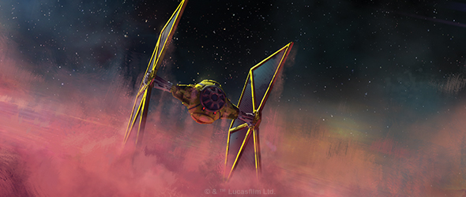
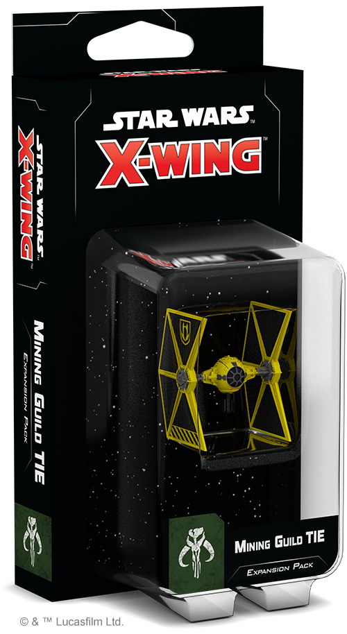
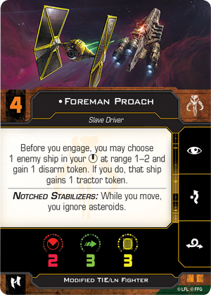
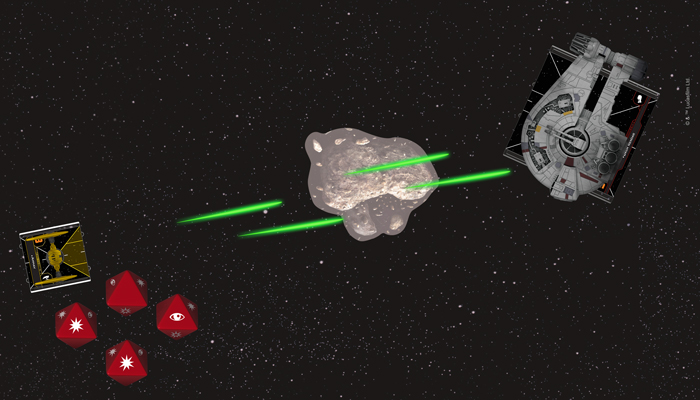

This article was originally published on [https://www.fantasyflightgames.com/en/news/2018/11/27/secure-your-operations/](https://www.fantasyflightgames.com/en/news/2018/11/27/secure-your-operations/)

&laquo; [Back to index](../index.md)

---

27 November 2018

Secure Your Operations
======================

Preview the Mining Guild TIE Expansion Pack for X-Wing

_“TIE fighters, two of ‘em. I need a better angle.”_  
   –Kanan Jarrus, _Star Wars: Rebels_

Allying yourself with the Empire has many benefits. In addition to the copious profits the Mining Guild reaps from working with the Empire to harvest natural resources throughout the galaxy, it also receives its own complement of TIE fighters and other Imperial weaponry. Distinguished by their bold yellow paint scheme, these TIEs further set themselves apart from their Imperial counterparts with a notch cut in their stabilizers to improve visibility.

The result of these modifications is a TIE uniquely suited to meet the Mining Guild’s needs. Hugging tight to asteroids, these TIEs swoop into action whenever the Mining Guild’s operations are threatened. When it's released as part of the second wave of expansions for [_X-Wing_™](https://www.fantasyflightgames.com/en/products/x-wing-second-edition/), you’ll have the chance to add your own Mining Guild TIE to your Scum and Villainy squadrons with the _[Mining Guild TIE Expansion Pack](https://www.fantasyflightgames.com/en/products/x-wing-second-edition/products/mining-guild-tie-expansion-pack/)_.

This expansion contains everything you need to supplement your Scum and Villainy squadrons with one of these nimble fighters. Alongside the beautifully painted Mining Guild TIE miniature featuring the Mining Guild’s distinct paint scheme, you’ll find six ship cards, with four unique pilots ready to protect the Mining Guild’s profits. Your Mining Guild TIE can be further modified with five upgrade cards, while two Quick Build cards provide predefined combinations of pilots and upgrades for you to test all of the ship’s capabilities.

Join us today as we take a closer look at what’s included in the _Mining Guild TIE Expansion Pack_!

Greed Is Good
-------------

With Imperial construction projects advancing at an unprecedented rate, the demand for raw materials such as doonium gas has never been higher. The Mining Guild ruthlessly exploits new deposits of these raw materials on worlds across the galaxy, seeking to secure control of as many as possible.

Such valuable resources are bound to attract the interest of outside parties, of course, so it’s only natural for the Mining Guild to look for ways to protect its investment. A full complement of Mining Guild TIEs is more than enough to give any would-be thieves second thoughts before making a raid on a Mining Guild facility.

Retaining the characteristic speed and maneuverability of other TIE fighters, the Mining Guild variant has one important advantage over other models. Their trademark Notched Stabilizers help them weave in and out of asteroids with ease. As a result, every Mining Guild TIE ignores asteroids while moving, giving them an enormous amount of freedom to make strategic use of these obstacles.   

 With little to fear from asteroids, Mining Guild TIE pilots take a different approach to battle than most others who fly ships with only three hull and no shields. Free from the strict uniformity of the Empire, these pilots are able to express their own personal flavor, incorporating many of the tricks that characterize the Scum faction into their flying style. [Foreman Proach,](swz23_foreman_proach.png)    for example, assigns tractor tokens to enemy ships in his bullseye arc, giving him a chance to fling them into asteroids or other obstacles.

[Captain Seevor](swz23_a1_captain-seevor.png) has a similar knack for disrupting enemy plans. As long as he isn’t in his target's bullseye arc, he can spend his recurring charge to give it a jam token, whether he's defending or performing an attack. This could deprive enemy ships of their green tokens or locks at the perfect moment: just before attack dice are rolled.  

Despite making use of these dirty tricks to throw their opponents off balance, Mining Guild pilots have not forgotten the central tenet of flying TIE fighters: strength comes in numbers. Like other TIE variants, Mining Guild TIEs work well in swarms, with [Overseer Yushyn](swz23_overseer-yushyn.png) highlighting this point. He works especially well with Foreman Proach, replacing Proach's disarm token with a stress token instead, ensuring he can still attack after altering an enemy ship’s course.

In addition to these named pilots, their notched stabilizers make navigating a large group of Mining Guild TIEs a little easier. The Mining Guild’s corporate pilots enjoy more extensive life support systems than Imperial pilots and a [Mining Guild Surveyor](swz23_mining-guild-surveyor.png) to help one of them engage much earlier than they otherwise would.

  
_With his ability and Trick Shot, Ahhav rolls four attack dice during an obstructed attack on the YT-2400!_

Like all TIEs, attacking in a large group can help the Mining Guild TIE overcome the limitations of their two die primary attack. If there’s a single Mining Guild TIE pilot who can fly on their own, however, it’s [Ahhav.](swz23_ahhav.png)  rolling a total of four dice against a medium or large ship that’s obstructed by an obstacle. 

Protect Your Profits
--------------------

The Mining Guild has put its own clever spin on one of the galaxy’s most iconic starfighters, adapting it to operate in some of the most dangerous environments imaginable. Deploy your own group of Mining Guild TIEs and secure your profits!

