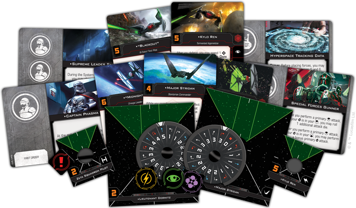
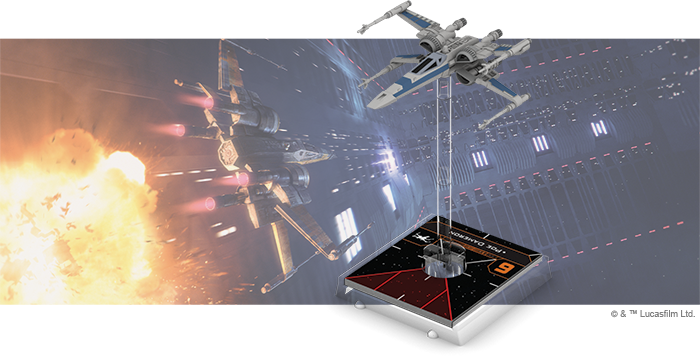

This article was originally published on [https://www.fantasyflightgames.com/en/news/2018/12/13/happy-beeps/](https://www.fantasyflightgames.com/en/news/2018/12/13/happy-beeps/)

&laquo; [Back to index](../index.md)

---

13 December 2018

Happy Beeps
===========

The Resistance and the First Order Arrive in X-Wing

_“Go straight at ’em! Don’t let these thugs scare you!”  
   –_Poe Dameron, _Star Wars: The Force Awakens_

It is a new era of war in the _Star Wars_ galaxy. In the absence of Jedi Master Luke Skywalker, the sinister First Order has risen to challenge the peaceful Republic. Now, the brave Resistance, led by General Leia Organa, is only thing standing between the First Order and a new age of galactic domination. From the cockpits of advanced starfighters, these rival factions renew the conflict for the fate of the galaxy.

[_X-Wing_™](https://www.fantasyflightgames.com/en/products/x-wing-second-edition/) Wave II is available now at your local retailer and online through our webstore! Launch into a new era with six _X-Wing_ products, all releasing today:

*   _[First Order Conversion Kit](https://shop.fantasyflightgames.com/preorders/create/SWZ18/)_
*   _[Resistance Conversion Kit](https://shop.fantasyflightgames.com/preorders/create/SWZ19/)_
*   _[RZ-2 A-Wing Expansion Pack](https://shop.fantasyflightgames.com/preorders/create/SWZ22/)_
*   _[Mining Guild TIE Expansion Pack](https://shop.fantasyflightgames.com/preorders/create/SWZ23/)_
*   _[T-70 X-Wing Expansion Pack](https://shop.fantasyflightgames.com/preorders/create/SWZ25/)_
*   _[TIE/fo Fighter Expansion Pack](https://shop.fantasyflightgames.com/preorders/create/SWZ26/)_

In addition to bringing _X-Wing_ into the intense space combat seen in _The Force Awakens_ and _The Last Jedi_, these expansions bring both the Resistance and the First Order into the game as unique factions for the first time and give you everything you need to begin building squadrons from the ground up.

Conversion Kits for the Resistance and the First Order contain all the ship and upgrade cards, tokens, and maneuver dials that veteran players need to bring their first edition Resistance and First Order miniatures into the game's second edition. Meanwhile, brand-new ships make their way into _X-Wing_, providing even more options for you to put together the squadrons you want to fly.

Read on for more of what awaits you in Wave II of _X-Wing_!

Striking Fear
-------------

The Empire may have been defeated, but that doesn't mean it's gone. Gathering power on the fringes of the galaxy, the remnants of the Empire have reemerged as the First Order, bringing with them advanced versions of many classic Imperial starfighters. With the _First Order Conversion Kit_, you can strike fear into the heart of the Resistance as you bring your squadrons into the new edition of _X-Wing_.

Within this kit, you’ll find the components necessary to bring your collection of TIE/fo Fighter, Special Forces TIE, TIE Silencer, and _Upsilon_\-class Shuttle miniatures into the second edition, including a number of faction-specific upgrade cards. In [our preview](https://www.fantasyflightgames.com/en/news/2018/10/8/a-new-order/), we took a look at how these cards establish the First Order as an aggressive faction eager to overwhelm their opponents with a quick first strike. We also broke down a sample list showcasing some of the First Order’s best pilots and the ways they can harness their ship’s unique technology to wreak havoc in battle!

You can begin building your own First Order squadrons today using the _X-Wing_ squad builder. Click here to access the web interface, or log onto the mobile app versions on iOS and Android!

A New Generation of Terror
--------------------------

A new era of space combat requires a new breed of starfighter. Using technologies pioneered for the Empire’s TIE Advanced program, Sienar-Jaemus Fleet Systems has created a TIE fighter that fits modern standards. Sporting a number of improvements over its predecessor, including deflector shields and the ability to acquire locks, the TIE/fo fighter redefines terror for a new generation.

These extensive upgrades make the TIE/fo ideal for both flying in swarms and supporting squadrons on their own. Whatever role you choose for it, you’ll find that the TIE/fo has more potential to deal damage than ever before. Between the ability of pilots like [“Scorch”](swz26_a1_scorch.png)  a single TIE/fo can be a force to be reckoned with.

Within the _TIE/fo Fighter Expansion Pack_, you’ll find everything you need to add one of these vicious starfighters to your First Order squadrons, including a beautifully painted TIE/fo miniature, twelve ship cards, five upgrade cards, four Quick Build cards, a maneuver dial, and a handful of tokens. For a full look at the pilots included in this expansion, click [here](https://www.fantasyflightgames.com/en/news/2018/11/7/advanced-terror/)!

Rekindle Hope
-------------

With the backing of the Republic, the Resistance is prepared to oppose tyranny in all its forms. In their burgeoning conflict with the First Order, however, the Resistance increasingly finds itself on the defensive, desperately in need of whatever ships and pilots will rally to its cause. Fortunately, the _Resistance Conversion Kit_ has arrived to bolster their ranks.

This kit contains everything you need to bring your collection of T-70 X-wing, Resistance Bomber, and YT-1300 miniatures from the first edition of _X-Wing_ into the second edition and begin building your own Resistance squadrons. In [our preview](https://www.fantasyflightgames.com/en/news/2018/10/3/continuing-the-fight/) of the Resistance-exclusive upgrade cards, we highlighted the incredible synergy displayed by many of the characters in this faction. When brought together, crew members like [Finn](swz19_a2_finn-gunner.png) launch powerful attacks and stay out of harm’s way at an unprecedented level.

You can start building your own Resistance squadrons today using the _X-Wing_ squad builder!

Speed Redefined
---------------

The main interceptor of the Resistance, the RZ-2 A-wing by Kuat Systems Engineering is the natural evolution of its predecessor. With field-tested refinements integrated into its design such as incredible maneuverability, reversible laser cannons, and precision ordnance, mastering this craft is a challenge worthy of the greatest aces.

The RZ-2 A-wing boasts one of the most flexible maneuver dials in the game and its pilots take advantage of this in a variety of ways. [Tallissan Lintra,](swz22_tallissan_lintra.png)

Th _RZ-2 A-Wing Expansion Pack_ contains everything you need to incorporate a single RZ-2 A-wing into your squadron. The beautifully detailed, fully painted miniature can be flown by one of six pilots—including four unique pilots. Additionally, five upgrade cards help you outfit your RZ-2 A-wing to match these pilots’ unique skills and two Quick Build cards give you predefined combinations of pilots and upgrades to get your RZ-2 in the fight right away. For a full look at everything included in this expansion, click [here](https://www.fantasyflightgames.com/en/news/2018/11/12/deadly-speed/)!

An Updated Icon
---------------

With the First Order flying an updated version of classic Imperial TIE fighter, it’s only appropriate that the Resistance counter this threat with a new version of the Rebel Alliance’s iconic starfighter. Improving on the tactical flexibility of the T-65, the T-70 X-wing is truly a next generation starfighter.

Like its predecessor, this new X-wing features a set of [Integrated S-foils](swz25_s-foils-closed_a1.png) that open up even more tactical options in the heat of battle. But the T-70’s built-in Weapon Hardpoint truly sets it apart from earlier models, allowing the ship to equip an array of weaponry to suit the individual tastes of every pilot.

In our [preview](https://www.fantasyflightgames.com/en/news/2018/10/24/a-new-classic/), we took a look at many of the pilots taking the controls of the T-70 for the first time, including [Kare Kun](swz25_kare_a1.png)  In addition to the pilots, you’ll also find six upgrade cards in this expansion as well as four Quick Build cards that offer suggested combinations of pilots and upgrades to get your T-70 into the fight right away.

Protecting Profits
------------------

The Empire’s demand for raw materials has never been higher and no one is in a better position to provide them than the Mining Guild. This already lucrative collaboration gives the Mining Guild access to state-of-the-art Sienar Fleet Systems technology, including modified TIE/ln fighters. The removal of two solar panels reduces the craft’s power output in exchange for a much-needed boost to peripheral vision when weaving through treacherous asteroid fields.

In the battles of _X-Wing_, these notched stabilizers provide Mining Guild TIE fighters with one distinct advantage: they ignore obstacles while moving. With little to fear from these obstacles, Mining Guild TIE pilots are free to enhance their attacks by taking as many [Trick Shots](swz23_trick-shot.png) as ever and can perform red maneuvers with less concern for any asteroids in their path.

The _Mining Guild TIE Expansion Pack_ contains everything you need to supplement your Scum and Villainy squadrons with one of these nimble fighters. Alongside the beautifully painted Mining Guild TIE miniature featuring the Mining Guild’s distinct paint scheme, you’ll find six ship cards, with four unique pilots ready to protect the Mining Guild’s profits. Your Mining Guild TIE can be further modified with five upgrade cards, while two Quick Build cards provide predefined combinations of pilots and upgrades for you to test all of the ship’s capabilities. 

For a look at everything included in this expansion, click [here](https://www.fantasyflightgames.com/en/news/3000/1/1/secure-your-operations/)!

The War Has Begun
-----------------

With the release of _X-Wing_ Wave II, you can build squadrons with some of the most advanced starfighters the _Star Wars_ galaxy has ever seen. Gather your forces, launch into battle, and continue the fight!

