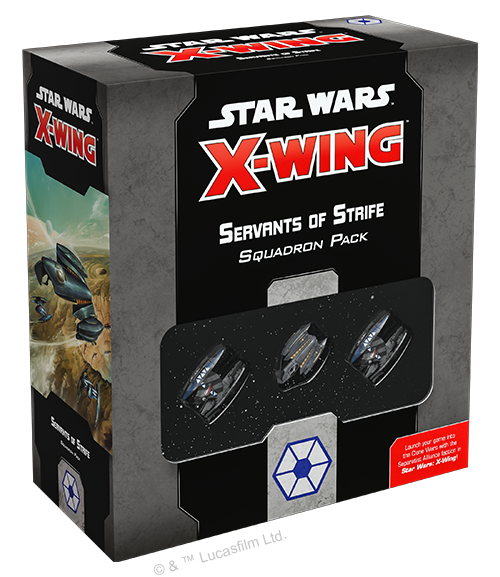

This article was originally published on [https://www.fantasyflightgames.com/en/news/2019/1/8/seize-the-galaxy/](https://www.fantasyflightgames.com/en/news/2019/1/8/seize-the-galaxy/)

&laquo; [Back to index](../index.md)

---

8 January 2019

Seize the Galaxy
================

Preview the Ships of the Servants of Strife Squadron Pack for X-Wing

_“Crush them! Make them suffer!”_  
   –General Grievous, _Star Wars: Revenge of the Sith_

After centuries of peace, war has broken out on an unprecedented scale across the _Star Wars_ galaxy. Backed by powerful megacorporations such as the Trade Federation, the Techno Union, and the Retail Caucus, the Separatist Alliance has fractured the Galactic Republic, rallying thousands of star systems to its cause.

At the heart of this offensive is the dastardly General Grievous, commanding endless legions of droid fighters. Coordinated by cunning tactical droids, these swarms of networked _Vulture_\-class fighters strike at innocent worlds, forcing the Republic onto the defensive. Soon, you'll be able to field your own customized squadrons of Separatist fighters when the _[Servants of Strife Squadron Pack](https://www.fantasyflightgames.com/en/products/x-wing-second-edition/products/servants-strife-squadron-pack/)_ is released along with the rest of [_X-Wing_™](https://www.fantasyflightgames.com/en/products/x-wing-second-edition/) Wave III in the first quarter of 2019.

Combining the incredible power of a Belbullab-22 starfighter with the advanced technology of two _Vulture_\-class droid fighters, this _Squadron Pack_ is the perfect place to begin building your Separatist Alliance squadrons, whether you're a veteran player or you just have a _Core Set_. Both ships offer utterly unique playstyles that help define the Separatists as a faction comfortable fielding large swarms of disposable fighters and heavily-armed ships in equal measure.  

Beyond the individual ships, you’ll find plenty of opportunities to fine-tune your Separatist squadrons in this expansion. In addition to the three starfighter miniatures, the _Servants of Strife Squadron Pack_ also contains fourteen ship cards—five for the Belbullab-22 and nine for the _Vulture_\-class droid fighters—as well as 48 upgrade cards, giving you the freedom to customize your squadrons as you see fit.

Join us today as we take a closer look at these starfighters and their ship cards!

Feed Your Ambition
------------------

While the Separatists’ approach to space combat has largely been defined by large attack groups of cheap droid starfighters, lurking just behind them is a different breed of starfighter altogether. Unlike the more disposable fighters it also built for the Separatists, Feethan Ottraw Scalable Assemblies designed the Belbullab-22 with a solid mix of firepower, durability, and speed, making it the fighter of choice of the Separatist Alliance’s best organic pilots.

 Even though it may not be quite as aggressive as a _Vulture_\-class droid fighter, the Belbullab-22 is still a maneuverable starfighter that gives its pilots a range of options for approaching combat. Critically, in addition to a dial that lets them keep up with the droids they’ll inevitably be leading into battle, a Belbullab-22 can link both a boost or barrel roll action with a focus, opening the perfect window for a powerful attack.  

With these tools at their disposal, the three limited Belbullab-22 pilots included in the _Servants of Strife Squadron Pack_ are free to approach battle in their own way. A pilot like [General Grievous,](swz29_grievous.png)  for example, is always on the offensive, and will most likely use his ship’s ability to barrel roll and boost to avoid enemy firing arcs. Sllipping out of firing arcs not only helps him avoid incoming fire, but also gives him the chance to reroll up to two attack dice!

Not all pilots have the singular focus of General Grievous, however. It’s very likely that Belbullab-22 pilots will be accompanied into battle by their share of droids, and the other pilots are prepared for this eventuality. As Foreman of the Techno Union, [Wat Tambor](swz29_wat-tambor.png) knows the benefits of using droid fighters to keep enemies busy. Tambor himself can launch his own attack while they’re distracted, rerolling one attack die for each calculating friendly ship at Range 1 of the defender.

Operating at such close ranges can be dangerous for an unshielded ship like a _Vulture_\-class droid fighter, but Tambor could just as easily pester his enemies with a [Feethan Ottraw Autopilot](swz29_autopilot.png)  giving you two chances to discard a faceup **_Ship_** damage card throughout the game.

  
_With Captain Sear at Range 0–3 and the Delta-7_ Aethersprite _in its bullseye arc, the_ Vulture-_class droid fighter can spend a calculate token to cancel an evade result!_ 

While most Separatist flight leaders view their droid fighters as expendable assets used to gain a tactical advantage, [Captain Sear](swz29_captain-sear.png)  recognizes the power of superior numbers. While a friendly ship close to Captain Sear makes a primary attack against a ship in its bullseye arc, it can also spend a calculate token to cancel one of the defender’s evades. At the head of a sufficiently large group of droid fighters, Captain Sear can cut through enemy defenses even faster, overwhelming them with pure numbers.

Ruthless Intelligence
---------------------

Both the Republic and the Separatist Alliance have been forced to take drastic measures to keep up in their rapidly escalating conflict. While the Republic turns to legions of clone troopers to pilot its starfighters into battle, the Separatists take a decidedly different approach. Largely eschewing organic pilots, they instead rely on innovative droid starfighter technology to accomplish their objectives.

In addition to avoiding the loss of living pilots, this novel approach to space combat also provides other advantages. Chiefly, _Vulture_\-class droid fighters can perform a wide range of maneuvers that would likely crush organic pilots. Perfectly comfortable pulling off tight turns, these fighters can quickly change direction with a speed-one Koiogran Turn or a speed-two Tallon Roll, making them an unpredictable addition to any Separatist squadron.

The introduction of droid starfighters into _X-Wing_ also brings a new way of thinking about how these ships are controlled. Rather than being at the whims of an individual pilot, the behavior of _Vulture_\-class droid fighters is dictated by programming and sets of protocols. As a result, these droid starfighters bring with them the first limited 2 and 3 ship cards.

  
_Precise Hunter is a limited 3 ship card, so you can include three copies of it in your squadron!_

Thus far in _X-Wing_ we have seen numerous limited 1 cards that prevent players from including more than one card with that name in their squadron. In Wave III, however, some cards are marked with two and three bullets before their name, indicating that a player can include the indicated number of cards in their squadron. For example, a squadron can contain up to three copies of [Precise Hunter,](swz29_precise-hunter.png) can quickly react to an ever-evolving battle, and any squadron with two of them will have even more opportunities to retaliate against enemy attacks—or draw their fire.

No matter what programming you choose for your droid fighters, they operate best as an interconnected unit. Every _Vulture_\-class droid fighter can spend calculate tokens from friendly ships at Range 0–1 to modify their focus results on both attack and defense rolls, making them even more deadly when encountered in large swarms. Some droid fighters, like [DFS-081,](swz29_dfs-081.png)  make this ability even better, inviting nearby ships to spend a calculate token to change all critical damage against them to standard damage. Even a single chain of critical damage could be powerful enough to destroy a droid fighter, so DFS-081 can be a valuable asset in any Separatist squadron.

Finally, _Vulture_\-class droid fighters may lack the cunning of individual organic pilots, but perhaps no other ship is better prepared to deal with asteroids or debris clouds than one of these equipped with a set of [Grappling Struts.](swz29_struts-closed.png) when they overlap an obstacle to quickly change direction or create a useful firing platform.

Down with the Republic
----------------------

The Galactic Republic has been brought to the edge of collapse under the relentless Separatist onslaught. Gather your droid fighters and topple it once and for all.

