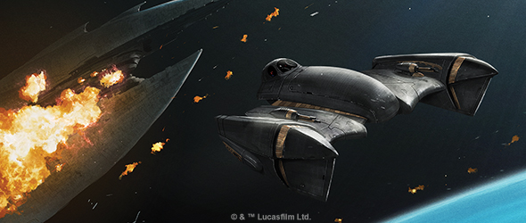
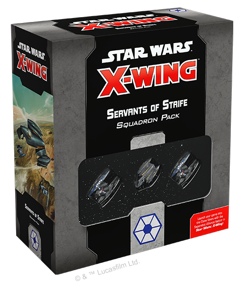
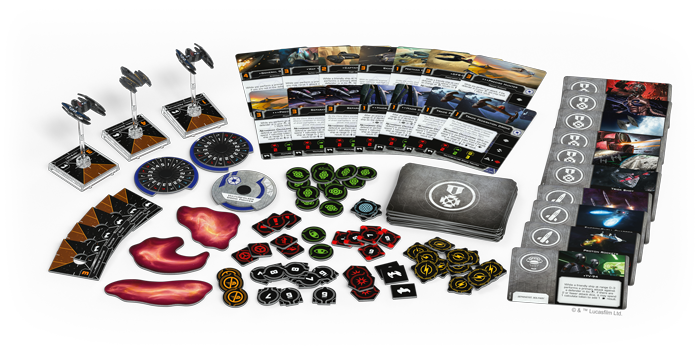
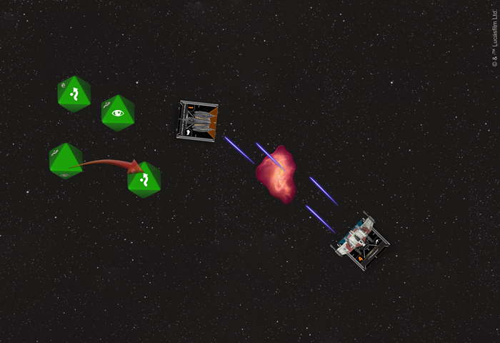
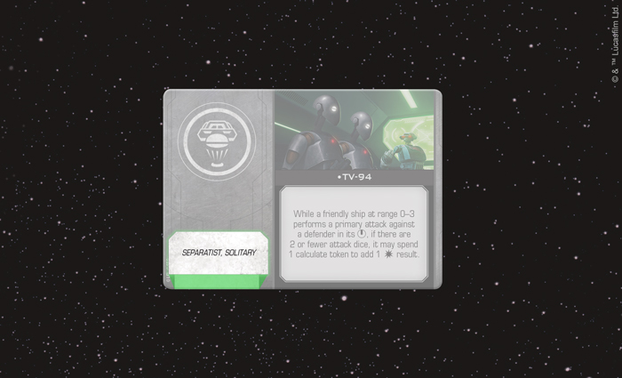
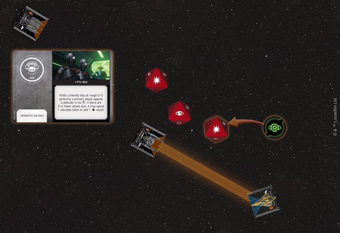

This article was originally published on [https://www.fantasyflightgames.com/en/news/2019/1/18/power-and-profit/](https://www.fantasyflightgames.com/en/news/2019/1/18/power-and-profit/)

&laquo; [Back to index](../index.md)

---

18 January 2019

Power and Profit
================

Preview the Separatist Alliance Upgrade Cards in the Servants of Strife Squadron Pack for X-Wing

_“I am programmed to resist intimidation.”_  
   –Kraken, _Star Wars: The Clone Wars_

Long before the Galactic Empire seized control of the galaxy, the Separatist Alliance also sought to rule through tyranny and fear. Despite their great desire for power, however, the leaders of this faction rarely saw action in the battles that determined the fate of the galaxy. Instead, they fought by proxy, deploying massive groups of battle droids and droid starfighters to fight in their stead.  

As the Separatist Alliance joins the intense space battles of [_X-Wing_™](https://www.fantasyflightgames.com/en/products/x-wing-second-edition/) with the _[Servants of Strife Squadron Pack](https://www.fantasyflightgames.com/en/products/x-wing-second-edition/products/servants-strife-squadron-pack/)_, it should be no surprise that the faction is defined by this same attitude. The Separatist’s organic pilots view their droid starfighters as a means to accomplishing their own ends, often content to support their swarms of _Vulture_\-class droid fighters from the safety of their own Belbullab-22 starfighters.

In addition to these utterly unique starfighters, this _Squadron Pack_ gives you plenty of ways to choose your approach to battle. A full suite of 48 upgrade cards invites you to outfit your Separatist ships with new tools that enhance their abilities and make them even more lethal. While many of these upgrade cards are reprints of common neutral upgrades, _Servants of Strife_ also features brand-new upgrade cards exclusive to the Separatist Alliance that further define it as a faction focused on using droid starfighters like never before.

Join us today as we take a closer look at these upgrade cards and what they bring to the Separatists!

Ruthless Calculations
---------------------

Possessing artificial intelligence that enables them to perform lightning-fast strategic calculations on the fly, droids can make a valuable addition to any squadron as both pilots and crew members. For the Separatist Alliance, however, droid starfighters serve another purpose entirely. While they may be a bit flimsy, _Vulture_\-class droid fighters are also cheap and easy to throw at your opponents in large numbers.

For a faction as [Treacherous](b3694f31edde823194e3b0f9da576a74.png) as the Separatists, having plenty of ships in the fight can be an integral part of their strategy. Every ship with this Talent upgrade can either cancel a regular damage or critical damage while they defend against an obstructed attack. While ideally the obstructing ship belongs to your opponent's squadron, cunning Separatist players could also use their own ships to screen their more valuable pilots from incoming fire.

Understandably, being used as cover isn’t without consequences for any pilots—organic or otherwise. The ship chosen by a pilot with the Treacherous upgrade gains a strain token, making it even more vulnerable to attack—while a strained ship defends, it rolls one fewer defense die. A strain token is removed after a strained ship defends, but it’s far better to remove the token by executing a blue maneuver before being targeted while at an extreme disadvantage.

  
_The V-19 Torrent's attack is obstructed by a gas cloud, so the Feethan Ottraw Autopilot rolls an additional defense die and changes a blank result to an evade!_

In the meantime, a strained ship can gain a measure of safety by hiding behind a gas cloud. These new obstacles introduced in both the _Servants of Strife Squadron Pack_ and the _[Guardians of the Republic Squadron Pack](https://www.fantasyflightgames.com/en/products/x-wing-second-edition/products/guardians-republic-squadron-pack/)_ can be selected instead of the asteroids and debris clouds found in the _Core Set_, and they offer a defensive bonus to any ship that can position a gas cloud between themselves and their attacker. When a gas cloud obstructs an attack, not only does the defender roll one additional defense die, they may also change up to one blank to an evade.

Although most Separatist commanders see the droids fighting for them as expendable, that doesn’t mean these droids can’t have uses other than cannon fodder. As we highlighted in our [earlier preview](https://www.fantasyflightgames.com/en/news/3000/1/1/seize-the-galaxy/), swarms of _Vulture_\-class droid fighters are already capable of performing Networked Calculations to act as a single unit and, with the help of some cunning tactical droids, this ability can be made even more potent.

  
_The_ Servants of Strife Squadron Pack _introduces_ _solitary upgrade cards to_ X-Wing!

On top of strain tokens and gas clouds, the _Servants of Strife Squadron Pack_ also introduces new Tactical Relay upgrades to _X-Wing_, giving you another way to customize your Separatist ships. These devious droids feed battle information directly to the Separatist commanders, helping both them and their _Vulture_ droids alter tactics on the fly. This information is so valuable that each Tactical Relay upgrade is also marked with the "solitary" restriction, limiting its use. During squad building, a player cannot field more than one solitary card of the same upgrade type.

It’s easy to see, for example, the great value a Tactical Relay like [Kraken](359f2752f8cfb7fad58db4511aea1888.png)

  
_The_ Vulture-_class droid fighter has the Delta-7 in its bullseye arc, so it uses TV-94's ability to add damage to its attack!_ 

If you’re looking for other ways to enhance your droids' attacks, there’s no better option than [TV-94.](b635e942be3132d2b1e728d74c43cc94.png)  who can already reroll a blank while attacking a ship in their bullseye arc.    

If there’s one thing that the leaders of the Separatist Alliance desire more than power, it’s their own survival. This is most clearly articulated by General Grievous’s personal starfighter, the _[_Soulless One_.](8a982740aeb369a8775c15c348de89dc.png) ability particularly well, any Belbullab-22 pilot can benefit from the extra defenses that it offers.

Tenacious Treachery
-------------------

With a fleet of droid fighters at their command, the Separatist Alliance has all the strength it needs to bring the Republic to its knees.

