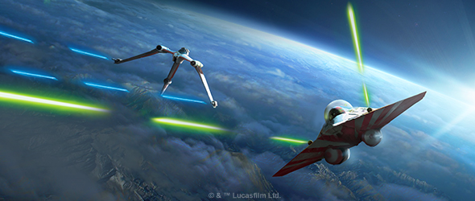
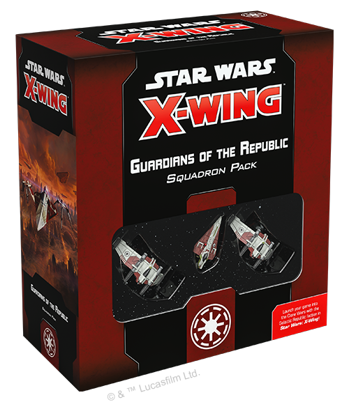
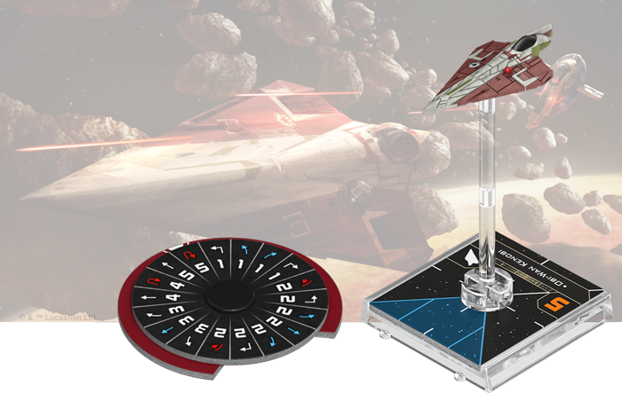
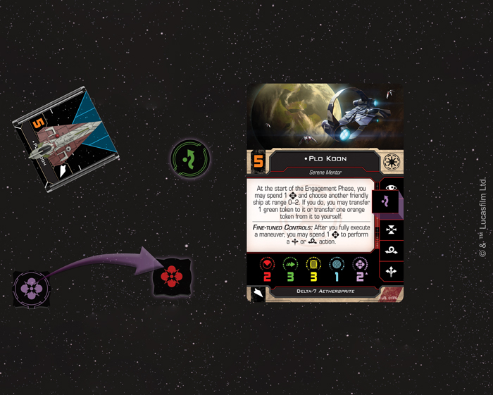
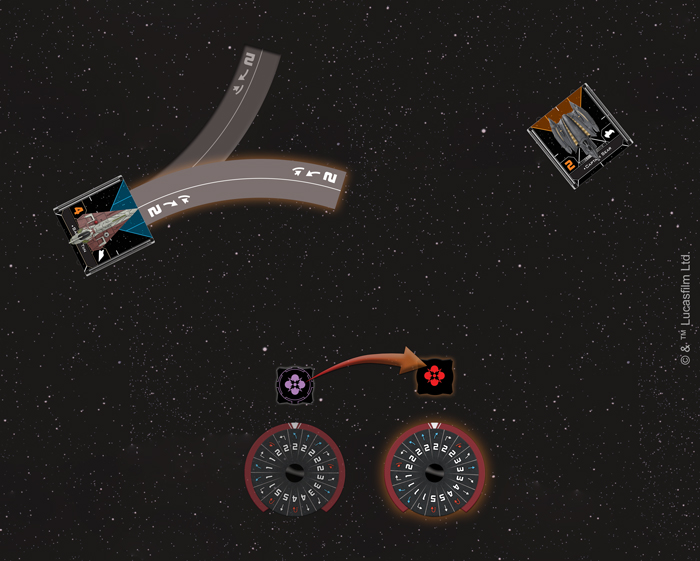
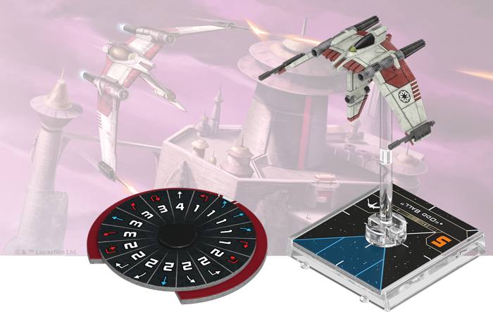
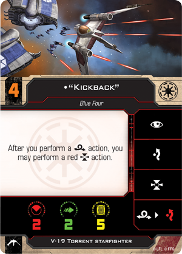
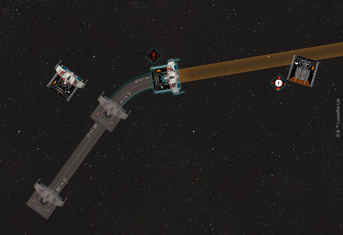

This article was originally published on [https://www.fantasyflightgames.com/en/news/2019/2/4/protecting-peace/](https://www.fantasyflightgames.com/en/news/2019/2/4/protecting-peace/)

&laquo; [Back to index](../index.md)

---

4 February 2019

Protecting Peace
================

Preview the Ships in the Guardians of the Republic Squadron Pack for X-Wing

_“Hello there.”_  
   –Obi-Wan Kenobi, _Star Wars: Revenge of the Sith_

The Galactic Republic is crumbling. Under constant assault from the fledgling Separatist Alliance and the dastardly General Grievous, the once-unified Republic has been splintered by chaos, tyranny, and fear. Despite the turmoil, brave Jedi Knights continue to staunchly support democracy, commanding legions of clone troopers to defend the Republic.

To counter the Separatist’s suffocating swarms of droid starfighters, the Jedi enter battle in the Delta-7 _Aethersprite_, a starfighter specifically designed to use the Jedi's Force-enhanced reflexes to the fullest. Meanwhile, their dedicated clone pilots support them from the controls of nimble V-19 Torrents.

As the ship-to-ship space battles of [_X-Wing_™](https://www.fantasyflightgames.com/en/products/x-wing-second-edition/) enter the Clone Wars for the first time, you’ll soon have the chance to put both of these classic starfighters to the test with the _[Guardians of the Republic Squadron Pack](https://www.fantasyflightgames.com/en/products/x-wing-second-edition/products/guardians-republic-squadron-pack/)_. Featuring two V-19 Torrent miniatures and one Delta-7 _Aethersprite_ miniature, as well as a complete suite of upgrade cards, this _Squadron Pack_ is the perfect place to begin building your Galactic Republic squadrons, no matter if you’re a seasoned _X-Wing_ veteran or you just purchased the _Core Set_ and you're looking to expand.

But before you start outfitting your ships with upgrades, you’ll want to choose who’s flying. Within the _Guardians of the Republic Squadron Pack_, you’ll find an array of ship cards—five for the Delta-7 _Aethersprite_ and nine for the V-19 Torrent—that give you the freedom to build the squadron that fits your strategy. Whether you’re looking to assemble a crack squad of legendary Jedi Knights, put together a motley crew of clone troopers, or a mixture of the two, join us today as examine the pilots included in the _Guardians of the Republic Squadron Pack_!

A Force to Be Reckoned With
---------------------------

From heightened senses and lightning-fast reflexes to precognition, Jedi Knights can display their control over the Force in a wide variety of ways. It is only natural, then, that they bring these skills to their space battles against the Separatists. While the Separatists make extensive use of calculate tokens to enhance their cheap droid fighters, the Galactic Republic’s pilots tap into the Force at an unprecedented level.

Many factions have Force-sensitive pilots, but none have as many as the Galactic Republic and none incorporate the use of the Force into the very design of their starfighters. The Delta-7 _Aethersprite_ can make even an anonymous [Jedi Knight’s](swz32_jedi-knight.png) Force powers more pronounced, allowing them to perform actions that would be impossible for other pilots. Already capable of a wide range of actions, the Delta-7’s Jedi pilots can spend a Force charge to perform a new purple evade action. Better yet, the Delta-7’s Fine-Tuned Controls give them the power to spend a Force charge to perform a boost or barrel roll action after they fully execute a maneuver.

  
_Plo Koon spends a Force charge to perform a purple evade action!_

With these features, it’s easy to see how even a young Jedi Knight can turn the Delta-7 into an effective starfighter. In the hands of a true master, however, the Delta-7 can be flown with unmatched precision, making it a true terror to face in battle. Not only do legendary Jedi Masters like [Obi-Wan Kenobi](swz32_obi-wan-kenobi.png) have larger Force capacities than less-skilled Jedi, they also feature a wide range of abilities that let them put these tokens to good use. In Kenobi’s case, he can spend a Force charge to gain a focus token after a friendly ship nearby—including himself—spends a focus token!

Most Jedi serving as generals lead the Republic forces into battle and look for any way they can to support their troops. A skilled master like [Plo Koon,](swz32_plo-koon.png)  for example, can take a bit of pressure off any novice Jedi or clone pilots that he's flying with by spending a Force charge to transfer a green token from himself to another nearby friendly ship at the beginning of the Engagement Phase. Alternatively, should another friendly pilot find themselves jammed or tractored, Plo Koon can also transfer an orange token from another friendly ship to himself, keeping them up and running.

Rather than maintaining his focus throughout a battle or acting as a mentor to other pilots, [Saesee Tiin](swz32_saesee-tiin.png) instead excels at using the Force to predict where enemy ships are moving. He can spend a Force charge after a friendly ship at Range 0–2 reveals its dial to set that dial to another maneuver of the same speed and difficulty. With the Force as his guide, Saesee Tiin can drastically alter course to get a better position on the enemy and take them by surprise.

  
_After revealing his dial, Saesee Tiin spends a Force charge to set his dial to a bank to the right instead of the left!_

Between these abilities, Force upgrades like [Brilliant Evasion,](swz34_brilliant-evasion.png)  however, this is less of a concern. He recovers a Force charge after fully executing a red maneuver, ensuring that he’ll always have a good supply of charges to spare—so long as he's pushing his ship to the limits.

Although the stress from this ability prevents Windu from performing additional actions, he can still modify his focus results with his Force charges, helping him surprise his opponents with a Koiogran Turn or a sudden Segnor’s Loop. This also makes him an ideal candidate to equip his Delta-7 with the [Calibrated Laser Targeting](swz_clt.png) that adds a focus to his primary attack if the defender is in his bullseye arc.

Brothers in Arms
----------------

Jedi Knights are valuable leaders of any squadron, but they are far too few in number to fight an entire war on behalf of the Republic. Luckily, they don't have to enter the fight against the Separatists alone. Trained to fly their V-19 Torrent’s in conjunction with Jedi, the Republic’s best clone pilots often support famous commanders such as Obi-Wan Kenobi and Plo Koon.

 Even though the V-19 lacks shields, its five hull, combined with its ability to evade incoming attacks, help weather repeated enemy fire and draw attention away from the Jedi. Far from being simple cannon fodder, however, the V-19 can also equip missiles, making it a major threat in its own right. As a result, many of its pilots’ abilities combine staying on the move with acquiring the locks needed to fire these powerful weapons.

Every V-19 pilot has the ability to link a barrel roll and a red evade action, but [“Kickback”](swz32_kickback.png) has a similar knack for lining up his shots and acquiring locks. He likes to stay aggressive, acquiring a lock on a ship in his bullseye arc after executing a red maneuver or performing a red action.

Locks are particularly valuable to high initiative pilots that engage earlier in the phase and other V-19 pilots can give you an even better chance of using your missiles. A pilot like [“Swoop,”](swz32_swoop.png) can give other pilots an even better chance of connecting with their missiles by transferring a green token after defending or performing an attack.

  
_"Odd Ball" is within Range 0–1 of "Swoop" after executing a speed-three maneuver, so he performs a red boost action to get the Belbullab-22 in his bullseye arc and acquire a lock!_

These low initiative pilots may excel at supporting ace Jedi or more skilled clone troopers, but at least one feeds off the strength of his commanders to improve his own performance. [“Tucker”](swz32_tucker.png) has only marginally lower initiative for a cheaper cost. Either way, you'll have the perfect pilots to escort your Jedi into any battle.

Restore Order
-------------

It is a time of uncertainy and disunion. The Republic needs heroes now more than ever. With the pilots in this _Squadron Pack_, you'll have what it takes to preserve the Republic for another thousand generations. 

