This article was originally published on [https://www.fantasyflightgames.com/en/news/2019/2/8/expand-your-operations/](https://www.fantasyflightgames.com/en/news/2019/2/8/expand-your-operations/)

&laquo; [Back to index](../index.md)

---

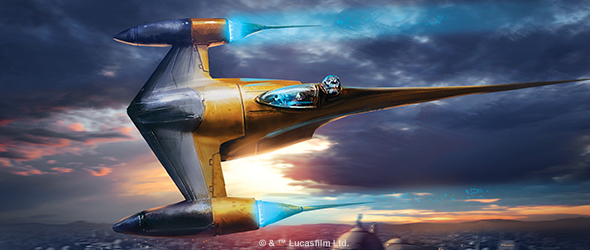

8 February 2019

Expand Your Operations
======================

Announcing Wave IV for X-Wing

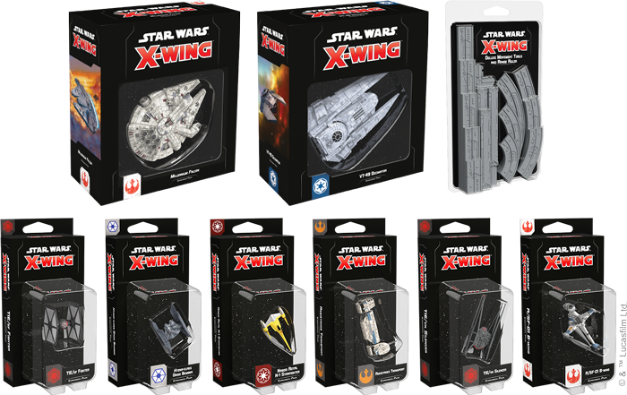

_“Always remember: your focus determines your reality.”_  
   –Qui-Gon Jinn, _Star Wars: The Phantom Menace_

From the Clone Wars to the conflict between the Resistance and the First Order, the space battles of [_X-Wing_™](https://www.fantasyflightgames.com/en/products/x-wing-second-edition/) now encompass every era of the _Star Wars_ saga. Whether you're flying for the Separatist Alliance or the Galactic Empire, the tides of all these conflicts could turn on the actions of single starfighter pilot. Now, new fighters are on the way to bolster the squadrons of those caught up in these monumental clashes.

Fantasy Flight Games is proud to announce a new wave of nine expansions for _X-Wing_!

*   _[Naboo Royal N-1 Starfighter Expansion Pack](https://www.fantasyflightgames.com/en/products/x-wing-second-edition/products/naboo-royal-n-1-starfighter-expansion-pack/)_
*   [Hyena_\-class Droid Bomber Expansion Pack_](https://www.fantasyflightgames.com/en/products/x-wing-second-edition/products/hyena-class-droid-bomber-expansion-pack/)
*   _[Resistance Transport Expansion Pack](https://www.fantasyflightgames.com/en/products/x-wing-second-edition/products/resistance-transport-expansion-pack/)_
*   _[TIE/vn Silencer Expansion Pack](https://www.fantasyflightgames.com/en/products/x-wing-second-edition/products/tievn-silencer-expansion-pack/)_
*   [Millennium Falcon _Expansion Pack_](https://www.fantasyflightgames.com/en/products/x-wing-second-edition/products/x-wing-second-edition-millennium-falcon-expansion-pack/)
*   _[A/SF-01 B-Wing Expansion Pack](https://www.fantasyflightgames.com/en/products/x-wing-second-edition/products/sf-01-b-wing-expansion-pack/)_
*   _[VT-49 Decimator Expansion Pack](https://www.fantasyflightgames.com/en/products/x-wing-second-edition/products/vt-49-expansion-pack/)_
*   _[TIE/sf Fighter Expansion Pack](https://www.fantasyflightgames.com/en/products/x-wing-second-edition/products/tiesf-fighter-expansion-pack/)_
*   _[Deluxe Movement Tools and Range Ruler](https://www.fantasyflightgames.com/en/products/x-wing-second-edition/products/deluxe-movement-tools-and-range-ruler/)_

Placing an emphasis on heavily-armed starfighters, this wave shakes up the established strategies for each of the included factions, giving you more options than ever for producing explosive results. While you pursue new strategies for the Rebel Alliance, Galactic Empire, and First Order with starfighters returning from the game’s first edition, this wave also introduces never-before-seen ships and upgrades for the Galactic Republic, Separatist Alliance, and Resistance, taking your squadrons in bold new directions.

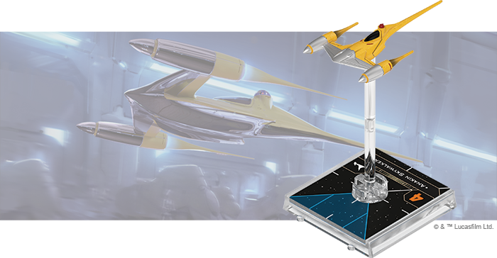

Naboo Royal N-1 Starfighter Expansion
-------------------------------------

Sleek and agile, the Naboo Royal N-1 is well-suited to its role as a diplomatic escort for that planet’s ambassadors. Beneath the gleaming chromium of its elegant spaceframe are advanced Nubian engines further customized by the Theed Palace Engineering Corps, making the N-1 one of the fastest starfighters of its time.

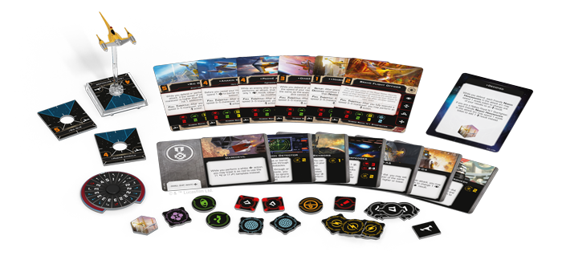

When pressed into combat, N-1 starfighters are known to use this great speed as a defensive strategy—the ship’s Full Throttle ability gives them the option to perform an evade action after fully executing a speed 3–5 maneuver. But the token gained from this action could just as easily be used during an attack if you have [R2-C4](swz40_r2-c4.png) aboard.

In addition to the beautifully detailed and pre-painted Naboo Royal N-1 Starfighter miniature, this expansion contains six ship cards, seven upgrade cards that give you greater control over its prodigious speed, and the tokens and maneuver dial you need to defend Naboo or any other planet. 

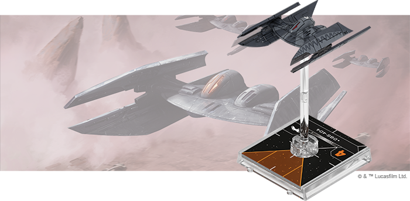

_Hyena_\-Class Droid Bomber Expansion Pack
------------------------------------------

Baktoid Armor Workshop’s _Hyena_\-class droid bomber is a wartime evolution of the Trade Federation’s _Vulture_\-class droid fighter. Carrying an extensive payload of experimental and deadly ordnance provided by the Techno Union, a _Hyena_ is a nasty surprise to any Republic loyalist who dismisses the danger posed by “mere” droids.

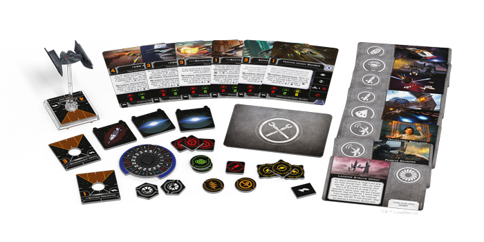

Compatible with the _Vulture_ swarm tactics, _Hyena_\-class bombers add lethal new layers to Separatist squadrons. With access to a variety of deadly devices, missiles, and torpedoes, there’s no telling where a [Bombardment Drone](swz41_hyena-class-bomber.png) will strike next. The Hyena-_class Droid Bomber Expansion Pack_ contains everything you need to supplement your swarm of interlinked droids, including six ship cards and ten upgrade cards.

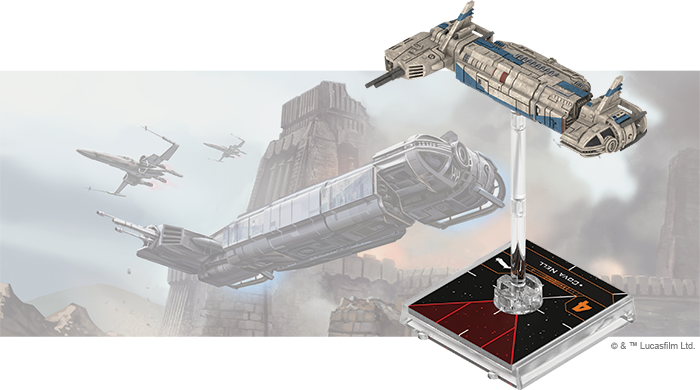

Resistance Transport Expansion Pack
-----------------------------------

Often pressed to put their skills and technical knowledge to good use in the fight against the First Order, many members of the Resistance pull double duty as transport pilots. The Resistance transport is a custom-built shuttle, used by the Resistance as a troop carrier and gunship. What's more, its modular design means the vessel's cockpit pod can be flown independently on missions that don’t require heavy weaponry or transport capacity.

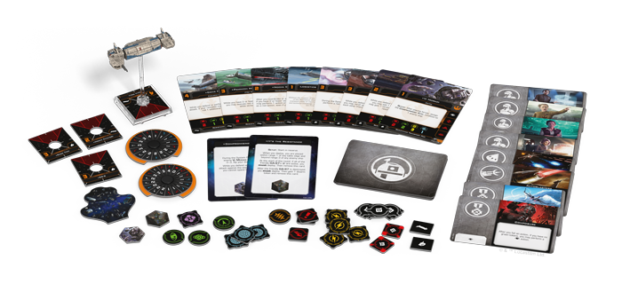

With the _Resistance Transport Expansion Pack_, you can add this versatile ship to your squadrons in one of two forms. As a transport, the ship is perfect for carrying high-ranking Resistance officers into battle to support their more nimble fighters. The Transport Pod, on the other hand, may lack the space for more than one crew member or additional weaponry, but makes up for it with additional agility and a lower cost.

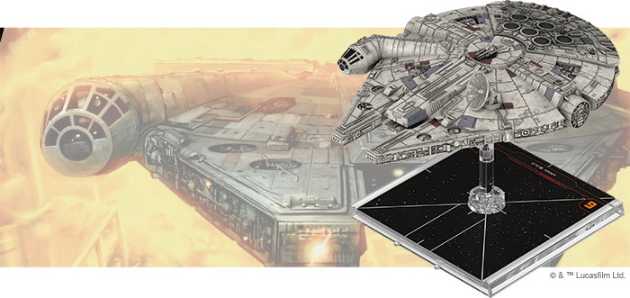

_Millennium Falcon_ Expansion Pack
----------------------------------

One of the most iconic ships in the _Star Wars_ galaxy, the _Millennium Falcon_ may look like a YT-1300 Light Freighter, but Han Solo and Chewbacca’s modifications have turned it into anything but. Now, these scruffy-looking smugglers turn their efforts to defeating the Galactic Empire alongside the heroes of the Rebellion.

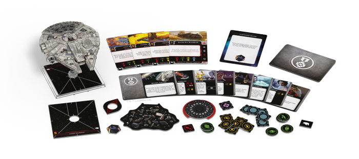

With the Millennium Falcon _Expansion Pack_, you can add a generic YT-1300 Light Freighter to your Rebel Alliance squadrons, or you can choose to pilot the legendary _[Millennium Falcon](swz39_millennium-falcon.png)_ itself. In addition to a Modified YT-1300 Light Freighter ship miniature featuring a blue engine glow, this expansion also contains four YT-1300 ship cards identical to those found in the _[Rebel Alliance Conversion Kit](https://www.fantasyflightgames.com/en/products/x-wing-second-edition/products/rebel-alliance-conversion-kit/)_, two new Quick Build cards, and reprints of fourteen essential upgrade cards that give you the chance to make your own modifications.

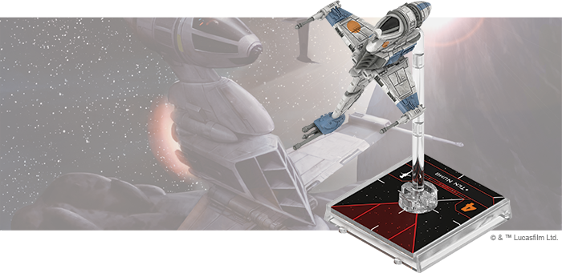

A/SF-01 B-Wing Expansion Pack
-----------------------------

Incorporating a revolutionary gyrostabilization system, the A/SF-01 B-wing is dangerous to fly and difficult to master. In the right hands, however, the B-wing’s formidable weapons can be used to devasting effect, earning it a reputation as the premier assault fighter of the Rebel Alliance.

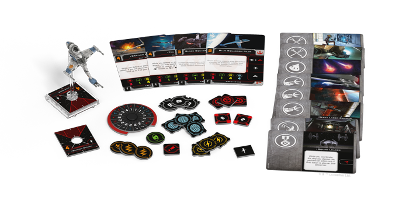

The _A/SF-01 B-Wing Expansion Pack_ contains everything you need to add one of these powerful fighters to your Rebel squadrons, including a fully re-sculpted A/SF-01 B-wing ship miniature—now featuring folding wings, a spinning cockpit, and a body that can rotate on the peg. Additionally, you'll find four ship cards, identical to the A/SF-01 ship cards found in the _Rebel Alliance Conversion Kit_. Finally, you’ll also find reprints of eight upgrade cards and two new Quick Build cards that provide plenty of options for outfitting your B-wing for battle.

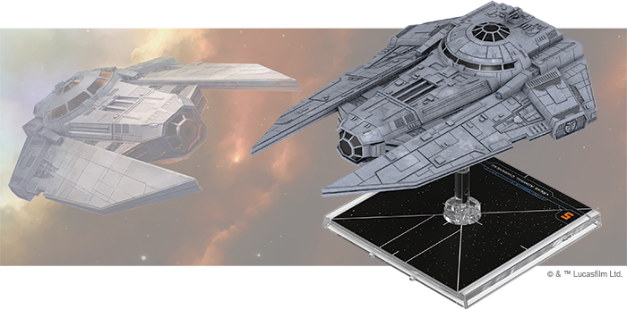

VT-49 Decimator Expansion Pack
------------------------------

A durable vessel capable of independent patrols, the VT-49 Decimator’s size and power blurred the line between shuttle and corvette—but the same qualities that endeared it to up-and-coming Imperial officers also made it useful to agents of the Emperor, under whom failure was not an option.

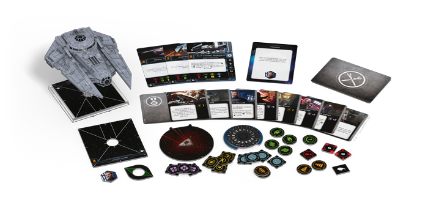

With the _VT-49 Decimator Expansion Pack_, you can bring a single VT-49 Decimator to your Galactic Empire squadrons. Additionally, you’ll also find three ship cards matching the VT-49 Decimator ship cards from the [_Galactic Empire Conversion Kit_](https://www.fantasyflightgames.com/en/products/x-wing-second-edition/products/galactic-empire-conversion-kit/), as well as a selection of thirteen reprinted upgrade cards, giving you the freedom to add vital crew and deadly devices to your ship. Finally, two Quick Build cards let you get your Decimator in the fight right away with predefined combinations of ship and upgrade cards. 

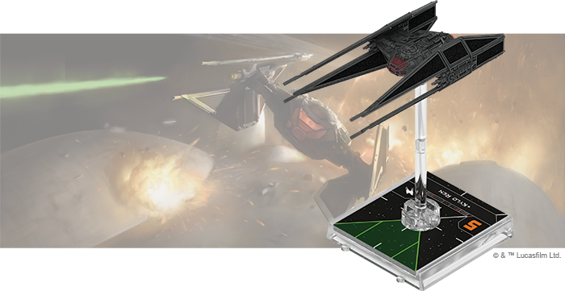

TIE/vn Silencer Expansion Pack
------------------------------

The TIE/vn silencer is the most elite starfighter developed for the First Order by Sienar-Jaemus Fleet Systems. Built in the depths of the Unknown Regions with the technologies that once made the TIE defender an unprecedented threat, this dreaded craft can threaten any Resistance ship—provided the pilot can handle its power and speed.

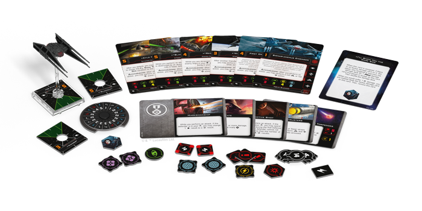

Featuring a beautifully re-sculpted miniature, the _TIE/vn Silencer Expansion Pack_ gives you everything you need to wield one of these high-tech fighters in your First Order squadrons. In addition to six ship cards identical to those found in the _[First Order Conversion Kit](https://www.fantasyflightgames.com/en/products/x-wing-second-edition/products/first-order-conversion-kit/)_, you’ll also find reprints of five upgrade cards tailored to the silencer’s unique capabilities, as well as two Quick Build cards inviting you to jump into action right away.

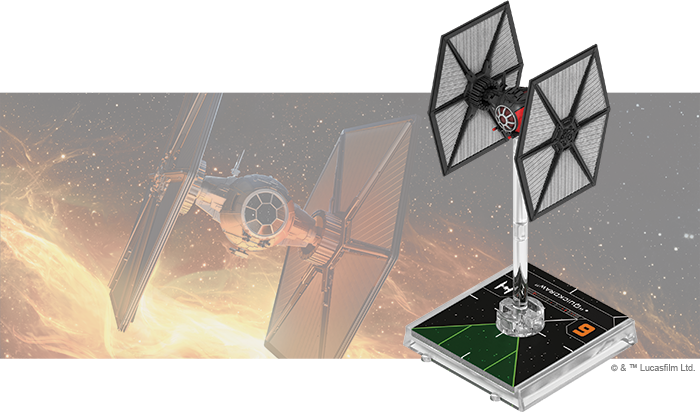

TIE/sf Fighter Expansion Pack
-----------------------------

Development of the TIE/sf fighter required Sienar-Jaemus Fleet Systems to pioneer new energy-cell technology to power the advanced systems demanded by the First Order Special Forces. The resulting starfighter boasts a versatile array of weapons, shields, and sensors, suitable for any situation.

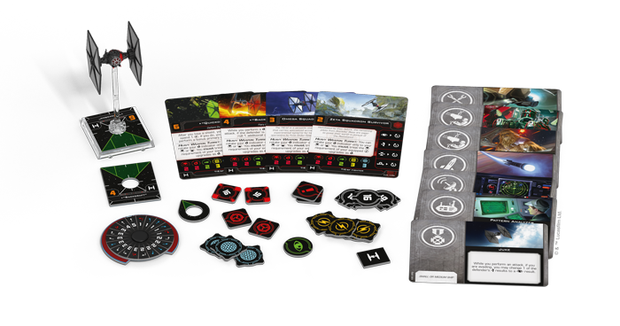

Equipped with a Heavy Weapon Turret that can be rotated between its front and rear arcs, the TIE/sf is a threat from multiple angles. When outfitted with a set of [Afterburners,](swz17_afterburners.png)  it can combine this turret with deadly speed to get in the perfect position to launch an attack. On top of the TIE/sf miniature and Afterburners upgrade card, this expansion also contains four TIE/sf ship cards identical to those in the _First Order Conversion Kit_, seven upgrade cards, and two new Quick Build cards.

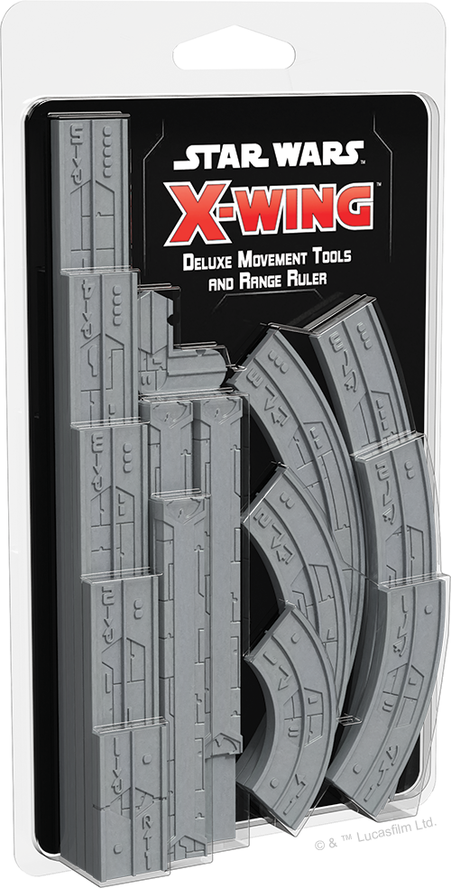

Deluxe Movement Tools and Range Ruler
-------------------------------------

Every game of _X-Wing_ locks you in a tense duel for space superiority, where every move you make could bring you one step closer to victory or push you toward defeat. Every round, you’ll need to carefully plot a course for each of your ships, trying to anticipate enemy movement and bring opposing ships in range to open fire. Now you can upgrade every move you make with the _Deluxe Movement Tools and Range Ruler_.

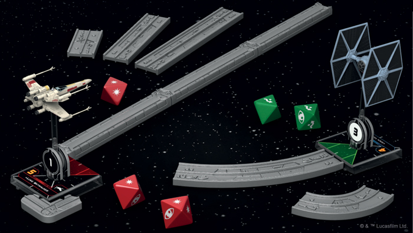

This pack contains premium plastic maneuver templates and a range ruler to upgrade the corresponding components from your _X-Wing Core Set_. In addition to the eleven movement templates, you’ll also find a range ruler base and four range ruler segments that can be used individually or combined to make your measurements quick and precise.

Arms Race
---------

The galaxy’s major powers are gathering their forces. Prepare your squadrons for the battles to come with a new wave of expansions for _X-Wing_! 

