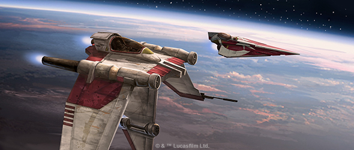
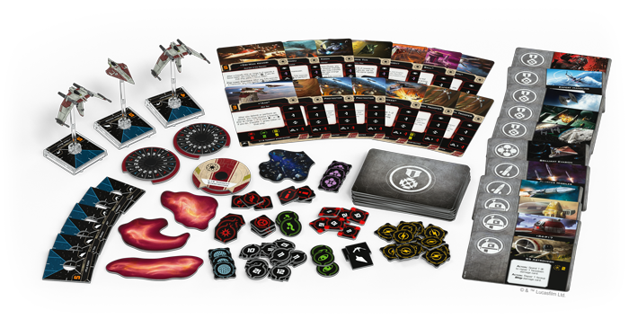
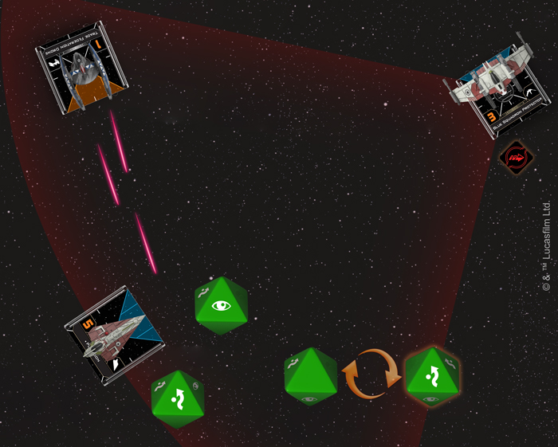
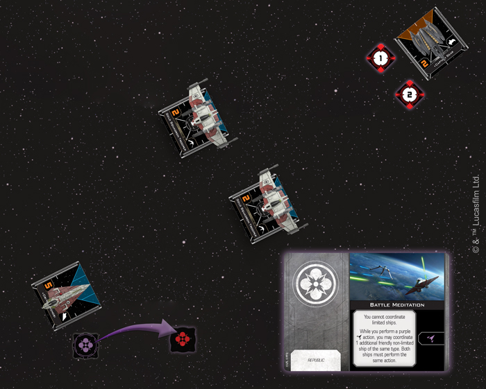
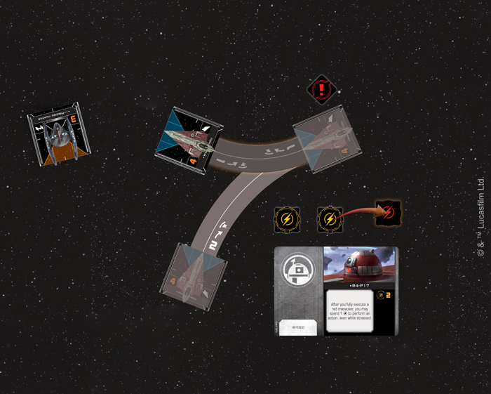

This article was originally published on [https://www.fantasyflightgames.com/en/news/2019/2/11/for-the-republic/](https://www.fantasyflightgames.com/en/news/2019/2/11/for-the-republic/)

&laquo; [Back to index](../index.md)

---

11 February 2019

For the Republic
================

Preview the Upgrades in the Guardians of the Republic Squadron Pack

_“We’re on your tail, General Kenobi.”_  
   –“Odd Ball,” _Star Wars: Revenge of the Sith_

Even with the power of the Force on their side, the Jedi cannot hope to take on the Separatist Alliance’s swarms of interlinked droid starfighters alone. Fortunately, the Galactic Republic has turned to a massive army of clone troopers in this time of crisis to support the Jedi in their efforts to preserve the Republic. Working in unison, Jedi and clone troopers play off each other’s strengths to become a lethal combination capable of bringing down the most dangerous droids.

While every clone trooper may be built from the genetic template of the bounty hunter Jango Fett and all Jedi share a connection to the Force, this does not mean they are all uniform in their approach to combat. In fact, skilled clone pilots can be deployed to the space battles of [_X-Wing_™](https://shop.fantasyflightgames.com/preorders/create/SWZ32/) in any number of ways, while their Jedi commanders tap into a wide range of powers granted by the Force.

With the _[Guardians of the Republic Squadron Pack](https://www.fantasyflightgames.com/en/products/x-wing-second-edition/products/guardians-republic-squadron-pack/)_ set to introduce the Galactic Republic to the game later in the first quarter of 2019, you’ll soon have to opportunity to create your own combination of Jedi generals and dedicated clone troopers. In addition to its fourteen ship cards—five for the Delta-7 _Aethersprite_ and nine for the V-19 Torrent Starfighter—this _Squadron Pack_ also includes 50 upgrade cards, giving you all the tools you need to customize your Galactic Republic squadrons.

On top of providing reprints of many neutral upgrades that you’ll need to fully equip your squadrons, this _Squadron Pack_ also contains several upgrade cards that can be used exclusively by the Galactic Republic and its starfighters. Join us today as we examine how these upgrade cards define the Galactic Republic and its approach to the space combat of _X-Wing_.

Stand Together
--------------

The Separatist Alliance may have the technological edge in the escalating Clone Wars, but no amount of droid starfighters can hope to match the dedication of those who fly for the Galactic Republic. Each battle, the cool calculations of the Separatist’s droids is matched by the Republic pilots’ belief in their common cause and both Jedi and clone pilots work together to defend the Republic from those who would tear it apart.   

Often flying into battle in tight formation, the Republic’s clone troopers remain [Dedicated](swz32_dedicated.png)  to live up to their name, gaining a strain token so that a friendly ship can reroll one of their blank defense results.

  
_With Plo Koon taking fire, the Blue Squadron Protector gains a strain token, allowing Plo Koon to reroll his blank result!_

Better yet, this upgrade supports two distinctly different forms of squad-building. On the one hand, Dedicated pilots can help valuable limited ships stay in the fight for longer. But pilots with the Dedicated upgrade also help each other gain defensive rerolls, giving you the chance to build a large squadron of non-limited ships that can be particularly hard to damage.

Already proficient defensively, a squadron of V-19 Torrents could similarly enhance its offense by equipping a set of [Synchronized Consoles.](swz32_synchronized-console.png)  With one of these modifications, a ship can spend a lock on the defender after performing an attack for a different friendly ship to acquire a lock on the defender. When timed correctly, Synchronized Consoles give clone troopers even more chances to launch a deadly cascade of missiles or punch through just a little more damage.

  
_Obi-Wan Kenobi uses his Battle Meditation ability to coordinate with both Gold Squadron Troopers, letting them acquire locks on Captain Sear!_

Similarly, the Jedi recognize how important each and every ship is to accomplishing their mission. In our [article on the pilots](https://www.fantasyflightgames.com/en/news/3000/1/1/protecting-peace/) included in the _Guardians of the Republic Squadron Pack_, we already discussed how their Delta-7 _Aethersprite_ starfighters have the built-in ability to evade after spending a Force charge. With the [Battle Meditation](swz32_battle-meditation.png) work together to set up a devastating attack run.

When they’re not working alongside clone pilots, the Jedi will likely be using the Delta-7’s high maneuverability to zip around the engagement area and stay one step ahead of their opponents. They can make this even easier by equipping their fighters with some handy astromech droids. With a simple [R4-P Astromech](swz32_r4-p_astromech.png) lets them be even more aggressive and perform actions after fully executing a red maneuver, even while stressed.

  
_Mace Windu executes a Segnor's Loop and then uses R4-P17 to perform a boost and close in on the_ Vulture_\-class droid fighter!_

Using an astromech for navigation has obvious advantages, but these droids can only be relied on for so long, and they won’t help you avoid incoming missiles or torpedoes. To make up for this, a ship can be outfitted with some [Spare Parts Canisters.](swz_spare-part-canisters.png)  These parts could be used to recover a charge on a ship’s astromech or to put some debris between a ship and its pursuers, breaking all locks assigned to it. Either way, this modification can make a crucial difference when used at the right moment.

In fact, some Spare Parts Canisters may be especially useful for Jedi pilots looking for a little more firepower and durability. If they opt for the heavier [Delta-7B](swz_delta-7b.png) configuration, their fighters gain two shields and an increased attack value, making them even more formidable. These enhancements do come at the cost of some maneuverability, though, making a cloud of spare parts an invaluable defensive tool. 

Fight As One
------------

The Jedi Knights and clone troopers protecting the Galactic Republic must band together and work as one if they hope to stand against the insurgent Separatist Alliance. When outfitted with upgrades that enhance their natural abilities, nothing can stand in their way. 

