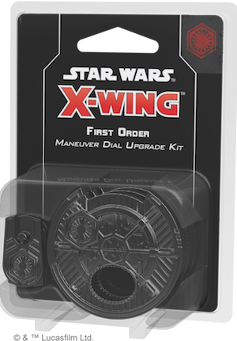
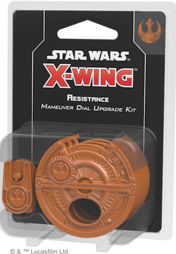

This article was originally published on [https://www.fantasyflightgames.com/en/news/2019/2/14/available-now-february-14/](https://www.fantasyflightgames.com/en/news/2019/2/14/available-now-february-14/)

&laquo; [Back to index](../index.md)

---

14 February 2019

Available Now - February 14
===========================

New FFG Products Are Available Now

_Take a look at the latest products from Fantasy Flight Games, now available at your local retailer or online through our webstore!_ 

* * *

[Children of the Empire](https://www.fantasyflightgames.com/en/products/legend-of-the-five-rings-the-card-game/products/children-empire/) 
--------------------------------------------------------------------------------------------------------------------------------------------------------------------------------------------------------------------------------------------------------------------

Further explore Rokugan with _Children of the Empire_, a new premium expansion for _[Legend of the Five Rings: The Card Game](https://www.fantasyflightgames.com/en/products/legend-of-the-five-rings-the-card-game/)_!

Featuring a total of 234 new cards that celebrates the era of tranquility brought upon Rokugan by the Hantei Dynasty. Every Great Clan gets new tools, with themes of dueling and honor persistent throughout the expansion.

_Children of the Empire_ also provides a snapshot of characters and events in the _Legend of the Five Rings_ story as they are today. Look for cards that represent some of the biggest moments from _Legend of the Five Rings_ fiction, and an updated version of an iconic character whose role in the celestial order has shifted.

* * *

[First Order Maneuver Dial Upgrade Kit](https://www.fantasyflightgames.com/en/products/x-wing-second-edition/products/first-order-maneuver-dial-upgrade-kit/) 
----------------------------------------------------------------------------------------------------------------------------------------------------------------------------------------------------------------------------------------------------------------------------------------

With the First Order poised to usher in a new era of galactic dominance, it's time to display your loyalty. With the _First Order Maneuver Dial Upgrade Kit_, you can move out of the Empire's shadow and further customize your [_X-Wing_™](https://www.fantasyflightgames.com/en/products/x-wing-second-edition/)  squadron.

These upgraded plastic maneuver dials signal your allegiance to the First Order while enhancing the aesthetic look of your squadron. As you secretly plot your maneuvers each round, these kits house a ship’s dial within a secure plastic housing. Additionally, the kits include a space on the back to insert a dial ID token, making it easy to differentiate between your ships in the middle of a game. 

_Pick up your copy of the_ First Order Maneuver Dial Upgrade Kit (_SWZ20) at your local retailer or online through our website [here](https://shop.fantasyflightgames.com/preorders/create/SWZ20/)!_

* * *

[Resistance Maneuver Dial Upgrade Kit](https://www.fantasyflightgames.com/en/products/x-wing-second-edition/products/resistance-maneuver-dial-upgrade-kit/) 
--------------------------------------------------------------------------------------------------------------------------------------------------------------------------------------------------------------------------------------------------------------------------------------

Carry on the spark of the Rebellion and signal your dedication to protect freedom throughout the galaxy with the _Resistance Maneuver Dial Upgrade Kit_!

During every game of _X-Wing_, you and your opponent will secretly plot your ships’ movements on cardboard maneuver dials. The dial upgrade kit contains three plastic protectors that situate a ship’s dial within a secure housing, enhancing the aesthetics of your squadron and proudly displaying the colors of the Resistance. Not only does each dial clearly indicate that you fight for the freedom of the galaxy, they also include a space on the back to insert a dial ID token displaying a silhouette of the corresponding ship, making it easy to differentiate between your ships.

_Pick up your copy of the_ Resistance Maneuver Dial Upgrade Kit _(SWZ21) at your local retailer or online through our website [here](https://shop.fantasyflightgames.com/preorders/create/SWZ21/)!_

