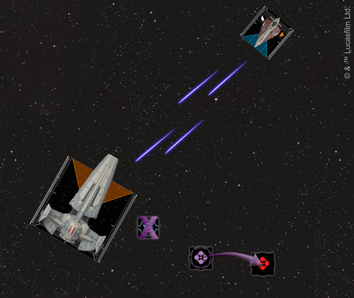
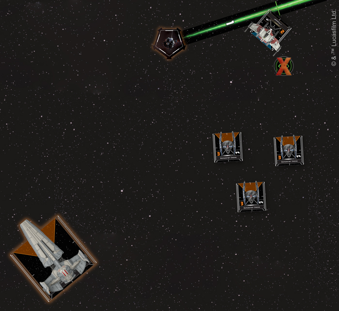

This article was originally published on [https://www.fantasyflightgames.com/en/news/2019/2/25/a-phantom-menace/](https://www.fantasyflightgames.com/en/news/2019/2/25/a-phantom-menace/)

&laquo; [Back to index](../index.md)

---

25 February 2019

A Phantom Menace
================

Preview the Sith Infiltrator Expansion Pack for X-Wing

_“It’s not about the mission, Master; it’s about something… elsewhere. Elusive.”_  
   –Obi-Wan Kenobi, _Star Wars: The Phantom Menace_

Even as deadly swarms of droid starfighters assault the Galactic Republic, nefarious forces are at work in the shadows. The sinister agents of Darth Sidious, the true power behind the Separatist Alliance, slink across the stars, carrying out their master’s will as they strike against the enemies of the Sith and undermine the Jedi Order. Aiding them in their tasks is the Sith Infiltrator, a heavily modified ship perfectly suited to their dark purposes.

Most commonly used in infiltration and assassination missions, the Sith Infiltrator is equally effective in ship-to-ship combat. Equipped with stealth technologies and advanced surveillance devices, the vessel known as the _Scimitar_ was a particularly deadly craft offering its operators some distinct advantages in battle. Soon, you’ll be able to deploy your own Sith Infiltrator to the intense space battles of [_X-Wing_™](https://www.fantasyflightgames.com/en/products/x-wing-second-edition/) with the _[Sith Infiltrator Expansion Pack](https://www.fantasyflightgames.com/en/products/x-wing-second-edition/products/sith-infiltrator-expansion-pack/)_.

Releasing alongside the rest of Wave III, this expansion injects some underhanded tactics to your Separatist Alliance squadrons. In addition to being able to choose from four pilots to fly your Sith Infiltrator into battle, you can also outfit it with 20 upgrade cards, including several upgrades exclusive to the Separatist Alliance and the Sith Infiltrator.

Join us today as we take a look at everything this sinister fighter can add to your Separatist squadrons!

Dark Machinations
-----------------

The Separatist Alliance is straightforward in its approach to overcoming obstacles in its path. Typically, the Separatists simply throw _Vulture_\-class droid fighters at a problem until it’s solved. In sensitive situations where more discretion is involved, however, a ship like the Sith Infiltrator becomes invaluable.

Since these ships were often piloted by the acolytes of Darth Sidious, it’s only natural that the ships are attuned to those with Force abilities. The legendary Sith assassin [Darth Maul](swz30_darth-maul.png) for his enemies to recover his charges even faster.

Darth Maul is clearly a pilot that prefers to press the attack as much as possible, but that doesn't mean he can’t also use a bit of subterfuge to give himself an even greater advantage. His signature ship, the _[_Scimitar_,](swz30_scimitar.png)_  allows him to cloak at the very beginning of the game, giving him the cover he needs to move into close range before raining fire on his adversaries. In addition to the extra die Darth Maul gains for a range 1 attack, the _Scimitar_ can also ensure an enemy ship in its bullseye arc is particularly vulnerable by forcing it to gain a jam token when the Sith Infiltrator decloaks.

  
_Count Dooku spends a Force charge after defending against Mace Windu's attack to remove his cloak token, freeing him to return fire!_

The ability to cloak with such a large ship is useful to any pilot, of course, and Darth Maul isn’t the only Sith Infiltrator pilot who can use the _Scimitar_ to their advantage. In fact, [Count Dooku](swz30_count-dooku.png) himself can make particularly creative use of the ship and its cloaking technology—he can spend a Force charge to remove one of his red tokens after defending against an attacker in his firing arc. If the attacker has a higher initiative than him, however, Dooku may choose to remove his blue cloak token, setting himself up for a surprise retaliatory strike. If this attack hits, Dooku can further his gains by spending another Force charge to perform an action, perhaps even acquiring a lock to menace a ship that would threaten him.

The Sith thrive on the kind of deception that both Darth Maul and Count Dooku bring to a fight and this mentality extends far beyond combat. The Sith Infiltrator works equally well as a transport, and no one is more emblematic of Sith double-dealing than [Chancellor Palpatine.](swz30_palpatine.png) at just the right moment to manipulate friendly ships to do his bidding.

When Sidious himself is preoccupied with other schemes, the Sith Infiltrator can be used to carry other Separatist leaders. If he’s not flying himself, for example, [Count Dooku](swz30_upgrade-dooku.png) can cancel one of those results, reducing the damage to the Sith Infiltrator.

  
_The Trade Federation Drone uses its Networked Calculations ship ability to spend O-66's calculate token and change its focus result to an evade result. Meanwhile, it spends its own Calculate token to add an evade result using K2-B4!_

Even when it’s not being flown by a powerful Force user, the Sith Infiltrator is a deadly addition to any Separatist squadron. As we’ve noted before, the Separatist’s strategy relies heavily on the use of droid starfighters and, with [O-66](swz30_0-66.png) aboard his Sith Infiltrator, O-66 gives nearby droid fighters the chance to modify their dice and add an evade, greatly enhancing the defensive capabilities of these otherwise brittle starfighters.

Sith Infiltrators can be assigned to any number of covert missions across the galaxy and even a lowly [Dark Courier](swz30_dark-courier.png) allow friendly ships to measure range from them when locking an object or jamming an enemy ship, allowing a Sith Infiltrator to support their _Vulture_\-class droid fighters from a safe distance.

  
_The Dark Courier measures range from the DRK-1 Probe Droid while jamming "Tucker," removing his focus token!_

Plot Your Revenge
-----------------

The Sith have been relegated to the shadows for far too long. With the Sith Infiltrator, you'll have everything you need to declare your presence and take your vengeance on the galaxy!

