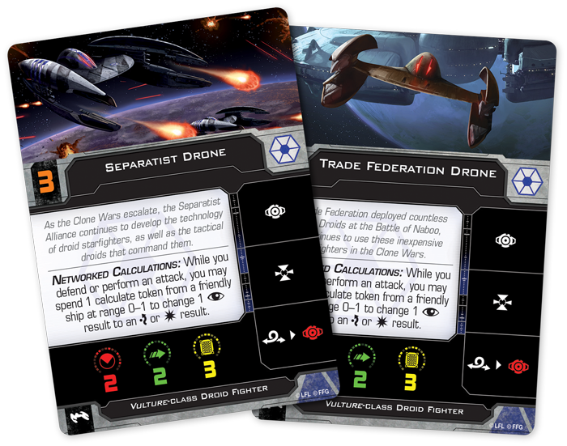

This article was originally published on [https://www.fantasyflightgames.com/en/news/2019/3/7/terrifying-technology/](https://www.fantasyflightgames.com/en/news/2019/3/7/terrifying-technology/)

&laquo; [Back to index](../index.md)

---

7 March 2019

Terrifying Technology
=====================

Preview the Vulture-class Droid Fighter Expansion Pack for X-Wing

_“Master, General Grievous’s ship is directly ahead. The one crawling with_ Vulture _droids.”_  
   –Anakin Skywalker, _Star Wars: Revenge of the Sith_

No matter how skilled they are, starfighter pilots can only do so much from the cockpits of their individual ships. Seeking to overcome these limitations, the Separatist Alliance takes a novel approach to space combat. Rather than “traditional” organic pilots controlling only a single ship, they turn to groups of interlinked droid starfighters that share tactical data in real time and coordinate their movements to overwhelm their enemies.

At the heart of these attack groups is the _Vulture_\-class droid fighter. While weak in isolation, a sufficient number of these fighters can quickly become too much for even the most experienced pilots to handle. Already capable of precise combat calculations, _Vulture_ droids become even more deadly when they're fed additional tactical data from supporting command ships. Soon, you’ll be able to make these droids the cornerstone of your own strategies with the [Vulture-_class Droid Fighter Expansion Pack_](https://www.fantasyflightgames.com/en/products/x-wing-second-edition/products/vulture-class-droid-fighter-expansion/) for [_X-Wing_™](https://www.fantasyflightgames.com/en/products/x-wing-second-edition/)!

Within this expansion, you’ll find one _Vulture_\-class droid fighter miniature, beautifully painted in the colors of the Trade Federation as well as five ship cards representing different programming styles for you to employ in battle. You can further shape your _Vulture_ droid to fit your personal strategy with five upgrade cards.

Join us today as we explore everything included in the Vulture-_class Droid Fighter Expansion Pack_!

Programmed for Destruction
--------------------------

There is a clear distinction between two different classes of starfighters within Separatist Alliance squadrons. On the one hand, the faction’s leaders take to battle in powerful and heavily armored starfighters, such as the Belbullab-22 and Sith Infiltrator. On the other hand, you'll find the weak droid starfighters that make up the vast majority of the Separatist forces. Expected to take the brunt of enemy fire, these droid fighters can play a number of roles in your squadron.

Cheaply produced on an unprecedented scale, _Vulture_\-class droid fighters are most commonly encountered in large numbers, and the Vulture-_class Droid Fighter Expansion Pack_ gives you two options for building your squadron around inexpensive fighters. With average initiative, a group of [Separatist Drones](swz31_separatist-drone.png) can react to some enemy movements and make good use of the information relayed to them from the tactical droids carried on command ships.

Alternatively, a squadron of [Trade Federation Drones](swz31_trade-federation-drone.png)

Traditional missiles are certainly a useful tool for making your _Vulture_ droids more deadly, but the Separatist Alliance is far from traditional. Rather than simply firing projectiles at enemies, you could also sow chaos among them by launching some [Discord Missiles](swz31_discord-missiles.png) into the enemy’s flight path. Once launched, these missiles deploy an aggressive buzz droid swarm, ready to latch onto an enemy ship and tear it apart from the outside.

  
_The Delta-7 Aethersprite moves through the Buzz Droid Swarm, relocating the swarm to its rear guides. As long as they are at range 0, the Delta-7 will suffer one critical damage every time the buzz droids engage!_ 

Any enemy ship unfortunate enough to overlap or move through a [Buzz Droid Swarm](swz31_buzz-droid-swarm.png) must immediately relocate it by aligning the buzz droids to that ship’s front or rear guides. While this doesn’t have an immediate effect, the buzz droid swarm will soon set to work, causing each enemy ship at range 0 to suffer a critical damage every time it engages. With an initiative of 0, however, the buzz droids are still vulnerable to an attack that could blast them off the ship before they get a chance to do any damage. Even still, they are dangerous enough to draw the enemy’s attention away from the rest of your ships, giving you plenty of opportunity to attack.

Even though they are manufactured according to precise specifications, _Vulture_ droids are far from uniform. As we saw in our [preview of the ships](https://www.fantasyflightgames.com/en/news/2019/1/8/seize-the-galaxy/) contained in the _Servants of Strife Squadron Pack_, the _Vulture_\-class droid fighter can be programmed with specific protocols in mind and those in the Vulture-_class Droid Fighter Expansion Pack_ are no exception. A step up from a Trade Federation Drone, [DFS-311](swz31_dfs-311.png) can help your other ships that have a better chance of making a powerful attack.

  
_At the start of the Engagement Phase, DFS-311 transfers its calculate token to the Precise Hunter!_

Scouting ahead of the rest of the squadron, this droid fighter can both disrupt enemy movement and transfer one of its calculate tokens to another friendly ship at range 0–3. When used to block enemy ships, DFS-311 could help a [Precise Hunter](swz29_precise-hunter.png) line up the shot it needs and give it the calculate it needs to modify the results.

No matter if you blitz your enemies with a large squadron of _Vulture_\-class droid fighters or you pair them with another ship and a tactical relay, they are a versatile fighter key to the Separatist’s success in the intense battles of _X-Wing_!

Sowing Discord
--------------

The Separatist Alliance seeks to splinter the galaxy with chaos, tyranny, and fear, and the _Vulture_\-class droid fighter is their main tool in accomplishing this goal. Deploy yours and topple the Republic!

