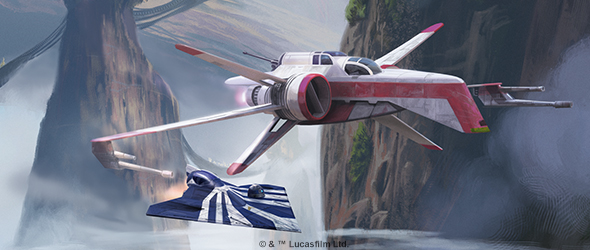
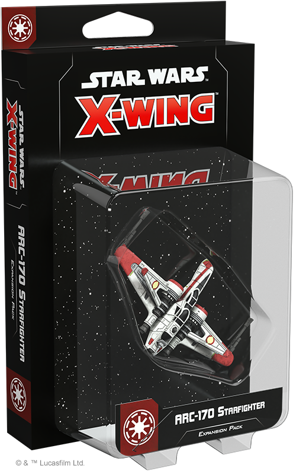
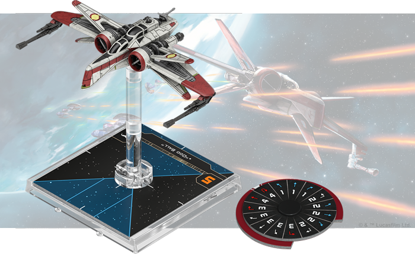
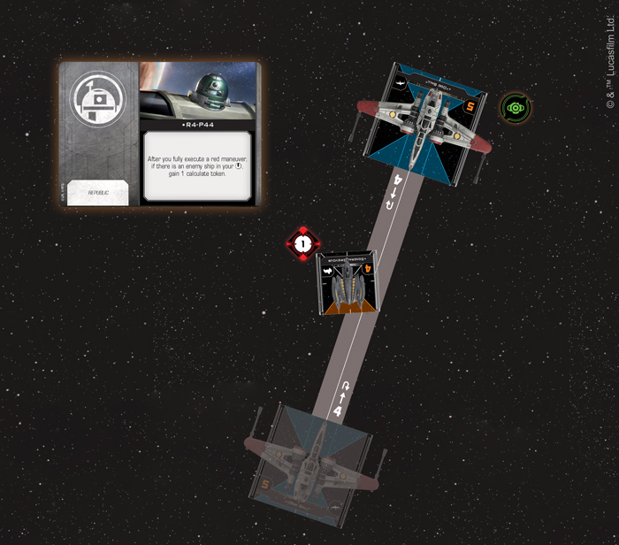
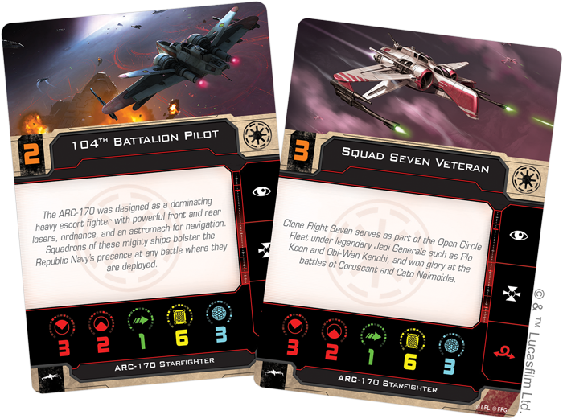
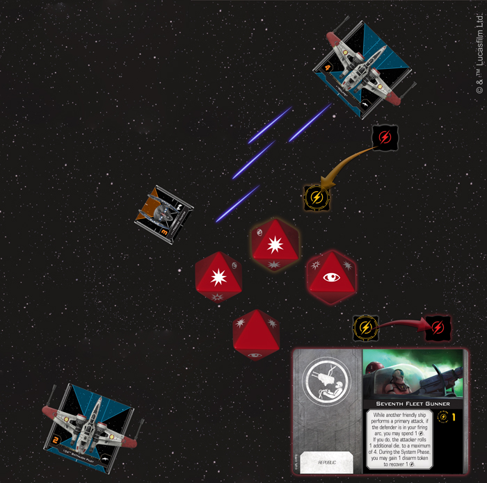

This article was originally published on [https://www.fantasyflightgames.com/en/news/2019/3/13/hammer-the-opposition/](https://www.fantasyflightgames.com/en/news/2019/3/13/hammer-the-opposition/)

&laquo; [Back to index](../index.md)

---

13 March 2019

Hammer the Opposition
=====================

Preview the ARC-170 Starfighter Expansion Pack for X-Wing

_“Come on, when have I ever let you down?”_  
   –Clone Commander Cody, _Star Wars: Revenge of the Sith_

The threat posed by the Separatist Alliance is growing, threatening the entire _Star Wars_ galaxy. With the Jedi and their Delta-7 _Aethersprite_ starfighters spread thin, brave clone pilots fill in the gaps, serving as the last line of defense against Separatist assaults. While many fly into battle in the V-19 Torrent, others prefer a heavier option.

Designed as a dominating heavy escort fighter, the ARC-170 starfighter features powerful front and rear lasers, heavy ordnance, and an astromech for navigation. Squadrons of these mighty ships bolster the Republic Navy’s presence at any battle, and soon you can bring your own complement of ARC-170s to the battles of [_X-Wing_™](https://www.fantasyflightgames.com/en/products/x-wing-second-edition/) with the _[ARC-170 Starfighter Expansion Pack](https://www.fantasyflightgames.com/en/products/x-wing-second-edition/products/arc-170-starfighter-expansion-pack/)_.

This expansion contains everything you need to add the Republic’s mainstay heavy starfighter to your squadrons, including one beautifully painted ARC-170 starfighter miniature and six clone pilots ready to fly into any battle. In addition to the unique abilities that these pilots bring to your squadrons, fourteen upgrade cards invite you to customize your ARC-170 with additional crew, astromech droids, gunners and more. Join us today as we take a look at everything contained in the _ARC-170 Starfighter Expansion Pack_!

Aggressive Reconaissance
------------------------

While most starfighters eventually give way to newer models, the ARC-170 has proven surprisingly resilient to the passage of time. For the Galactic Republic, the ship was a welcome alternative to their lighter starfighters, giving the clone pilots who flew them a way to punch a hole through swarms of Separatist fighters.

With heavy armor and multiple attack options, the ARC-170 is a versatile ship that can easily become the offensive centerpiece of your squadron as it lays down covering fire for other ships. A pilot like [“Odd Ball,”](575edba890e089da741364be88f09e5f.png)  acquiring locks on enemy ships when catching them in his bullseye arc after fully executing a red maneuver or performing a red action.

  
_"Odd Ball" performs a speed-four Koiogran Turn. General Grievous is in his bullseye arc after he completes the maneuver, so he acquires a lock on Grievous with his ability and gains a calculate token from R4-P44!_

“Odd Ball” has a knack for putting himself in position to launch powerful attacks, no matter what ship he’s flying, but the ARC-170’s astromech slot can give him advantages not seen in the V-19. If [R4-P44](e4a73ae03633964be3f2eddb0940c3f0.png) is performing combat calculations for him, “Odd Ball” also gains a calculate token to go along with his lock after executing a red maneuver, giving him even more control over his attack.

As tempting as it may be to turn a pilot like “Odd Ball” into an offensive powerhouse, he will inevitably be one part of a larger squadron and the ARC-170 also excels at supporting other ships. Although not quite as skilled as “Odd Ball,” [“Jag”](2df266218ff34570995d0a49d9a3bd0d.png) gives those same ships a better chance of hitting their targets when they can reroll an attack die while performing a primary attack.

But a clone pilot doesn’t need to have a special ability to improve the entire squadron. Even though they might not be as well known, generic pilots like  [Squad Seven Veterans](c0950b1cb5181c09a6836183b73aff42.png) to their wingmen, taking on some strain to help give the aces of their squadron the chance to shake off some enemy fire. In fact, the ARC-170 is perhaps an ideal candidate for this upgrade—its six hull and three shields allowing it to continue supporting its squadron deep into a battle.

At the same time, these characteristics also make the ARC-170 a safe choice to shuttle high ranking Republic personnel into battle. From aiding navigation to repairing damage, each of these crewmembers can contribute to a different area of your ship, but [Chancellor Palpatine](75132b36d332d7e4ac8946421bb838ec.png) to push itself even further.

In addition to its thick hull, the ARC-170’s rear-facing laser is one of its defining characteristics, making the ship difficult to approach from most angles. A pilot like “Wolffe” takes advantage of this as often as possible. His single charge can be spent during a primary attack out of his front arc to reroll an attack die. But this is far from the only use for this charge. Not only can this charge be recovered while performing a primary attack out of the ARC-170’s rear arc, doing this allows [“Wolffe”](5ede56b727f3a9a3979950d4d33ed49b.png)  you could even spend and recover this charge while performing two attacks in the course of a single activation!

  
_"Wolffe" recovers his charge to roll an additional attack die while attacking the Precise Hunter from his rear arc. But the Precise Hunter is also in the 104th Battallion Pilot's firing arc, so he uses his Seventh Fleet Gunner upgrade to let "Wolffe" roll an additional die for a total of four attack dice!_ 

It’s easy to see the benefits of a Veteran Tail Gunner, but this is far from the only option to fill your gunner’s seat. [Clone Commander Cody,](348f9867b6835b4901ead9aed796e60e.png)  for example, keeps the pressure on enemy ships even when his shots miss. If any of his damage was neutralized during an attack, the defender gains a strain token, making them easier to hit next time.

A ship carrying a [Seventh Fleet Gunner,](544923a448947c49a4a5de13ee1a8a85.png)  on the other hand, can provide some supporting fire to a friendly ship, letting them roll an additional attack die to a maximum of four. In fact, a Seventh Fleet Gunner is a good alternative for “Wolffe,” potentially giving him a four die attack from the rear arc. Whether you bring in outside help or assign Republic personnel to your ARC-170, it invites customization, letting you choose the role that this ship plays in your _X-Wing_ squadrons!

Standing Strong
---------------

The Republic's survival depends upon the clone pilots who resist the tyranny of the Separatist Alliance. With the ARC-170 starfighter, they'll have a powerful tool to fight injustice in all its forms.