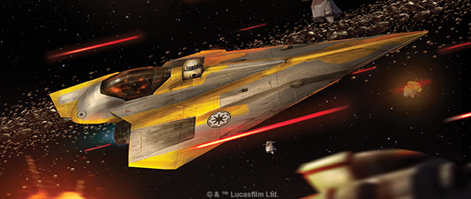
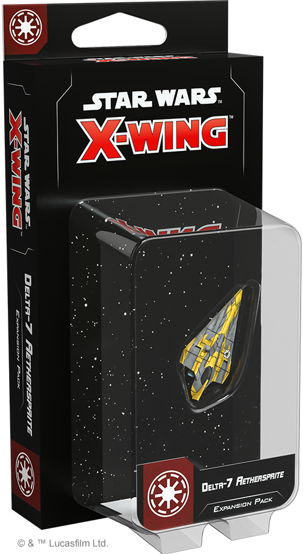
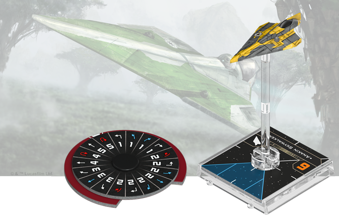
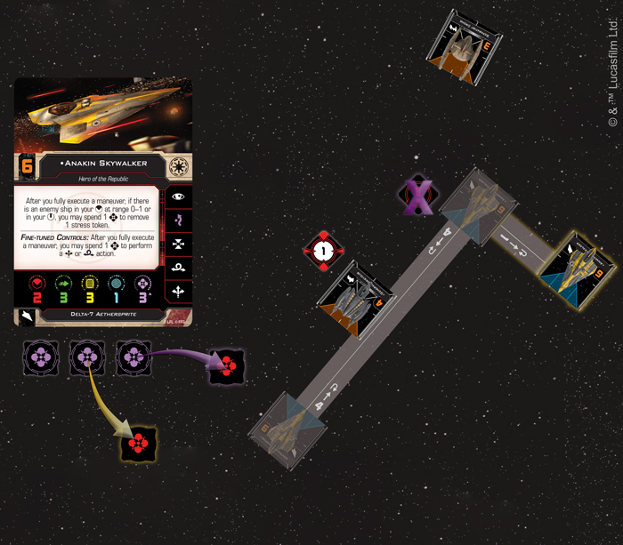
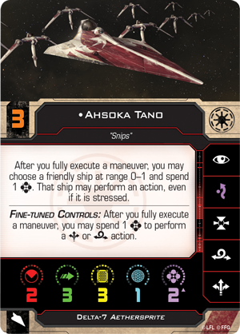
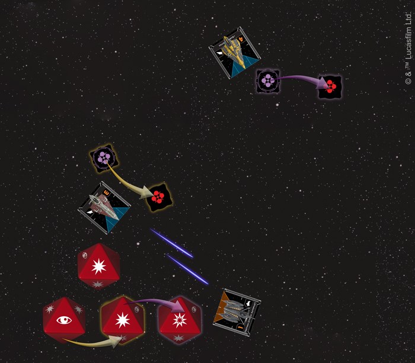

This article was originally published on [https://www.fantasyflightgames.com/en/news/2019/3/20/a-powerful-ally/](https://www.fantasyflightgames.com/en/news/2019/3/20/a-powerful-ally/)

&laquo; [Back to index](../index.md)

---

20 March 2019

A Powerful Ally
===============

Preview the Delta-7 Aethersprite Expansion Pack for X-Wing

_“Remember, concentrate on the moment. Feel, don’t think. Trust your instincts.”_ –Qui-Gon Jinn, _Star Wars: The Phantom Menace_

It is a desperate time for the Galactic Republic. Assailed on all sides by the nefarious Separatist Alliance, the Senate has dispatched the Jedi Knights to the far reaches of the galaxy to lead a valiant defense. As the battles of the Clone Wars tear across countless worlds, the Jedi turn to the power of the Force to hone their reflexes and give them an advantage—both on the ground and in the skies above.

With a power as strong as the Force on their side, it’s only natural for the Jedi to take their own unique approach to the space combat of [_X-Wing_™](https://www.fantasyflightgames.com/en/products/x-wing-second-edition/), one that allows them to use their considerable powers to the fullest. As useful to the Jedi as a lightsaber, the Delta-7 _Aethersprite_ starfighter helps its Jedi pilots be at one with the Force in the midst of even the most chaotic battles. But, just like a lightsaber, the Delta-7 must be fully mastered before it can be wielded properly.

As _X-Wing_ begins exploring the Clone Wars with the upcoming release of Wave III, you’ll soon have the chance to master the Force with the [_Delta-7_ Aethersprite _Expansion Pack_](https://www.fantasyflightgames.com/en/products/x-wing-second-edition/products/delta-7-aethersprite-expansion/). In addition to a finely detailed Delta-7 _Aethersprite_ miniature, beautifully pre-painted in the colors of the starfighter flown by Anakin Skywalker, this expansion also introduces four new unique Jedi pilots ready to fight on behalf of the Republic. Accompanying these brave pilots are six upgrades that can help them get the most out of their ships, as well as two Quick Build cards offering useful predefined selections of upgrades to get you in the fight right away.

Join us today as we take a look at everything included in the _Delta-7_ Aethersprite _Expansion Pack_!

Knowledge and Defense
---------------------

The Force can make even the most novice pilot a formidable opponent, especially if that pilot is at the controls of a Delta-7 _Aethersprite_. But even with this great power at their command, no Jedi can take on the Separatists alone. Elegantly designed and highly maneuverable, the Delta-7 can complement any squadron, no matter if its pilot is leading a group of clone troopers or flying alongside their fellow Jedi.

When they are in sync with their ships, the best Delta-7 pilots can fly effortlessly with unmatched precision. This is exactly the case with the legendary Jedi Knight [Anakin Skywalker.](93e8bc4ce589e98ccc1d3447558bad89.png)  Known as one of the best starfighter pilots in the galaxy, he can pull off even the most difficult maneuvers with ease. If he’s able to place an enemy ship in his front arc at range 0–1 or in his bullseye arc after fully executing a maneuver, he can then spend a Force charge to remove a stress token.

  
_General Grievous is in his bullseye arc after he fully executes a speed-four Koiogran Turn, so Anakin Skywalker spends a Force charge to remove the stress token he gained from the maneuver. He now has no stress, so he spends another Force charge to use the Delta-7's Fine-Tuned Controls and barrel roll out of the_ Vulture_\-class droid fighter's firing arc. Finally, he takes his normal action, acquiring a lock on General Grievous!_   

The combination of his high initiative and ability makes Anakin Skywalker an incredibly versatile and unpredictable opponent. Removing stress frees him to continue performing difficult Segnor’s Loops and Koiogran Turns in future rounds, but there are more immediate benefits as well. If he removes the stress using his pilot ability, Skywalker is then free to use his Delta-7’s Fine-Tuned Controls to perform a boost or barrel roll, before taking his regular action.

 Anakin Skywalker makes flying the Delta-7 look easy, and fortunately, Skywalker has passed some of his knowledge to his apprentice [Ahsoka Tano.](a822703b3705d5cfe4debd65ce98511c.png)   to help her navigate. Tano can use this astromech’s charges at critical moments to lower the difficulty of a basic maneuver, helping her remove stress tokens while still pulling off tight turns.

Seeing as an ace like Anakin Skywalker excels at swooping in close to enemy ships, it should come as no surprise that he prefers the [Delta-7B](26ebcd42130dd410547176dfb0f76f84.png) variant of the fighter. While this configuration does cost him some agility, it's balanced by a boost to the ship’s firepower, granting him four attack dice when performing a primary attack at Range 1. And even if moving in close does mean he’ll take some extra fire, the Delta-7B can easily absorb the damage with its two extra shields.

Switching to the Delta-7B configuration may be the most direct way for Delta-7 pilots to gain an extra attack die, but there is another way, especially for those who want to maintain the ship’s agility. The Delta-7 can also be outfitted with [Calibrated Laser Targeting,](d299646d0bf26dd8c06f76f7b87a9a13.png) is nearby. Her ability naturally syncs with Calibrated Laser Targeting, allowing her to spend a Force charge to enhance the attack of any friendly ship at range 0–2 firing on a ship in their bullseye arc. 

  
_While attacking the Belbullab-22, the Jedi Knight spends its Force charge to change its focus to regular damage. Barriss Offee is at range 0–2, so she uses her ability, changing the regular damage to a critical damage!_ 

At the same time that Barriss Offee is improving her team’s attacks, her own Master [Luminara Unduli](22c29da6adfcb7924a17a15b0215aa4b.png) can help reduce the impact of enemy attacks. If a friendly ship at range 0–2 has used the Delta-7’s many options to avoid an attacking ship’s bullseye arc, she can spend a Force charge to lessen the impact or even negate the damage altogether.

The Force Will Be With You
--------------------------

They may be outnumbered by the Separatist Alliance's swarms of droid starfighters, but the Jedi enter battle with one distinct advantage: the Force is with them, and with their Delta-7 starfighters, they can defeat even the most formidable foes.

