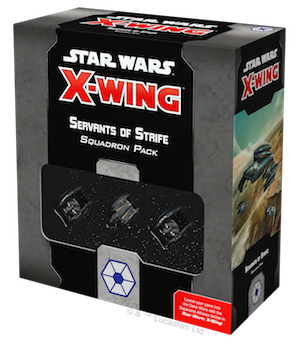
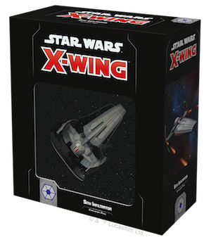
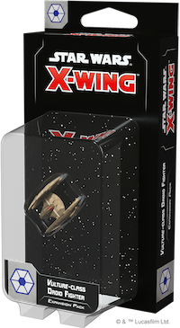
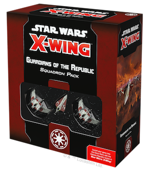
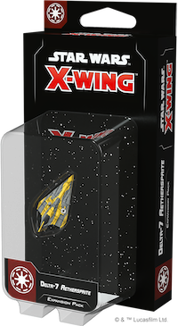
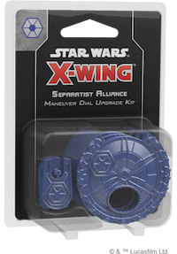
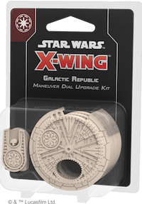
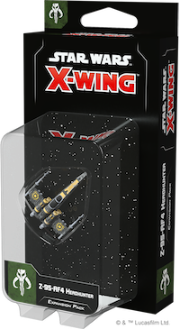
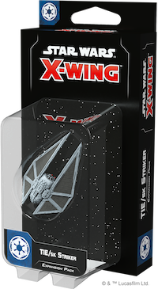
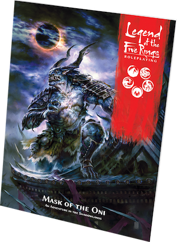

This article was originally published on [https://www.fantasyflightgames.com/en/news/2019/3/21/available-now-march-21-1/](https://www.fantasyflightgames.com/en/news/2019/3/21/available-now-march-21-1/)

&laquo; [Back to index](../index.md)

---

21 March 2019

Available Now — March 21
========================

X-Wing Wave III Is Available Now

_Take a look at the latest products from Fantasy Flight Games, now available at your local retailer or online through our webstore!_ 

* * *

[Servants of Strife Squadron Pack](https://www.fantasyflightgames.com/en/products/x-wing-second-edition/products/servants-strife-squadron-pack/) 
---------------------------------------------------------------------------------------------------------------------------------------------------------------------------------------------------------------------------------------------------------------------------

War! The Separatist Alliance has driven a spike into the heart of the galaxy, splintering the once-unified worlds with choas, tyranny, and fear. At the heart of this offensive is the dastardly General Grievous, commanding endless legions of droid fighters. 

Swarms of networked _Vulture_\-class fighters commanded by tactical droids strike at innocent worlds, forcing the Republic on the defensive. All the while, Grievous slinks through the shadows in his customized Belbullab-22 starfighter; hunting the Jedi at every turn. 

This _Squadron Pack_ contains everything you need to add one Belbullab-22 starfighter and two _Vulture_\-class droid fighter ships to your games of _[X-Wing](https://www.fantasyflightgames.com/en/products/x-wing-second-edition/)_, including new ship and upgrade cards, three maneuver dials, and an array of tokens.

* * *

[Sith Infiltrator Expansion Pack](https://www.fantasyflightgames.com/en/products/x-wing-second-edition/products/sith-infiltrator-expansion-pack/) 
----------------------------------------------------------------------------------------------------------------------------------------------------------------------------------------------------------------------------------------------------------------------------

The Sith operate in the shadows. As they unfold their dark machinations across the galaxy, they need a ship that matches their nefarious purposes. Casting a menacing shadow as it cuts across the skies, the Sith Infiltrator is the perfect choice to carry the agents of Darth Sidious on their dark missions and into the battles of _X-Wing_.

With the _Sith Infiltrator Expansion Pack_, you can use the experimental cloaking device, devastating firepower, and advanced systems of one of these ships to deliver vicious surgical strikes before vanishing into the void. In addition to the finely detailed and fully painted Sith Infiltrator miniature, you’ll find a collection of five ship cards, including Darth Maul himself, twenty upgrade cards that help you fully utilize the ship’s systems, and all the tokens and maneuver dials you need to launch your own secret missions.

_Pick up your own copy of the_ Sith Infiltrator Expansion Pack _(SWZ30) at your local retailer today!_

* * *

[_Vulture_\-class Droid Fighter Expansion Pack](https://www.fantasyflightgames.com/en/products/x-wing-second-edition/products/vulture-class-droid-fighter-expansion/) 
------------------------------------------------------------------------------------------------------------------------------------------------------------------------------------------------------------------------------------------------------------------------------------------------

The _Vulture_\-class droid fighter is the backbone of the Separatist Navy and emblematic of its strategy: weak in isolation, but overwhelming in numbers. A sufficiently vast swarm of networked attackers form a cunning, sinister intelligence that can defeat even wise and powerful Jedi pilots.

The Vulture-_class Droid Fighter Expansion Pack_ contains everything you need to begin building your own squadron of linked droid starfighters—most importantly, a beautifully pre-painted _Vulture_\-class droid fighter miniature. Additionally, five ship cards give you the ability to outfit your droid fighter with distinct types of programming while five upgrade cards provide even more freedom to shape your squadron.

_Pick up your own copy of the Vulture_\-class Droid Fighter Expansion Pack _(SWZ31) at your local retailer today!_

* * *

[Guardians of the Republic Squadron Pack](https://www.fantasyflightgames.com/en/products/x-wing-second-edition/products/guardians-republic-squadron-pack/) __ 
----------------------------------------------------------------------------------------------------------------------------------------------------------------------------------------------------------------------------------------------------------------------------------------

The Galactic Republic is crumbling, reeling from the blow dealt by the fledgling Separatist Alliance. But even in this age of uncertainty and disunion, heroes arise. Legendary Jedi Knight Obi-Wan Kenobi valiantly leads dedicated clone pilots into battle against the forces of tyranny and chaos in the _Guardians of the Republic Squadron Pack_ for _X-Wing_!

This pack gives you everything you need to begin building your Galactic Republic squadrons, including one Delta-7 _Aethersprite_ miniature and two V-19 Torrent miniatures. The chosen interceptor of many Jedi, the Delta-7 allows them to use their Force-enhanced reflexes to the fullest. Behind them, clone pilots cover them from their V-19 Torrents with coordinated fire, tight formation flying, and salvoes of missilies. In addition to the miniatures, this Squadron Pack gives you the chance to further explore the potential of the Force with several new Force upgrade cards. Meanwhile, a variety of other upgrade cards—including reprints of many common neutral upgrade cards—provide a wealth of options for customizing your squadrons.

_Pick up your own copy of the_ Guardians of the Republic Squadron Pack _(SWZ32) at your local retailer today!_

* * *

[ARC-170 Starfighter Expansion Pack](https://www.fantasyflightgames.com/en/products/x-wing-second-edition/products/arc-170-starfighter-expansion-pack/) __ 
-------------------------------------------------------------------------------------------------------------------------------------------------------------------------------------------------------------------------------------------------------------------------------------

The ARC-170 is the Galactic Republic's mainstay heavy starfighter. Equipped torpedoes allow this intimidating craft to smash through foes that might repel the Republic's more lightly armed ships, while its rear gunner makes it difficult to approach from most angles. Whether defending the flanks of a formation or giving support to a Jedi General, the ARC-170 has an imposing presence on the battlefield.

With the _ARC-170 Starfighter Expansion Pack_, you can bring a single ARC-170 starfighter to your _X-Wing_ battles. Alongside the beautifully painted ARC-170 miniature, you'll find six clone pilots ready to fly for the Republic as well as fourteen upgrade cards giving you the freedom to add additional heavy weaponry, gunners, and crew members to your ship.  

_Pick up your own copy of the_ ARC-170 Starfighter Expansion Pack _(SWZ33) at your local retailer today!_

* * *

[Delta-7 _Aethersprite_ Expansion Pack](https://www.fantasyflightgames.com/en/products/x-wing-second-edition/products/delta-7-aethersprite-expansion/) 
---------------------------------------------------------------------------------------------------------------------------------------------------------------------------------------------------------------------------------------------------------------------------------

The Delta-7 _Aethersprite_ is an elegant craft designed to help Jedi Knights cross the gulfs between the stars in their quest to uphold justice. Equipped with an astromech for navigation, it is lightly armed but highly maneuverable, its fine-tuned controls allowing a Force-sensitive pilot to fly it with unmatched precision. 

With five ship cards—including four unique pilots—the _Delta-7_ Aethersprite _Expansion Pack_ adds even more Jedi for you to include in your Galactic Republic squadrons, including the legendary Anakin Skywalker. Featuring an alternate paint scheme to the ship included in the _Guardians of the Republic Squadron Pack_, this expansion also features six upgrade cards designed to get even more out of your ship and its Jedi pilots.

_Pick up your own copy of the_ Delta-7 _Aethersprite_ Expansion Pack _(SWZ34) at your local retailer today!_ 

* * *

[Separatist Alliance Maneuver Dial Upgrade Kit](https://www.fantasyflightgames.com/en/products/x-wing-second-edition/products/separatist-alliance-maneuver-dial-upgrade-kit/) 
-------------------------------------------------------------------------------------------------------------------------------------------------------------------------------------------------------------------------------------------------------------------------------------------------------

Proudly declare your independence from the Republic with the _Separatist Alliance Maneuver Dial Upgrade Kit_!

The three upgraded plastic protectors found in this kit boldly indicate your allegiance to the Separatist Alliance while enhancing the aesthetic look of your squadron. As you secretly plot your maneuvers each round, these kits house a ship’s dial within a secure plastic housing. Additionally, the kits include a space on the back to insert dial ID tokens found in expansion packs, making it easy to differentiate between your ships in the middle of a game.

_Pick up your own copy of the_ Separatist Alliance Maneuver Dial Upgrade Kit _(SWZ35) at your local retailer today!_

* * *

[Galactic Republic Maneuver Dial Upgrade Kit](https://www.fantasyflightgames.com/en/products/x-wing-second-edition/products/galactic-republic-maneuver-dial-upgrade-kit/) __ 
-------------------------------------------------------------------------------------------------------------------------------------------------------------------------------------------------------------------------------------------------------------------------------------------------------

Announce your alliegance to the Galactic Republic with the _Galactic Republic Maneuver Dial Upgrade Kit_!

The three upgraded plastic protectors found in this kit proudly declare your dedication to preserving the Republic while enhancing the aesthetic look of your squadron. As you secretly plot your maneuvers each round, these protectors house a ship’s dial within a secure plastic housing. Additionally, the kits include a space on the back to insert dial ID tokens found in expansion packs, making it easy to differentiate between your ships in the middle of a game.

_Pick up your own copy of the_ Galactic Republic Maneuver Dial Upgrade Kit _(SWZ36) at your local retailer today!_

* * *

[Z-95-AF4 Headhunter Expansion Pack ](https://www.fantasyflightgames.com/en/products/x-wing-second-edition/products/z-95-af4-headhunter-expansion-pack/) __ 
--------------------------------------------------------------------------------------------------------------------------------------------------------------------------------------------------------------------------------------------------------------------------------------

The Z-95 Headhunter's wide production saw it scattered to the far corners of the galaxy. Now, this reliable, easy-to-acquire starfighter is integral to numerous criminal cartel fleets—from large operations like Black Sun to small-time raiders like the Binayre Pirates. Armed with missiles and illicit technologies, a single Z-95-AF4 can be a danger, but a swarm can be devastating. 

Now, you have the chance to continue growing your Scum and Villainy squadrons with these inexpensive fighters. The _Z-95-AF4 Headhunter Expansion Pack_ includes everything you need to add one Z-95-AF4 Headhunter ship to your squadron, including a miniature with a stunning new paint scheme, four ship cards, five upgrade cards, and a handful of tokens.

_Pick up your own copy of the_ Z-95-AF4 Headhunter Expansion Pack _(SWZ37) at your local retailer today!_

* * *

[TIE/sk Striker Expansion Pack ](https://www.fantasyflightgames.com/en/products/x-wing-second-edition/products/tiesk-striker-expansion-pack/) 
------------------------------------------------------------------------------------------------------------------------------------------------------------------------------------------------------------------------------------------------------------------------

Screaming through the atmosphere on nimble ailerons, the TIE/sk striker is a unique starfighter designed to excel at both air and space assaults. Its atmospheric capabilities give it unique and flexible movement patterns that can surprise even veteran opponents, as its heavy firepower lets it wear down nearly any foe.

With the _TIE/sk Striker Expansion Pack_, you have a new option for rounding out your Imperial squadrons. In addition to the fully assembled, pre-painted TIE/sk striker miniature, five pilots stand ready to swoop into battle and protect the Empire in any situation. Meanwhile, five upgrade cards give you even more chances to customize your squadrons with additional gunners, devices, and talents.

_Pick up your own copy of the_ TIE/sk Striker Expansion Pack _(SWZ38) at your local retailer today!_

* * *

[Shadowlands](https://www.fantasyflightgames.com/en/legend-of-the-five-rings-roleplaying-game/products/shadowlands/)
--------------------------------------------------------------------------------------------------------------------

__

Explore Fu Leng’s festering domain with the _Shadowlands_ sourcebook for the _[Legend of the Five Rings Roleplaying Game](https://www.fantasyflightgames.com/en/legend-of-the-five-rings-roleplaying-game/)_! Discover the vile locations and denizens of this ancient realm, as well as the brave samurai who stand against them, including the mighty Falcon Clan. Finally, advice for Game Masters running campaigns in this dark domain ensures your games are dripping with theme. Can your samurai survive the perils of the Shadowlands?

_Shadowlands_ is a 144-page hardcover sourcebook that serves as a guide to the dread realms of Fu Leng, where corruption and evil thrive in place of honor and courage. In it, players find information on this region, as well as Crab lands and the great Kaiu Wall that divides the Shadowlands from Rokugan. With new schools, techniques, weapons, and more to aid them, players can fight the Tainted creatures and other terrors that would destroy the Emerald Empire.

_Pick up your own copy of_ Shadowlands _(L5R06) at your local retailer today!_

* * *

[Mask of the Oni](https://www.fantasyflightgames.com/en/legend-of-the-five-rings-roleplaying-game/products/mask-oni/) 
------------------------------------------------------------------------------------------------------------------------------------------------------------------------------------------------------------------------------------------------

Take your players into the foreboding Shadowlands with _Mask of the Oni_. This adventure for the _Legend of the Five Rings Roleplaying Game_ pits heroes against the dangers of the Shadowlands and the horrors found within the crumbling walls of the Hiruma family’s fallen castle. Tokens, maps, and an adventure booklet will guide players on their journey, but will they survive with their soul intact?

_Mask of the Oni_ is the perfect companion to the _Shadowlands_ sourcebook, providing an adventure to use the lore and tools introduced in _Shadowlands_ as well as additional context for your adventure.

_Pick up your own copy of_ Mask of the Oni _(L5R07) at your local retailer today!_