This article was originally published on [https://www.fantasyflightgames.com/en/news/2019/4/13/the-fate-of-the-galaxy/](https://www.fantasyflightgames.com/en/news/2019/4/13/the-fate-of-the-galaxy/)

&laquo; [Back to index](../index.md)

---

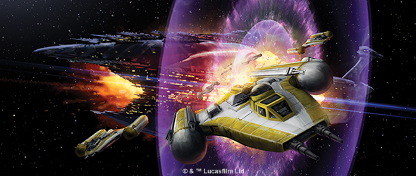

13 April 2019

The Fate of the Galaxy
======================

Announcing Wave V for X-Wing

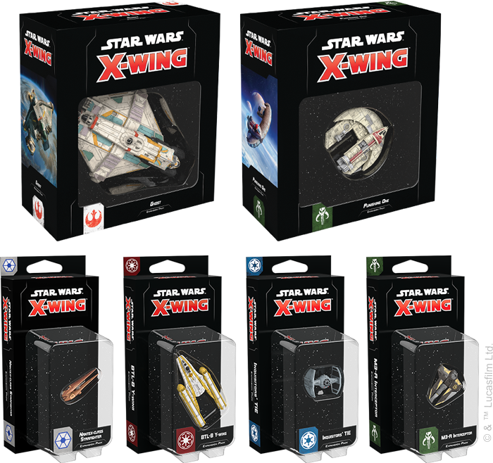

_“I’ve been looking forward to this.”_  
   –Count Dooku, _Star Wars: Revenge of the Sith_

Wise Jedi and dedicated clones teaming up against cold, mechanical droid starfighters. Brave Rebels flying against the might of the Empire. A group of pirates in the Outer Rim making a bold raid on an Imperial convoy. The intense space battles of [_X-Wing_™](https://www.fantasyflightgames.com/en/products/x-wing-second-edition/) are varied and can take you to any era of the _Star Wars_ saga. Now, new ships are preparing to make the jump into whatever war you find yourself.

_Pre-order your own copies of Wave V for_ X-Wing _at your local retailer or online through our website—with free shipping in the continental US—today!  
 _ 

Fantasy Flight Games is happy to announce a new wave of six expansions for _X-Wing_!

*   [Nantex-_class Starfighter Expansion Pack_](https://www.fantasyflightgames.com/en/products/x-wing-second-edition/products/nantex-class-starfighter-expansion-pack/)
*   _[BTL-B Y-Wing Expansion Pack](https://www.fantasyflightgames.com/en/products/x-wing-second-edition/products/btl-b-y-wing-expansion-pack/)_
*   [Ghost _Expansion Pack_](https://www.fantasyflightgames.com/en/products/x-wing-second-edition/products/x-wing-second-edition-ghost-expansion-pack/)
*   _[Inquisitors' TIE Expansion Pack](https://www.fantasyflightgames.com/en/products/x-wing-second-edition/products/x-wing-second-edition-inquisitors-tie-expansion-pack/)_
*   [Punishing One _Expansion Pack_](https://www.fantasyflightgames.com/en/products/x-wing-second-edition/products/x-wing-second-edition-punishing-one-expansion-pack/)
*   _[M3-A Interceptor Expansion Pack](https://www.fantasyflightgames.com/en/products/x-wing-second-edition/products/x-wing-second-edition-m3-interceptor-expansion-pack/)_

Whether your strategy relies on fast starfighters nimbly outmaneuvering their opponents or heavy ships that can cover any angle, the ships and upgrades you find in this wave unlock deep new options for their factions. As you explore even more of the Clone Wars with new ships for the Galactic Republic and Separatist Alliance, this wave also brings more depth to the Rebel Alliance, Galactic Empire, and Scum and Villainy factions, adding new layers to the Hyperspace format.

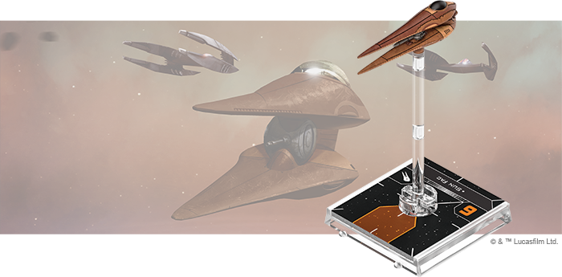

_Nantex_\-class Starfighter Expansion Pack
------------------------------------------

Dancing nimbly on invisible threads, the _Nantex_\-class starfighter uses an advanced tractor array to perform impossible maneuvers and guide its turret-mounted laser cannon with exceptional precision. Swarms of these agile fighters are the first line of defense for the Separatist stronghold of Geonosis.

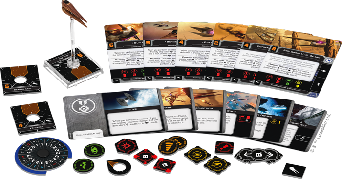

In the space battles of _X-Wing_, expert _Nantex_\-class starfighter pilots make use of tractor tokens to manipulate enemies and their own ships. Not only can they use their ship’s Pinpoint Tractor Array to snap their turrets in place for quick attacks, they are also known to [Ensnare](12da523053fd073bab38c57f92da980a.png) enemy ships in their tractor fields, pulling them into the line of fire or obstacles.

Within this expansion, you’ll find six pilots ready to fly the beautifully detailed and pre-painted _Nantex_\-class starfighter miniature. Six upgrade cards give these pilots even more control over their ship, while two Quick Build cards offer useful combinations of pilots and upgrades to get you flying as soon as possible. We’ll take a full look at everything included in the Nantex_\-class Starfighter Expansion Pack_ in a future preview!

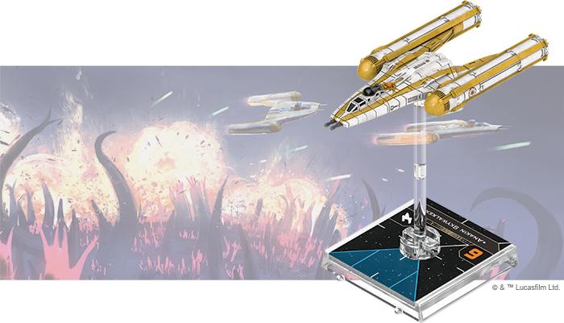

BTL-B Y-Wing Expansion Pack
---------------------------

Designed with an armored hull for extra durability and a bubble turret to keep enemies at bay, the Republic’s BTL-B Y-wing can run escort missions or lead an attack. Piloted by legendary Jedi and dedicated clone troopers alike, this fearsome bomber performs reliably over any battlefield.

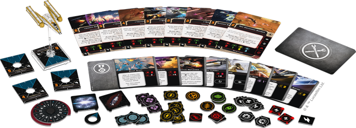

The BTL-B Y-wing fills a vital role in Republic squadrons with its ability to carry a number of devices—including some experimental technology—into battle. Although it moves at a lumbering pace, any [Shadow Squadron Veteran](6fef5fb682190bf74e340db49035d48b.png) can tell you that the BTL-B’s Plated Hull keeps it flying under the heaviest of fire.

The _BTL-B Y-Wing Expansion Pack_ contains everything you need to add one of these formidable ships to your Galactic Republic Squadrons, including a BTL-B Y-wing miniature, eight ship cards, ten upgrade cards, and four Quick Build cards. We’ll take a look at everything included in this expansion—including all its ship cards—in a future preview!

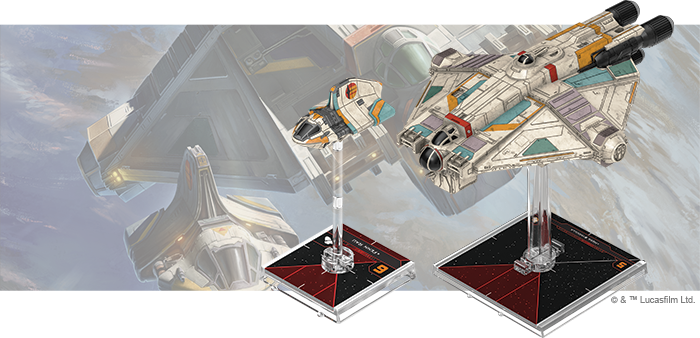

_Ghost_ Expansion Pack
----------------------

The durable VCX-100 light freighter and nimble _Sheathipede_\-class shuttle can fight as a docked pair or split up to attack from multiple angles. When helmed by heroes like Hera Syndulla, Kanan Jarrus, and Ezra Bridger, these ships can be some of the greatest assets of the Rebellion.

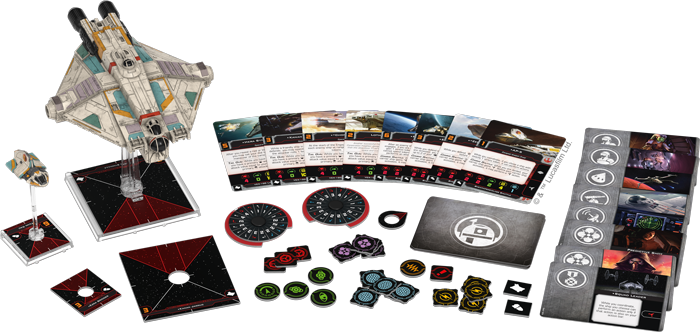

Working with the Phoenix Cell, these heroes were some of the first to join the fight against the Galactic Empire. In addition to using the _Ghost_ crew in a variety of roles, the VCX-100 platform invites customizability, letting you outfit it with advanced systems, turrets, torpedoes, and more.

You’ll find both a VCX-100 light freighter miniature and a _Sheathipede_\-class shuttle miniature that can physically dock with it in this expansion, giving you the freedom to fly them separately or as a powerful combined force. Alongside these miniatures, new players will also find reprints of eight ship cards—four for the VCX-100 and four for the _Sheathipede_\-class shuttle—as well as sixteen upgrade cards, including your first chance to pair [Ezra Bridger](50fed1314ae8f67b981d5215cce1a93a.png) in the Hyperspace format. Finally, four Quick Build cards help get you into the battle right away.

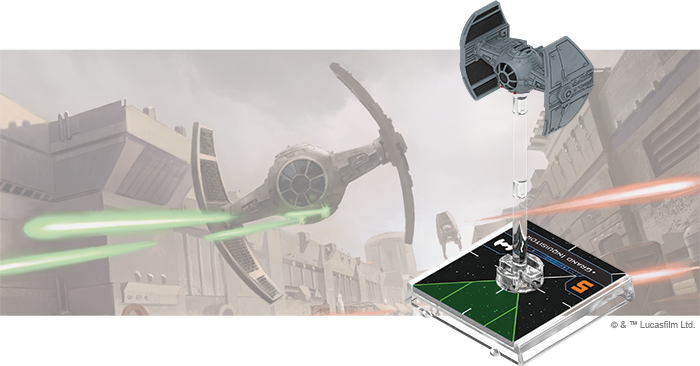

Inquisitors' TIE Expansion Pack
-------------------------------

An experimental craft reserved for elite agents of the Empire such as the dreaded Inquisitors, the TIE Advanced v1 has numerous cutting-edge features that skilled pilots can leverage to deadly effect. The craft’s high-precision thrusters and flexible controls let its pilots tirelessly pursue their prey across the galaxy.

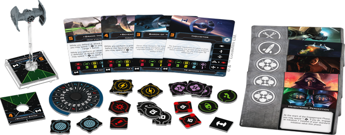

A groundbreaking starfighter in its own right, this ship becomes even more deadly in the hands of Force-sensitive pilots like the [Grand Inquisitor](e77356976d9b0aa15b9933f82bf7ca38.png) , these pilots have unprecedented control over these fearsome starfighters.

This expansion pack includes everything you need to add one TIE Advanced v1 ship to your Imperial squadrons, including reprints of four ship cards and five upgrade cards for the benefit of new players, as well as two Quick Build cards to get you off the ground even faster.

_Punishing One_ Expansion Pack
------------------------------

Built for long-distance reconnaissance and plotting new hyperspace routes, the lightly armed JumpMaster 5000 is often extensively retrofitted with custom upgrades. The vengeful bounty hunter [Dengar](ae9189221a8937d17f039fa03b3b10eb.png) , for example, takes advantage of the ship’s nimble turret and potent engines to great effect.

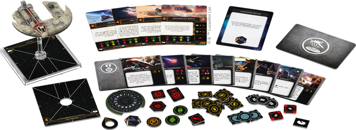

His personal JumpMaster 5000, the _Punishing One_, can keep pace with even the most desperate fugitives, helping him earn a reputation as one of the best bounty hunters in the galaxy. Now, you can track your targets to the farthest corners of the galaxy in this infamous ship.

Within the Punishing One _Expansion Pack_, you’ll find everything you need to add one JumpMaster 5000 to your Scum and Villainy squadrons. Reprints of three pilots join Dengar in the pursuit of profit while twelve reprinted upgrade cards give new players plenty of options for putting a personal touch on their ships. Finally, two Quick Build cards offer useful combinations of pilots and upgrades to maximize your JumpMaster 5000’s effectiveness.

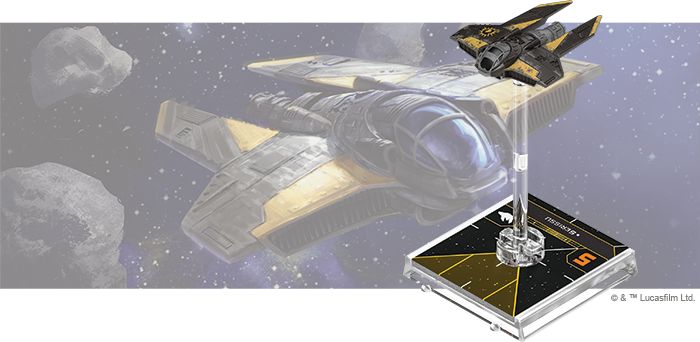

M3-A Interceptor Expansion Pack
-------------------------------

In the Outer Rim, justice is often decided through superior firepower. The M3-A Interceptor is a light, maneuverable craft favored by cartels and syndicates, thanks to the modular hardpoint that lets it equip destructive torpedoes, powerful cannons, and other weapons to threaten much larger vessels.

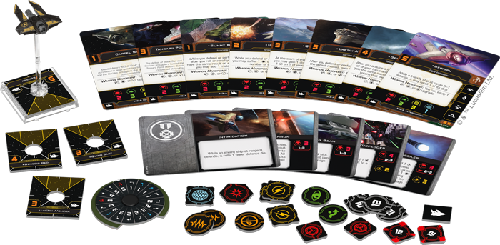

In fact, some of the Outer Rim’s most infamous crime lords, including [Genesis Red](e8bb4eef09a63687a2d7297c1d7f177e.png) , have flown into battle at the controls of the M3-A Interceptor. The ships were perhaps most famously used by Car’das smugglers to defeat the Black Sun ace Talonbane Cobra during the Battle of Tansarii Point Station, earning it much respect throughout the sector.

This expansion contains everything you need to supplement your Scum and Villainy squadrons with one of these inexpensive and highly customizable fighters. In addition to an M3-A Interceptor ship miniature featuring a striking black and gold Black Sun paint scheme, new players will also find eight reprinted ship cards—including six limited pilots—as well as reprints of five valuable upgrades and four Quick Build cards that help you jump into battle right away.

Prepare for Battle
------------------

No matter where the battles of _X-Wing_ take you, there are always new strategies to explore and new foes to face. Choose your pilots, outfit your ships, and launch into new battles!