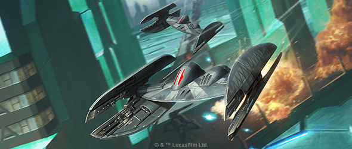
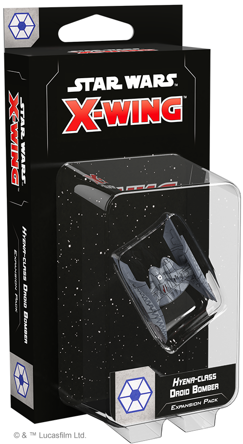
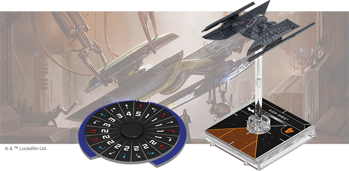
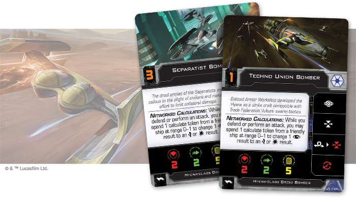
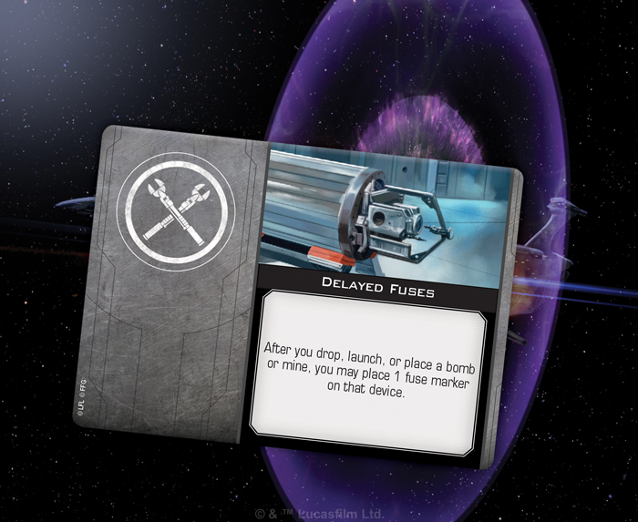
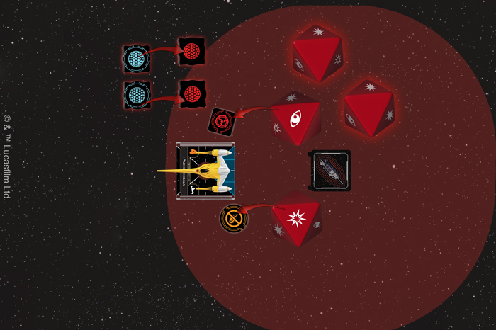
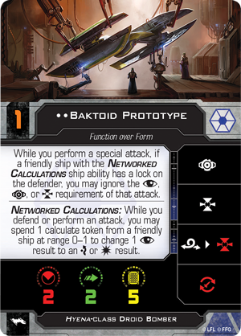
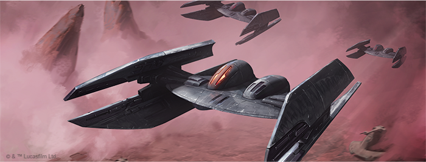

This article was originally published on [https://www.fantasyflightgames.com/en/news/2019/5/13/living-starfighters/](https://www.fantasyflightgames.com/en/news/2019/5/13/living-starfighters/)

&laquo; [Back to index](../index.md)

---

13 May 2019

Living Starfighters
===================

Preview the Hyena-class Droid Bomber Expansion Pack For X-Wing

_"Send the_ Hyena _bombers to hit Senator Organa on the surface."_  
   –Admiral Trench, _Star Wars: The Clone Wars_

Swarms of interlinked starfighters are some of the Separatist Alliance’s greatest assets in their struggle to overthrow the Republic. But a numerical advantage is only so useful against heavily-armored craft and nimble fighters flown by experienced Jedi Masters. Fortunately for the Separatists, droids can do much more than mob opposing squadrons.

When they truly need to pack a punch, the Separatists deploy droids designed for that very purpose, such as the _Hyena_\-class droid bomber. Whether it's launching a volley of missiles, dropping deadly bombs, or deploying some experimental ordnance, the _Hyena_ brings a variety of new options to Separatist squadrons. Soon, you’ll be able to take full advantage of these fighters with the [Hyena_\-class Droid Bomber Expansion Pack_](https://www.fantasyflightgames.com/en/products/x-wing-second-edition/products/hyena-class-droid-bomber-expansion-pack/) for [_X-Wing_™!](https://www.fantasyflightgames.com/en/products/x-wing-second-edition/)

In this expansion, you’ll find a beautifully painted _Hyena_\-class droid bomber miniature, along with six ship cards that offer their own variations on the ship. Each one makes the _Hyena_\-class droid bomber dangerous in its own way, but a bomber can't contribute much without bombs. Accordingly, this expansion also puts an impressive arsenal of ten upgrade cards at your fingertips, letting you choose the loadout you prefer.

Read on as we take a look at everything included in the Hyena-_class Droid Bomber Expansion Pack_!

Short Fuse
----------

Despite being built to Baktoid Armor Workshop’s exacting specifications, the _Hyena_\-class bomber is far from uniform in combat. In fact, the ship—and its different forms of programming—offer Separatist squad leaders a surprising number of strategic options. In addition to offering their own unique approach to controlling the ship, each form of programming can also equip a unique set of upgrades, helping them take on an even more specialized role in your squadron.

For those looking for an all-purpose bomber, basic models like the [Separatist Bomber](swz41_separatist-bomber.png)

Other variations of the _Hyena_\-class droid bomber, on the other hand, take a more specialized approach to the weapons they carry. A [Bombardment Drone,](swz41_hyena-class-bomber.png) Rather than simply dropping bombs, however, the Bombardment Drone has the option to launch them instead, making it particularly unpredictable.

Normally, launching a bomb directly into your own flight path is a recipe for disaster, but the Bombardment Drone can buy itself some time to get clear by rigging its ordnance with some [Delayed Fuses.](swz41_delayed-fuses.png) If a device with a fuse marker would detonate, it removes one fuse marker instead, leaving a deadly surprise for anyone flying too close the next round.

Alternatively, a _Hyena_\-class droid bomber can its  [Landing Struts](swz41_landing-struts-closed.png) can extend your bomber’s reach deep into the battlefield.

While Delayed Fuses can add fuse markers to any bomb or mine, some experimental ordnance like the [Electro-Proton Bomb](swz41_electro-proton_bomb.png) come with them built in. When one of these bombs detonates, each ship at Range 0–2 rolls four attack dice, losing a shield for each blank, gaining an ion token for each focus or damage, and taking one disarm token for each critical damage! It's only natural that any ship deploying these powerful bombs will be grateful for the extra time to move out of range.

  
_The Naboo Royal N-1 starfighter is caught in the Electro-Proton Bomb's blast, losing both its shields for the two blank results, while gaining an ion token for the focus result and a disarm token for the critical result!_

No _Hyena_\-class droid is better suited to working with its fellow droids than the [Baktoid Prototype.](swz41_baktoid.png) while using its fellow droids’ calculate tokens to guide the rockets to their target.

 Such an attack could devastate a single target, but some [Diamond-Boron Missiles](swz41_diamond-boron-missiles.png)   can damage an entire squadron that’s flying in formation. Once these missiles hit, you can spend an additional charge to pile damage on the defender and every nearby ship with equal or lower agility.

Clearly, most _Hyena_\-class bombers rely on the special weapons they equip to have an impact on a battle. A ship like [DBS-404,](swz41_dbs-404.png)  however, makes effective use of its primary laser cannons as well. Recklessly flying into battle with little regard for self-preservation, this ship not only can attack at Range 0, it gains an additional attack die during its attacks at close range. This may seem to give it a key advantage—but these benefits come at a cost. Your ship must take a critical damage every time one of these attacks hits, forcing you to carefully choose when to use DBS-404 to attack and when to block.

Finally, a _Hyena_\-class droid bomber like [DBS-32C](swz41_dbs-32c.png) into battle.

Function Over Form
------------------

Droids may be expendable, but they care little for collateral damage and will stay on target throughout the battle. With a _Hyena_\-class droid bomber flying with you, you can be sure your payload will be delivered.

