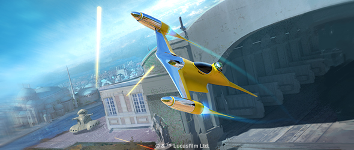
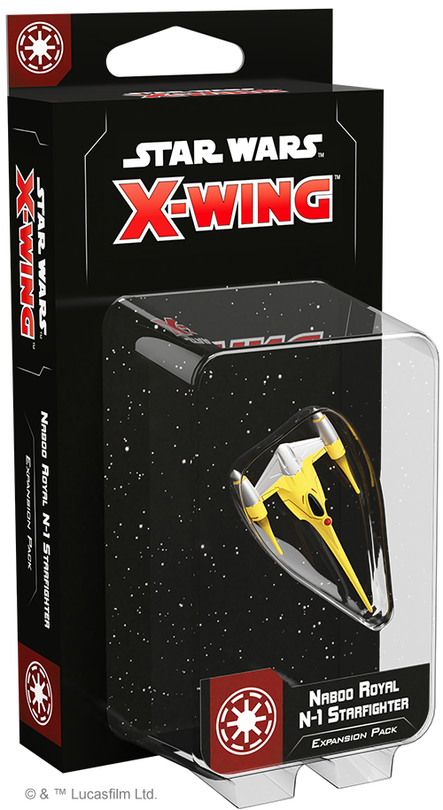
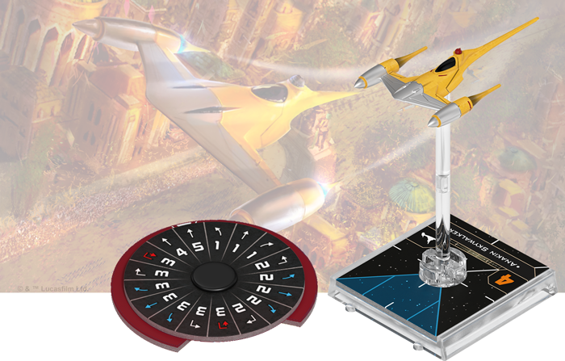
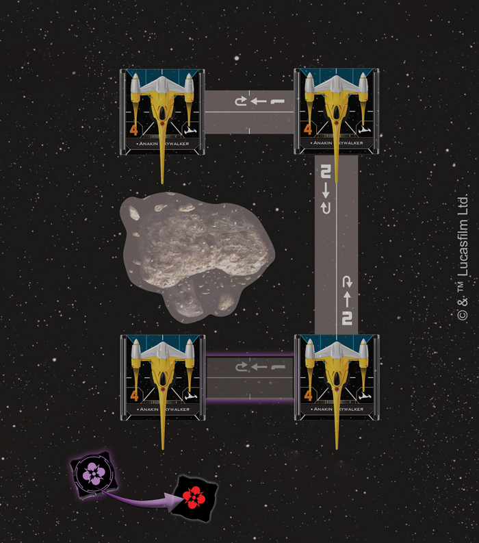
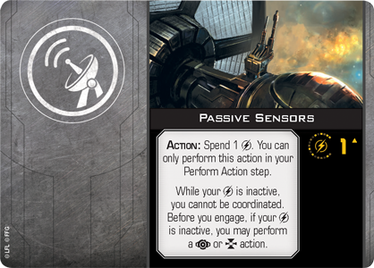
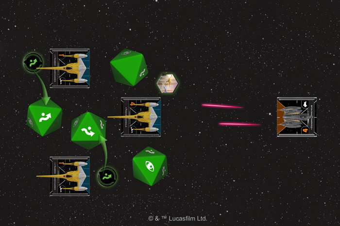

This article was originally published on [https://www.fantasyflightgames.com/en/news/2019/5/20/new-tricks/](https://www.fantasyflightgames.com/en/news/2019/5/20/new-tricks/)

&laquo; [Back to index](../index.md)

---

20 May 2019

New Tricks
==========

Preview the Naboo Royal N-1 Starfighter Expansion Pack for Star Wars: X-Wing

_“I’ll try spinning; that’s a good trick!”_  
   –Anakin Skywalker, _Star Wars: The Phantom Menace_

Despite being a peaceful planet with no standing army, Naboo is still dedicated to supporting the Republic against the nefarious Separatist Alliance. The planet’s Royal Security Forces are ready to spring into action at a moment’s notice and—when these battles take them to the skies above the planet and beyond—they enter the fight in the Naboo Royal N-1 starfighter.

After proving its worth while helping to break the Trade Federation’s blockade of Naboo, this sleek and agile fighter now sees regular service against the Separatist Alliance in the Clone Wars. Using its incredible speed to get the upper hand on less maneuverable fighters, the N-1 adds some much-needed velocity to Republic squadrons that rely on bulky starfighters and heavy weapons. Soon, you can add even more tricks to your [_Star Wars_™: X-Wing](https://www.fantasyflightgames.com/en/products/x-wing-second-edition/) squadrons with the _[Naboo Royal N-1 Starfighter Expansion Pack.](https://www.fantasyflightgames.com/en/products/x-wing-second-edition/products/naboo-royal-n-1-starfighter-expansion-pack/)_

Within this expansion, you’ll find one finely detailed Naboo Royal N-1 starfighter miniature painted in the iconic yellow and chrome finish, accompanied by all the cards and tokens you need to add it to your Galactic Republic squadrons. Among these are six pilots who each bring their own approach to flying the ship as well as seven upgrades inviting you to outfit your N-1 starfighter however you choose. Finally, two Quick Build cards offer helpful combinations of pilots and upgrades, letting you get your N-1 starfighter into battle as quickly as possible.

Join us today as we take a look at everything included in the _Naboo Royal N-1 Starfighter Expansion Pack_!

Better Than Podracing
---------------------

The pilots of the Royal Naboo Security Forces may be volunteers, but that doesn't mean they're any less skilled than the clones or Jedi who regularly fly into battle on behalf of the Republic. These volunteers are dedicated to protecting the people and ideals of their homeworld, and they trust their Queen to send them into battle only when all other options have failed.

When the time comes for them to enter the space battles of the Clone Wars, these pilots have remarkably different approaches to piloting Naboo’s signature starfighter. A veteran flight leader like [Ric Olié,](5ccfe9dfe74c85fe29a92931793de7a2.png) he gains an unprecedented level of control over his ship, making him even more of a threat to those who fly against him.

  
_Anakin Skywalker uses his ability to change course and avoid the asteroid. This is not an action, so he barrel rolls back to the left after executing his maneuver!_

Rather than focus on outmaneuvering opponents with superior speed, a blossoming Force user like  [Anakin Skywalker](5e21fb7db59d290d5a806f84dd36d30f.png) can use reflexes refined by podracing on Tatooine to put his own spin on the ship. Already an accomplished pilot at a young age, Skywalker can deftly weave in and out of the action by spending a Force point to barrel roll before he reveals his maneuver. Better yet, this does not count as an action, allowing Skywalker to barrel roll twice in the same activation!

But this ability frees Skywalker to do more than just perform two barrel rolls. It also allows him to pair a barrel roll with his regular action and—if he has a set of [Passive Sensors](cb6dbb95a65574f0d84898fab1f5ced4.png) equipped on his N-1 Starfighter—he can use them to wait and see how a round develops before acquiring a lock or calculating when it’s time for him to engage.

While Anakin Skywalker’s youth and latent Force abilities let him take a unique approach to piloting the N-1, other members of the Royal Security Force largely follow a similar pattern. Like Ric Olié, [Dineé Ellberger](8166af14bb4e4112d253debcbba28ac0.png) helping modify her speed on the fly, Ellberger should have little trouble getting the upper hand on her opponents.  

Like Ellberger, most of those who fly the N-1 are everyday members of the Naboo, but the planet’s leaders are not above flying the ship in the name of democracy. Having represented her people as both Queen and Senator, [Padmé Amidala](2276e5f6b0db772703fb69de98cbe269.png)

  
_Padmé Amidala is Decoyed, so the Naboo Handmaidens each spend their evade tokens to add evade results to her roll!_

Such a confrontational approach will inevitably make Padmé a high-profile target and—with only two shields and three hull—the N-1 can’t take much fire before succumbing to an all-out assault. With a [Naboo Handmaiden](2babda566d86dc620b45c9507b23b900.png) ship.

Ever Vigilant
-------------

Although small, Naboo played a pivotal role in the Clone Wars, becoming a beacon for every world that would support the Republic. With just a handful of the planet’s best pilots on your side, you can defend freedom across the galaxy.

