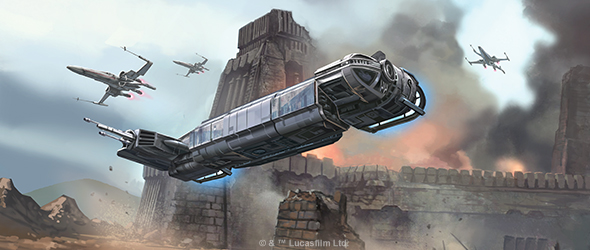
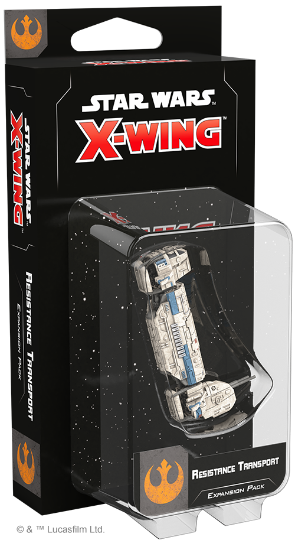
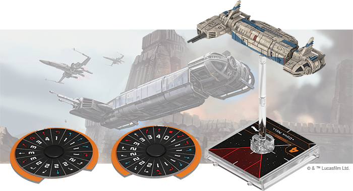
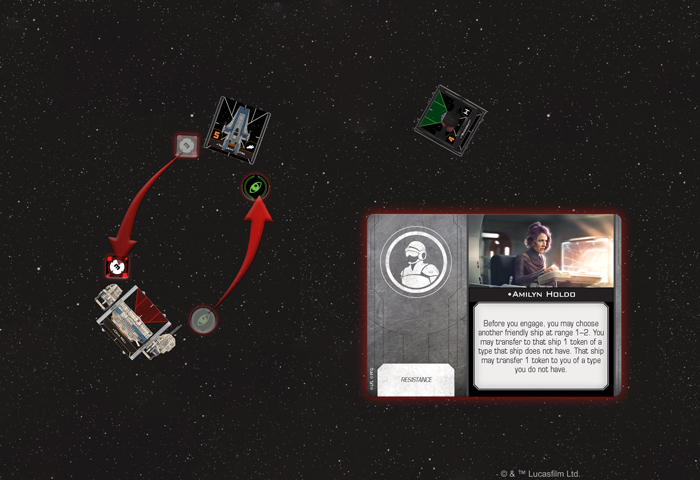
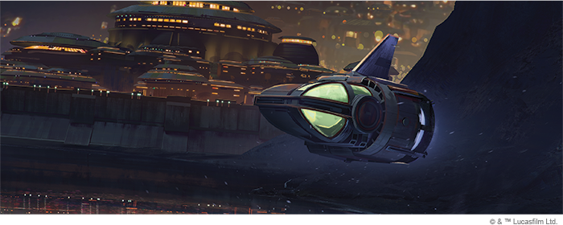
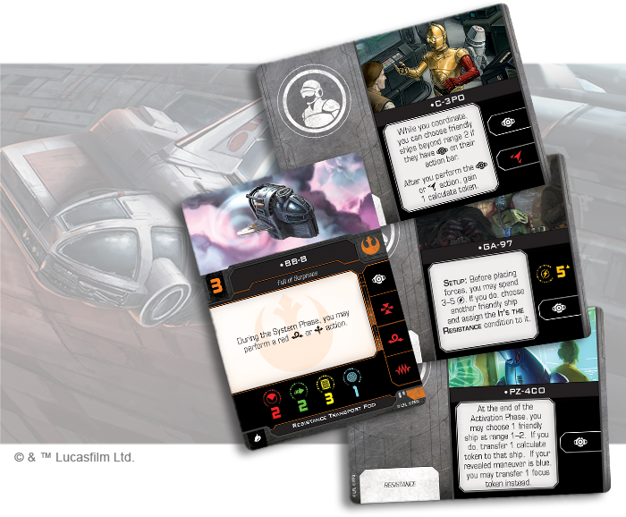
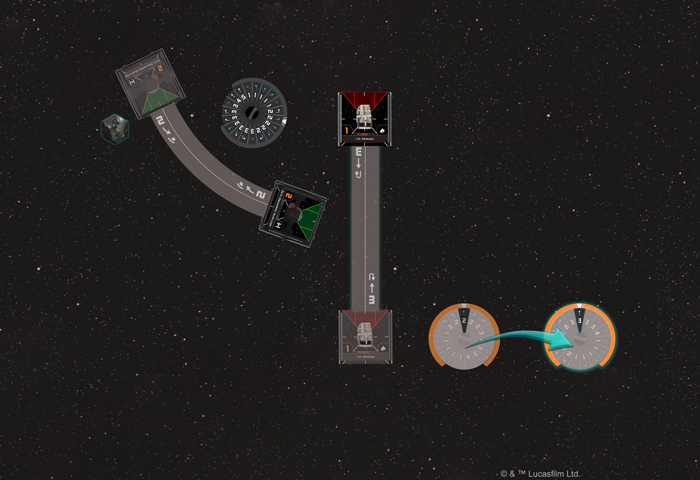

This article was originally published on [https://www.fantasyflightgames.com/en/news/2019/6/17/rebellion-reborn/](https://www.fantasyflightgames.com/en/news/2019/6/17/rebellion-reborn/)

&laquo; [Back to index](../index.md)

---

17 June 2019

Rebellion Reborn
================

Preview the Resistance Transport Expansion Pack for X-Wing

_"We are the very last of the Resistance. But we are not alone."_  
   –Amilyn Holdo, _Star Wars: The Last Jedi_

The Empire may be gone, but those who vigilantly defend the _Star Wars_ galaxy from tyranny still find themselves in much the same position as the Rebels who came before them. Lacking critical supplies and the support of the New Republic, the Resistance must use its own means to procure the vehicles and equipment it needs to continue the fight against the First Order.

Many times, ingenious Resistance engineers take matters into their own hands, cobbling together completely new starships from parts borrowed from a variety of sources. The foremost example of their work is the Resistance Transport, a custom-built shuttle designed to ferry troops and important personnel across the stars. Not only can this ship act as both a transport and a gunship, the cockpit can be flown as an independent ship in its own combat operations.

Whether you’re carrying high-ranking Resistance officers or using it as a command shuttle, you’ll soon be able to add one of these versatile transports to your squadrons with the _[Resistance Transport Expansion Pack](https://www.fantasyflightgames.com/en/products/x-wing-second-edition/products/resistance-transport-expansion-pack/)_ for [_X-Wing_™.](https://www.fantasyflightgames.com/en/products/x-wing-second-edition/) Within this expansion, you’ll find a beautifully painted Resistance Transport miniature with detachable Resistance Transport Pod that can also be added to your squadrons. Accompanying these miniatures is everything you need to fly them into battle, including 8 ship cards—4 for the Resistance Transport and 4 for the Resistance Transport Pod—as well as 16 upgrade cards featuring some of the most prominent members of the Resistance.

Join us today as we take a look at everything included in the _Resistance Transport Expansion Pack_!

Under Pressure
--------------

Many of the starfighters the Resistance employs against the First Order, such as the T-70 X-Wing and RZ-2 A-Wing—are updated versions of models that have been in use since the time of the Rebellion. The Resistance Transport follows this pattern by taking a B-Wing frame and putting it to an entirely new use, helping the ship take on a completely different role in Resistance squadrons and adding new strategic dimensions to the faction’s battle plans.

As its name suggests, the Resistance Transport was designed with carrying passengers in mind and you’ll find a number of new Resistance-exclusive crew cards ready to increase the synergy of your entire squadron. Nowhere is this more evident than the legendary [Leia Organa.](fff56d5e5574538503683a72d18f6e57.png)  Ever vigilant in the fight against tyranny, Organa not only adds her latent Force abilities to a ship, she can also spend her Force charge to instill hope in a friendly pilot once they’ve revealed their dial, reducing the difficulty of their maneuver.

  
_Leia Organa spends her Force charge after Poe Dameron reveals a red 3-Tallon Roll, so he reduces the difficulty of this maneuver. Dameron has a lock on the TIE/fo, so he boosts and uses his ability to perform a red focus action!_

Organa opens new possibilities for every pilot under her command, helping them reach new heights. With her help, an ace like [Poe Dameron](7d911cb1d06cb960f3952f05ee8528e5.png) ability, allowing her to roll an additional die while defending or performing a primary attack without gaining the stress token from her revealed red maneuver.

As Leia Organa clearly demonstrates, the crew members Resistance Transports carry are often invaluable to the squadron’s overall strategies. While having such important personnel aboard their ships certainly puts a lot of pressure on them, those who fly the Resistance Transport are among the best at managing these high-stress situations.

[Pammich Nerro Goode](2c4240a8d5220ac07e1c7940aab3053c.png) to her crew allows Goode to remove all the stress tokens she’s accumulated in a single swoop after fully executing a blue maneuver, helping her remain elusive and unpredictable throughout an engagement.

  
_The RZ-2 A-Wing doesn't have a focus token, so Amilyn Holdo transfers it from the Resistance Transport to the A-Wing before her Resistance Transport engages. The Resistance Transport doesn't have a lock token, so Holdo transfers the TIE/fo's lock token from the A-Wing to her ship!_

Similarly, [Nodin Chavdri](83cbfdb89717ef4f19cd801af0462ca1.png) just before engaging.  

Even without a pilot ability of their own, a [Logistics Division Pilot](d12d97a84676b8b5962396a26c8f3aa8.png)

Doing so may reduce your ship’s shield value, but it also adds the Reinforce action to your action bar, giving you a valuable tool for reducing the damage you could take. What’s more, having [Larma D’Acy](c42a50aeeb16a91271b6ad39c3ca9ae3.png) on board gives you the chance to do so at particularly crucial moments, giving you the chance to contribute to you squadron for at least a little longer.

Spreading the Spark
-------------------

The Resistance Transport’s ability to carry all manner of crew may be its defining feature, but the engineers who created it built function into the ship’s very form, lending it even more versatility. The ship is so versatile, in fact, that its cockpit pod can be flown as an independent ship with its own maneuver dial, action bar, and upgrade options. While this pod lacks the space for more than one crew member or the customization options of its parent ship, it can still make significant contributions to your squadrons.

An excellent platform for smaller teams to embark on missions that don’t require extra personnel or heavy armament, the Resistance Transport Pod also gives some Resistance members not typically known for their piloting skills the chance to take the controls. Normally seen helping guide Poe Dameron’s T-70 X-Wing, [BB-8](96bca8989a09e03895cb50cbf5c669c3.png) can take the Transport Pod in some surprising new directions if he chooses to perform a red barrel roll or boost action during the System Phase.

On top of his skills positioning his ship, BB-8 unlocks even more possibilities by giving the version of [C-3PO](caab93fb480501e99806740db0ebd879.png)  who can add results that can be subsequently modified to both his attack and defense rolls.

Clearly, the Resistance Transport Pod thrives on its pilots working with other ships and crew members to be successful. This is certainly the case with [Rose Tico](03fe9572c39e6ab00e3a46c0fb8b9166.png) once they’re in the thick of battle.

  
_Vi Moradi is at range 0–3 during the System Phase, so the TIE/fo with the Compromising Intel condition flips its dial faceup. Seeing the enemy's chosen maneuver, Moradi uses Kayden Connix to set her dial to a straight-3 and zoom out of the TIE/fo's firing arc!_

Finally, although she isn’t the most skilled pilot, [Vi Moradi](d263dbe5c32cf2118da6077118dca727.png) to alter her own flight path and give herself an advantage on her opponent.

Restore the Republic
--------------------

Beings in every corner of the galaxy put their hope in the Resistance to fight back against the nefarious First Order. With a good transport and some inspiring leaders on your side, you'll have everything you need to begin restoring peace to the galaxy.